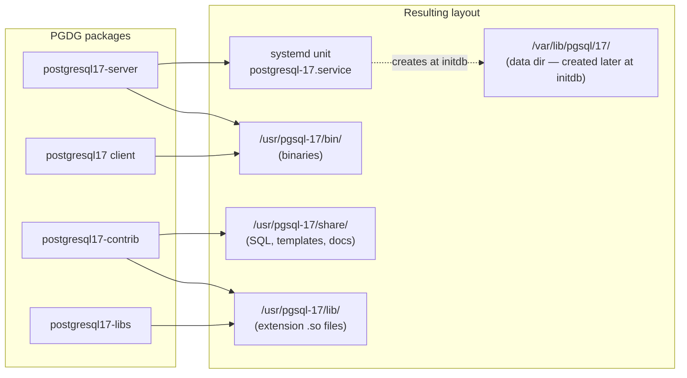

# Lab 01 — Install PostgreSQL 17 from the PGDG RPM Repository (AlmaLinux 9)

> **Track A · DBA · A1 Installation & Cluster Provisioning · Lab 1 of 8**
> Teaching package: concept → diagram → steps → verify → quick-ref → self-test → video script.

---

## 0. Lab Card (at a glance)

| Field | Value |
|---|---|
| **Objective** | Install PostgreSQL 17 server + client from the official PGDG YUM repo and get `/usr/pgsql-17/bin` on `PATH`. |
| **Success criterion** | `which psql` → `/usr/pgsql-17/bin/psql` and `psql --version` → `psql (PostgreSQL) 17.x`. |
| **Scope boundary** | Install + PATH only. Creating the cluster (`initdb`) and starting the service are **Lab 2**. |
| **Time** | 10–15 min |
| **Difficulty** | ★☆☆☆☆ (foundational — everything else depends on it) |
| **Prereqs** | AlmaLinux 9 VM, `sudo`, internet access to `download.postgresql.org` |
| **Risk** | None (non-destructive; no data touched) |

---

## 1. Learning Objectives

After this lab you can explain and do:

1. **Why the PGDG repo, not the distro package** — AlmaLinux ships an older PostgreSQL via a `dnf` module; PGDG gives you the current, vendor-maintained 17.x.
2. **What an RPM install actually lays down** — which package puts which binaries where, and why PGDG uses a versioned path (`/usr/pgsql-17/`) instead of `/usr/bin`.
3. **Why binaries aren't on `PATH` by default** — and the clean, host-wide way to fix it (`/etc/profile.d`).
4. **How to verify an install three independent ways** — filesystem, `PATH` resolution, and `pg_config`.

---

## 2. Concept Primer — the "why" before the "how"

**PGDG** = *PostgreSQL Global Development Group*, the project that develops PostgreSQL. They publish an official YUM/DNF repository for RHEL-family Linux (RHEL, AlmaLinux, Rocky, Oracle Linux). You install a small "repo RPM" that drops a `.repo` file and the GPG signing key into your system; from then on `dnf` can see every PostgreSQL major version PGDG ships.

**Why not just `dnf install postgresql-server`?** AlmaLinux 9's built-in AppStream carries PostgreSQL as a **DNF module**, usually pinned to an older major (13/15/16). If you install from it *and* from PGDG, the two can collide on the same package names. So the standard, conflict-free recipe is: **add PGDG repo → disable the built-in module → install the versioned PGDG packages.**

**Why the versioned path `/usr/pgsql-17/`?** PGDG deliberately installs each major version under its own prefix so **multiple majors coexist** on one host (`/usr/pgsql-16/`, `/usr/pgsql-17/`). That's what makes side-by-side upgrades (`pg_upgrade`, Lab 75) possible. The tradeoff: those `bin` dirs are **not** added to `PATH` automatically — otherwise two versions would fight over which `psql` wins. You choose, explicitly.

**The packages you'll install:**

| Package | Provides | Key binaries |
|---|---|---|
| `postgresql17-server` | The database engine + cluster tools | `postgres`, `initdb`, `pg_ctl`, the `postgresql-17` systemd unit |
| `postgresql17` | Client programs (pulled in as a dependency) | `psql`, `pg_dump`, `pg_restore`, `pg_isready` |
| `postgresql17-contrib` | Bundled extensions | modules for `pg_stat_statements`, `pgcrypto`, `pg_trgm`, … |
| `postgresql17-libs` | Shared client library (dependency) | `libpq.so` |

---

## 3. Diagrams

> Both diagrams are **Mermaid** — they render inline in BookStack (enable the Mermaid setting), GitHub, GitLab, and Obsidian. For a video, screenshot the rendered output or paste into mermaid.live.

### 3.1 Install flow

```mermaid
flowchart TD
    A([AlmaLinux 9 host<br/>sudo + internet]) --> B[Install PGDG repo RPM<br/>pgdg-redhat-repo-latest]
    B --> C[Disable built-in<br/>postgresql DNF module]
    C --> D[dnf install<br/>postgresql17-server + contrib]
    D --> E[Binaries land in<br/>/usr/pgsql-17/bin]
    E --> F[Add /usr/pgsql-17/bin to PATH<br/>via /etc/profile.d/pgsql17.sh]
    F --> G{Verify}
    G -->|which psql| H[/usr/pgsql-17/bin/psql]
    G -->|psql --version| I[PostgreSQL 17.x]
    G -->|pg_config --bindir| J[/usr/pgsql-17/bin]
    H --> K([✔ Lab complete →<br/>Lab 2: initdb])
    I --> K
    J --> K
```

### 3.2 Package → filesystem map (what ends up where)



---

## 4. Prerequisites & Environment

```bash
# Confirm the OS family and version (expect AlmaLinux 9.x)
cat /etc/os-release | grep -E '^(NAME|VERSION_ID)'

# Confirm you have sudo and outbound HTTPS
sudo -v
curl -sI https://download.postgresql.org | head -1     # expect HTTP/… 200 or 3xx
```

---

## 5. Step-by-Step

Each step: **command → what it does → what you should see.**

### Step 1 — Refresh metadata

```bash
sudo dnf -y update
```
*Brings the package index current so dependency resolution is clean.*

### Step 2 — Install the PGDG repository RPM

```bash
sudo dnf install -y \
  https://download.postgresql.org/pub/repos/yum/reporpms/EL-9-x86_64/pgdg-redhat-repo-latest.noarch.rpm
```
*Drops the PGDG `.repo` definitions and GPG key onto the system.*
**Verify:**
```bash
dnf repolist | grep -i pgdg          # expect several pgdg* repos listed
```

### Step 3 — Disable the built-in PostgreSQL module

```bash
sudo dnf -qy module disable postgresql
```
*Stops AlmaLinux's AppStream module from shadowing or colliding with the PGDG packages. **Skipping this is the #1 cause of install conflicts.***

### Step 4 — Install PostgreSQL 17 (server + contrib)

```bash
sudo dnf install -y postgresql17-server postgresql17-contrib
```
*`postgresql17` (client) and `postgresql17-libs` come in automatically as dependencies.*
**Verify the binaries exist:**
```bash
ls /usr/pgsql-17/bin/ | head        # expect postgres, initdb, psql, pg_ctl, ...
```

### Step 5 — Put the binaries on PATH (host-wide)

```bash
echo 'export PATH=/usr/pgsql-17/bin:$PATH' | sudo tee /etc/profile.d/pgsql17.sh
sudo chmod +x /etc/profile.d/pgsql17.sh
source /etc/profile.d/pgsql17.sh      # apply now, without logging out
```
*A file in `/etc/profile.d/` is sourced for every login shell — cleaner and more durable than editing `~/.bashrc`. New SSH sessions pick it up automatically.*

### Step 6 — Verify (three independent checks)

```bash
which psql                 # → /usr/pgsql-17/bin/psql
psql --version             # → psql (PostgreSQL) 17.x
pg_config --bindir         # → /usr/pgsql-17/bin
```

If all three agree, the lab's success criterion is met. **Stop here — cluster creation is Lab 2.**

---

## 6. Verification Checklist

- [ ] `dnf repolist` shows `pgdg*` repos
- [ ] `dnf module list postgresql` shows the AppStream module **[d]isabled**
- [ ] `/usr/pgsql-17/bin/` contains `postgres`, `initdb`, `psql`, `pg_ctl`
- [ ] `which psql` resolves into `/usr/pgsql-17/bin`
- [ ] `psql --version` reports **17.x**
- [ ] `pg_config --bindir` returns `/usr/pgsql-17/bin`
- [ ] A **new** SSH session still resolves `psql` (proves PATH is persistent)

---

## 7. Troubleshooting

| Symptom | Cause | Fix |
|---|---|---|
| `Conflicting requests` / duplicate `postgresql` packages | Built-in module not disabled | Re-run Step 3, then Step 4 |
| `which psql` finds `/usr/bin/psql` (older version) | Distro client still shadowing PGDG | Ensure `/usr/pgsql-17/bin` is **prepended** in Step 5; open a fresh shell |
| `psql: command not found` after install | PATH not applied to this shell | `source /etc/profile.d/pgsql17.sh` or reconnect |
| GPG key / signature error | Repo RPM didn't import key | `sudo rpm --import /etc/pki/rpm-gpg/PGDG-*` then retry |
| `Cannot download … download.postgresql.org` | No outbound HTTPS / proxy | Fix egress or configure `proxy=` in `/etc/dnf/dnf.conf` |
| `contrib` install pulls unmet deps | EPEL needed for some extras | `sudo dnf install -y epel-release` then retry |

---

## 8. Quick Reference Card (paste-ready)

```bash
# --- PostgreSQL 17 install from PGDG on AlmaLinux 9 ---
sudo dnf -y update
sudo dnf install -y https://download.postgresql.org/pub/repos/yum/reporpms/EL-9-x86_64/pgdg-redhat-repo-latest.noarch.rpm
sudo dnf -qy module disable postgresql
sudo dnf install -y postgresql17-server postgresql17-contrib
echo 'export PATH=/usr/pgsql-17/bin:$PATH' | sudo tee /etc/profile.d/pgsql17.sh
source /etc/profile.d/pgsql17.sh

# --- verify ---
which psql && psql --version && pg_config --bindir

# Key paths:  binaries /usr/pgsql-17/bin   |  data (later) /var/lib/pgsql/17/data   |  service postgresql-17
# Next:  Lab 2 → sudo /usr/pgsql-17/bin/postgresql-17-setup initdb && sudo systemctl enable --now postgresql-17
```

---

## 9. Self-Check (test yourself, answers below)

1. Why disable the `postgresql` DNF module before installing from PGDG?
2. Why does PGDG install under `/usr/pgsql-17/` instead of `/usr/bin`?
3. Which package provides `initdb` — client or server?
4. Why put the PATH export in `/etc/profile.d/` rather than `~/.bashrc`?
5. Name three independent ways to confirm the correct `psql` is active.
6. After this lab, does a database cluster exist yet? Why or why not?

<details>
<summary>Answers</summary>

1. AlmaLinux's built-in module ships an older major and collides on the same package names; disabling it prevents conflicts and version shadowing.
2. So multiple majors can coexist on one host, which is what enables side-by-side `pg_upgrade`.
3. **Server** (`postgresql17-server`). The client package provides `psql`, `pg_dump`, etc.
4. `/etc/profile.d/` applies host-wide to every login shell and survives across users/sessions; `~/.bashrc` is per-user and easy to forget.
5. `which psql` (PATH resolution), `psql --version` (reported version), `pg_config --bindir` (build/install metadata).
6. **No.** Installing binaries ≠ creating a cluster. `initdb` (Lab 2) builds the data directory; until then there's nothing to connect to.
</details>

---

## 10. Video / Teaching Script

Narration beats with on-screen actions. Keep terminal font large; pause on each verify.

| # | On screen | Say (narration) |
|---|---|---|
| 1 | Title card: "Install PostgreSQL 17 on AlmaLinux 9" | "We'll install PostgreSQL 17 from the official source and confirm it's ready — in under 15 minutes." |
| 2 | `cat /etc/os-release` | "First, confirm we're on AlmaLinux 9. The recipe is the same for Rocky or RHEL 9." |
| 3 | Install repo RPM | "This one package teaches our system where PostgreSQL's official repo lives. Nothing is installed yet — we're just adding the source." |
| 4 | `module disable postgresql` | "Critical step: AlmaLinux ships its own older PostgreSQL. We switch it off so it can't clash with the version we want." |
| 5 | `dnf install postgresql17-server contrib` | "Now the real install — the engine, the client tools, and the bundled extensions." |
| 6 | `ls /usr/pgsql-17/bin` | "Notice the versioned path. PostgreSQL 17 lives in its *own* directory so it can sit next to other versions later." |
| 7 | profile.d PATH + `source` | "Those tools aren't on our PATH yet — by design. We add them once, system-wide, here." |
| 8 | `which psql`, `--version`, `pg_config` | "Three checks that all agree: the right psql, version 17, correct bin dir. That's our success criterion." |
| 9 | Outro | "Installed and verified — but there's no database yet. In the next video we run initdb and start the service." |

---

## 11. Glossary

- **PGDG** — PostgreSQL Global Development Group; publishes the official repo.
- **Repo RPM** — a tiny package that only adds a repository definition + signing key.
- **DNF module** — AppStream mechanism that version-pins certain software; must be disabled here.
- **Cluster** — a data directory managed by one server instance (created at `initdb`, not now).
- **`pg_config`** — reports how this PostgreSQL build was configured, including paths.

---
*NETAPORT lab series · PostgreSQL 17 on AlmaLinux 9 · Lab 01/222*
