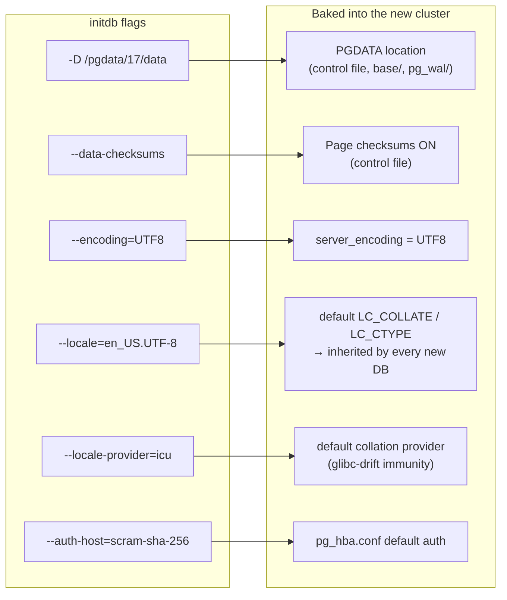

# Lab 02 — initdb a Fresh Cluster: Non-Default Data Dir, Locale & Checksums (AlmaLinux 9)

> **Track A · DBA · A1 Installation & Cluster Provisioning · Lab 2 of 8**
> Teaching package: concept → diagram → steps → verify → quick-ref → self-test → video script.
> **Depends on:** Lab 01 (PostgreSQL 17 installed, `/usr/pgsql-17/bin` on PATH).

---

## 0. Lab Card (at a glance)

| Field | Value |
|---|---|
| **Objective** | Initialize a new PostgreSQL 17 cluster in a **non-default** data directory, with an explicit **locale/encoding** and **data checksums enabled**, then wire systemd to it and start it. |
| **Success criterion** | Cluster runs from the custom dir; `pg_controldata` shows **checksum version 1**; `SHOW data_checksums` → `on`; locale/encoding match what you set. |
| **Scope boundary** | One clean cluster with the three required properties. Deep checksum proof is revisited in Lab 5; SELinux hardening in Lab 193. |
| **Time** | 20–30 min |
| **Difficulty** | ★★☆☆☆ |
| **Prereqs** | Lab 01 done; `sudo`; a target path/mount for the data dir; the locale installed on the host |
| **Risk** | Low (new cluster; touches only the new data dir + a systemd drop-in) |

---

## 1. Learning Objectives

1. **Why the data directory location is a decision, not a default** — separating `PGDATA` onto its own volume for I/O, capacity, and snapshot control.
2. **What `initdb` bakes in permanently** — locale, encoding, and checksum choice are set at birth and expensive-to-impossible to change later.
3. **How to make systemd manage a non-default `PGDATA`** the upgrade-safe way (a drop-in, not editing the shipped unit).
4. **Why the locale *provider* matters** — the `libc` vs `icu` vs `builtin` choice is your insurance against the glibc-collation index-corruption trap on a future OS upgrade (Lab 192).
5. **What data checksums buy you** — early detection of silent on-disk corruption, at a small CPU cost.

---

## 2. Concept Primer — the "why"

**A "cluster" is a data directory, not a machine.** In PostgreSQL, a *cluster* is one `PGDATA` directory managed by one running server (postmaster) on one port. Installing binaries (Lab 1) created **no** cluster. `initdb` is what creates one: it lays down the catalog, the template databases, `postgresql.conf`, `pg_hba.conf`, `pg_wal/`, and the control file.

**Why a non-default data dir?** The RPM default is `/var/lib/pgsql/17/data` — on the root filesystem. In production you almost always want `PGDATA` on a **dedicated volume**: independent capacity and IOPS, its own snapshot/backup cadence, and the ability to fill up without taking down the OS. This lab uses `/pgdata/17/data`.

**Three things `initdb` fixes for the life of the cluster:**

- **Encoding** (`UTF8`) — the byte representation of text. Changing it later means a full dump/reload.
- **Locale** — `LC_COLLATE` (sort order) and `LC_CTYPE` (character classification). These become the cluster default and are inherited by every new database. Collation affects **index ordering**, so changing it invalidates text indexes.
- **Locale provider** — *who* supplies the collation rules:
  - `libc` — the OS's glibc. **Hazard:** an OS/glibc upgrade can silently change sort order, corrupting text indexes (the classic RHEL/Alma upgrade landmine, Lab 192).
  - `icu` — bundled ICU library, versioned and portable across OS upgrades.
  - `builtin` (PG17) — a stable, dependency-free `C.UTF-8` provider. Fast, immune to glibc drift, but no linguistic sorting.
  - **Takeaway:** for durability across OS upgrades, prefer `icu` or `builtin` over `libc`.

**What `--data-checksums` does.** With checksums on, every 8 KB data page carries a checksum that PostgreSQL verifies on read. A mismatch (bit rot, bad disk, torn write) is surfaced as an error/log entry instead of silently returning garbage. Cost is a few % CPU. It must be chosen at `initdb` — or added later **offline** with `pg_checksums` (a separate lab). *In PG17 checksums are still off by default; PG18 flips the default on.*

**Two ways to run initdb on RPM systems:**
- **Direct** (`initdb -D …` as the `postgres` user) — explicit, full control of every flag, transferable to any distro. **We use this.**
- **RPM wrapper** (`postgresql-17-setup initdb`) — convenient, but reads `PGDATA` from the service and hides flags behind `PGSETUP_INITDB_OPTIONS`. Shown as an alternative in §5.

---

## 3. Diagrams

### 3.1 End-to-end flow

```mermaid
flowchart TD
    A([Prepare volume/dir<br/>owner=postgres, mode 0700]) --> B[Label SELinux context<br/>postgresql_db_t]
    B --> C[Confirm locale exists<br/>locale -a | grep en_US]
    C --> D["Run initdb as postgres<br/>-D /pgdata/17/data<br/>--data-checksums<br/>--encoding=UTF8 --locale=…"]
    D --> E[systemd drop-in<br/>Environment=PGDATA=/pgdata/17/data]
    E --> F[daemon-reload + enable --now]
    F --> G{Verify}
    G -->|pg_controldata| H["Data page checksum version: 1"]
    G -->|SHOW data_checksums| I[on]
    G -->|SHOW lc_collate / server_encoding| J[matches chosen locale]
    G -->|current_setting data_directory| K[/pgdata/17/data]
    H --> L([✔ Cluster live from custom dir])
    I --> L
    J --> L
    K --> L
```

### 3.2 What `initdb` sets — flags → cluster properties



**Data-dir anatomy after initdb** (text, for reference):
```
/pgdata/17/data/
├── PG_VERSION            # "17"
├── postgresql.conf       # main config
├── pg_hba.conf           # client auth rules
├── pg_ident.conf
├── global/               # cluster-wide catalogs + pg_control (has checksum flag)
├── base/                 # per-database subdirs
├── pg_wal/               # write-ahead log
└── log/                  # server logs (once logging_collector on)
```

---

## 4. Prerequisites

```bash
# Binaries present (from Lab 1)
psql --version                        # → 17.x

# Is the target locale installed? (en_US.UTF-8 in this example)
locale -a | grep -i en_US             # if empty → sudo dnf install -y glibc-langpack-en

# SELinux state (Alma defaults to Enforcing — matters for a custom dir)
getenforce                            # → Enforcing (expected)
```

---

## 5. Step-by-Step

### Step 1 — Prepare the data directory

```bash
sudo mkdir -p /pgdata/17/data
sudo chown -R postgres:postgres /pgdata
sudo chmod 0700 /pgdata/17/data
```
*`initdb` refuses a non-empty dir and demands `postgres` ownership with `0700` perms.*

### Step 2 — Give it the right SELinux context

```bash
sudo dnf install -y policycoreutils-python-utils   # provides semanage (if missing)
sudo semanage fcontext -a -t postgresql_db_t "/pgdata(/.*)?"
sudo restorecon -Rv /pgdata
```
*Under Enforcing SELinux, a custom `PGDATA` **won't start** unless it carries the `postgresql_db_t` label. Skipping this is the classic "it worked in the default dir but won't start in mine."*

### Step 3 — Run initdb (as the postgres user)

```bash
sudo -u postgres /usr/pgsql-17/bin/initdb \
  --pgdata=/pgdata/17/data \
  --data-checksums \
  --encoding=UTF8 \
  --locale=en_US.UTF-8 \
  --auth-local=peer \
  --auth-host=scram-sha-256
```
*Must run as `postgres`, never root. This writes the catalog, sets checksums on, and fixes encoding/locale for the cluster's life.*

> **Durability variant (recommended for real systems):** immunize against glibc collation drift by using ICU or the built-in provider:
> ```bash
> # ICU (linguistic sorting, version-stable):
> ... --locale-provider=icu --icu-locale=en-US --encoding=UTF8 ...
> # or PG17 builtin (fastest, C.UTF-8 semantics):
> ... --locale-provider=builtin --locale=C.UTF-8 --encoding=UTF8 ...
> ```

> **RPM-wrapper alternative** (does Steps 3 differently): set `Environment=PGDATA` (Step 4) *first*, then
> `sudo PGSETUP_INITDB_OPTIONS="--data-checksums --locale=en_US.UTF-8" /usr/pgsql-17/bin/postgresql-17-setup initdb`

### Step 4 — Point systemd at the non-default PGDATA (drop-in)

```bash
sudo mkdir -p /etc/systemd/system/postgresql-17.service.d
sudo tee /etc/systemd/system/postgresql-17.service.d/override.conf >/dev/null <<'EOF'
[Service]
Environment=PGDATA=/pgdata/17/data
EOF
sudo systemctl daemon-reload
```
*A drop-in overrides only `PGDATA` and **survives package upgrades** — editing the shipped unit file does not.*

### Step 5 — Enable and start

```bash
sudo systemctl enable --now postgresql-17
systemctl status postgresql-17 --no-pager
```

### Step 6 — Verify all three properties

```bash
# 1) Checksums — offline proof, no server needed:
sudo -u postgres /usr/pgsql-17/bin/pg_controldata /pgdata/17/data | grep -i checksum
#   → Data page checksum version: 1

# 2) Live confirmation via SQL:
sudo -u postgres psql -c "SHOW data_checksums;"          # → on
sudo -u postgres psql -c "SHOW server_encoding;"         # → UTF8
sudo -u postgres psql -c "SHOW lc_collate;"              # → en_US.UTF-8 (or your choice)
sudo -u postgres psql -c "SELECT current_setting('data_directory');"   # → /pgdata/17/data

# 3) Provider + per-DB locale:
sudo -u postgres psql -c "SELECT datname, datcollate, datctype, datlocprovider FROM pg_database;"
```

If checksum version is `1`, the data dir is `/pgdata/17/data`, and the locale matches — lab complete.

---

## 6. Verification Checklist

- [ ] `pg_controldata … | grep checksum` → **Data page checksum version: 1**
- [ ] `SHOW data_checksums;` → **on**
- [ ] `SELECT current_setting('data_directory');` → **/pgdata/17/data**
- [ ] `SHOW server_encoding;` → **UTF8**
- [ ] `SHOW lc_collate;` matches what you passed
- [ ] `datlocprovider` in `pg_database` matches your provider (`c`=libc, `i`=icu, `b`=builtin)
- [ ] `systemctl show -p Environment postgresql-17` shows your custom `PGDATA`
- [ ] Service is `active (running)` and survives `systemctl restart`

---

## 7. Troubleshooting

| Symptom | Cause | Fix |
|---|---|---|
| `initdb: cannot be run as root` | Ran as root | Prefix `sudo -u postgres` |
| `directory "…" exists but is not empty` | Target dir has files | Empty it or pick a fresh path |
| `could not change permissions` / `has wrong ownership` | Dir not owned by postgres / not 0700 | `chown postgres:postgres`, `chmod 0700` |
| `invalid locale name "en_US.UTF-8"` | Locale not installed | `sudo dnf install -y glibc-langpack-en`, re-run |
| Service fails, journal shows `Permission denied` on data dir | Wrong SELinux label | Re-run Step 2 (`semanage fcontext` + `restorecon`) |
| Server starts on `/var/lib/pgsql/17/data` instead | Drop-in not applied | `systemctl show -p Environment postgresql-17`; redo Step 4 + `daemon-reload` |
| `SHOW data_checksums` → off | Forgot `--data-checksums` | Re-`initdb` a fresh dir, **or** add later offline with `pg_checksums --enable` (cluster stopped) |

---

## 8. Quick Reference Card (paste-ready)

```bash
# --- initdb: custom dir + locale + checksums (AlmaLinux 9, PG17) ---
sudo mkdir -p /pgdata/17/data && sudo chown -R postgres:postgres /pgdata && sudo chmod 0700 /pgdata/17/data
sudo dnf install -y policycoreutils-python-utils
sudo semanage fcontext -a -t postgresql_db_t "/pgdata(/.*)?" && sudo restorecon -Rv /pgdata

sudo -u postgres /usr/pgsql-17/bin/initdb --pgdata=/pgdata/17/data \
  --data-checksums --encoding=UTF8 --locale=en_US.UTF-8 \
  --auth-local=peer --auth-host=scram-sha-256
# durability variant: add --locale-provider=icu --icu-locale=en-US   (or builtin + C.UTF-8)

sudo mkdir -p /etc/systemd/system/postgresql-17.service.d
printf '[Service]\nEnvironment=PGDATA=/pgdata/17/data\n' | sudo tee /etc/systemd/system/postgresql-17.service.d/override.conf
sudo systemctl daemon-reload && sudo systemctl enable --now postgresql-17

# verify
sudo -u postgres /usr/pgsql-17/bin/pg_controldata /pgdata/17/data | grep -i checksum
sudo -u postgres psql -c "SHOW data_checksums; SHOW server_encoding; SHOW lc_collate; SELECT current_setting('data_directory');"
```

---

## 9. Self-Check

1. Installing the packages (Lab 1) created a cluster — true or false?
2. Give one command that proves checksums are on **without starting the server**.
3. Why is the cluster locale expensive to change after `initdb`?
4. Which locale provider protects you from a glibc sort-order change on an OS upgrade, and why?
5. Why use a systemd **drop-in** for `PGDATA` instead of editing `postgresql-17.service`?
6. Under Enforcing SELinux, what extra step does a *non-default* data dir require that the default dir doesn't?

<details>
<summary>Answers</summary>

1. **False.** Packages install binaries only; `initdb` creates the cluster.
2. `pg_controldata /pgdata/17/data | grep -i checksum` → *Data page checksum version: 1* (reads the control file offline).
3. Locale sets `LC_COLLATE`, which determines index sort order and is inherited by every new database; changing it invalidates text indexes and generally needs a dump/reload (or per-DB/-column collations).
4. **ICU** or the PG17 **builtin** provider — their collation rules are versioned/bundled and don't shift when the OS's glibc changes, unlike the `libc` provider.
5. A drop-in overrides just the one setting and **survives package upgrades**; edits to the shipped unit file can be overwritten by the RPM.
6. Labeling the directory with the `postgresql_db_t` SELinux context (`semanage fcontext` + `restorecon`); the default dir already carries it.
</details>

---

## 10. Video / Teaching Script

| # | On screen | Say (narration) |
|---|---|---|
| 1 | Title: "Create a PostgreSQL 17 cluster — the production way" | "We'll build a fresh cluster on its own volume, with a chosen locale and corruption detection turned on." |
| 2 | `mkdir` + `chown` + `chmod 0700` | "PostgreSQL is strict: the data directory must be owned by the postgres user and locked to 0700." |
| 3 | `semanage fcontext` + `restorecon` | "AlmaLinux runs SELinux enforcing. A custom directory needs the database label or the service simply won't start — a very common gotcha." |
| 4 | `initdb …` with flags | "Here's the heart of it. Watch three flags: our custom path, data-checksums for corruption detection, and the locale — these are set once, for the life of the cluster." |
| 5 | Highlight `--locale-provider` variant | "One pro tip: choose ICU or the built-in provider. It protects your text indexes from breaking when you later upgrade the OS." |
| 6 | systemd drop-in + `daemon-reload` | "We tell systemd where the data lives — using a drop-in, so a package update can't undo it." |
| 7 | `enable --now` + `status` | "Enable and start. Green and running." |
| 8 | `pg_controldata … grep checksum`, then `SHOW` commands | "Proof: checksum version one, the right encoding and locale, running from our custom directory. Done." |
| 9 | Outro | "A real, hardened cluster. Next: tuning memory and connections." |

---

## 11. Glossary

- **Cluster** — one `PGDATA` directory served by one postmaster on one port.
- **`PGDATA`** — the data directory holding catalog, WAL, and config.
- **Data checksums** — per-page integrity check verified on read; detects silent corruption.
- **Locale / collation / ctype** — sort order and character classification; sets index ordering.
- **Locale provider** — `libc` / `icu` / `builtin`; source of collation rules and the key to glibc-drift immunity.
- **Template database** — `template0`/`template1`, the pattern new databases are cloned from; they carry the cluster default locale/encoding.
- **systemd drop-in** — an override file under `…/service.d/` that changes one directive without touching the shipped unit.

---
*NETAPORT lab series · PostgreSQL 17 on AlmaLinux 9 · Lab 02/222*
