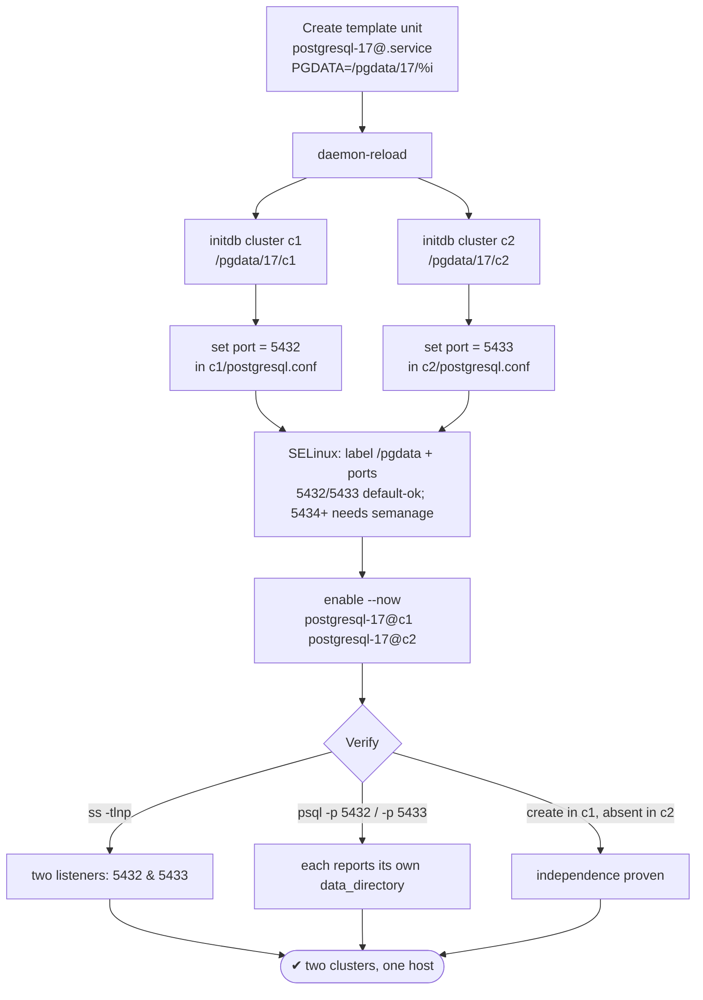
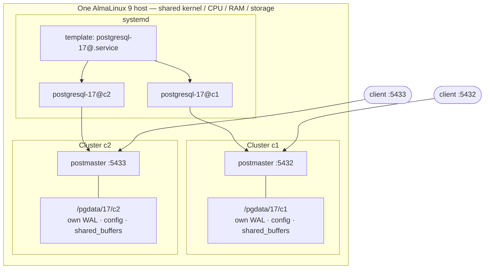

# Lab 03 — Two PostgreSQL 17 Clusters on One Host (ports 5432/5433, separate systemd units)

> **Track A · DBA · A1 Installation & Cluster Provisioning · Lab 3 of 8**
> Teaching package: concept → diagram → steps → verify → quick-ref → self-test → video script.
> **Depends on:** Lab 01 (installed) and Lab 02 (you can `initdb` a custom dir with locale + checksums).

---

## 0. Lab Card (at a glance)

| Field | Value |
|---|---|
| **Objective** | Run **two independent PostgreSQL 17 clusters** on one AlmaLinux 9 host — different data dirs, ports 5432 and 5433 — each managed by its **own systemd unit**. |
| **Success criterion** | `ss -tlnp` shows two postmasters listening on 5432 and 5433; each responds to `psql -p <port>` and reports its own `data_directory`; an object created in one is **absent** in the other. |
| **Scope boundary** | Two same-version clusters, side by side. Multi-*major* coexistence (16 + 17) reuses this exact pattern with a second binary path. |
| **Time** | 25–35 min |
| **Difficulty** | ★★★☆☆ |
| **Prereqs** | Labs 01–02; free ports 5432/5433; enough RAM for two engines |
| **Risk** | Low (new clusters; no existing data touched) |

---

## 1. Learning Objectives

1. **What "another cluster" actually means** — a second independent postmaster with its own `PGDATA`, port, WAL, config, and memory — not a second database inside the same server.
2. **Scale systemd cleanly with a template unit** — one `postgresql-17@.service`, any number of instances addressed by name (`@c1`, `@c2`).
3. **Where the port really lives** — it's a runtime setting in each cluster's `postgresql.conf`, not in the unit file.
4. **The two host-level gotchas** — the SELinux **port** label for non-standard ports, and **RAM oversubscription** when two engines share one box.

---

## 2. Concept Primer — the "why"

**One host can run many clusters.** Each *cluster* is a self-contained server: its own data directory, its own listening port, its own WAL stream, its own `postgresql.conf`/`pg_hba.conf`, and — importantly — **its own memory allocation** (`shared_buffers`, `work_mem`, etc.). They share only the kernel, CPU, RAM, and storage of the host. Common reasons to do this:

- **Isolation** — separate blast radius / tuning / auth for two workloads on one box.
- **Version coexistence** — 16 and 17 side by side for a `pg_upgrade` rehearsal.
- **Blue-green / staging** — a throwaway cluster next to the real one on the same hardware.
- **Cost** — dev + test on one VM without containers.

**Port lives in `postgresql.conf`, not systemd.** PostgreSQL's listening port is the `port` GUC read from each cluster's own config at startup. So "cluster on 5433" means *its* `postgresql.conf` says `port = 5433`. The systemd unit only decides **which `PGDATA`** the server starts against.

**Template units are the scalable pattern.** The PGDG package ships a single, non-template unit. Copying it once per cluster works but doesn't scale. A **systemd template** — a unit whose name ends in `@` — lets `%i` (the text after the `@`) parameterize it. One file, `postgresql-17@.service`, with `Environment=PGDATA=/pgdata/17/%i`, gives you `postgresql-17@c1`, `postgresql-17@c2`, `postgresql-17@anything` for free.

**Two host-level traps a senior must anticipate:**
- **SELinux port labeling.** Under Enforcing, PostgreSQL may only bind ports carrying the `postgresql_port_t` label. 5432 **and** 5433 are in the default label set, so this lab works out of the box — but the moment you pick 5434+, you must add it: `semanage port -a -t postgresql_port_t -p tcp <port>`. Know this *before* it bites.
- **Memory oversubscription.** Each cluster allocates its **own** `shared_buffers`. Two clusters each grabbing 25% of RAM is fine; two each set to "25% of RAM" as if they were alone will thrash or OOM. Budget memory across *all* clusters on the host.

---

## 3. Diagrams

### 3.1 Build flow



### 3.2 Runtime architecture



---

## 4. Prerequisites

```bash
psql --version                       # 17.x (Lab 1)
ss -tlnp | grep -E ':5432|:5433' || echo "ports free"   # both should be free
free -m                              # confirm RAM headroom for two engines
```

---

## 5. Step-by-Step

### Step 1 — Create the systemd **template** unit

```bash
sudo tee /etc/systemd/system/postgresql-17@.service >/dev/null <<'EOF'
[Unit]
Description=PostgreSQL 17 database server (cluster %i)
After=network-online.target
Wants=network-online.target

[Service]
Type=notify
User=postgres
Group=postgres
Environment=PGDATA=/pgdata/17/%i
OOMScoreAdjust=-1000
ExecStartPre=/usr/pgsql-17/bin/postgresql-17-check-db-dir ${PGDATA}
ExecStart=/usr/pgsql-17/bin/postmaster -D ${PGDATA}
ExecReload=/bin/kill -HUP $MAINPID
KillMode=mixed
KillSignal=SIGINT
TimeoutSec=300
RestartSec=10

[Install]
WantedBy=multi-user.target
EOF

sudo systemctl daemon-reload
```
*`%i` becomes the instance name: `postgresql-17@c1` starts against `/pgdata/17/c1`.*

### Step 2 — Prepare and initialize both data dirs

```bash
for c in c1 c2; do
  sudo mkdir -p /pgdata/17/$c
  sudo chown -R postgres:postgres /pgdata/17/$c
  sudo chmod 0700 /pgdata/17/$c
  sudo -u postgres /usr/pgsql-17/bin/initdb \
    --pgdata=/pgdata/17/$c --data-checksums \
    --encoding=UTF8 --locale=en_US.UTF-8 \
    --auth-local=peer --auth-host=scram-sha-256
done
```
*Same hardened `initdb` from Lab 2, applied to each cluster.*

### Step 3 — Set each cluster's port

```bash
echo "port = 5432" | sudo -u postgres tee -a /pgdata/17/c1/postgresql.conf
echo "port = 5433" | sudo -u postgres tee -a /pgdata/17/c2/postgresql.conf
```
*A later line in `postgresql.conf` wins, so appending is a safe way to override the default.*

### Step 4 — SELinux: label the data dirs (and ports if non-standard)

```bash
# Data-dir context (the /pgdata fcontext rule from Lab 2 covers new subdirs):
sudo semanage fcontext -a -t postgresql_db_t "/pgdata(/.*)?" 2>/dev/null || true
sudo restorecon -Rv /pgdata

# Ports: 5432 & 5433 are already in postgresql_port_t — verify, and see how to add others:
sudo semanage port -l | grep postgresql_port_t
# For a port OUTSIDE the default set (e.g. 5434), you WOULD run:
#   sudo semanage port -a -t postgresql_port_t -p tcp 5434
```

### Step 5 — Enable and start both instances

```bash
sudo systemctl enable --now postgresql-17@c1 postgresql-17@c2
systemctl status postgresql-17@c1 postgresql-17@c2 --no-pager
```

### Step 6 — (Optional) open the firewall for remote clients

```bash
sudo firewall-cmd --permanent --add-port=5432/tcp --add-port=5433/tcp
sudo firewall-cmd --reload
```

### Step 7 — Verify independence

```bash
# Two listeners:
ss -tlnp | grep -E ':5432|:5433'

# Each cluster reports its own identity:
sudo -u postgres psql -p 5432 -c "SELECT current_setting('port') AS port, current_setting('data_directory') AS dir;"
sudo -u postgres psql -p 5433 -c "SELECT current_setting('port') AS port, current_setting('data_directory') AS dir;"

# Prove isolation: create in c1, confirm absent in c2:
sudo -u postgres psql -p 5432 -c "CREATE DATABASE only_in_c1;"
sudo -u postgres psql -p 5432 -c "\l" | grep only_in_c1     # present
sudo -u postgres psql -p 5433 -c "\l" | grep only_in_c1     # (no output = correctly absent)
```

---

## 6. Verification Checklist

- [ ] `ss -tlnp` shows postmasters on **both** 5432 and 5433
- [ ] `systemctl is-enabled postgresql-17@c1 postgresql-17@c2` → both **enabled**
- [ ] `psql -p 5432` → `data_directory` = `/pgdata/17/c1`
- [ ] `psql -p 5433` → `data_directory` = `/pgdata/17/c2`
- [ ] A database created in c1 is **not** visible in c2
- [ ] Both survive `systemctl restart postgresql-17@c1 postgresql-17@c2` and a reboot
- [ ] `free -m` shows healthy headroom (no memory oversubscription)

---

## 7. Troubleshooting

| Symptom | Cause | Fix |
|---|---|---|
| `Unit postgresql-17@c1.service not found` | Forgot `daemon-reload` after creating the template | Re-run `sudo systemctl daemon-reload` |
| Second cluster won't start; log: `could not bind IPv4 address … Permission denied` | Port not labeled for SELinux (non-standard port) | `sudo semanage port -a -t postgresql_port_t -p tcp <port>` |
| `could not bind … Address already in use` | Port taken (other cluster/service) | Pick a free port; check `ss -tlnp` |
| `check-db-dir` fails / `PGDATA is not empty or not initialized` | initdb not run for that instance | Run Step 2 for that cluster |
| Both instances land on the same data dir | Template `%i` wrong or hardcoded PGDATA | Ensure `Environment=PGDATA=/pgdata/17/%i` |
| Random OOM kills under load | Two clusters' `shared_buffers` oversubscribe RAM | Size each cluster's memory to a share of host RAM (Lab 9) |
| Service fails after reboot only | Data dir on a mount that isn't ready | Add mount dependency / `RequiresMountsFor=` to the unit |

---

## 8. Quick Reference Card (paste-ready)

```bash
# --- template unit (one file, N clusters) ---
sudo tee /etc/systemd/system/postgresql-17@.service >/dev/null <<'EOF'
[Unit]
Description=PostgreSQL 17 (cluster %i)
After=network-online.target
Wants=network-online.target
[Service]
Type=notify
User=postgres
Group=postgres
Environment=PGDATA=/pgdata/17/%i
OOMScoreAdjust=-1000
ExecStartPre=/usr/pgsql-17/bin/postgresql-17-check-db-dir ${PGDATA}
ExecStart=/usr/pgsql-17/bin/postmaster -D ${PGDATA}
ExecReload=/bin/kill -HUP $MAINPID
KillMode=mixed
KillSignal=SIGINT
TimeoutSec=300
RestartSec=10
[Install]
WantedBy=multi-user.target
EOF
sudo systemctl daemon-reload

# --- init two clusters ---
for c in c1 c2; do
  sudo mkdir -p /pgdata/17/$c && sudo chown -R postgres:postgres /pgdata/17/$c && sudo chmod 0700 /pgdata/17/$c
  sudo -u postgres /usr/pgsql-17/bin/initdb --pgdata=/pgdata/17/$c --data-checksums \
    --encoding=UTF8 --locale=en_US.UTF-8 --auth-local=peer --auth-host=scram-sha-256
done
echo "port = 5432" | sudo -u postgres tee -a /pgdata/17/c1/postgresql.conf
echo "port = 5433" | sudo -u postgres tee -a /pgdata/17/c2/postgresql.conf
sudo restorecon -Rv /pgdata
sudo systemctl enable --now postgresql-17@c1 postgresql-17@c2

# --- verify ---
ss -tlnp | grep -E ':5432|:5433'
sudo -u postgres psql -p 5432 -c "SELECT current_setting('data_directory');"
sudo -u postgres psql -p 5433 -c "SELECT current_setting('data_directory');"

# Add another cluster later:  init /pgdata/17/c3, set port, then: systemctl enable --now postgresql-17@c3
# Non-standard port under SELinux:  sudo semanage port -a -t postgresql_port_t -p tcp <port>
```

---

## 9. Self-Check

1. Is "a second cluster" the same as "a second database"? Explain the difference.
2. Where is each cluster's listening port set — the systemd unit or `postgresql.conf`?
3. What does `%i` do in `postgresql-17@.service`, and why is that better than copying the unit per cluster?
4. Ports 5432/5433 start fine under Enforcing SELinux, but 5434 is refused. Why, and what's the fix?
5. What single host resource most limits how many clusters you can run, and which config knob controls each cluster's share?
6. Give one command that proves the two clusters don't share data.

<details>
<summary>Answers</summary>

1. **No.** A database is one namespace *inside* a cluster; a second cluster is a whole second server — its own postmaster, `PGDATA`, port, WAL, config, and memory.
2. In each cluster's **`postgresql.conf`** (`port` is a runtime GUC). The unit only chooses `PGDATA`.
3. `%i` is the instance name after the `@`, substituted into `PGDATA=/pgdata/17/%i`. One template file serves unlimited clusters, versus maintaining a separate copied unit for each.
4. 5432/5433 are in the default `postgresql_port_t` SELinux label set; 5434 isn't, so binding is denied. Fix: `sudo semanage port -a -t postgresql_port_t -p tcp 5434`.
5. **RAM** — each cluster allocates its own `shared_buffers` (and work_mem, etc.); size each to a *share* of host memory so they don't oversubscribe.
6. Create an object on one port and show it's absent on the other, or compare `current_setting('data_directory')` per port.
</details>

---

## 10. Video / Teaching Script

| # | On screen | Say (narration) |
|---|---|---|
| 1 | Title: "Two PostgreSQL clusters, one server" | "You don't need two machines — or containers — to run two independent PostgreSQL servers. We'll do it with systemd." |
| 2 | Write `postgresql-17@.service` | "The trick is a *template* unit. This `@` and the `%i` inside mean one file can launch as many clusters as we want, each named." |
| 3 | `daemon-reload` | "Tell systemd about it." |
| 4 | `for c in c1 c2; initdb …` | "We initialize two data directories — same hardened settings from the last lab: checksums, locale, scram auth." |
| 5 | append `port =` lines | "The port isn't in the unit — it lives in each cluster's own config. One gets 5432, the other 5433." |
| 6 | `semanage port -l | grep postgresql` | "A heads-up: SELinux only allows PostgreSQL on approved ports. 5432 and 5433 are fine by default — but remember this line the day you pick a different one." |
| 7 | `enable --now @c1 @c2` + `ss -tlnp` | "Start both, and there they are — two postmasters, two ports, one host." |
| 8 | create DB in c1, `\l` on both | "Proof they're truly separate: this database exists on 5432 and simply doesn't on 5433." |
| 9 | `free -m` | "Last word: two engines share this box's RAM. Size each cluster's memory as a *share*, never as if it were alone." |
| 10 | Outro | "Two clusters, cleanly managed. This same pattern runs PostgreSQL 16 and 17 side by side for upgrade rehearsals." |

---

## 11. Glossary

- **Cluster / instance** — one `PGDATA` + one postmaster + one port; a complete server.
- **Template unit** — a systemd unit whose name ends in `@`; `%i` carries the instance name.
- **`%i` specifier** — text after the `@` in `systemctl start name@i`, substituted into the unit.
- **postmaster** — the main PostgreSQL server process that listens and forks backends.
- **GUC** — Grand Unified Configuration: a PostgreSQL setting such as `port` or `shared_buffers`.
- **`postgresql_port_t`** — the SELinux type that whitelists ports PostgreSQL may bind.

---
*NETAPORT lab series · PostgreSQL 17 on AlmaLinux 9 · Lab 03/222*
