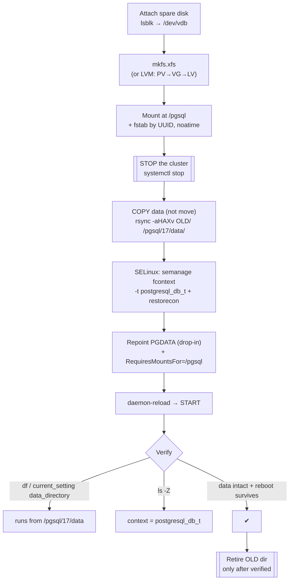
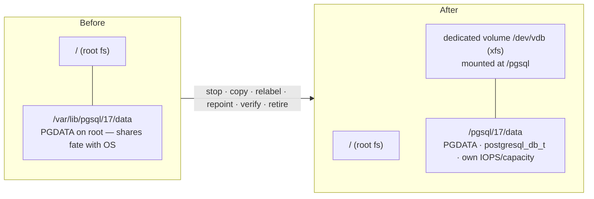

# Lab 04 — Relocate the Data Directory to a Dedicated Volume + Fix SELinux Context

> **Track A · DBA · A1 Installation & Cluster Provisioning · Lab 4 of 8**
> Teaching package: concept → diagram → steps → verify → quick-ref → self-test → video script.
> **Depends on:** Labs 01–03 (installed; you know `PGDATA`, systemd drop-ins, and basic SELinux labeling).

---

## 0. Lab Card (at a glance)

| Field | Value |
|---|---|
| **Objective** | Move an existing PostgreSQL 17 cluster's data directory onto a **dedicated mounted volume**, persist the mount, apply the correct **SELinux context** with `semanage fcontext`, and make systemd start only after the volume mounts. |
| **Success criterion** | Server runs with `data_directory` on the new volume; `df` confirms it's a separate mount; `ls -Z` shows `postgresql_db_t`; data is intact; it all survives a reboot. |
| **Scope boundary** | Relocating one cluster's storage. Encrypting that volume (LUKS) is Lab 178; xfs-vs-ext4 tuning is Lab 195. |
| **Time** | 30–40 min |
| **Difficulty** | ★★★☆☆ |
| **Prereqs** | Labs 01–03; a spare block device (a second virtual disk); an existing cluster to move; a maintenance window (brief downtime) |
| **Risk** | **Medium** — you're moving live data. Mitigated by **copy-not-move + verify + retire**, never an in-place move. |

---

## 1. Learning Objectives

1. **Why `PGDATA` belongs on its own volume** — independent capacity, IOPS, snapshot cadence, and the ability to fill up without taking down the OS.
2. **The safe relocation ritual** — stop → **copy** (preserving perms/xattrs) → repoint → verify → *only then* retire the original.
3. **Persistent SELinux labeling** — `semanage fcontext` + `restorecon` (survives relabels) versus `chcon` (temporary; lost on the next relabel).
4. **Mount-ordering safety** — `RequiresMountsFor=` so PostgreSQL never starts against an unmounted or empty mount point after a reboot.
5. **fstab done right** — mount by **UUID**, with sane options (`noatime`).

---

## 2. Concept Primer — the "why"

**Storage is a first-class DBA decision.** The RPM default puts `PGDATA` on the root filesystem. In production you want it on a **dedicated volume** so you can: grow it without touching `/`, give it faster/independent disks, snapshot it on its own schedule, and — crucially — survive it filling to 100% without crashing the whole host. This lab performs that relocation on an existing cluster.

**Move data the safe way — copy, don't move.** The golden rule: **stop the server first** (moving a live data directory guarantees corruption), then **copy** the tree with a tool that preserves ownership, permissions, and extended attributes. Copy — not `mv` — because the original stays intact as an instant rollback until you've proven the new location works. Only after verification do you retire the old directory.

**Two SELinux tools, one right choice.**
- `chcon` sets a context **now**, but it's **not remembered** — the next `restorecon`/relabel/`autorelabel` wipes it back to the policy default. Never use it for a permanent data dir.
- `semanage fcontext` writes a **persistent rule** into the local policy ("anything matching this path pattern is `postgresql_db_t`"); `restorecon` then applies that rule to files on disk. This is why the lab specifies `semanage fcontext` — it's the durable one.

The context PostgreSQL's data must carry is **`postgresql_db_t`**. Without it, under Enforcing SELinux the server is denied access to its own files and won't start.

**Mount ordering is a real hazard.** After a reboot, if PostgreSQL's unit starts *before* the volume is mounted, it either fails or (worse, if the mount point has stray files) starts against the wrong directory. `RequiresMountsFor=/pgsql` tells systemd: don't start this service until that path is mounted. Pair it with a correct `/etc/fstab` entry (by **UUID**, since kernel device names like `/dev/sdb` can reorder across boots).

---

## 3. Diagrams

### 3.1 Relocation flow



### 3.2 Before / after



---

## 4. Prerequisites

```bash
# Identify the current data dir (the one you'll move):
sudo -u postgres psql -c "SHOW data_directory;"      # e.g. /var/lib/pgsql/17/data
# (If you did Labs 2-3, substitute your /pgdata/17/... path throughout.)

# See the spare disk (expect an empty device with no partitions):
lsblk

# Confirm the cluster's service name:
systemctl list-units 'postgresql*' --type=service
```

> Throughout: **OLD** = current `PGDATA`, **NEW** = `/pgsql/17/data`. Adjust names to your host.

---

## 5. Step-by-Step

### Step 1 — Make a filesystem on the dedicated disk

```bash
# Whole-disk xfs (simplest). Assume the spare disk is /dev/vdb — CONFIRM with lsblk first.
sudo mkfs.xfs -f /dev/vdb
```

> **Production variant — LVM (recommended for online growth):**
> ```bash
> sudo pvcreate /dev/vdb
> sudo vgcreate vg_pg /dev/vdb
> sudo lvcreate -l 100%FREE -n lv_pgdata vg_pg
> sudo mkfs.xfs /dev/vg_pg/lv_pgdata
> # later grow live:  lvextend -l +100%FREE … && xfs_growfs /pgsql
> ```
> Use the LV path (`/dev/vg_pg/lv_pgdata`) in place of `/dev/vdb` below.

### Step 2 — Mount it and persist in fstab (by UUID)

```bash
sudo mkdir -p /pgsql
UUID=$(sudo blkid -s UUID -o value /dev/vdb)        # or the LV path
echo "UUID=$UUID  /pgsql  xfs  defaults,noatime  0 0" | sudo tee -a /etc/fstab
sudo systemctl daemon-reload
sudo mount -a
df -h /pgsql                                         # confirm it's mounted
```
*By-UUID survives device renaming; `noatime` cuts needless write traffic.*

### Step 3 — Prepare the target path

```bash
sudo mkdir -p /pgsql/17/data
sudo chown -R postgres:postgres /pgsql
sudo chmod 0700 /pgsql/17/data
```

### Step 4 — STOP the cluster (mandatory)

```bash
sudo systemctl stop postgresql-17        # or postgresql-17@c1 — your unit
sudo -u postgres /usr/pgsql-17/bin/pg_controldata "$OLD" | grep -i "cluster state"
#   → expect "shut down"  (never copy a running cluster)
```

### Step 5 — COPY the data (preserve everything)

```bash
sudo rsync -aHAXv /var/lib/pgsql/17/data/  /pgsql/17/data/
#         a=archive H=hardlinks A=ACLs X=xattrs  — note the TRAILING SLASHES
sudo chown -R postgres:postgres /pgsql/17/data
sudo chmod 0700 /pgsql/17/data
```
*Trailing slashes copy the **contents** into NEW. The original stays untouched as your rollback.*

### Step 6 — Fix the SELinux context (the persistent way)

```bash
sudo semanage fcontext -a -t postgresql_db_t "/pgsql/17/data(/.*)?"
sudo restorecon -Rv /pgsql/17/data
ls -Zd /pgsql/17/data                     # → ...:postgresql_db_t:...
```
*`semanage fcontext` writes a durable policy rule; `restorecon` stamps it onto disk. Do **not** use `chcon` here — it wouldn't survive a relabel.*

### Step 7 — Repoint PGDATA and gate on the mount

```bash
sudo mkdir -p /etc/systemd/system/postgresql-17.service.d
sudo tee /etc/systemd/system/postgresql-17.service.d/override.conf >/dev/null <<'EOF'
[Unit]
RequiresMountsFor=/pgsql
[Service]
Environment=PGDATA=/pgsql/17/data
EOF
sudo systemctl daemon-reload
```
*`RequiresMountsFor` stops the server from ever starting before the volume is present.*

### Step 8 — Start and verify

```bash
sudo systemctl start postgresql-17
sudo -u postgres psql -c "SELECT current_setting('data_directory');"   # → /pgsql/17/data
df -h /pgsql/17/data                                                   # → on /dev/vdb, not root
sudo -u postgres psql -c "\l+"                                         # confirm your databases are all present
```

### Step 9 — Reboot test, then retire the old directory

```bash
sudo reboot
# after reboot:
systemctl status postgresql-17 --no-pager        # active, on the new path
df -h /pgsql                                      # mounted
# ONLY once everything checks out, retire the old data (rename first, delete later):
sudo mv /var/lib/pgsql/17/data /var/lib/pgsql/17/data.OLD.$(date +%F)
```
*Rename — don't `rm` — until you've run for a while. That folder is your last rollback.*

---

## 6. Verification Checklist

- [ ] `SELECT current_setting('data_directory')` → `/pgsql/17/data`
- [ ] `df -h /pgsql/17/data` shows the **dedicated device**, not `/`
- [ ] `ls -Zd /pgsql/17/data` → context includes **`postgresql_db_t`**
- [ ] `semanage fcontext -l | grep /pgsql` shows the persistent rule
- [ ] All pre-move databases/tables present (`\l+`, row counts match)
- [ ] `systemctl show -p Environment postgresql-17` → new `PGDATA`
- [ ] Survives `reboot`: volume auto-mounts **and** service starts on it
- [ ] `/etc/fstab` entry is by **UUID**, mount option `noatime`

---

## 7. Troubleshooting

| Symptom | Cause | Fix |
|---|---|---|
| Service won't start; journal shows AVC denial / `Permission denied` on data dir | Missing/incorrect SELinux label | Re-run Step 6 (`semanage fcontext` + `restorecon`); check `ls -Zd` |
| After reboot the DB is empty or fails | Started before the mount was ready | Add `RequiresMountsFor=/pgsql` (Step 7); confirm fstab entry |
| Mount vanished / wrong disk after reboot | fstab used `/dev/sdX` name that reordered | Switch fstab to `UUID=…` (Step 2) |
| `data directory … has wrong ownership` / `has group or world access` | Copy lost perms | `chown -R postgres:postgres` + `chmod 0700` on NEW |
| Copy finished but some files missing/links broken | rsync flags too weak | Use `rsync -aHAXv` (hardlinks, ACLs, xattrs) |
| Corruption / won't recover after move | Copied while **running** | Always `stop` first; if damaged, roll back to OLD and redo |
| `df` still shows root fs for the data path | `/pgsql` not actually mounted | `mount -a`; check `/etc/fstab` and `mount | grep pgsql` |

---

## 8. Quick Reference Card (paste-ready)

```bash
OLD=/var/lib/pgsql/17/data ; NEW=/pgsql/17/data ; DISK=/dev/vdb ; SVC=postgresql-17

# 1. filesystem + persistent mount (by UUID)
sudo mkfs.xfs -f "$DISK"
sudo mkdir -p /pgsql
UUID=$(sudo blkid -s UUID -o value "$DISK")
echo "UUID=$UUID  /pgsql  xfs  defaults,noatime  0 0" | sudo tee -a /etc/fstab
sudo systemctl daemon-reload && sudo mount -a

# 2. target dir
sudo mkdir -p "$NEW" && sudo chown -R postgres:postgres /pgsql && sudo chmod 0700 "$NEW"

# 3. STOP, then COPY (never move a running cluster)
sudo systemctl stop "$SVC"
sudo rsync -aHAXv "$OLD"/ "$NEW"/
sudo chown -R postgres:postgres "$NEW" && sudo chmod 0700 "$NEW"

# 4. SELinux (persistent) 
sudo semanage fcontext -a -t postgresql_db_t "/pgsql/17/data(/.*)?"
sudo restorecon -Rv "$NEW"

# 5. repoint + gate on mount
sudo mkdir -p /etc/systemd/system/$SVC.service.d
printf '[Unit]\nRequiresMountsFor=/pgsql\n[Service]\nEnvironment=PGDATA=%s\n' "$NEW" \
  | sudo tee /etc/systemd/system/$SVC.service.d/override.conf
sudo systemctl daemon-reload && sudo systemctl start "$SVC"

# 6. verify
sudo -u postgres psql -c "SELECT current_setting('data_directory');"
df -h "$NEW" ; ls -Zd "$NEW"
# reboot, re-check, THEN: sudo mv "$OLD" "$OLD".OLD.$(date +%F)
```

---

## 9. Self-Check

1. Why copy the data with `rsync` instead of `mv`-ing the directory?
2. What must be true about the cluster before you touch its files, and why?
3. `chcon` sets the right context and the server starts — why is that still wrong here?
4. Which fstab field should identify the volume, and what breaks if you use `/dev/sdb1`?
5. What does `RequiresMountsFor=/pgsql` protect against?
6. Name two independent checks that the running server is on the new volume.

<details>
<summary>Answers</summary>

1. Copy leaves the original intact as an instant rollback; you retire it only after verifying. `mv` gives you no fallback if the new location misbehaves.
2. It must be **stopped** (`pg_controldata` → "shut down"). Copying a live data directory captures an inconsistent state and corrupts the copy.
3. `chcon` is not persistent — the next `restorecon`/relabel reverts it to the policy default, and PostgreSQL breaks later. `semanage fcontext` writes a durable rule.
4. **UUID**. Kernel device names (`/dev/sdb1`) can reorder across reboots, so a name-based entry may mount the wrong disk or fail.
5. It prevents systemd from starting PostgreSQL before `/pgsql` is mounted — avoiding a start against an unmounted/empty path after reboot.
6. `SELECT current_setting('data_directory')` returns the new path **and** `df -h <new path>` shows the dedicated device (plus `ls -Zd` for the SELinux label).
</details>

---

## 10. Video / Teaching Script

| # | On screen | Say (narration) |
|---|---|---|
| 1 | Title: "Move PostgreSQL onto its own disk — safely" | "Data on the root filesystem is a liability. We'll move it to a dedicated volume without losing a byte." |
| 2 | `lsblk`, `mkfs.xfs` | "Here's our spare disk. We put an xfs filesystem on it." |
| 3 | fstab by UUID + `mount -a` | "We mount it — and pin it in fstab by UUID, never by device name, because device names can shuffle on reboot." |
| 4 | `systemctl stop` + `pg_controldata` | "Golden rule: stop the server first. You never copy a running data directory — that's guaranteed corruption." |
| 5 | `rsync -aHAXv OLD/ NEW/` | "We *copy*, not move — preserving every permission and attribute. The original stays as our safety net." |
| 6 | `semanage fcontext` + `restorecon`, then `ls -Z` | "Now the SELinux part the lab is really about: a *persistent* label with semanage — not chcon, which wouldn't survive a relabel." |
| 7 | drop-in with `RequiresMountsFor` + `Environment=PGDATA` | "Point systemd at the new location, and tell it: don't even start until this volume is mounted." |
| 8 | start + `current_setting` + `df` | "Start it. Running from the new disk, all databases present." |
| 9 | `reboot`, re-check, rename OLD | "Reboot to prove it. Then — and only then — we retire the old directory, by renaming, not deleting." |
| 10 | Outro | "Data on its own volume, correctly labeled, reboot-proof. This is the foundation for snapshots, encryption, and growth." |

---

## 11. Glossary

- **Mount point** — a directory where a filesystem is attached (`/pgsql`).
- **fstab / UUID** — `/etc/fstab` defines persistent mounts; UUID identifies a volume stably across reboots.
- **xfs / LVM** — journaling filesystem RHEL favors for databases; LVM adds online resize (PV→VG→LV).
- **`semanage fcontext`** — writes a **persistent** SELinux file-context rule (vs temporary `chcon`).
- **`restorecon`** — applies the policy's context rules to files on disk.
- **`postgresql_db_t`** — the SELinux type the data directory must carry.
- **`RequiresMountsFor=`** — systemd dependency ensuring a path is mounted before the unit starts.

---
*NETAPORT lab series · PostgreSQL 17 on AlmaLinux 9 · Lab 04/222*
