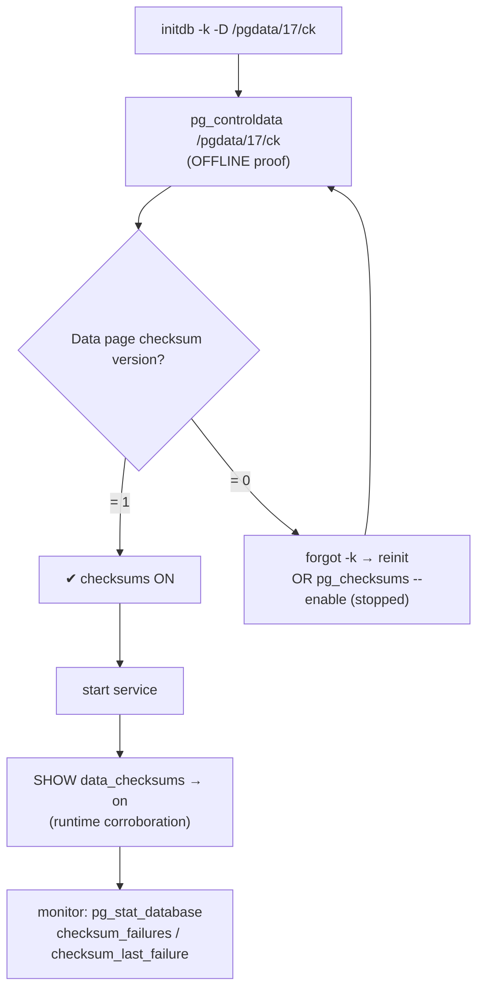
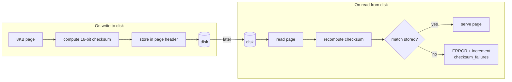

# Lab 05 — Initialize with `initdb -k` and Prove Checksums via `pg_controldata`

> **Track A · DBA · A1 Installation & Cluster Provisioning · Lab 5 of 8**
> Teaching package: concept → diagram → steps → verify → quick-ref → self-test → video script.
> **Depends on:** Labs 01–02 (installed; you can `initdb` a cluster). Complements Lab 02, which set checksums as one option among several — here checksums are the whole subject.

---

## 0. Lab Card (at a glance)

| Field | Value |
|---|---|
| **Objective** | Create a cluster with **`initdb -k`** (data checksums) and **prove** they're on using `pg_controldata` — offline, without starting the server — then corroborate at runtime and learn how to enable them on an *existing* cluster. |
| **Success criterion** | `pg_controldata` reports **Data page checksum version: 1**; `SHOW data_checksums` → `on`. |
| **Scope boundary** | Enabling + proving + monitoring checksums. *Deliberately corrupting a page to watch detection fire* is Lab 123. |
| **Time** | 15–20 min |
| **Difficulty** | ★★☆☆☆ |
| **Prereqs** | Labs 01–02; a scratch path for a fresh cluster |
| **Risk** | Low (fresh cluster; `pg_checksums` section acts only on a stopped cluster) |

---

## 1. Learning Objectives

1. **What `-k` bakes in** — `-k` is the short form of `--data-checksums`; it's a birth-time property recorded in the control file.
2. **Prove it offline** — `pg_controldata` reads the control file directly, so you can confirm checksums with the server **down**.
3. **Enable on an existing cluster** — no dump/reload needed; `pg_checksums --enable` rewrites every page while the cluster is stopped.
4. **Monitor at runtime** — `pg_stat_database.checksum_failures` is your ongoing corruption tripwire.
5. **Understand the limit** — checksums **detect** silent corruption; they don't **repair** it. Recovery still comes from a backup or a healthy replica.

---

## 2. Concept Primer — the "why"

**What a data checksum is.** Every table/index page is 8 KB. With checksums enabled, PostgreSQL computes a 16-bit checksum, stores it in the page header on **write to disk**, and **verifies** it whenever that page is read *from disk* into shared buffers. If the stored and recomputed values disagree — bit rot, a failing disk, a torn write, a storage-layer bug — PostgreSQL raises an error instead of silently handing back corrupted data.

**What it catches, and what it doesn't.**
- **Catches:** silent on-disk corruption below PostgreSQL (hardware, firmware, storage).
- **Doesn't catch:** corruption in RAM/shared buffers (a cached page isn't re-verified), or logic bugs. And critically — it is **detection only**. A checksum failure tells you a page is bad; it does **not** fix it. Your recovery path is a backup (Track A3) or a good replica (A4). (WAL has its own CRC and is always protected, independent of this setting.)

**Set at birth, or added offline.** Checksums are chosen at `initdb` via `-k`. On a cluster that's already running without them, you don't need a dump/reload: `pg_checksums --enable` walks every page and writes checksums in — but the cluster must be **cleanly shut down** first, and on a large cluster this is a long, I/O-heavy pass (do it in a maintenance window).

**Cost.** A few percent CPU on reads/writes — negligible for the corruption-detection value on virtually all production systems. *In PG17 checksums are still off by default; PG18 makes them the default.* That default flip is the industry telling you: turn them on.

**Why `pg_controldata` is the proof.** `pg_control` is a small binary file in `global/` recording cluster-wide facts: system identifier, WAL/checkpoint positions, and the checksum version. `pg_controldata` prints it **without a running server**, so it's the authoritative, offline proof — `0` means off, `1` means on.

---

## 3. Diagrams

### 3.1 Enable + prove flow



### 3.2 How a checksum protects a page



---

## 4. Prerequisites

```bash
psql --version                         # 17.x
which pg_controldata pg_checksums      # both in /usr/pgsql-17/bin (from Lab 1)
```

---

## 5. Step-by-Step

### Step 1 — Initialize a cluster with `-k`

```bash
sudo mkdir -p /pgdata/17/ck
sudo chown -R postgres:postgres /pgdata/17/ck && sudo chmod 0700 /pgdata/17/ck
sudo -u postgres /usr/pgsql-17/bin/initdb -k -D /pgdata/17/ck --encoding=UTF8 --locale=en_US.UTF-8
```
*`-k` == `--data-checksums`. That single flag records checksum version 1 in the control file.*

### Step 2 — Prove it with `pg_controldata` (server still down)

```bash
sudo -u postgres /usr/pgsql-17/bin/pg_controldata /pgdata/17/ck | grep -i "checksum"
#   → Data page checksum version: 1
```
*This is the authoritative proof and needs **no** running server. Version `1` = on, `0` = off.*

> See the surrounding context too — `pg_controldata` also shows the system identifier, latest checkpoint, and WAL position:
> ```bash
> sudo -u postgres /usr/pgsql-17/bin/pg_controldata /pgdata/17/ck | head -20
> ```

### Step 3 — Start and corroborate at runtime

```bash
# point a systemd unit at it (drop-in pattern from Lab 2/3) or start directly for a quick check:
sudo -u postgres /usr/pgsql-17/bin/pg_ctl -D /pgdata/17/ck -o "-p 5440" -l /tmp/ck.log start
sudo -u postgres psql -p 5440 -c "SHOW data_checksums;"        # → on
sudo -u postgres psql -p 5440 -c "SELECT datname, checksum_failures, checksum_last_failure FROM pg_stat_database;"
```
*`checksum_failures` starts at 0 — that's your live tripwire going forward.*

### Step 4 — (Companion) enable checksums on an EXISTING cluster

For a cluster that was built *without* `-k` and can't be reinitialized:

```bash
sudo systemctl stop postgresql-17                     # must be cleanly shut down
sudo -u postgres /usr/pgsql-17/bin/pg_controldata /var/lib/pgsql/17/data | grep "cluster state"
#   → "shut down"   (pg_checksums refuses otherwise)

# verify current pages first (optional), then enable:
sudo -u postgres /usr/pgsql-17/bin/pg_checksums --check  -D /var/lib/pgsql/17/data       # scan existing
sudo -u postgres /usr/pgsql-17/bin/pg_checksums --enable -P -D /var/lib/pgsql/17/data    # -P shows progress

sudo -u postgres /usr/pgsql-17/bin/pg_controldata /var/lib/pgsql/17/data | grep -i checksum   # → 1
sudo systemctl start postgresql-17
```
*`--enable` rewrites **every** page — long and I/O-heavy on big clusters. Maintenance window only.*

---

## 6. Verification Checklist

- [ ] `pg_controldata … | grep checksum` → **Data page checksum version: 1**
- [ ] `SHOW data_checksums;` → **on**
- [ ] `pg_stat_database.checksum_failures` is visible and **0** on a healthy cluster
- [ ] (Companion) `pg_checksums --check` on the enabled cluster reports **0 bad checksums**
- [ ] You can articulate: checksums **detect**, they do **not** repair

---

## 7. Troubleshooting

| Symptom | Cause | Fix |
|---|---|---|
| `Data page checksum version: 0` | `-k` omitted at initdb | Reinit a fresh dir with `-k`, **or** `pg_checksums --enable` on the stopped cluster |
| `pg_checksums: database cluster is not in a shut down state` | Cluster still running / crashed | `systemctl stop`; confirm `pg_controldata` → "shut down" |
| `pg_checksums --enable` takes hours | Rewrites every page on a large cluster | Expected; run in a window, use `-P` for progress |
| `ERROR: invalid page in block … checksum mismatch` on a query | Real on-disk corruption detected | Restore that object from backup or a healthy replica; do **not** ignore silently |
| Must read a corrupt page to salvage data | Emergency only | Temporarily `SET ignore_checksum_failure = on;` to read + copy out, then get off it and restore properly |
| `pg_controldata: could not open file … Permission denied` | Not running as postgres | Prefix `sudo -u postgres` |

---

## 8. Quick Reference Card (paste-ready)

```bash
# --- new cluster WITH checksums ---
sudo mkdir -p /pgdata/17/ck && sudo chown -R postgres:postgres /pgdata/17/ck && sudo chmod 0700 /pgdata/17/ck
sudo -u postgres /usr/pgsql-17/bin/initdb -k -D /pgdata/17/ck --encoding=UTF8 --locale=en_US.UTF-8

# --- PROVE (offline, no server) ---
sudo -u postgres /usr/pgsql-17/bin/pg_controldata /pgdata/17/ck | grep -i checksum   # → version: 1

# --- corroborate at runtime ---
sudo -u postgres psql -c "SHOW data_checksums;"                                        # on
sudo -u postgres psql -c "SELECT datname,checksum_failures,checksum_last_failure FROM pg_stat_database;"

# --- enable on an EXISTING (stopped) cluster ---
sudo systemctl stop postgresql-17
sudo -u postgres /usr/pgsql-17/bin/pg_checksums --enable -P -D /var/lib/pgsql/17/data
sudo -u postgres /usr/pgsql-17/bin/pg_controldata /var/lib/pgsql/17/data | grep -i checksum
sudo systemctl start postgresql-17

# scan/verify existing pages:  pg_checksums --check -D <dir>   (cluster stopped)
```

---

## 9. Self-Check

1. What does `-k` stand for?
2. Does proving checksums with `pg_controldata` require the server to be running?
3. What value of "Data page checksum version" means checksums are on?
4. A cluster is already live without checksums. How do you enable them without a dump/reload, and what's the hard precondition?
5. Checksums just caught a bad page. Are your data fixed?
6. Where do you watch for accumulated checksum failures while the server runs?

<details>
<summary>Answers</summary>

1. `--data-checksums`.
2. **No.** `pg_controldata` reads the control file offline — that's why it's the authoritative proof.
3. **1** (0 means off).
4. `pg_checksums --enable` on the cluster — but it must be **cleanly shut down** first; it then rewrites every page.
5. **No.** Checksums are detection only. Recover the corrupted object from a backup or a healthy replica.
6. `pg_stat_database.checksum_failures` (and `checksum_last_failure` for the timestamp).
</details>

---

## 10. Video / Teaching Script

| # | On screen | Say (narration) |
|---|---|---|
| 1 | Title: "Turn on corruption detection — and prove it" | "One flag lets PostgreSQL catch silent disk corruption before it spreads. Let's enable it and, more importantly, prove it's on." |
| 2 | `initdb -k …` | "`-k` — short for data-checksums. That's the whole switch, set at cluster creation." |
| 3 | `pg_controldata … grep checksum` | "Here's the proof — and notice the server isn't even running. pg_controldata reads the control file directly. Version one means on." |
| 4 | `SHOW data_checksums;` + pg_stat_database | "Start it up, confirm from SQL, and meet your tripwire: this failures counter stays at zero on a healthy system." |
| 5 | `pg_checksums --enable` (stopped) | "Already have a cluster without checksums? No dump-and-reload. Stop it, run pg_checksums enable — it rewrites every page." |
| 6 | Emphasis slide | "The one thing to remember: checksums *detect*, they don't *repair*. When one fires, you restore from backup or a replica." |
| 7 | Outro | "Corruption detection on, and proven. In a later lab we'll deliberately corrupt a page and watch this fire." |

---

## 11. Glossary

- **Data checksum** — 16-bit per-page integrity value, verified on read from disk.
- **`pg_control`** — small binary file (`global/pg_control`) of cluster-wide state.
- **`pg_controldata`** — prints `pg_control` offline; the authoritative checksum proof.
- **`pg_checksums`** — enable/disable/verify checksums on a **stopped** cluster.
- **`checksum_failures`** — per-database counter in `pg_stat_database`; the runtime tripwire.
- **`ignore_checksum_failure`** — emergency GUC to read a failing page for salvage (off by default; dangerous).
- **Torn write / bit rot** — partial page write / silent storage decay that checksums surface.

---
*NETAPORT lab series · PostgreSQL 17 on AlmaLinux 9 · Lab 05/222*
