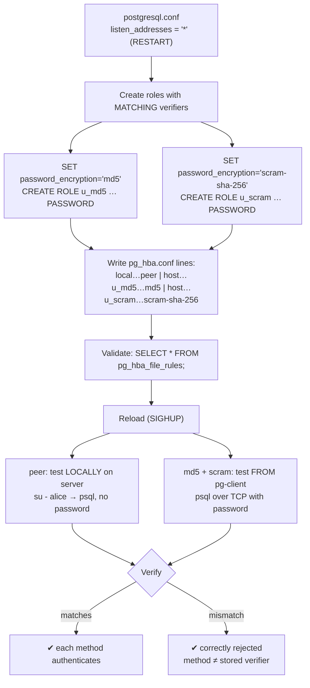
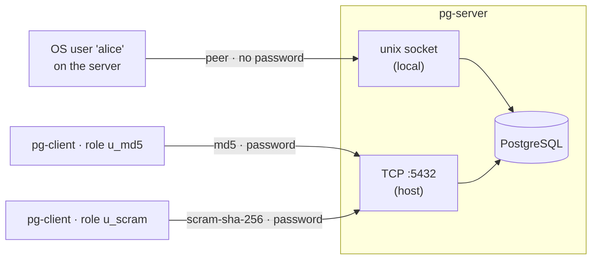

# Lab 06 — pg_hba.conf Auth: peer vs md5 vs scram-sha-256, Tested from `pg-client`

> **Track A · DBA · A1 Installation & Cluster Provisioning · Lab 6 of 8**
> Teaching package: concept → diagram → steps → verify → quick-ref → self-test → video script.
> **Depends on:** Labs 01–02 (a running cluster). Two hosts: `pg-server` (the DB) and `pg-client` (a separate box).

---

## 0. Lab Card (at a glance)

| Field | Value |
|---|---|
| **Objective** | Configure `pg_hba.conf` to use **peer** (local), **md5**, and **scram-sha-256** (TCP), and test each. |
| **Success criterion** | peer login works locally with no password; from `pg-client`, an md5-verifier role authenticates on the md5 line and a scram-verifier role on the scram line; mismatches are correctly **rejected**. |
| **Scope boundary** | These three methods + the verifier/method dependency. TLS (`hostssl`, `cert`) is Labs 45–46; LDAP/Kerberos is Lab 173–174. |
| **Time** | 30–40 min |
| **Difficulty** | ★★★☆☆ |
| **Prereqs** | Labs 01–02; a second host (`pg-client`) with `psql`; network reachability to port 5432 |
| **Risk** | Low–Medium — **auth misconfig can lock you out**. Always keep one working admin line (see the box in §5). |

---

## 1. Learning Objectives

1. **Read and write a `pg_hba.conf` rule** — the five fields (`TYPE DATABASE USER ADDRESS METHOD`) and **first-match-wins** ordering.
2. **Understand each method's domain** — peer is **local socket only** (OS identity); md5 and scram work over **TCP** (passwords).
3. **The core dependency** — the method in `pg_hba.conf` must match the **stored password verifier**, and that format is fixed by `password_encryption` *when the password was set*.
4. **Change auth safely** — reload vs restart, validate with `pg_hba_file_rules`, and never lock yourself out.
5. **Know why scram beats md5** — and how to migrate.

---

## 2. Concept Primer — the "why"

**`pg_hba.conf` is the front door.** HBA = *Host-Based Authentication*. Every connection is matched, **top to bottom, first match wins**, against lines of:

```
# TYPE   DATABASE   USER      ADDRESS          METHOD
local    all        all                        peer
host     all        u_md5     10.0.0.20/32     md5
hostssl  all        u_scram   10.0.0.20/32     scram-sha-256
```

- **TYPE** — `local` (unix socket), `host` (TCP, SSL or not), `hostssl` (TLS required), `hostnossl`.
- **ADDRESS** — CIDR for `host` lines (`10.0.0.20/32`, `10.0.0.0/24`); empty for `local`.
- **METHOD** — how to authenticate once matched.

**The three methods here:**
- **peer** — for `local` connections only. PostgreSQL asks the OS "who is this socket's user?" and logs them in as the same-named role (or a `pg_ident` mapping). **No password, no TCP.** This is why `postgres` can `psql` on the server with no prompt.
- **md5** — password auth using an MD5 challenge. **Deprecated** — the verifier is a weak, reusable hash. Works over TCP.
- **scram-sha-256** — modern SCRAM (RFC 5802): salted, challenge-response, no reusable secret crosses the wire or sits stealable on disk. **The standard.** Works over TCP.

**The dependency people miss:** the method must match the **stored verifier**. A role's password is stored either as `md5…` or `SCRAM-SHA-256$…`, decided by `password_encryption` **at the moment the password is set**. So:

| pg_hba method ↓ / stored verifier → | md5 verifier | scram verifier |
|---|---|---|
| **md5** | ✅ works | ❌ fails |
| **scram-sha-256** | ❌ fails | ✅ works |

To exercise both methods you therefore set two roles' passwords under two different `password_encryption` values. *(PG17 defaults `password_encryption = scram-sha-256`.)*

**"Test peer from pg-client" — the honest caveat.** peer is **local-socket only**; it cannot be used over TCP. So peer is demonstrated **on the server**; md5 and scram are what you test **from pg-client**. Stating this correctly is part of the lab.

**Reload vs restart.** Editing `pg_hba.conf` needs only a **reload** (SIGHUP). But letting `pg-client` connect at all first requires `listen_addresses` in `postgresql.conf` to include more than `localhost` — and `listen_addresses` needs a **restart**.

---

## 3. Diagrams

### 3.1 Setup + test flow



### 3.2 Which method reaches where



---

## 4. Prerequisites

```bash
# on pg-server — note its IP; note pg-client's IP (used in ADDRESS):
hostname -I
# on pg-client — confirm psql + reachability:
psql --version
nc -vz <pg-server-ip> 5432 || echo "port blocked — open firewall / listen_addresses"
```

---

## 5. Step-by-Step

> ⚠️ **Do not remove the `local … peer` (or your admin) line.** Keep at least one working way in as `postgres` on the server, or a bad edit can lock you out. All edits below **add** rules; the admin path stays intact.

### Step 1 — Let the server accept TCP (server)

```bash
sudo -u postgres psql -c "ALTER SYSTEM SET listen_addresses = '*';"   # or a specific IP
sudo systemctl restart postgresql-17                                   # listen_addresses needs RESTART
# open the firewall for the client:
sudo firewall-cmd --permanent --add-service=postgresql && sudo firewall-cmd --reload
```

### Step 2 — Create roles with matching verifiers (server)

```bash
sudo -u postgres psql <<'SQL'
-- md5-verifier role
SET password_encryption = 'md5';
CREATE ROLE u_md5   LOGIN PASSWORD 'Md5Pass!1';
-- scram-verifier role
SET password_encryption = 'scram-sha-256';
CREATE ROLE u_scram LOGIN PASSWORD 'ScramPass!1';
-- a peer role that maps to an OS user (created next):
CREATE ROLE alice   LOGIN;
SQL

# OS user for the peer test:
sudo useradd alice 2>/dev/null; echo "alice OS user ready"

# confirm the stored verifier formats differ:
sudo -u postgres psql -c "SELECT rolname, left(rolpassword,13) AS verifier FROM pg_authid WHERE rolname IN ('u_md5','u_scram');"
#   u_md5   | md5xxxxxxxxxx
#   u_scram | SCRAM-SHA-256
```

### Step 3 — Write the pg_hba rules (server)

```bash
HBA=$(sudo -u postgres psql -tAc "SHOW hba_file;")   # find the active file
echo "$HBA"

sudo tee -a "$HBA" >/dev/null <<EOF

# --- Lab 06 auth methods ---
local   all   alice                         peer
host    all   u_md5     <pg-client-ip>/32   md5
host    all   u_scram   <pg-client-ip>/32   scram-sha-256
EOF
```
*Replace `<pg-client-ip>`. Order matters — these are specific-user lines; keep them above any broad catch-all.*

### Step 4 — Validate, then reload (server)

```bash
# Parse-check WITHOUT disrupting the running server:
sudo -u postgres psql -c "SELECT line_number, type, user_name, address, auth_method, error FROM pg_hba_file_rules ORDER BY line_number;"
#   → your three lines appear; error column must be NULL

sudo systemctl reload postgresql-17          # pg_hba changes need only a reload (SIGHUP)
```

### Step 5 — Test **peer** (locally on the server)

```bash
sudo su - alice -c "psql -d postgres -c 'SELECT current_user, \"current_setting\"('\''client_addr'\'')' " 2>/dev/null \
  || sudo su - alice -c "psql -d postgres -c 'SELECT current_user;'"
#   → current_user = alice, no password prompted (OS identity via peer)
```

### Step 6 — Test **md5** and **scram** (from pg-client)

```bash
# on pg-client:
PGPASSWORD='Md5Pass!1'   psql "host=<pg-server-ip> port=5432 dbname=postgres user=u_md5"   -c "SELECT current_user, 'md5 ok';"
PGPASSWORD='ScramPass!1' psql "host=<pg-server-ip> port=5432 dbname=postgres user=u_scram" -c "SELECT current_user, 'scram ok';"
```

### Step 7 — Prove the mismatches are rejected (from pg-client)

```bash
# scram-verifier role against… works on scram line; now prove a WRONG password fails:
PGPASSWORD='wrong' psql "host=<pg-server-ip> port=5432 user=u_scram dbname=postgres" -c "select 1;"
#   → FATAL: password authentication failed for user "u_scram"

# a host/user with no matching hba line:
PGPASSWORD='x' psql "host=<pg-server-ip> port=5432 user=postgres dbname=postgres" -c "select 1;"
#   → FATAL: no pg_hba.conf entry for host "...", user "postgres", database "postgres"
```

---

## 6. Verification Checklist

- [ ] `pg_hba_file_rules.error` is **NULL** for all three new lines
- [ ] peer: `su - alice` → `psql` connects as `alice` with **no password**
- [ ] md5: `u_md5` authenticates from `pg-client` with its password
- [ ] scram: `u_scram` authenticates from `pg-client` with its password
- [ ] Wrong password → `password authentication failed`
- [ ] Unlisted host/user → `no pg_hba.conf entry`
- [ ] `pg_authid` shows `u_md5` as `md5…` and `u_scram` as `SCRAM-SHA-256$…`
- [ ] You never lost `postgres` local access during the lab

---

## 7. Troubleshooting

| Symptom | Cause | Fix |
|---|---|---|
| `no pg_hba.conf entry for host …` | Client IP not covered / wrong TYPE (ssl vs not) | Add/adjust the `host` line with the right CIDR; reload |
| md5 login fails though password is right | Stored verifier is **scram**, method is **md5** | Reset under `SET password_encryption='md5'`, or use `scram-sha-256` in hba |
| scram login fails though password is right | Stored verifier is **md5**, method is **scram** | Reset the password under `password_encryption='scram-sha-256'` |
| `connection refused` (not an auth error) | `listen_addresses` still `localhost` / firewall | `ALTER SYSTEM SET listen_addresses='*'` + **restart**; open firewall |
| Edits ignored | Forgot reload | `systemctl reload postgresql-17`; hba needs SIGHUP |
| peer fails | OS user ≠ role name, no `pg_ident` map | Create a same-named role or add an ident map |
| **Locked out** after an edit | Removed/hid the admin line | As OS `postgres` on the server (local peer still works), fix the file and reload |

---

## 8. Quick Reference Card (paste-ready)

```bash
# server: accept TCP
sudo -u postgres psql -c "ALTER SYSTEM SET listen_addresses='*';"
sudo systemctl restart postgresql-17
sudo firewall-cmd --permanent --add-service=postgresql && sudo firewall-cmd --reload

# server: roles with matching verifiers
sudo -u postgres psql <<'SQL'
SET password_encryption='md5';           CREATE ROLE u_md5   LOGIN PASSWORD 'Md5Pass!1';
SET password_encryption='scram-sha-256'; CREATE ROLE u_scram LOGIN PASSWORD 'ScramPass!1';
CREATE ROLE alice LOGIN;
SQL
sudo useradd alice 2>/dev/null

# server: hba rules (edit <pg-client-ip>)
HBA=$(sudo -u postgres psql -tAc "SHOW hba_file;")
sudo tee -a "$HBA" >/dev/null <<EOF
local   all   alice                        peer
host    all   u_md5     <pg-client-ip>/32  md5
host    all   u_scram   <pg-client-ip>/32  scram-sha-256
EOF
sudo -u postgres psql -c "SELECT line_number,auth_method,error FROM pg_hba_file_rules;"   # error must be NULL
sudo systemctl reload postgresql-17

# tests
sudo su - alice -c "psql -d postgres -c 'SELECT current_user;'"                                  # peer, no pw
# from pg-client:
PGPASSWORD='Md5Pass!1'   psql "host=SRV user=u_md5   dbname=postgres" -c "select current_user;"  # md5
PGPASSWORD='ScramPass!1' psql "host=SRV user=u_scram dbname=postgres" -c "select current_user;"  # scram
```

**Migrate md5 → scram:** `ALTER SYSTEM SET password_encryption='scram-sha-256';` → reload → each user **re-sets** their password (old md5 verifiers don't auto-convert) → switch hba lines to `scram-sha-256`.

---

## 9. Self-Check

1. Why can't `peer` be tested from `pg-client`?
2. You set the hba method to `scram-sha-256` but the role's password is stored as md5. What happens?
3. What determines whether a password is stored as md5 or scram?
4. Which needs a **restart** and which only a **reload**: `listen_addresses` or `pg_hba.conf`?
5. In `pg_hba.conf`, is it first-match or best-match?
6. What single query validates your hba edits before you reload?
7. Give the one-sentence reason scram-sha-256 is preferred over md5.

<details>
<summary>Answers</summary>

1. `peer` works only over the local unix socket and relies on OS user identity; a remote TCP client has no such identity to present.
2. Authentication **fails** — the method must match the stored verifier; scram can't validate against an md5 verifier.
3. `password_encryption` **at the time the password is set** (`CREATE ROLE … PASSWORD` / `\password`).
4. `listen_addresses` → **restart**; `pg_hba.conf` → **reload** (SIGHUP).
5. **First match wins** — order lines specific-to-general.
6. `SELECT * FROM pg_hba_file_rules;` — parses the file and surfaces errors without disrupting the running server.
7. SCRAM is a salted challenge-response with no reusable secret on the wire or stealable hash at rest; md5's verifier is a weak, reusable hash.
</details>

---

## 10. Video / Teaching Script

| # | On screen | Say (narration) |
|---|---|---|
| 1 | Title: "Three ways PostgreSQL says 'prove it'" | "peer, md5, scram — three authentication methods. We'll set up all three and test them from a real client." |
| 2 | `ALTER SYSTEM listen_addresses` + restart | "First, let the server answer the network at all — this one needs a full restart." |
| 3 | roles + `password_encryption`, then `pg_authid` | "Here's the subtlety most people miss: the password is stored in a *format* — md5 or scram — decided when you set it. Watch — two roles, two formats." |
| 4 | append hba lines + `pg_hba_file_rules` | "The rules file, read top to bottom, first match wins. And this view parses it safely before we apply anything." |
| 5 | `su - alice` → psql | "peer: no password at all — the operating system vouches for you. But notice, this only works *on the server*, over the local socket." |
| 6 | from pg-client: md5 then scram | "Now from the client, over TCP: our md5 role, then our scram role — each on its matching line." |
| 7 | wrong password + no-entry | "And the failures are just as important: wrong password rejected, unlisted host refused." |
| 8 | migrate note | "In production, use scram everywhere. Migrating off md5 means users reset their passwords — the old ones don't convert themselves." |
| 9 | Outro | "Authentication, understood and tested. Next we harden the transport with TLS." |

---

## 11. Glossary

- **`pg_hba.conf` / HBA** — host-based auth rules, matched first-to-last.
- **peer / ident** — local auth by OS user identity (no password).
- **md5 / scram-sha-256** — password methods; md5 deprecated, scram the standard.
- **verifier** — the stored form of a password (`md5…` or `SCRAM-SHA-256$…`).
- **`password_encryption`** — GUC fixing which verifier format new passwords get.
- **`listen_addresses`** — which interfaces the server binds (restart to change).
- **`pg_hba_file_rules`** — view that parses the HBA file and reports errors.
- **SIGHUP / reload** — re-read config without downtime (`systemctl reload` / `pg_reload_conf()`).

---
*NETAPORT lab series · PostgreSQL 17 on AlmaLinux 9 · Lab 06/222*
