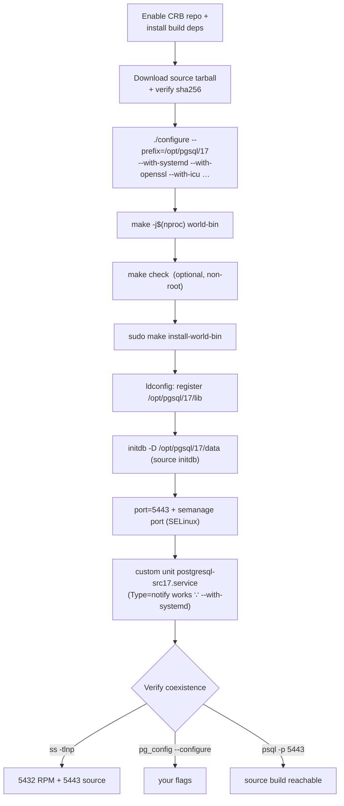
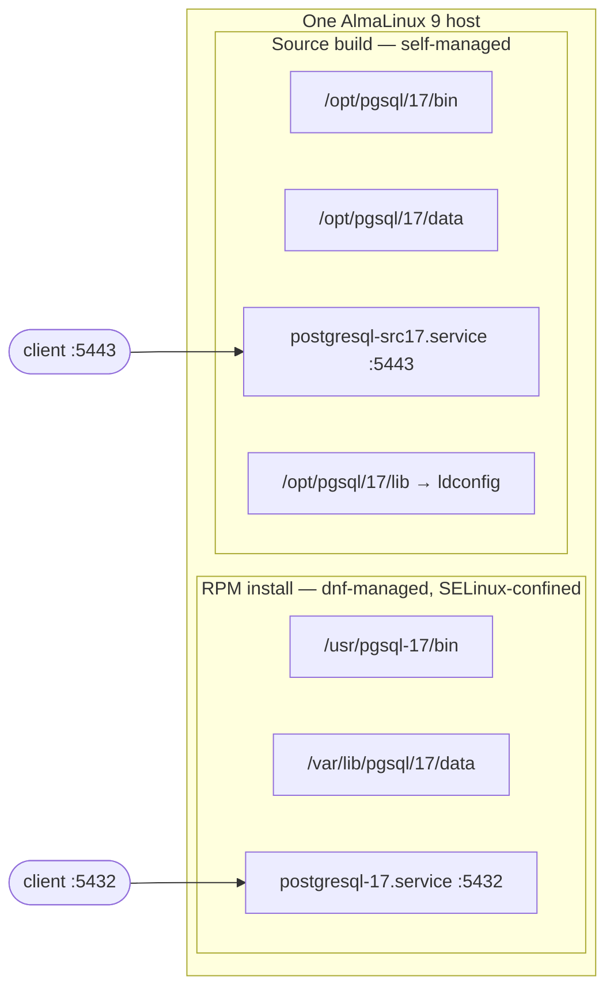

# Lab 07 — Build PostgreSQL 17 from Source with a Custom `--prefix`, Alongside the RPM Install

> **Track A · DBA · A1 Installation & Cluster Provisioning · Lab 7 of 8**
> Teaching package: concept → diagram → steps → verify → quick-ref → self-test → video script.
> **Depends on:** Labs 01–06 (RPM install running on :5432; you know initdb, systemd units, SELinux ports).

---

## 0. Lab Card (at a glance)

| Field | Value |
|---|---|
| **Objective** | Compile PostgreSQL 17 from source into an isolated `--prefix` (`/opt/pgsql/17`), initialize its own cluster on a **different port (5443)** and its own systemd unit, and run it **side by side** with the RPM install on :5432. |
| **Success criterion** | `/opt/pgsql/17/bin/pg_config --configure` shows your flags; both servers listen (`ss` shows 5432 **and** 5443); `psql -p 5443` reaches the source build; the RPM install is untouched. |
| **Scope boundary** | Build + coexist. Using the build to test a patch/pre-release is a follow-on; JIT tuning is Lab 208. |
| **Time** | 45–75 min (compile time dominates) |
| **Difficulty** | ★★★★☆ |
| **Prereqs** | Labs 01–06; CRB repo available; build toolchain; free port 5443 |
| **Risk** | Low — isolated prefix; the RPM install and its data are never touched. |

---

## 1. Learning Objectives

1. **When source beats RPM — and when it doesn't.** Custom flags, patches, pre-release testing, or an odd `--prefix` vs the RPM's speed, signing, dnf updates, and SELinux integration.
2. **Drive `./configure` deliberately** — what each `--with-*` flag turns on, and why `--with-systemd` matters for a `Type=notify` unit.
3. **Make two installs coexist cleanly** — separate prefix, libraries (`ldconfig`), data dir, port, and unit.
4. **Own the consequences** — a source build lives outside dnf and the SELinux `postgresql` policy; you recompile for every security release yourself.

---

## 2. Concept Primer — the "why"

**RPM vs source — a real tradeoff.**

| | RPM (PGDG) | Source build |
|---|---|---|
| Install speed | seconds | minutes (compile) |
| Updates | `dnf update`, signed | **you** recompile each minor release |
| Paths | FHS (`/usr/pgsql-17`) | your `--prefix` |
| SELinux | integrated (`postgresql_exec_t`, confined) | outside policy (runs largely unconfined) |
| Flexibility | packager's choices | **any** configure flag, patches, pre-release |

Use source when you need something the package can't give you — a specific build flag, a patch, a beta, or a fully isolated tree. For ordinary production, RPM wins; the source build's hidden cost is that **security patching becomes your manual job**.

**`--prefix` is what makes coexistence possible.** It installs the *entire* tree (bin, lib, share, include) under one root — `/opt/pgsql/17` — with nothing landing in the RPM's `/usr/pgsql-17`. Two independent PostgreSQLs, different roots, zero file collisions.

**Key `configure` flags:**
- `--with-openssl` — TLS.
- `--with-systemd` — compiles `sd_notify` so a **`Type=notify`** systemd unit knows when the server is truly ready. Without it your unit must use a weaker type.
- `--with-icu` — ICU locale provider (the glibc-drift-immune option from Lab 2). Needs `libicu-devel`.
- `--with-lz4 --with-zstd` — modern TOAST/WAL compression.
- `--with-llvm` — JIT. `--with-perl/python` — PL languages. `--with-pam/ldap/gssapi` — enterprise auth. `--with-uuid=e2fs`, `--with-libxml`.

**Coexistence checklist (all must differ):** prefix, **library path** (`ldconfig` must find `/opt/pgsql/17/lib`), `PGDATA`, **port** (5443), and the **systemd unit**. Miss the library path and the binaries won't start; miss the port and the second cluster can't bind.

**SELinux nuance.** The RPM's binaries are labeled `postgresql_exec_t` and run confined. A binary in `/opt` isn't, so the source build runs largely **unconfined** — but the **port** still needs labeling if you keep Enforcing, and 5443 is **not** in the default `postgresql_port_t` set (reprise of Lab 3), so you add it.

> Modern PostgreSQL (16+) can also build with **meson + ninja**. This lab uses the classic `configure`/`make` path — universally known and enough to teach the concepts. Meson is a drop-in alternative once you're comfortable.

---

## 3. Diagrams

### 3.1 Build → run pipeline



### 3.2 Two installs, one host



---

## 4. Prerequisites — toolchain & source

```bash
# 1) Enable CRB (many -devel packages live here) + EPEL
sudo dnf config-manager --set-enabled crb
sudo dnf install -y epel-release

# 2) Build toolchain + libraries
sudo dnf groupinstall -y "Development Tools"
sudo dnf install -y \
  readline-devel zlib-devel openssl-devel libicu-devel \
  flex bison perl-core \
  lz4-devel libzstd-devel libxml2-devel libxslt-devel \
  systemd-devel python3-devel pam-devel openldap-devel krb5-devel \
  llvm-devel clang libuuid-devel

# 3) Fetch source (set PGVER to the current 17.x — see postgresql.org/ftp/source/)
PGVER=17.6
cd /usr/local/src && sudo curl -O https://ftp.postgresql.org/pub/source/v${PGVER}/postgresql-${PGVER}.tar.bz2
sudo curl -O https://ftp.postgresql.org/pub/source/v${PGVER}/postgresql-${PGVER}.tar.bz2.sha256
sudo sha256sum -c postgresql-${PGVER}.tar.bz2.sha256      # must say: OK
sudo tar xjf postgresql-${PGVER}.tar.bz2
```

---

## 5. Step-by-Step

### Step 1 — Configure with a custom prefix

```bash
cd /usr/local/src/postgresql-${PGVER}
sudo ./configure \
  --prefix=/opt/pgsql/17 \
  --with-systemd --with-openssl --with-icu \
  --with-lz4 --with-zstd \
  --with-libxml --with-uuid=e2fs --with-llvm \
  --with-perl --with-python \
  --with-pam --with-ldap --with-gssapi
```
*If configure stops with "X not found", install the matching `-devel` (CRB may be required) and re-run.*

### Step 2 — Compile (and optionally test)

```bash
sudo make -j"$(nproc)" world-bin          # core + contrib, no docs
# optional regression tests — must NOT run as root:
sudo chown -R "$USER" . && make check      # expect: "All ... tests passed"
```

### Step 3 — Install into the prefix

```bash
sudo make install-world-bin
ls /opt/pgsql/17/bin | head                # postgres, initdb, psql, pg_config, ...
/opt/pgsql/17/bin/pg_config --configure    # your exact flags, recorded
```

### Step 4 — Register the source libraries

```bash
echo "/opt/pgsql/17/lib" | sudo tee /etc/ld.so.conf.d/pgsql-src17.conf
sudo ldconfig
```
*Without this, the source binaries can't find their own `libpq.so`/libraries and won't start.*

### Step 5 — Initialize its own cluster (source `initdb`)

```bash
sudo mkdir -p /opt/pgsql/17/data
sudo chown -R postgres:postgres /opt/pgsql/17
sudo chmod 0700 /opt/pgsql/17/data
sudo -u postgres /opt/pgsql/17/bin/initdb -k -D /opt/pgsql/17/data \
  --encoding=UTF8 --locale-provider=icu --icu-locale=en-US
echo "port = 5443" | sudo -u postgres tee -a /opt/pgsql/17/data/postgresql.conf
```

### Step 6 — SELinux: allow the new port

```bash
# 5443 is NOT in the default postgresql_port_t set:
sudo semanage port -a -t postgresql_port_t -p tcp 5443
```

### Step 7 — A systemd unit for the source build

```bash
sudo tee /etc/systemd/system/postgresql-src17.service >/dev/null <<'EOF'
[Unit]
Description=PostgreSQL 17 (source build, /opt/pgsql/17)
After=network-online.target
Wants=network-online.target

[Service]
Type=notify
User=postgres
Group=postgres
Environment=PGDATA=/opt/pgsql/17/data
ExecStart=/opt/pgsql/17/bin/postgres -D ${PGDATA}
ExecReload=/bin/kill -HUP $MAINPID
KillMode=mixed
KillSignal=SIGINT
TimeoutSec=300
RestartSec=10

[Install]
WantedBy=multi-user.target
EOF

sudo systemctl daemon-reload
sudo systemctl enable --now postgresql-src17
```
*`Type=notify` works because we compiled `--with-systemd`.*

### Step 8 — Verify coexistence

```bash
ss -tlnp | grep -E ':5432|:5443'                              # both listening
sudo -u postgres /opt/pgsql/17/bin/psql -p 5443 -c "SELECT version();"    # source build
sudo -u postgres psql -p 5432 -c "SELECT version();"                       # RPM build (unchanged)
/opt/pgsql/17/bin/pg_config --bindir                          # /opt/pgsql/17/bin
/usr/pgsql-17/bin/pg_config --bindir                          # /usr/pgsql-17/bin
```

---

## 6. Verification Checklist

- [ ] `pg_config --configure` (source) lists **your** flags, including `--with-systemd`
- [ ] `ss -tlnp` shows postmasters on **both** 5432 and 5443
- [ ] `psql -p 5443 "SELECT version()"` reports the **source** build
- [ ] RPM install still answers on 5432, data untouched
- [ ] `systemctl status postgresql-src17` → **active (running)**, `Type=notify` (no timeout)
- [ ] `/opt/pgsql/17/lib` registered (`ldconfig -p | grep /opt/pgsql/17`)
- [ ] `make check` passed (if run)

---

## 7. Troubleshooting

| Symptom | Cause | Fix |
|---|---|---|
| `configure: error: readline/ICU/… not found` | Missing `-devel` package | Install it (enable **CRB** for `libicu-devel`, `llvm-devel`, `systemd-devel`), re-run configure |
| `make check` fails with a permissions error | Ran as root | Run as a normal user in the build dir |
| Server won't start; `error while loading shared libraries: libpq.so.5` | Library path not registered | Step 4: `ld.so.conf.d` + `ldconfig` (or `LD_LIBRARY_PATH`) |
| Unit hangs then times out | Built **without** `--with-systemd` but unit is `Type=notify` | Rebuild with `--with-systemd`, or set `Type=simple` |
| `could not bind … Permission denied` on 5443 | SELinux port not labeled | `sudo semanage port -a -t postgresql_port_t -p tcp 5443` |
| `psql` hits the wrong server | PATH resolves to the other install | Use full binary paths per install; don't rely on PATH |
| Two servers fight over a port/socket | Same port configured | Confirm 5432 vs 5443 in each `postgresql.conf` |

---

## 8. Quick Reference Card (paste-ready)

```bash
PGVER=17.6
# deps
sudo dnf config-manager --set-enabled crb && sudo dnf install -y epel-release
sudo dnf groupinstall -y "Development Tools"
sudo dnf install -y readline-devel zlib-devel openssl-devel libicu-devel flex bison perl-core \
  lz4-devel libzstd-devel libxml2-devel libxslt-devel systemd-devel python3-devel \
  pam-devel openldap-devel krb5-devel llvm-devel clang libuuid-devel

# source + verify
cd /usr/local/src && sudo curl -O https://ftp.postgresql.org/pub/source/v$PGVER/postgresql-$PGVER.tar.bz2{,.sha256}
sudo sha256sum -c postgresql-$PGVER.tar.bz2.sha256 && sudo tar xjf postgresql-$PGVER.tar.bz2
cd postgresql-$PGVER

# configure / build / install
sudo ./configure --prefix=/opt/pgsql/17 --with-systemd --with-openssl --with-icu \
  --with-lz4 --with-zstd --with-libxml --with-uuid=e2fs --with-llvm --with-perl --with-python \
  --with-pam --with-ldap --with-gssapi
sudo make -j"$(nproc)" world-bin && sudo make install-world-bin
echo /opt/pgsql/17/lib | sudo tee /etc/ld.so.conf.d/pgsql-src17.conf && sudo ldconfig

# cluster on :5443 + SELinux + unit
sudo mkdir -p /opt/pgsql/17/data && sudo chown -R postgres:postgres /opt/pgsql/17 && sudo chmod 0700 /opt/pgsql/17/data
sudo -u postgres /opt/pgsql/17/bin/initdb -k -D /opt/pgsql/17/data --encoding=UTF8 --locale-provider=icu --icu-locale=en-US
echo "port = 5443" | sudo -u postgres tee -a /opt/pgsql/17/data/postgresql.conf
sudo semanage port -a -t postgresql_port_t -p tcp 5443
# (unit: see Step 7) then:
sudo systemctl daemon-reload && sudo systemctl enable --now postgresql-src17

# verify
ss -tlnp | grep -E ':5432|:5443'
sudo -u postgres /opt/pgsql/17/bin/psql -p 5443 -c "select version();"
/opt/pgsql/17/bin/pg_config --configure
```

---

## 9. Self-Check

1. What does `--prefix` do, and why is it the key to coexisting with the RPM install?
2. Why compile `--with-systemd`?
3. The source binaries install fine but won't start — `libpq.so.5` not found. Fix?
4. Port 5443 is refused under Enforcing SELinux. Why, and the one command to fix it?
5. What's the biggest ongoing operational cost of running a source build in production vs the RPM?
6. How do you see exactly which configure flags a build was compiled with?

<details>
<summary>Answers</summary>

1. It installs the whole tree under one custom root (`/opt/pgsql/17`), so nothing collides with the RPM's `/usr/pgsql-17` — two independent installs.
2. It compiles `sd_notify` support so a `Type=notify` systemd unit correctly detects when the server is ready (no start-up timeout).
3. Register the build's lib dir: add `/opt/pgsql/17/lib` under `/etc/ld.so.conf.d/` and run `ldconfig` (or set `LD_LIBRARY_PATH`).
4. 5443 isn't in the default `postgresql_port_t` set. Fix: `sudo semanage port -a -t postgresql_port_t -p tcp 5443`.
5. **You** must recompile for every minor/security release — it's outside `dnf` and the SELinux `postgresql` policy, so patching and confinement are manual.
6. `pg_config --configure`.
</details>

---

## 10. Video / Teaching Script

| # | On screen | Say (narration) |
|---|---|---|
| 1 | Title: "Compile PostgreSQL from source — next to the packaged one" | "Sometimes you need a build the package can't give you. We'll compile 17 from source and run it beside our RPM install." |
| 2 | enable CRB + install deps | "First the toolchain. One gotcha: several dev libraries live in the CRB repo — enable it or configure will complain." |
| 3 | download + `sha256sum -c` | "Grab the source and — always — verify its checksum before trusting it." |
| 4 | `./configure --prefix … --with-systemd …` | "Here's the control panel. `--prefix` isolates the whole install. And `--with-systemd` — remember that one — makes our service integrate cleanly." |
| 5 | `make -j` + `make check` | "Compile across all cores. Optional but wise: run the regression suite — as a normal user, never root." |
| 6 | `make install` + `ldconfig` | "Install into our prefix, then register its libraries so the binaries can find themselves." |
| 7 | initdb :5443 + `semanage port` | "Its own cluster, its own port. SELinux doesn't know 5443 yet — so we tell it." |
| 8 | unit + `ss -tlnp` | "A dedicated service, and there they are — 5432 packaged, 5443 from source, side by side." |
| 9 | honesty slide | "One caveat for production: a source build is yours to patch. Every security release, you recompile. That's the price of the control." |
| 10 | Outro | "Two PostgreSQLs, two toolchains, one host. Next: systemd resource limits." |

---

## 11. Glossary

- **`./configure` / `--prefix`** — sets build options and the isolated install root.
- **`make world-bin` / `install-world-bin`** — build/install core + contrib (no docs).
- **`make check`** — the regression test suite (run as non-root).
- **CRB** — CodeReady Builder repo; hosts many `-devel` packages.
- **`ldconfig` / `/etc/ld.so.conf.d`** — registers extra shared-library directories.
- **`--with-systemd` / `sd_notify`** — lets a `Type=notify` unit detect readiness.
- **`pg_config --configure`** — prints the flags a build was compiled with.

---
*NETAPORT lab series · PostgreSQL 17 on AlmaLinux 9 · Lab 07/222*
