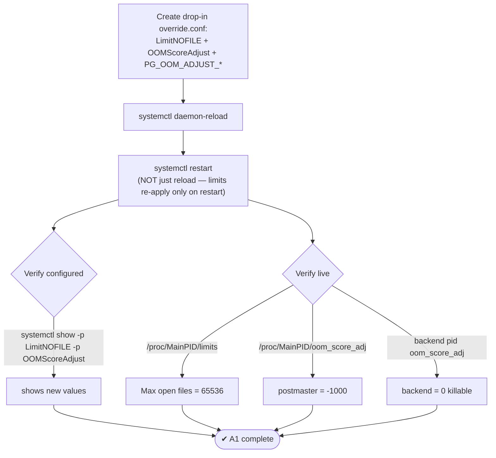
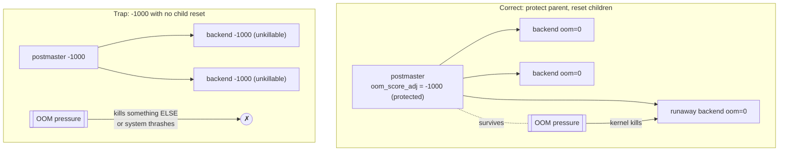

# Lab 08 — systemd Override: Raise `LimitNOFILE`, Set `OOMScoreAdjust`, Verify with `systemctl show`

> **Track A · DBA · A1 Installation & Cluster Provisioning · Lab 8 of 8 (A1 complete)**
> Teaching package: concept → diagram → steps → verify → quick-ref → self-test → video script.
> **Depends on:** Labs 01–03 (running cluster; you know systemd drop-ins).

---

## 0. Lab Card (at a glance)

| Field | Value |
|---|---|
| **Objective** | Add a systemd **drop-in override** that raises `LimitNOFILE` (open-file limit) and sets `OOMScoreAdjust` (OOM-killer protection) for the PostgreSQL service, then verify with `systemctl show`. |
| **Success criterion** | `systemctl show` reports the new `LimitNOFILE` and `OOMScoreAdjust`; `/proc/<MainPID>/limits` and `oom_score_adj` confirm they took effect on the live process; a backend's `oom_score_adj` is **0** (killable), the postmaster's is **-1000** (protected). |
| **Scope boundary** | These two resource controls + verification. Kernel VM tuning (`overcommit`, huge pages) is Labs 10–11. |
| **Time** | 15–20 min |
| **Difficulty** | ★★☆☆☆ |
| **Prereqs** | Labs 01–03 |
| **Risk** | Low (config + one restart). |

---

## 1. Learning Objectives

1. **Why PostgreSQL needs a high `LimitNOFILE`** — what actually consumes file descriptors, and how to size it.
2. **Where the limit really comes from** — the systemd unit, **not** `/etc/security/limits.conf` (a classic dead end for services).
3. **The OOM-killer model done right** — protect the postmaster, keep backends sacrificeable, via `OOMScoreAdjust` + `PG_OOM_ADJUST_*`.
4. **Make changes take effect and prove it** — `daemon-reload` + **restart** (reload alone won't re-apply), then verify config *and* live process.

---

## 2. Concept Primer — the "why"

**File descriptors (`LimitNOFILE`).** PostgreSQL is FD-hungry: each backend holds descriptors for the relation files it touches, plus WAL, sockets, and one connection each. A busy server with many connections and many tables can blow past the EL9 default soft limit of **1024**, producing `too many open files` errors and failed connections. Rough sizing:

```
LimitNOFILE ≳ max_connections × max_files_per_process + headroom
```
(`max_files_per_process` GUC defaults to 1000.) A generous flat value like **65536** covers most systems; compute it for very high connection counts.

**The `limits.conf` trap.** `/etc/security/limits.conf` sets limits for **PAM login sessions** — interactive shells, `su`, etc. A **systemd-managed service does not read it.** For the PostgreSQL *service*, the only thing that counts is `LimitNOFILE=` in its unit (or a drop-in). Editing `limits.conf` and expecting the service to change is a very common wasted afternoon.

**The OOM killer (`OOMScoreAdjust`).** When Linux runs out of memory, the kernel's OOM killer picks a process to kill based on each process's `oom_score_adj` (-1000 = never pick me, +1000 = pick me first). The **right** model for PostgreSQL:

- **Postmaster: protected** (`OOMScoreAdjust=-1000`). If the kernel kills the parent, the *whole* database goes down and enters crash recovery — catastrophic.
- **Backends: sacrificeable** (`oom_score_adj = 0`). A single runaway query's backend should be the thing killed, not the server.

PostgreSQL achieves this with two env vars: the postmaster starts at `-1000`, and each child **resets its own** score using `PG_OOM_ADJUST_FILE=/proc/self/oom_score_adj` and `PG_OOM_ADJUST_VALUE=0`. **The trap:** set `OOMScoreAdjust=-1000` *without* those env vars and every backend inherits `-1000` — nothing is killable, so under memory pressure the kernel kills something else on the host, or the system thrashes. Protect the parent **and** reset the children.

> The PGDG RPM unit already ships `OOMScoreAdjust=-1000` + the `PG_OOM_ADJUST_*` env, but does **not** raise `LimitNOFILE`. So the real gain here is the FD limit; we re-assert the OOM settings in the override to make them explicit and to cover custom units (like the source build from Lab 7, which had none).

**Apply + prove.** Editing a unit needs `daemon-reload`; but resource limits like these only re-apply to the process on a **restart** — a reload alone leaves the running server on the old limits. Then verify twice: `systemctl show` (what's configured) and `/proc/<pid>/limits` (what's live).

---

## 3. Diagrams

### 3.1 Override → apply → verify flow



### 3.2 OOM protection model (right vs wrong)



---

## 4. Prerequisites

```bash
systemctl is-active postgresql-17                       # running
# current values (baseline):
systemctl show postgresql-17 -p LimitNOFILE -p LimitNOFILESoft -p OOMScoreAdjust
cat /proc/$(systemctl show -p MainPID --value postgresql-17)/limits | grep "open files"
```

---

## 5. Step-by-Step

### Step 1 — Create the override drop-in

```bash
sudo mkdir -p /etc/systemd/system/postgresql-17.service.d
sudo tee /etc/systemd/system/postgresql-17.service.d/limits.conf >/dev/null <<'EOF'
[Service]
# raise open-file limit (soft:hard). Size ≳ max_connections × max_files_per_process
LimitNOFILE=65536:1048576

# protect the postmaster from the OOM killer...
OOMScoreAdjust=-1000
# ...but let child backends reset themselves to killable (essential pairing):
Environment=PG_OOM_ADJUST_FILE=/proc/self/oom_score_adj
Environment=PG_OOM_ADJUST_VALUE=0
EOF
```
*Equivalent interactive path: `sudo systemctl edit postgresql-17` (opens an editor on the same drop-in).*

### Step 2 — Reload and restart (both required)

```bash
sudo systemctl daemon-reload
sudo systemctl restart postgresql-17          # limits re-apply only on restart
```

### Step 3 — Verify what's **configured** (`systemctl show`)

```bash
systemctl show postgresql-17 \
  -p LimitNOFILE -p LimitNOFILESoft -p OOMScoreAdjust -p Environment
#   LimitNOFILE=1048576        (hard)
#   LimitNOFILESoft=65536      (soft)
#   OOMScoreAdjust=-1000
#   Environment=PG_OOM_ADJUST_FILE=/proc/self/oom_score_adj PG_OOM_ADJUST_VALUE=0
```

### Step 4 — Verify it **actually applied** to the live process

```bash
MAINPID=$(systemctl show -p MainPID --value postgresql-17)

# open-file limit on the running postmaster:
grep "Max open files" /proc/$MAINPID/limits          # → 65536   1048576

# postmaster is protected:
cat /proc/$MAINPID/oom_score_adj                      # → -1000

# a backend is killable (open a session, then check its pid):
sudo -u postgres psql -c "SELECT pg_backend_pid();"   # note the pid, then:
# (in another shell, using that pid)
cat /proc/<backend_pid>/oom_score_adj                 # → 0  (reset by PG_OOM_ADJUST)
```

---

## 6. Verification Checklist

- [ ] `systemctl show -p LimitNOFILESoft` → **65536** (and hard = 1048576)
- [ ] `systemctl show -p OOMScoreAdjust` → **-1000**
- [ ] `/proc/<MainPID>/limits` "Max open files" → **65536 / 1048576**
- [ ] `/proc/<MainPID>/oom_score_adj` → **-1000** (postmaster protected)
- [ ] A backend's `oom_score_adj` → **0** (children killable)
- [ ] Values persisted across the restart (and survive a reboot)

---

## 7. Troubleshooting

| Symptom | Cause | Fix |
|---|---|---|
| `systemctl show` still shows old values | Forgot `daemon-reload` | Run it, then **restart** |
| Config shows new value but `/proc/.../limits` shows old | Only reloaded, didn't restart | `systemctl restart` — limits re-apply on restart only |
| Raised `limits.conf`, service unchanged | Services ignore PAM `limits.conf` | Use the systemd unit/drop-in (`LimitNOFILE=`) |
| Under OOM, whole PostgreSQL is killed or host thrashes | `OOMScoreAdjust=-1000` with no child reset | Add `PG_OOM_ADJUST_FILE`/`VALUE` so backends reset to killable |
| `too many open files` in logs | `LimitNOFILE` too low for the workload | Raise it (size by `max_connections × max_files_per_process`) |
| Override didn't affect the source build | Wrong unit name | Edit `postgresql-src17.service.d/` (Lab 7's unit) |
| `MainPID` is 0/empty | Service not running | Start it, re-check |

---

## 8. Quick Reference Card (paste-ready)

```bash
# --- drop-in override ---
sudo mkdir -p /etc/systemd/system/postgresql-17.service.d
sudo tee /etc/systemd/system/postgresql-17.service.d/limits.conf >/dev/null <<'EOF'
[Service]
LimitNOFILE=65536:1048576
OOMScoreAdjust=-1000
Environment=PG_OOM_ADJUST_FILE=/proc/self/oom_score_adj
Environment=PG_OOM_ADJUST_VALUE=0
EOF
sudo systemctl daemon-reload && sudo systemctl restart postgresql-17

# --- verify configured ---
systemctl show postgresql-17 -p LimitNOFILE -p LimitNOFILESoft -p OOMScoreAdjust

# --- verify live ---
MAINPID=$(systemctl show -p MainPID --value postgresql-17)
grep "Max open files" /proc/$MAINPID/limits         # 65536  1048576
cat /proc/$MAINPID/oom_score_adj                     # -1000 (postmaster)
# backend: SELECT pg_backend_pid();  then  cat /proc/<pid>/oom_score_adj  → 0

# Sizing note: LimitNOFILE ≳ max_connections × max_files_per_process (default 100 × 1000) + headroom
```

---

## 9. Self-Check

1. What consumes file descriptors in PostgreSQL, and roughly how do you size `LimitNOFILE`?
2. You raise the limit in `/etc/security/limits.conf` but the service is unchanged. Why?
3. Which two `systemctl` actions are needed for the override to take effect on the running server, and why isn't reload enough?
4. Why is `OOMScoreAdjust=-1000` on its own a trap, and what makes it correct?
5. Give one command to check the **configured** value and one to check the **live** value.
6. With the correct config, under memory pressure does the kernel kill the postmaster or a backend?

<details>
<summary>Answers</summary>

1. Connections, open relation files, WAL, and sockets. Size it at roughly `max_connections × max_files_per_process` plus headroom (a flat 65536 is safe for most).
2. `limits.conf` applies to PAM login sessions; systemd services take their limits from the unit (`LimitNOFILE=`), not from it.
3. `daemon-reload` (re-read the unit) **and** `restart` (re-apply resource limits to the process). A reload alone leaves the running process on the old limits.
4. Alone, every backend inherits `-1000` and becomes unkillable, so under OOM the kernel kills something else or thrashes. Correct = protect the postmaster **plus** `PG_OOM_ADJUST_FILE`/`VALUE` to reset children to `0`.
5. Configured: `systemctl show postgresql-17 -p LimitNOFILE`. Live: `cat /proc/<MainPID>/limits` (and `/oom_score_adj`).
6. A **backend** — the postmaster is protected at `-1000`.
</details>

---

## 10. Video / Teaching Script

| # | On screen | Say (narration) |
|---|---|---|
| 1 | Title: "Two systemd settings that save you at 3 a.m." | "File-descriptor limits and OOM protection — small unit settings with big consequences under load." |
| 2 | baseline `systemctl show` | "Here's our starting point — the default open-file limit is often just 1024. A busy PostgreSQL will hit that." |
| 3 | write `override.conf` | "One drop-in: raise the file limit, and set OOM behavior. Notice we don't touch limits.conf — services ignore it." |
| 4 | highlight the PG_OOM env lines | "This pairing is the whole trick. We protect the parent process — but tell each backend to make *itself* killable. Protect the server, sacrifice the runaway query." |
| 5 | `daemon-reload` + `restart` | "Reload *and* restart — the limits only re-apply when the process restarts." |
| 6 | `systemctl show` | "First proof: the configured values are in place." |
| 7 | `/proc/MainPID/limits` + `oom_score_adj` | "Second proof — the live process. 65 thousand file descriptors, and the postmaster protected at minus one thousand." |
| 8 | backend `oom_score_adj = 0` | "And a backend? Zero — perfectly killable. Exactly what we want when memory runs short." |
| 9 | Outro | "That's Installation and Provisioning complete — eight labs. Next section: memory and connection tuning." |

---

## 11. Glossary

- **`LimitNOFILE`** — systemd directive for a service's max open file descriptors (soft:hard).
- **File descriptor** — a handle to an open file/socket; PostgreSQL uses many.
- **OOM killer / `oom_score_adj`** — kernel mechanism that kills a process under memory exhaustion; per-process bias from -1000 to +1000.
- **`OOMScoreAdjust`** — systemd directive setting the service's starting `oom_score_adj`.
- **`PG_OOM_ADJUST_FILE` / `_VALUE`** — env vars telling backends to reset their own OOM score (to stay killable).
- **Drop-in override** — a `…/service.d/*.conf` file overriding parts of a unit; `systemctl edit` manages it.
- **`daemon-reload` / restart** — re-read units / re-apply resource limits to the process.

---
*NETAPORT lab series · PostgreSQL 17 on AlmaLinux 9 · Lab 08/222 · **A1 Installation & Cluster Provisioning complete***
