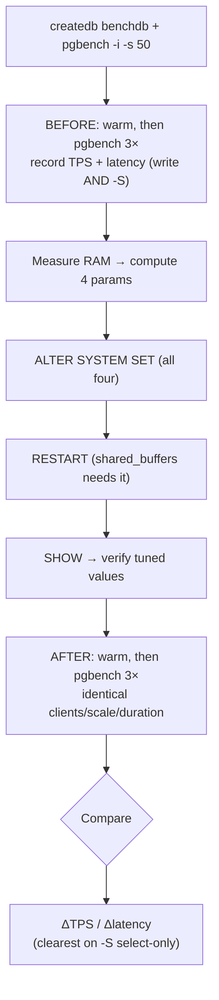
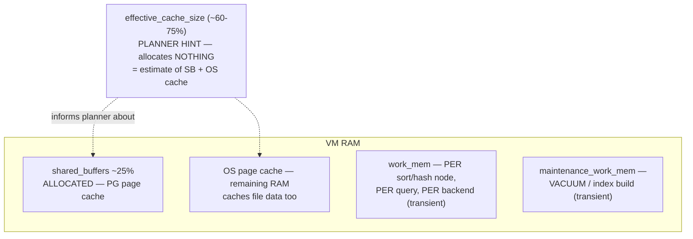

# Lab 09 — Tune shared_buffers / effective_cache_size / work_mem / maintenance_work_mem + Measure with pgbench

> **Track A · DBA · A2 Configuration & Tuning · Lab 1 of 7 (Lab 09/222)**
> Teaching package: concept → diagram → steps → verify → quick-ref → self-test → video script.
> **Depends on:** Labs 01–08 (running cluster; you know `ALTER SYSTEM`, restart vs reload, OOM sizing).

---

## 0. Lab Card (at a glance)

| Field | Value |
|---|---|
| **Objective** | Size the four core memory parameters to the VM's RAM, apply them, and **measure** the effect with `pgbench` before/after. |
| **Success criterion** | All four settings show tuned values via `SHOW`; you have a recorded before/after TPS + latency comparison from an identical `pgbench` run. |
| **Scope boundary** | These four params + a rigorous before/after measurement. `huge_pages` is Lab 11; kernel VM params Lab 11; autovacuum memory Lab 59. |
| **Time** | 40–60 min (pgbench runs dominate) |
| **Difficulty** | ★★★☆☆ |
| **Prereqs** | Labs 01–08; `pgbench` (from `postgresql17-contrib`); an idle VM (no competing load) |
| **Risk** | Low–Medium — `shared_buffers` too high can block startup; `work_mem` too high risks OOM (Lab 8). |

---

## 1. Learning Objectives

1. **What each of the four actually does** — which are memory *allocations*, which are *planner hints*, which are *per-operation*.
2. **Size them to RAM** with defensible rules of thumb, computed from the VM's real memory.
3. **The `work_mem` multiplier trap** — why "per query, per node, per backend" makes it the dangerous one.
4. **Measure honestly** — a repeatable `pgbench` before/after, and *why the write test often hides buffer gains* while a select-only test reveals them.

---

## 2. Concept Primer — the "why"

Four parameters, four very different natures:

| Parameter | Nature | Rule of thumb | Apply |
|---|---|---|---|
| **shared_buffers** | **Allocation** — PostgreSQL's own page cache in shared memory | ~**25%** of RAM (up to ~40% on large dedicated boxes) | **RESTART** |
| **effective_cache_size** | **Planner hint** — *no memory used*; tells the planner how much cache (PG + OS) likely exists | ~**50–75%** of RAM | reload |
| **work_mem** | **Per-operation** memory for each sort/hash node | small & careful (see trap) | reload |
| **maintenance_work_mem** | Memory for VACUUM / CREATE INDEX / REINDEX / FK validation | **256 MB–1 GB+** | reload |

**shared_buffers isn't the whole cache.** PostgreSQL reads through its shared_buffers, but the **OS page cache** holds the rest of RAM's worth of file data too. That's why you don't set shared_buffers to 90% — you'd starve the OS cache and hit diminishing returns (double-buffering). 25% is the balanced starting point; measure before going higher.

**effective_cache_size allocates nothing.** It's purely a *cost input* to the planner: a bigger value makes index scans look cheaper (the planner assumes pages are likely cached), nudging it away from sequential scans. Changing it alters **plans**, not memory.

**The work_mem trap.** `work_mem` is the limit **per sort or hash node, per query, per backend**. One complex query can have several such nodes; dozens of backends can run at once. Worst-case memory ≈ `work_mem × nodes × concurrent_backends`. Set it modestly globally (e.g. 8–32 MB) and raise it *per-session* for the occasional heavy analytical query. Oversetting it is a direct path to the OOM killer from Lab 8.

**maintenance_work_mem can be generous** — few maintenance ops run at once, and a bigger value makes index builds and vacuums much faster. (Autovacuum workers each use up to this, so account for `autovacuum_max_workers × maintenance_work_mem`.)

**Apply semantics.** Only `shared_buffers` needs a **restart** (it sizes a shared-memory segment); the other three take effect on **reload**. Since we change all four, we restart once.

**Measuring honestly with pgbench.** pgbench runs a TPC-B-like workload and reports **TPS** (transactions/sec) and latency. Two cautions that separate a real result from noise:
- The **default (write) test** is often bound by WAL flushing and checkpoints, not by cache — so more `shared_buffers` may barely move it.
- The **select-only test** (`-S`) is read-bound and *does* respond to buffer cache — that's where you'll see the shared_buffers effect.
- Reduce noise: **warm the cache** with a throwaway run, then measure; run **3×** and take the median; keep scale, clients, threads, and duration identical before and after. pgbench is a synthetic microbenchmark — good for teaching method; real-workload replay (`pgreplay`, Lab 221) is the production-grade measure.

---

## 3. Diagrams

### 3.1 Tune-and-measure flow



### 3.2 Where the memory goes



---

## 4. Prerequisites

```bash
which pgbench                                 # from postgresql17-contrib
free -h                                       # note total RAM
sudo -u postgres psql -c "SHOW shared_buffers; SHOW effective_cache_size; SHOW work_mem; SHOW maintenance_work_mem;"
```

---

## 5. Step-by-Step

### Step 1 — Create and initialize the benchmark DB

```bash
sudo -u postgres createdb benchdb
sudo -u postgres pgbench -i -s 50 benchdb        # scale 50 ≈ ~750 MB dataset
```

### Step 2 — BEFORE: baseline measurement (record it)

```bash
# warm the cache (throwaway), then measure 3×; take the median tps
sudo -u postgres pgbench -c 16 -j 4 -T 30 benchdb >/dev/null          # warm
for i in 1 2 3; do sudo -u postgres pgbench -c 16 -j 4 -T 60 benchdb    | grep -E "tps|latency average"; done
echo "--- select-only (read-bound; best shows buffer effect) ---"
for i in 1 2 3; do sudo -u postgres pgbench -c 16 -j 4 -T 60 -S benchdb | grep -E "tps|latency average"; done
```
*Record the median TPS and latency for both tests in the §6 table.*

### Step 3 — Compute the four values from actual RAM

```bash
TOTAL_MB=$(( $(awk '/MemTotal/{print $2}' /proc/meminfo) / 1024 ))
SB=$(( TOTAL_MB / 4 ))                 # 25%
ECS=$(( TOTAL_MB * 3 / 4 ))            # 75%
MWM=$(( TOTAL_MB / 16 )); [ $MWM -gt 1024 ] && MWM=1024     # ~6%, cap 1 GB for the lab
WM=$(( (TOTAL_MB / 4) / 100 )); [ $WM -lt 4 ] && WM=4       # (25%RAM)/max_conn, floor 4 MB
echo "shared_buffers=${SB}MB  effective_cache_size=${ECS}MB  maintenance_work_mem=${MWM}MB  work_mem=${WM}MB"
```
*Example, 8 GB VM: shared_buffers 2 GB, effective_cache_size 6 GB, maintenance_work_mem 512 MB, work_mem 20 MB.*

### Step 4 — Apply with ALTER SYSTEM, then restart

```bash
sudo -u postgres psql <<SQL
ALTER SYSTEM SET shared_buffers        = '${SB}MB';
ALTER SYSTEM SET effective_cache_size  = '${ECS}MB';
ALTER SYSTEM SET maintenance_work_mem  = '${MWM}MB';
ALTER SYSTEM SET work_mem              = '${WM}MB';
SQL
sudo systemctl restart postgresql-17          # shared_buffers requires a restart
```

### Step 5 — Verify the tuned values

```bash
sudo -u postgres psql -c "SHOW shared_buffers; SHOW effective_cache_size; SHOW work_mem; SHOW maintenance_work_mem;"
# confirm they came from ALTER SYSTEM:
sudo -u postgres psql -c "SELECT name, setting, source FROM pg_settings WHERE name IN
 ('shared_buffers','effective_cache_size','work_mem','maintenance_work_mem');"
```

### Step 6 — AFTER: identical measurement

```bash
sudo -u postgres pgbench -c 16 -j 4 -T 30 benchdb >/dev/null          # warm
for i in 1 2 3; do sudo -u postgres pgbench -c 16 -j 4 -T 60 benchdb    | grep -E "tps"; done
for i in 1 2 3; do sudo -u postgres pgbench -c 16 -j 4 -T 60 -S benchdb | grep -E "tps"; done
```

---

## 6. Verification Checklist & Results Table

- [ ] `SHOW` returns tuned values for all four
- [ ] `pg_settings.source` = `configuration file` (from `postgresql.auto.conf`)
- [ ] Server restarted cleanly with the new `shared_buffers`
- [ ] Before/after recorded with **identical** scale/clients/threads/duration
- [ ] Cache warmed and 3-run median taken

| Test | Metric | BEFORE | AFTER | Δ |
|---|---|---|---|---|
| Default (write) | median TPS | | | |
| Default (write) | latency avg (ms) | | | |
| Select-only `-S` | median TPS | | | |
| Select-only `-S` | latency avg (ms) | | | |

*Expect the clearest gain on **select-only**. If the write test barely moves, that's not a failure — it's WAL/checkpoint-bound (see §7).*

---

## 7. Troubleshooting

| Symptom | Cause | Fix |
|---|---|---|
| Server won't start after Step 4 | `shared_buffers` set larger than available RAM (or huge_pages misconfig) | Lower `shared_buffers`; check journal; huge_pages is Lab 11 |
| Write test shows ~no improvement | Workload is WAL/checkpoint-bound, not cache-bound | Compare on `-S`; tune WAL/checkpoints separately (Lab 15/57) |
| Backends OOM-killed under load | `work_mem` too high × concurrency | Lower `work_mem`; raise per-session only when needed (Lab 8) |
| `effective_cache_size` change "did nothing" | It's a planner hint, not an allocation | Its effect appears in `EXPLAIN` plan choices, not memory use |
| Noisy, inconsistent TPS | Cold cache / single run / competing load | Warm first, median of 3, isolate the VM |
| `pgbench: could not connect` | Wrong DB/port | Check `benchdb` exists and the port |

---

## 8. Quick Reference Card (paste-ready)

```bash
# --- benchmark DB ---
sudo -u postgres createdb benchdb
sudo -u postgres pgbench -i -s 50 benchdb

# --- BEFORE (warm, then median of 3; write + select-only) ---
sudo -u postgres pgbench -c 16 -j 4 -T 30 benchdb >/dev/null
sudo -u postgres pgbench -c 16 -j 4 -T 60 benchdb    | grep tps
sudo -u postgres pgbench -c 16 -j 4 -T 60 -S benchdb | grep tps

# --- compute from RAM + apply ---
TOTAL_MB=$(( $(awk '/MemTotal/{print $2}' /proc/meminfo) / 1024 ))
SB=$((TOTAL_MB/4)); ECS=$((TOTAL_MB*3/4)); MWM=$((TOTAL_MB/16)); [ $MWM -gt 1024 ] && MWM=1024
WM=$(((TOTAL_MB/4)/100)); [ $WM -lt 4 ] && WM=4
sudo -u postgres psql <<SQL
ALTER SYSTEM SET shared_buffers='${SB}MB';
ALTER SYSTEM SET effective_cache_size='${ECS}MB';
ALTER SYSTEM SET maintenance_work_mem='${MWM}MB';
ALTER SYSTEM SET work_mem='${WM}MB';
SQL
sudo systemctl restart postgresql-17

# --- verify + AFTER ---
sudo -u postgres psql -c "SHOW shared_buffers; SHOW effective_cache_size; SHOW work_mem; SHOW maintenance_work_mem;"
sudo -u postgres pgbench -c 16 -j 4 -T 60 -S benchdb | grep tps

# Rules: shared_buffers 25% | effective_cache_size 50-75% | maintenance_work_mem 256MB-1GB | work_mem small (per-op × per-backend!)
```

---

## 9. Self-Check

1. Which of the four *allocates* memory, and which allocates *none*?
2. Why is `work_mem` the dangerous one to raise?
3. Which parameter needs a restart, and why do the others not?
4. Starting rules of thumb for `shared_buffers` and `effective_cache_size`?
5. Your write-heavy pgbench barely improved after tuning `shared_buffers`. Why, and which test would show the gain?
6. Does raising `effective_cache_size` use more RAM? What does it change?

<details>
<summary>Answers</summary>

1. `shared_buffers` allocates a shared-memory cache; `effective_cache_size` allocates nothing (planner hint). `work_mem`/`maintenance_work_mem` allocate transiently, per operation.
2. It's per sort/hash node, per query, per backend — worst-case ≈ `work_mem × nodes × concurrent backends`, so a high value can OOM the host.
3. `shared_buffers` (it sizes a shared-memory segment → restart). The others are per-backend/planner settings applied on reload.
4. `shared_buffers` ≈ 25% of RAM; `effective_cache_size` ≈ 50–75% of RAM.
5. The write test is bound by WAL flushing/checkpoints, not cache. A **select-only** (`-S`) run is read-bound and reflects the buffer-cache gain.
6. No — it allocates nothing. It changes the **planner's** cost estimates, making index scans look cheaper (affects plan choice).
</details>

---

## 10. Video / Teaching Script

| # | On screen | Say (narration) |
|---|---|---|
| 1 | Title: "Tune PostgreSQL's memory — and prove it" | "Four settings shape how PostgreSQL uses RAM. We'll size them, then measure the difference — properly." |
| 2 | `pgbench -i` + baseline runs | "First, a baseline. Warm the cache, run three times, take the median — one run tells you nothing." |
| 3 | the four-param table | "Here's the key insight: these four behave differently. One's a real allocation, one allocates *nothing*, and one is a loaded gun." |
| 4 | compute from `free` + ALTER SYSTEM | "We size them from the machine's actual RAM — 25% for shared_buffers, up to 75% for the planner's cache estimate." |
| 5 | emphasize work_mem | "work_mem is the one to respect. It's per-sort, per-query, per-connection. Small and safe here; big only for one heavy query at a time." |
| 6 | restart + `SHOW` | "shared_buffers needs a restart — it's a shared-memory segment. The rest just reload." |
| 7 | after runs, write vs `-S` | "Now measure again. Notice: the write test may barely move — it's disk-bound. The read-only test is where the cache earns its keep." |
| 8 | fill results table | "Record it. This before/after table is the deliverable — tuning without measurement is guessing." |
| 9 | Outro | "Memory tuned and *proven*. Next: huge pages, to make shared_buffers even more efficient." |

---

## 11. Glossary

- **shared_buffers** — PostgreSQL's shared-memory page cache (an allocation).
- **effective_cache_size** — planner's estimate of total cache (PG + OS); no allocation.
- **work_mem** — memory per sort/hash node, per query, per backend.
- **maintenance_work_mem** — memory for VACUUM, index builds, FK validation.
- **OS page cache** — the kernel's file cache, using otherwise-free RAM.
- **TPS / latency** — transactions per second / average response time (pgbench output).
- **pgbench scale factor (`-s`)** — dataset size multiplier at init.

---
*NETAPORT lab series · PostgreSQL 17 on AlmaLinux 9 · Lab 09/222 · A2 Configuration & Tuning*
