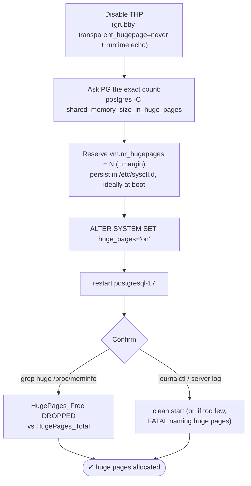
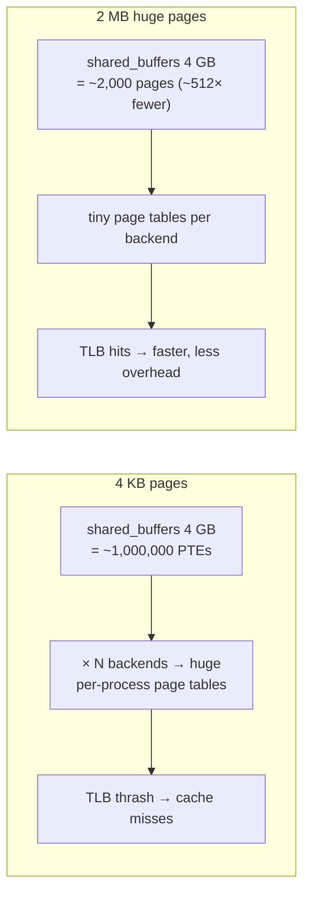

# Lab 10 — Configure `huge_pages`; Confirm Allocation via `/proc/meminfo` and Server Log

> **Track A · DBA · A2 Configuration & Tuning · Lab 2 of 7 (Lab 10/222)**
> Teaching package: concept → diagram → steps → verify → quick-ref → self-test → video script.
> **Depends on:** Labs 01–09 (running cluster; `shared_buffers` tuned in Lab 9).

---

## 0. Lab Card (at a glance)

| Field | Value |
|---|---|
| **Objective** | Disable Transparent Huge Pages, reserve the exact number of explicit huge pages PostgreSQL needs, set `huge_pages = on`, and **confirm** the allocation in `/proc/meminfo` and the server log. |
| **Success criterion** | Server starts with `huge_pages=on`; `/proc/meminfo` shows `HugePages_Free` **dropping** after start (proof PG mapped them); an intentional shortfall shows the huge-pages error in the log, and reserving enough clears it. |
| **Scope boundary** | Explicit 2 MB huge pages for shared memory. NUMA/1 GB gigantic pages are advanced follow-ons. |
| **Prereqs** | Labs 01–09; a tuned `shared_buffers`; `sudo`; ability to reboot (for persistent THP-off) |
| **Time** | 25–35 min |
| **Difficulty** | ★★★☆☆ |
| **Risk** | **Medium** — `huge_pages=on` **blocks startup** if too few pages are reserved (by design). Rollback = `huge_pages=try` / reserve more. |

---

## 1. Learning Objectives

1. **Why huge pages help** — fewer page-table entries, less TLB thrash, smaller *per-backend* page tables (the win grows with connection count).
2. **THP vs explicit huge pages** — disable Transparent Huge Pages; PostgreSQL uses *reserved* huge pages instead.
3. **Reserve the *exact* count** — `postgres -C shared_memory_size_in_huge_pages` removes the guesswork.
4. **`try` vs `on`** — why production uses `on` (fail-fast) not `try` (silent fallback).
5. **Prove it** — read `/proc/meminfo` before/after and interpret the server log (including the failure case).

---

## 2. Concept Primer — the "why"

**The page-table problem.** Linux maps memory in 4 KB pages by default. A large `shared_buffers` (say 4 GB) is a *million* 4 KB pages. Worse, page tables are **per process** — every backend maps the shared memory, so with many connections the kernel maintains enormous cumulative page tables, and the CPU's **TLB** (the cache of virtual→physical translations) thrashes. **Huge pages** are 2 MB each (x86_64), so the same 4 GB is ~2,000 pages instead of a million — ~512× fewer PTEs, dramatically smaller page tables, far fewer TLB misses. The benefit **scales with connection count**, which is exactly when big servers hurt.

**THP is not what you want here.** *Transparent* Huge Pages (THP) is the kernel silently promoting anonymous memory to huge pages and running `khugepaged` to defragment — which causes **unpredictable latency stalls** in databases. Every major DB vendor says the same: **disable THP**, and use **explicit reserved** huge pages via PostgreSQL's `huge_pages` setting. THP off + explicit huge pages on is the correct combination.

**`huge_pages` has three values:**
- `try` (default) — use huge pages if available, **silently fall back** to 4 KB if not. Convenient, but you can *think* you have them and not.
- `on` — **require** them; the server refuses to start without enough reserved. Production choice: you find out immediately, not months later.
- `off` — never.

**Reserve the exact number — no guessing.** PostgreSQL's shared memory is a bit larger than `shared_buffers` (WAL buffers, lock tables, etc.). Rather than estimate, ask PostgreSQL:
```
postgres -C shared_memory_size_in_huge_pages -D $PGDATA   # prints the page count it needs
```
Reserve that many (plus a small margin) via `vm.nr_hugepages`, ideally **at boot** — on a running, fragmented system the kernel may fail to find enough contiguous memory to reserve them later.

**How you'll confirm.** `/proc/meminfo` exposes `HugePages_Total` (reserved), `HugePages_Free` (reserved-but-unused), and `Hugepagesize`. Before PostgreSQL starts, `Free == Total`. After it starts with `huge_pages=on`, `Free` **drops** by the pages PostgreSQL mapped — that delta is your proof. The server log gives the negative proof: if you reserve too few, `huge_pages=on` produces a FATAL that names huge pages, and the server won't start.

---

## 3. Diagrams

### 3.1 Configure + confirm flow



### 3.2 Why huge pages help



---

## 4. Prerequisites

```bash
grep -i huge /proc/meminfo                       # baseline: likely HugePages_Total: 0
cat /sys/kernel/mm/transparent_hugepage/enabled  # THP state: [always] madvise never
sudo -u postgres psql -c "SHOW shared_buffers; SHOW huge_pages;"
```

---

## 5. Step-by-Step

### Step 1 — Disable Transparent Huge Pages

```bash
# immediate (this boot):
echo never | sudo tee /sys/kernel/mm/transparent_hugepage/enabled
echo never | sudo tee /sys/kernel/mm/transparent_hugepage/defrag
# persistent (RHEL-native, survives reboot):
sudo grubby --update-kernel=ALL --args="transparent_hugepage=never"
```
*Reboot later to make the kernel-cmdline setting take effect; the `echo` covers you until then.*

### Step 2 — Ask PostgreSQL exactly how many pages it needs

```bash
PGDATA=/var/lib/pgsql/17/data     # adjust to your data dir
NEED=$(sudo -u postgres /usr/pgsql-17/bin/postgres -C shared_memory_size_in_huge_pages -D "$PGDATA")
echo "PostgreSQL needs $NEED huge pages (2 MB each)"
sudo -u postgres /usr/pgsql-17/bin/postgres -C shared_memory_size -D "$PGDATA"   # in bytes, for reference
```

### Step 3 — (Optional, instructive) see the FAILURE in the log

```bash
# reserve too FEW on purpose, require huge pages, and watch it refuse to start:
sudo sysctl -w vm.nr_hugepages=1
sudo -u postgres psql -c "ALTER SYSTEM SET huge_pages='on';"
sudo systemctl restart postgresql-17 ; echo "exit: $?"
journalctl -u postgresql-17 -n 20 --no-pager | grep -i -A2 "huge\|shared memory"
#   → FATAL: could not map anonymous shared memory …
#     HINT: … reduce … or huge pages …   (this is your server-log confirmation of the mechanism)
```

### Step 4 — Reserve enough (with margin) and persist

```bash
RESERVE=$(( NEED + NEED/20 + 8 ))                 # +5% + a little slack
sudo sysctl -w vm.nr_hugepages=$RESERVE
echo "vm.nr_hugepages = $RESERVE" | sudo tee /etc/sysctl.d/10-pg-hugepages.conf
grep -i huge /proc/meminfo                        # HugePages_Total should now = RESERVE
```
*If `HugePages_Total` comes back lower than requested, memory is fragmented — reserve at boot via the sysctl.d file + reboot.*

### Step 5 — Require huge pages and restart

```bash
sudo -u postgres psql -c "ALTER SYSTEM SET huge_pages='on';" 2>/dev/null \
  || sudo -u postgres /usr/pgsql-17/bin/pg_ctl -D "$PGDATA" reload   # if server was down from Step 3
sudo systemctl restart postgresql-17
systemctl is-active postgresql-17                 # active
```

### Step 6 — Confirm via `/proc/meminfo` (the allocation proof)

```bash
grep -i huge /proc/meminfo
#   HugePages_Total:   <RESERVE>
#   HugePages_Free:    <RESERVE - pages PG mapped>   ← the DROP proves PG is using them
#   HugePages_Rsvd:    ...
#   Hugepagesize:      2048 kB
sudo -u postgres psql -c "SHOW huge_pages;"        # on
```

### Step 7 — Confirm via server log (clean start)

```bash
journalctl -u postgresql-17 --since "2 min ago" --no-pager | tail -15
#   → normal "database system is ready to accept connections", NO huge-pages FATAL
```

---

## 6. Verification Checklist

- [ ] THP shows `never` (`/sys/kernel/mm/transparent_hugepage/enabled`)
- [ ] `HugePages_Total` = your reserved count; `Hugepagesize` = 2048 kB
- [ ] `HugePages_Free` **< Total** after PostgreSQL starts (allocation proof)
- [ ] `SHOW huge_pages;` → **on**
- [ ] Server log: clean startup, no huge-pages FATAL
- [ ] (Learned) you saw the FATAL when under-reserved, and it cleared when fixed
- [ ] `vm.nr_hugepages` persisted in `/etc/sysctl.d/` and survives reboot

---

## 7. Troubleshooting

| Symptom | Cause | Fix |
|---|---|---|
| Won't start; log: `could not map anonymous shared memory … huge pages` | Too few pages reserved | Raise `vm.nr_hugepages` ≥ `shared_memory_size_in_huge_pages` (+margin) |
| `HugePages_Total` < requested | Memory fragmented at runtime | Reserve at boot via `/etc/sysctl.d` + reboot |
| THP still `[always]` after reboot | grub arg didn't apply | Re-run `grubby --update-kernel=ALL --args=…`; verify `cat /proc/cmdline` |
| `huge_pages=try` but no benefit | Silent fallback to 4 KB | Switch to `on` to force/diagnose; check `HugePages_Free` dropped |
| Startup fails after later raising `shared_buffers` | Page count is now higher | Recompute `shared_memory_size_in_huge_pages`, re-reserve |
| Permission error mapping huge pages (rare) | postgres user lacks hugetlb access | Set `vm.hugetlb_shm_group` to postgres's gid, re-reserve |

---

## 8. Quick Reference Card (paste-ready)

```bash
PGDATA=/var/lib/pgsql/17/data

# 1. disable THP (now + persistent)
echo never | sudo tee /sys/kernel/mm/transparent_hugepage/enabled
echo never | sudo tee /sys/kernel/mm/transparent_hugepage/defrag
sudo grubby --update-kernel=ALL --args="transparent_hugepage=never"

# 2. exact pages PG needs
NEED=$(sudo -u postgres /usr/pgsql-17/bin/postgres -C shared_memory_size_in_huge_pages -D "$PGDATA")

# 3. reserve (+margin), persist
RESERVE=$(( NEED + NEED/20 + 8 ))
sudo sysctl -w vm.nr_hugepages=$RESERVE
echo "vm.nr_hugepages = $RESERVE" | sudo tee /etc/sysctl.d/10-pg-hugepages.conf

# 4. require + restart
sudo -u postgres psql -c "ALTER SYSTEM SET huge_pages='on';"
sudo systemctl restart postgresql-17

# 5. CONFIRM
grep -i huge /proc/meminfo                     # HugePages_Free < Total  ⇒ PG is using them
sudo -u postgres psql -c "SHOW huge_pages;"    # on
journalctl -u postgresql-17 --since "2 min ago" | tail    # clean start, no huge-pages FATAL
```

---

## 9. Self-Check

1. What's the difference between THP and explicit `huge_pages`, and which does PostgreSQL want?
2. What do `huge_pages = try / on / off` each do, and which suits production?
3. What's the exact, no-guess way to know how many huge pages to reserve?
4. Why reserve huge pages at boot rather than on a running server?
5. Give two independent confirmations that PostgreSQL is actually using huge pages.
6. Why does the huge-pages benefit grow with the number of connections?

<details>
<summary>Answers</summary>

1. THP is the kernel automatically promoting/defragmenting huge pages (causes latency stalls — disable it). `huge_pages` uses **explicit reserved** pages, which is what PostgreSQL recommends.
2. `try` = use if available, silently fall back; `on` = require (fail to start otherwise); `off` = never. Production uses **on** to fail fast and be certain.
3. `postgres -C shared_memory_size_in_huge_pages -D $PGDATA`.
4. On a fragmented running system the kernel may not find enough contiguous memory to reserve them; at boot it can.
5. `/proc/meminfo` shows `HugePages_Free` dropped below `HugePages_Total` after start; and the server log shows a clean start with `huge_pages=on` (whereas too few pages yields a huge-pages FATAL).
6. Page tables are **per process**; with many backends each mapping shared memory, huge pages cut the cumulative page-table size (and TLB pressure) enormously.
</details>

---

## 10. Video / Teaching Script

| # | On screen | Say (narration) |
|---|---|---|
| 1 | Title: "Huge pages: make big shared_buffers efficient" | "When shared_buffers is large, the way memory is *mapped* starts to matter. Huge pages fix that." |
| 2 | `cat …/transparent_hugepage/enabled` → set never | "First, counterintuitively, we *disable* Transparent Huge Pages — its background defrag causes latency spikes in databases." |
| 3 | `postgres -C shared_memory_size_in_huge_pages` | "No guessing: PostgreSQL tells us the exact number of pages it needs." |
| 4 | reserve too few → restart fails → log | "Watch what 'on' does when we under-provision — it refuses to start, and the log says exactly why. That's a feature: fail loud, not silent." |
| 5 | reserve enough + persist | "Now reserve the real number plus a margin, and pin it so it survives reboot." |
| 6 | `huge_pages=on` + restart | "Require them, restart." |
| 7 | `grep huge /proc/meminfo` | "Here's the proof: Free is now *below* Total — PostgreSQL claimed those pages." |
| 8 | journalctl clean start | "And the log: a clean startup, no huge-pages error. Confirmed two ways." |
| 9 | Outro | "Big buffers, efficiently mapped. Next: the kernel VM parameters underneath all of this." |

---

## 11. Glossary

- **Huge page** — a 2 MB (or 1 GB) memory page vs the default 4 KB.
- **TLB** — CPU cache of virtual→physical address translations; huge pages reduce misses.
- **PTE / page table** — per-process mapping structures; smaller with huge pages.
- **THP** — Transparent Huge Pages; automatic, defrag-driven, disabled for databases.
- **`huge_pages`** — PostgreSQL GUC: `try` / `on` / `off`.
- **`shared_memory_size_in_huge_pages`** — read-only GUC giving the exact page count to reserve.
- **`vm.nr_hugepages`** — sysctl reserving explicit huge pages.
- **`HugePages_Total` / `_Free`** — `/proc/meminfo` counters; a drop in Free proves usage.

---
*NETAPORT lab series · PostgreSQL 17 on AlmaLinux 9 · Lab 10/222 · A2 Configuration & Tuning*
