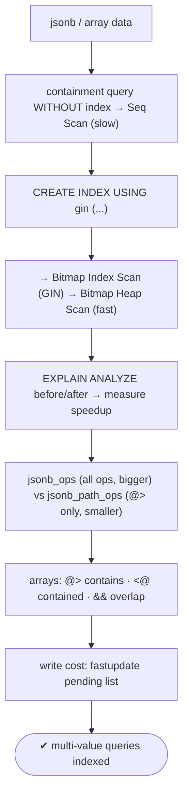
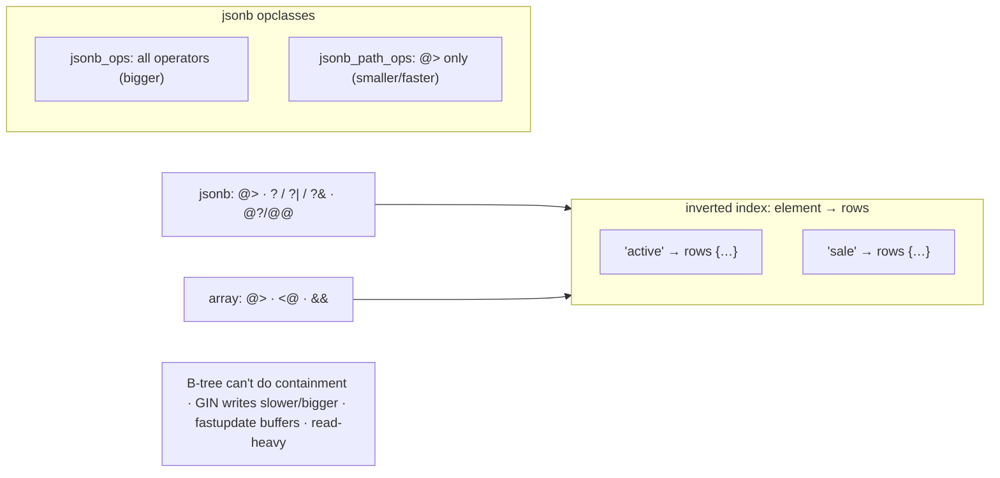

# Lab 100 — GIN Index for `jsonb` and Array Containment; Measure the Speedup

> **Track B · Developer · B3 Query Performance & Indexing · Lab 6 of 10 (Lab 100/222)**
> Teaching package: concept → diagram → steps → verify → quick-ref → self-test → video script.
> **Depends on:** Lab 95 (EXPLAIN), Lab 70 (extensions). **Related:** Lab 101 (GiST), Lab 116 (jsonb), Lab 117 (FTS).

---

## 0. Lab Card (at a glance)

| Field | Value |
|---|---|
| **Objective** | Build GIN indexes for `jsonb` containment/existence and array containment/overlap, measure the speedup vs a Seq Scan, and choose `jsonb_ops` vs `jsonb_path_ops`. |
| **Success criterion** | Containment queries switch from Seq Scan to a GIN Bitmap Index Scan with a large time drop; the right opclass is chosen for the operators used. |
| **Scope boundary** | GIN for jsonb/arrays. Full-text GIN is Lab 117; GiST is Lab 101. |
| **Prereqs** | Lab 95; jsonb/array data |
| **Time** | 30–45 min |
| **Difficulty** | ★★★★☆ |
| **Risk** | Low — read-mostly. |

---

## 1. Learning Objectives

1. **Why GIN** — inverted index for multi-value data.
2. **jsonb GIN** — `@>`, `?`/`?|`/`?&`, jsonpath.
3. **`jsonb_ops` vs `jsonb_path_ops`** — the trade-off.
4. **Array GIN** — `@>`, `<@`, `&&`.
5. **Measure** the speedup; know the write cost.

---

## 2. Concept Primer — the "why"

**GIN (Generalized Inverted Index) indexes the *elements inside* a value.** A B-tree indexes a whole scalar — great for `col = X` or ranges, useless for "which rows have element X *inside* this array/jsonb?" GIN is an **inverted index**: for each distinct element/key, it stores the list of rows containing it (like a search engine's word→documents map). So "contains X" is a fast lookup. GIN is the index for **jsonb**, **arrays**, **full-text** (`tsvector`), and **trigrams** (`pg_trgm`).

**jsonb GIN — operators and opclasses.**
```sql
CREATE INDEX ON docs USING gin (data);                 -- jsonb_ops (default)
CREATE INDEX ON docs USING gin (data jsonb_path_ops);  -- smaller, @> only
```
- **`@>` containment** — `data @> '{"status":"active"}'` → rows whose json contains that.
- **`?` / `?|` / `?&` key existence** — has a key / any of / all of.
- **`@?` / `@@` jsonpath** (PG12+).
- **`jsonb_ops`** (default) indexes every **key and value** → supports **all** the above; larger index.
- **`jsonb_path_ops`** indexes hashed **paths-to-values** → supports **only `@>`** (and jsonpath), but is **smaller and faster** for pure containment. *(It can't do the `?` existence operators.)*
- **Rule:** only doing `@>` containment → **`jsonb_path_ops`**; need `?` existence too → **`jsonb_ops`**.

**Array GIN.**
```sql
CREATE INDEX ON items USING gin (tags);   -- text[]
```
- **`@>` contains** — `tags @> ARRAY['sale']` (has element 'sale').
- **`<@` contained by**, **`&&` overlap** — `tags && ARRAY['sale','new']` (has any of these).

**The write trade-off.** GIN reads are fast for containment/membership, but **writes are slower** than B-tree (maintaining the inverted lists — every element updates the index), and the index is **larger** (it stores every element). To soften writes, GIN uses **`fastupdate`** (on by default): new entries buffer in a **pending list** flushed periodically — faster inserts, but reads must also scan the pending list until it's flushed (`gin_pending_list_limit` sizes it; `VACUUM`/`gin_clean_pending_list()` flush it; `fastupdate=off` for consistent read latency). Net: GIN suits **read-heavy** jsonb/array/full-text workloads.

**The payoff to measure:** without GIN, a `@>` containment or array-membership query is a **Seq Scan** (B-tree can't help); with GIN, it becomes a **Bitmap Index Scan → Bitmap Heap Scan** examining a tiny fraction of rows — often orders of magnitude faster.

---

## 3. Diagrams

### 3.1 Build + measure flow



### 3.2 GIN model



---

## 4. Prerequisites — jsonb + array data

```bash
sudo -u postgres psql -d shopdb <<'SQL'
DROP TABLE IF EXISTS docs, items;
CREATE TABLE docs (id bigint GENERATED ALWAYS AS IDENTITY PRIMARY KEY, data jsonb);
INSERT INTO docs (data)
SELECT jsonb_build_object(
  'status', (ARRAY['active','archived','pending'])[1+(random()*2)::int],
  'priority', (random()*5)::int,
  'tags', to_jsonb(ARRAY['x'||(random()*100)::int]))
FROM generate_series(1, 1000000);

CREATE TABLE items (id bigint GENERATED ALWAYS AS IDENTITY PRIMARY KEY, tags text[]);
INSERT INTO items (tags)
SELECT ARRAY[(ARRAY['sale','new','clearance','featured'])[1+(random()*3)::int],
             'c'||(random()*50)::int]
FROM generate_series(1, 1000000);
ANALYZE docs; ANALYZE items;
SQL
```

---

## 5. Step-by-Step

### Step 1 — jsonb containment WITHOUT GIN → Seq Scan

```bash
sudo -u postgres psql -d shopdb -c "
EXPLAIN (ANALYZE, COSTS OFF) SELECT count(*) FROM docs WHERE data @> '{\"status\":\"active\"}';"
#   → Seq Scan (1M rows) — note the time
```

### Step 2 — Create the jsonb GIN index, re-measure

```bash
sudo -u postgres psql -d shopdb -c "CREATE INDEX docs_data_gin ON docs USING gin (data); ANALYZE docs;"
sudo -u postgres psql -d shopdb -c "
EXPLAIN (ANALYZE, COSTS OFF) SELECT count(*) FROM docs WHERE data @> '{\"status\":\"active\"}';"
#   → Bitmap Index Scan on docs_data_gin → Bitmap Heap Scan — much faster
```

### Step 3 — Key existence (needs jsonb_ops)

```bash
sudo -u postgres psql -d shopdb -c "
EXPLAIN (COSTS OFF) SELECT count(*) FROM docs WHERE data ? 'priority';"
#   → uses the GIN index (jsonb_ops supports ?)
```

### Step 4 — jsonb_path_ops: smaller, @>-only

```bash
sudo -u postgres psql -d shopdb <<'SQL'
CREATE INDEX docs_data_pathops ON docs USING gin (data jsonb_path_ops);
SELECT pg_size_pretty(pg_relation_size('docs_data_gin'))     AS jsonb_ops_size,
       pg_size_pretty(pg_relation_size('docs_data_pathops')) AS path_ops_size;   -- path_ops smaller
SQL
#   path_ops serves @> but NOT the ? existence operators
```

### Step 5 — Array containment/overlap WITHOUT then WITH GIN

```bash
sudo -u postgres psql -d shopdb -c "
EXPLAIN (ANALYZE, COSTS OFF) SELECT count(*) FROM items WHERE tags @> ARRAY['sale'];"      # Seq Scan
sudo -u postgres psql -d shopdb -c "CREATE INDEX items_tags_gin ON items USING gin (tags); ANALYZE items;"
sudo -u postgres psql -d shopdb -c "
EXPLAIN (ANALYZE, COSTS OFF) SELECT count(*) FROM items WHERE tags @> ARRAY['sale'];"      # GIN Bitmap
sudo -u postgres psql -d shopdb -c "
EXPLAIN (COSTS OFF) SELECT count(*) FROM items WHERE tags && ARRAY['new','clearance'];"    # overlap uses GIN
```

### Step 6 — Note the write cost (fastupdate)

```bash
sudo -u postgres psql -d shopdb -c "SHOW gin_pending_list_limit;"
sudo -u postgres psql -d shopdb -c "\d+ items_tags_gin" | grep -i fastupdate || echo "fastupdate default ON (buffers writes)"
#   GIN writes are heavier than B-tree; fastupdate buffers new entries in a pending list
```

---

## 6. Verification Checklist & Results

- [ ] jsonb `@>` was a Seq Scan before GIN
- [ ] jsonb GIN → Bitmap Index Scan, large speedup
- [ ] `?` existence uses `jsonb_ops`
- [ ] `jsonb_path_ops` smaller than `jsonb_ops`
- [ ] Array `@>` and `&&` use the array GIN
- [ ] Recorded before/after times
- [ ] Understood the write cost / fastupdate

| Query | plan (no GIN) | time (no GIN) | plan (GIN) | time (GIN) |
|---|---|---|---|---|
| jsonb `@>` | | | | |
| array `@>` | | | | |

---

## 7. Troubleshooting

| Symptom | Cause | Fix |
|---|---|---|
| GIN not used for `?` | `jsonb_path_ops` doesn't support existence | Use `jsonb_ops` |
| Containment still slow | No GIN index | `CREATE INDEX … USING gin` |
| GIN index very large | `jsonb_ops` indexes everything | `jsonb_path_ops` if only `@>` |
| Slow writes | GIN maintenance | `fastupdate` (default) buffers; batch loads; tune `gin_pending_list_limit` |
| Reads scan a pending list | Pending list not flushed | `VACUUM` / `gin_clean_pending_list()`; or `fastupdate=off` |
| Array `= ANY` not indexed | Wrong operator | Use containment `@> ARRAY[...]` |
| `data = '{...}'` slow | Equality compares whole jsonb | Use `@>` containment |

---

## 8. Quick Reference Card (paste-ready)

```sql
-- jsonb GIN
CREATE INDEX ON docs USING gin (data);                  -- jsonb_ops: @>, ?, ?|, ?&, @?/@@  (bigger)
CREATE INDEX ON docs USING gin (data jsonb_path_ops);   -- @> only (and jsonpath) — smaller/faster
--   data @> '{"status":"active"}'   ·   data ? 'key'   (existence needs jsonb_ops)

-- array GIN
CREATE INDEX ON items USING gin (tags);                 -- @> contains · <@ contained · && overlap
--   tags @> ARRAY['sale']   ·   tags && ARRAY['new','sale']

-- measure: EXPLAIN (ANALYZE) ...  → Seq Scan → Bitmap Index Scan (GIN)
-- writes slower/bigger than B-tree · fastupdate buffers (pending list) · read-heavy workloads
-- B-tree CAN'T do containment — GIN is the tool
```

---

## 9. Self-Check

1. What kind of data is GIN designed for, and how does it work?
2. What jsonb operators does GIN support?
3. What's the difference between `jsonb_ops` and `jsonb_path_ops`?
4. What array operators does GIN support?
5. What's the write trade-off, and what softens it?
6. Why can't a B-tree do containment queries?

<details>
<summary>Answers</summary>

1. Values containing **multiple elements** (jsonb, arrays, full-text); it's an **inverted index** mapping each element/key to the rows that contain it.
2. `@>` containment; `?`/`?|`/`?&` key existence; `@?`/`@@` jsonpath.
3. `jsonb_ops` (default) indexes all keys/values and supports **all** operators (larger); `jsonb_path_ops` indexes hashed paths, supports **only `@>`** (and jsonpath), and is smaller/faster.
4. `@>` contains, `<@` contained by, `&&` overlap.
5. Writes are slower and the index larger; **`fastupdate`** buffers new entries in a pending list to soften inserts.
6. A B-tree indexes a whole scalar value; it can't index "elements *within*" a composite, so it can't answer containment/membership.
</details>

---

## 10. Video / Teaching Script

| # | On screen | Say (narration) |
|---|---|---|
| 1 | Title: "Index what's *inside*" | "B-trees index whole values. But 'which rows have this tag, or this key-value pair inside them'? That's a job for GIN — an inverted index." |
| 2 | seq scan | "A jsonb containment query with no GIN? Sequential scan — a million rows, every time." |
| 3 | create GIN | "Add a GIN index, and the same query finds its rows through the inverted lists. Watch the time collapse." |
| 4 | ops vs path_ops | "Two flavors for jsonb: the full one supports key-existence too; the path version only does containment, but it's smaller and faster. Pick by what you query." |
| 5 | arrays | "Same tool for arrays: 'has this tag,' 'overlaps these tags' — all indexed." |
| 6 | write cost | "The trade: GIN writes are heavier. Fastupdate buffers them, so it's ideal when you read far more than you write." |
| 7 | Outro | "Containment, indexed. Next: GiST for ranges and geometry." |

---

## 11. Glossary

- **GIN** — Generalized Inverted Index for multi-value data.
- **Inverted index** — element → list of containing rows.
- **`@>` containment / `?` existence** — jsonb query operators.
- **`jsonb_ops` / `jsonb_path_ops`** — full opclass / `@>`-only (smaller).
- **Array operators** — `@>`, `<@`, `&&`.
- **`fastupdate` / pending list** — buffered GIN inserts.

---
*NETAPORT lab series · PostgreSQL 17 on AlmaLinux 9 · Lab 100/222 · B3 Query Performance & Indexing*
