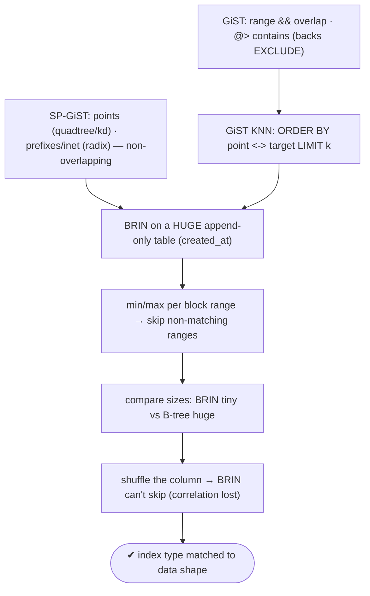
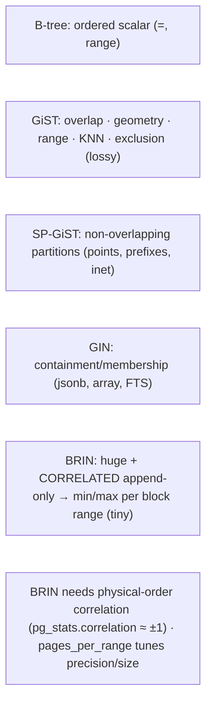

# Lab 101 — GiST/SP-GiST for Geometric/Range Queries; BRIN for Huge Append-Only Tables

> **Track B · Developer · B3 Query Performance & Indexing · Lab 7 of 10 (Lab 101/222)**
> Teaching package: concept → diagram → steps → verify → quick-ref → self-test → video script.
> **Depends on:** Lab 95 (EXPLAIN), Lab 82 (exclusion/GiST), Lab 100 (GIN). **Related:** Lab 65 (time-series).

---

## 0. Lab Card (at a glance)

| Field | Value |
|---|---|
| **Objective** | Use GiST for range overlap and nearest-neighbor, note where SP-GiST fits, and build a BRIN index on a huge append-only table — measuring its tiny size and its correlation requirement. |
| **Success criterion** | GiST serves an overlap query and a KNN query; BRIN is a fraction of a B-tree's size and prunes block ranges on a correlated column but not on a shuffled one. |
| **Scope boundary** | GiST/SP-GiST/BRIN selection. GIN was Lab 100; B-tree Labs 96–99. |
| **Prereqs** | Lab 95; range/geometry + a large ordered table |
| **Time** | 35–50 min |
| **Difficulty** | ★★★★☆ |
| **Risk** | Low — read-mostly. |

---

## 1. Learning Objectives

1. **GiST** — overlap, containment, nearest-neighbor, exclusion.
2. **SP-GiST** — non-overlapping partitions (points, prefixes).
3. **BRIN** — block-range summaries for huge correlated tables.
4. **The BRIN requirement** — physical-order correlation.
5. **Pick the index type** for the data shape.

---

## 2. Concept Primer — the "why"

Beyond B-tree (ordered scalars) and GIN (containment), three more index types each fit a data *shape*:

**GiST (Generalized Search Tree) — overlap, containment, nearest-neighbor.** A balanced tree whose nodes store **bounding predicates** (boxes, ranges), so it handles data where *closeness or overlap* matters, not linear order. It powers:
- **Range types** (`tstzrange`, `int4range`) — `&&` overlap, `@>` contains → and it **backs exclusion constraints** (Labs 82/86).
- **Geometry** (`point`, `box`, `circle`, `polygon`) and **PostGIS** spatial.
- **Nearest-neighbor (KNN)** — `ORDER BY location <-> target LIMIT k` uses a GiST **distance operator** to find the k closest rows directly from the index.
- **Full-text** (`tsvector`, smaller but slower than GIN), **trigram**, **ltree**.
GiST is *lossy* (nodes hold bounding predicates → a recheck may follow), which is fine for these query kinds.

**SP-GiST (Space-Partitioned GiST) — non-overlapping partitions.** For data that splits into **disjoint** regions: **quadtrees/k-d trees** for point data (often faster/smaller than GiST for points), **radix trees** for text prefixes and `inet`/IP ranges. Use it when the data *naturally partitions* (points, prefixes); use GiST when regions *overlap*.

**BRIN (Block Range INdex) — a tiny index for huge, ordered tables.** Instead of indexing every row, BRIN stores a **summary (min/max)** for each **block range** (a group of consecutive heap pages, default 128). A range query then **skips block ranges** whose min/max can't match, scanning only candidate ranges (and filtering within).
```sql
CREATE INDEX ON events USING brin (created_at);
CREATE INDEX ON events USING brin (created_at) WITH (pages_per_range = 32);   -- finer = bigger/more precise
```
- **Astonishingly small** — a few KB even for *billions* of rows (only per-range summaries), versus a B-tree measured in gigabytes. Cheap to build and maintain.
- **The hard requirement: the column must correlate with physical row order.** BRIN shines on **append-only/naturally-ordered** data (a time-series where `created_at` rises as rows are appended). If the column is *shuffled* relative to storage, every block range spans nearly the whole value range → **nothing can be skipped** → BRIN is useless. Check `pg_stats.correlation` (near ±1 = great for BRIN).
- **Trade-off:** far less precise than a B-tree (it scans candidate *ranges* then filters), but *massively* smaller — the right choice for huge fact/log/time-series tables where a B-tree would be enormous and range scans dominate.
- After a bulk load, new pages may be **unsummarized** (scanned fully) until autovacuum or `brin_summarize_new_values()` summarizes them.

**Selection at a glance:** B-tree (ordered scalars) · **GiST** (overlap/geometry/KNN/exclusion) · **SP-GiST** (points, prefixes) · GIN (containment) · **BRIN** (huge correlated append-only). Hash is equality-only and rarely worth it.

---

## 3. Diagrams

### 3.1 Index-type flow



### 3.2 Selection matrix



---

## 4. Prerequisites — range/geometry + a large ordered table

```bash
sudo -u postgres psql -d shopdb <<'SQL'
CREATE EXTENSION IF NOT EXISTS btree_gist;

-- range data
DROP TABLE IF EXISTS reservations;
CREATE TABLE reservations (id int, during tstzrange);
INSERT INTO reservations SELECT g, tstzrange(now()+ (g||' hours')::interval, now()+((g+2)||' hours')::interval)
FROM generate_series(1,100000) g;

-- geometry (points)
DROP TABLE IF EXISTS places;
CREATE TABLE places (id int, loc point);
INSERT INTO places SELECT g, point(random()*100, random()*100) FROM generate_series(1,200000) g;

-- huge append-only, time-ordered
DROP TABLE IF EXISTS events;
CREATE TABLE events (id bigint GENERATED ALWAYS AS IDENTITY, created_at timestamptz, payload text);
INSERT INTO events (created_at, payload)
SELECT '2026-01-01'::timestamptz + (g||' seconds')::interval, md5(g::text)
FROM generate_series(1, 5000000) g;         -- created_at rises with row order (correlated)
ANALYZE reservations; ANALYZE places; ANALYZE events;
SQL
```

---

## 5. Step-by-Step

### Step 1 — GiST on a range type: overlap query

```bash
sudo -u postgres psql -d shopdb -c "CREATE INDEX res_during_gist ON reservations USING gist (during);"
sudo -u postgres psql -d shopdb -c "
EXPLAIN (ANALYZE, COSTS OFF) SELECT count(*) FROM reservations WHERE during && tstzrange(now(), now()+interval '5 hours');"
#   → Bitmap/Index Scan on the GiST index (overlap) — this opclass also backs EXCLUDE (Labs 82/86)
```

### Step 2 — GiST nearest-neighbor (KNN)

```bash
sudo -u postgres psql -d shopdb -c "CREATE INDEX places_loc_gist ON places USING gist (loc);"
sudo -u postgres psql -d shopdb -c "
EXPLAIN (ANALYZE, COSTS OFF) SELECT id, loc <-> point(50,50) AS dist FROM places ORDER BY loc <-> point(50,50) LIMIT 5;"
#   → Index Scan using places_loc_gist (KNN via the <-> distance operator)
```

### Step 3 — SP-GiST alternative for points

```bash
sudo -u postgres psql -d shopdb -c "CREATE INDEX places_loc_spgist ON places USING spgist (loc);"
sudo -u postgres psql -d shopdb -c "
EXPLAIN (COSTS OFF) SELECT count(*) FROM places WHERE loc <@ box '((10,10),(20,20))';"
#   → SP-GiST (quadtree) for point-in-box; good for non-overlapping partitioned point data
```

### Step 4 — BRIN on the huge ordered table + size comparison

```bash
sudo -u postgres psql -d shopdb <<'SQL'
CREATE INDEX events_created_brin ON events USING brin (created_at);
CREATE INDEX events_created_btree ON events USING btree (created_at);   -- for size comparison only
SELECT pg_size_pretty(pg_relation_size('events_created_brin'))  AS brin_size,
       pg_size_pretty(pg_relation_size('events_created_btree')) AS btree_size;   -- BRIN is a FRACTION
SQL
```

### Step 5 — BRIN prunes block ranges on the correlated column

```bash
sudo -u postgres psql -d shopdb -c "DROP INDEX events_created_btree;"   # force BRIN
sudo -u postgres psql -d shopdb -c "
EXPLAIN (ANALYZE, COSTS OFF) SELECT count(*) FROM events WHERE created_at BETWEEN '2026-01-15' AND '2026-01-16';"
#   → Bitmap Index Scan on events_created_brin (skips non-matching block ranges)
sudo -u postgres psql -d shopdb -c "SELECT correlation FROM pg_stats WHERE tablename='events' AND attname='created_at';"   # ≈ 1
```

### Step 6 — Prove BRIN needs correlation (shuffle breaks it)

```bash
sudo -u postgres psql -d shopdb <<'SQL'
DROP TABLE IF EXISTS events_shuffled;
CREATE TABLE events_shuffled AS SELECT * FROM events ORDER BY random();   -- destroy physical-order correlation
CREATE INDEX ON events_shuffled USING brin (created_at);
ANALYZE events_shuffled;
SELECT correlation FROM pg_stats WHERE tablename='events_shuffled' AND attname='created_at';   -- near 0
EXPLAIN (ANALYZE, COSTS OFF) SELECT count(*) FROM events_shuffled WHERE created_at BETWEEN '2026-01-15' AND '2026-01-16';
SQL
#   → BRIN can't skip ranges (each range spans the full value range) → scans nearly everything → useless here
```

---

## 6. Verification Checklist

- [ ] GiST serves a range `&&` overlap query
- [ ] GiST serves a KNN (`<->`) nearest-neighbor query
- [ ] SP-GiST used for point-in-box (partitioned points)
- [ ] BRIN index is a fraction of the B-tree's size
- [ ] BRIN prunes block ranges on the correlated column (correlation ≈ ±1)
- [ ] Shuffled table: correlation ≈ 0 → BRIN can't skip
- [ ] Can pick an index type per data shape

---

## 7. Troubleshooting

| Symptom | Cause | Fix |
|---|---|---|
| BRIN scans everything | Column not correlated with physical order | `CLUSTER` on the column, or use it only on append-only data |
| BRIN misses recent rows | New pages unsummarized | `brin_summarize_new_values('idx')`; autovacuum summarizes |
| BRIN scan too coarse | Large `pages_per_range` | Lower `pages_per_range` (bigger, more precise) |
| KNN not using GiST | Wrong operator/opclass | Use the distance operator `<->` with a GiST index |
| GiST slower than GIN (FTS/jsonb) | GiST is lossy | Use GIN for containment/FTS; GiST for overlap/geometry/KNN |
| SP-GiST on overlapping data | Doesn't partition | Use GiST |
| Exclusion constraint needs GiST | — | `EXCLUDE USING gist` (Labs 82/86); `btree_gist` for scalar `=` |

---

## 8. Quick Reference Card (paste-ready)

```sql
-- GiST: overlap / geometry / range / KNN / exclusion (lossy)
CREATE INDEX ON t USING gist (range_col);   -- && overlap, @> contains; backs EXCLUDE (Labs 82/86)
CREATE INDEX ON t USING gist (geom_col);    -- KNN: ORDER BY geom_col <-> target LIMIT k

-- SP-GiST: non-overlapping partitions
CREATE INDEX ON t USING spgist (point_col); -- quadtree/kd for points; radix for text prefixes / inet

-- BRIN: HUGE + physically CORRELATED (append-only/time-series) — tiny index
CREATE INDEX ON events USING brin (created_at) WITH (pages_per_range = 128);
--   stores min/max per block range → skips non-matching ranges
--   REQUIRES correlation (pg_stats.correlation ≈ ±1); shuffled data ⇒ useless
--   brin_summarize_new_values('idx') for fresh unsummarized pages

-- pick: B-tree (scalar) · GiST (overlap/geom/KNN) · SP-GiST (points/prefixes) · GIN (containment) · BRIN (huge correlated)
```

---

## 9. Self-Check

1. What is GiST good for?
2. How does SP-GiST differ from GiST?
3. What is a BRIN index, and its key requirement?
4. How does BRIN's size compare to a B-tree's?
5. When is BRIN useless?
6. Which index type serves KNN nearest-neighbor?

<details>
<summary>Answers</summary>

1. Overlap, containment, and nearest-neighbor queries — range types, geometry, full-text, KNN, and it backs exclusion constraints.
2. GiST uses (possibly overlapping) bounding predicates for general data; SP-GiST uses **non-overlapping** space partitions (quadtree/k-d for points, radix for prefixes/inet).
3. A **block-range** index storing min/max per group of heap pages; it requires the column to **correlate with physical row order** (append-only/naturally ordered).
4. **Tiny** — a few KB even for billions of rows (per-range summaries) vs a B-tree's gigabytes (per-row).
5. When the data is **uncorrelated** with storage order — every block range spans the full value range, so nothing can be skipped.
6. **GiST** with a distance operator (`<->`).
</details>

---

## 10. Video / Teaching Script

| # | On screen | Say (narration) |
|---|---|---|
| 1 | Title: "The right index for the shape of your data" | "B-trees order scalars. But ranges overlap, points scatter, and some tables are just enormous. Three more index types for those." |
| 2 | GiST | "GiST handles overlap and geometry — 'do these time ranges collide,' 'what are the five nearest points.' It's also what powers exclusion constraints." |
| 3 | SP-GiST | "SP-GiST partitions space — quadtrees for points, radix trees for prefixes and IP addresses. When data splits cleanly, it's smaller and faster." |
| 4 | BRIN size | "Now the showstopper. Five million rows: the B-tree is big. The BRIN index? A rounding error. It just stores min and max per chunk of pages." |
| 5 | BRIN prune | "Query a date range and it skips every chunk that can't match. Perfect for time-series and logs." |
| 6 | correlation | "But there's a catch — the data must be *stored* in order. Shuffle it, and BRIN can't skip anything. Correlation is everything." |
| 7 | Outro | "Match the index to the data. Next: hash indexes and index bloat." |

---

## 11. Glossary

- **GiST** — balanced tree for overlap/geometry/range/KNN (lossy).
- **SP-GiST** — space-partitioned (quadtree/kd/radix) for points/prefixes.
- **BRIN** — block-range min/max summary index (tiny).
- **Block range / `pages_per_range`** — pages summarized per entry.
- **Correlation** — column order vs physical order (BRIN's requirement).
- **KNN / `<->`** — nearest-neighbor via a distance operator.
- **`brin_summarize_new_values()`** — summarize fresh unsummarized pages.

---
*NETAPORT lab series · PostgreSQL 17 on AlmaLinux 9 · Lab 101/222 · B3 Query Performance & Indexing*
