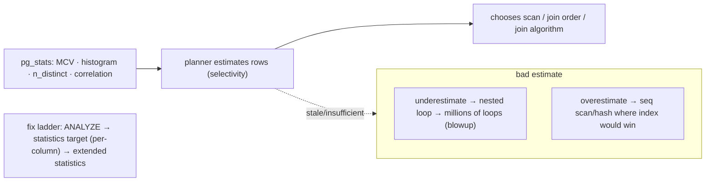

# Lab 102 — Diagnose a Bad Plan from Stale Stats; Fix with `ANALYZE` and Tuned `default_statistics_target`

> **Track B · Developer · B3 Query Performance & Indexing · Lab 8 of 10 (Lab 102/222)**
> Teaching package: concept → diagram → steps → verify → quick-ref → self-test → video script.
> **Depends on:** Lab 95 (EXPLAIN), Lab 59 (autovacuum/analyze). **Related:** Lab 50 (stat views).

---

## 0. Lab Card (at a glance)

| Field | Value |
|---|---|
| **Objective** | Reproduce a bad plan caused by stale/insufficient statistics, diagnose it by comparing estimated vs actual rows, and fix it with `ANALYZE`, a tuned statistics target, and (where needed) extended statistics. |
| **Success criterion** | A large estimate-vs-actual gap is identified; `ANALYZE` restores good estimates; a skewed column improves after raising its statistics target. |
| **Scope boundary** | Statistics-driven estimation. Reading plans was Lab 95; autovacuum-analyze Lab 59. |
| **Prereqs** | Lab 95; a table to load/skew |
| **Time** | 30–45 min |
| **Difficulty** | ★★★★☆ |
| **Risk** | Low — read-mostly + ANALYZE. |

---

## 1. Learning Objectives

1. **How the planner uses statistics** — to estimate rows.
2. **Stale stats → bad plans** — the failure mode.
3. **Diagnose** — estimated vs actual rows.
4. **Fix with `ANALYZE`** — refresh statistics.
5. **Tune `default_statistics_target`** and note extended stats.

---

## 2. Concept Primer — the "why"

**The planner chooses plans from statistics.** For every operation it estimates the **number of rows** (selectivity), and those estimates decide the scan type, the **join order**, and the **join algorithm**. The estimates come from statistics `ANALYZE` gathers into `pg_statistic` (readable via **`pg_stats`**):
- **`n_distinct`** — distinct values in the column.
- **`most_common_vals` / `most_common_freqs`** (MCVs) — the most frequent values and their frequencies.
- **`histogram_bounds`** — buckets describing the value distribution (for ranges).
- **`correlation`** — physical vs logical order; **`null_frac`** — fraction NULL.

**Good estimates → good plans; bad estimates → bad plans.** The signature disaster: the planner **underestimates** the rows from a step, so it picks a **nested loop** (cheap if the inner side runs a few times) — but the real count is huge, so it runs **millions** of iterations and the query crawls. Overestimates cause the reverse (a seq scan/hash join where an index scan would win). Wrong `n_distinct` wrecks grouping/join estimates.

**Stale statistics cause this.** After a **bulk load** or heavy churn, the data distribution changes but the stats still describe the *old* data — so estimates are wrong until `ANALYZE` runs. Autovacuum runs `ANALYZE` automatically once enough rows change (`autovacuum_analyze_scale_factor`, Lab 59), **but after a big load you should `ANALYZE` immediately** rather than wait.

**The diagnostic is always the same: estimated vs actual rows.** Run `EXPLAIN (ANALYZE)` and compare, at each node, the estimated `rows=` to the `actual rows=`. A large gap (estimated 1, actual 1,000,000) means a bad estimate — the root of the bad plan.

**The fixes, in escalating order:**
1. **`ANALYZE`** — refresh statistics (fixes staleness). This is the first move.
2. **Raise the statistics target** — `default_statistics_target` (global, default 100) or, better, **per-column** `ALTER TABLE t ALTER COLUMN c SET STATISTICS 500;` controls how many MCVs and histogram buckets `ANALYZE` collects. Raise it for **skewed** columns or ones with **many distinct values** the default 100 buckets can't capture. **Prefer per-column** (targeted) over the global default (which slows *every* `ANALYZE` and bloats stats).
3. **Extended statistics** — `CREATE STATISTICS … (dependencies, ndistinct, mcv)` for **correlated columns** (e.g., city determines zip). The planner otherwise assumes column independence and multiplies selectivities wrongly; extended stats capture the correlation. The tool when single-column stats aren't enough.

*(Occasionally `n_distinct` is mis-sampled on huge tables; you can set it manually with `ALTER TABLE … ALTER COLUMN … SET (n_distinct = …)`.)*

---

## 3. Diagrams

### 3.1 Diagnose + fix flow

```mermaid
flowchart TD
    A["run EXPLAIN (ANALYZE) on the slow query"] --> B["compare estimated rows vs actual rows per node"]
    B --> C{big gap?}
    C -->|no| D["stats fine — look elsewhere"]
    C -->|yes| E{cause?}
    E -->|stale (bulk load/churn)| F["ANALYZE → refresh"]
    E -->|skewed / many distinct| G["ALTER COLUMN SET STATISTICS n → ANALYZE"]
    E -->|correlated columns| H["CREATE STATISTICS (dependencies,mcv) → ANALYZE"]
    F & G & H --> I["re-check: estimates ≈ actual → better plan"]
    I --> J([✔ good plan restored])
```

### 3.2 Stats → estimate → plan



---

## 4. Prerequisites — a table we'll bulk-change

```bash
sudo -u postgres psql -d shopdb <<'SQL'
DROP TABLE IF EXISTS orders_s, customers_s;
CREATE TABLE customers_s (id int PRIMARY KEY, name text);
CREATE TABLE orders_s (id bigint GENERATED ALWAYS AS IDENTITY PRIMARY KEY, customer_id int, region text, amount numeric);
INSERT INTO customers_s SELECT g, 'cust'||g FROM generate_series(1,10000) g;
CREATE INDEX ON orders_s (customer_id);
-- start EMPTY-ish so stats say "few rows", then bulk-load without ANALYZE
INSERT INTO orders_s (customer_id, region, amount) SELECT (random()*10000)::int, 'x', 1 FROM generate_series(1,100);
ANALYZE orders_s;   -- stats now think orders_s has ~100 rows
SQL
```

---

## 5. Step-by-Step

### Step 1 — Bulk-load WITHOUT analyzing (stats go stale)

```bash
sudo -u postgres psql -d shopdb -c "
INSERT INTO orders_s (customer_id, region, amount)
SELECT (random()*10000)::int, (ARRAY['N','S','E','W'])[1+(random()*3)::int], (random()*500)::numeric
FROM generate_series(1, 3000000);"      # 3M rows added — but NO ANALYZE yet
```

### Step 2 — Diagnose: estimated vs actual rows are wildly off

```bash
sudo -u postgres psql -d shopdb -c "
EXPLAIN (ANALYZE, COSTS OFF, SUMMARY OFF)
SELECT c.name, count(*) FROM customers_s c JOIN orders_s o ON o.customer_id=c.id GROUP BY c.name;"
#   → look: estimated rows on orders_s ≈ 100, actual ≈ 3,000,000 — HUGE gap → likely a Nested Loop blowup
```

### Step 3 — Fix: ANALYZE, then re-check

```bash
sudo -u postgres psql -d shopdb -c "ANALYZE orders_s;"
sudo -u postgres psql -d shopdb -c "
EXPLAIN (ANALYZE, COSTS OFF, SUMMARY OFF)
SELECT c.name, count(*) FROM customers_s c JOIN orders_s o ON o.customer_id=c.id GROUP BY c.name;"
#   → estimates now ≈ actual; planner switches to Hash Join / better plan → much faster
```

### Step 4 — Inspect the statistics

```bash
sudo -u postgres psql -d shopdb -c "
SELECT attname, n_distinct, null_frac,
       array_length(most_common_vals::text::text[],1) AS n_mcv,
       correlation
FROM pg_stats WHERE tablename='orders_s' AND attname IN ('customer_id','region');"
```

### Step 5 — Skewed column: raise the statistics target

```bash
# make 'region' skewed so the default MCV list under-captures it, then improve estimates:
sudo -u postgres psql -d shopdb -c "ALTER TABLE orders_s ALTER COLUMN region SET STATISTICS 500;"   # more MCVs/buckets
sudo -u postgres psql -d shopdb -c "ANALYZE orders_s;"
sudo -u postgres psql -d shopdb -c "
EXPLAIN (ANALYZE, COSTS OFF, SUMMARY OFF) SELECT count(*) FROM orders_s WHERE region='N';"
#   estimate for the filter should now track actual more closely
sudo -u postgres psql -d shopdb -c "SHOW default_statistics_target;"   # global default (100)
```

### Step 6 — Extended statistics for correlated columns (when single-column isn't enough)

```bash
sudo -u postgres psql -d shopdb <<'SQL'
-- if two columns are correlated, the planner assumes independence and mis-estimates AND of both:
CREATE STATISTICS orders_corr (dependencies, ndistinct, mcv) ON customer_id, region FROM orders_s;
ANALYZE orders_s;
EXPLAIN (COSTS OFF) SELECT count(*) FROM orders_s WHERE customer_id=42 AND region='N';
SQL
```

---

## 6. Verification Checklist

- [ ] After a bulk load, estimated rows ≪ actual rows (diagnosed the gap)
- [ ] The bad plan (nested loop blowup) identified
- [ ] `ANALYZE` restored accurate estimates and a better plan
- [ ] Inspected `pg_stats` (n_distinct, MCVs, correlation)
- [ ] Raised a column's statistics target → improved skewed estimate
- [ ] Knew when to use extended statistics (correlated columns)
- [ ] `default_statistics_target` vs per-column understood

---

## 7. Troubleshooting

| Symptom | Cause | Fix |
|---|---|---|
| Estimated ≪/≫ actual rows | Stale stats | `ANALYZE` |
| Still off after ANALYZE | Skewed / many distinct values | Raise the column's `SET STATISTICS`; `ANALYZE` |
| AND-of-columns mis-estimated | Correlated columns assumed independent | `CREATE STATISTICS (dependencies, mcv)` |
| Nested-loop blowup | Underestimate | Fix the stats behind it |
| Autovacuum-analyze too slow to kick in | Big table, high scale factor | Tune `autovacuum_analyze_scale_factor` (Lab 59); ANALYZE after loads |
| `n_distinct` clearly wrong | Poor sampling on huge table | `ALTER COLUMN … SET (n_distinct = …)` |
| Global target slows all ANALYZE | `default_statistics_target` raised globally | Prefer **per-column** targets |

---

## 8. Quick Reference Card (paste-ready)

```sql
-- DIAGNOSE: compare estimated vs actual rows
EXPLAIN (ANALYZE) <query>;        -- big gap (est vs actual) ⇒ bad estimate ⇒ bad plan

-- FIX LADDER:
ANALYZE t;                                              -- 1) refresh stale stats
ALTER TABLE t ALTER COLUMN c SET STATISTICS 500; ANALYZE t;   -- 2) more detail for skewed/many-distinct (per-column > global)
CREATE STATISTICS s (dependencies, ndistinct, mcv) ON a, b FROM t; ANALYZE t;   -- 3) correlated columns

-- inspect: SELECT n_distinct, most_common_vals, histogram_bounds, correlation FROM pg_stats WHERE tablename='t';
-- SHOW default_statistics_target;   (global, default 100) · ANALYZE immediately after bulk loads
```

---

## 9. Self-Check

1. What does the planner use statistics for?
2. How do you diagnose a bad plan caused by stale stats?
3. What's the first fix for stale stats?
4. What does `default_statistics_target` control?
5. Per-column vs global statistics target — which is preferred and why?
6. When do you need extended statistics?

<details>
<summary>Answers</summary>

1. To **estimate row counts (selectivity)** for each operation, which drives scan types, join order, and join algorithms.
2. Run `EXPLAIN (ANALYZE)` and compare **estimated rows vs actual rows** per node — a large gap signals a bad estimate.
3. **`ANALYZE`** — refresh the statistics.
4. How many **MCVs and histogram buckets** `ANALYZE` collects (default 100); higher = more detail.
5. **Per-column** (`SET STATISTICS`) — targeted; raising the global default slows every `ANALYZE` and bloats stats.
6. For **correlated columns** (functional dependencies), where single-column stats assume independence and mis-estimate combined selectivity.
</details>

---

## 10. Video / Teaching Script

| # | On screen | Say (narration) |
|---|---|---|
| 1 | Title: "Why a good query goes bad" | "Same query, suddenly slow after a load. The culprit is almost always the same: the planner's statistics are lying to it." |
| 2 | the gap | "Run EXPLAIN ANALYZE and look at two numbers per node: estimated rows, and actual rows. Estimate says a hundred, reality says three million — that's your bug." |
| 3 | the blowup | "That underestimate made it pick a nested loop — a plan that's fine for a hundred rows and catastrophic for millions." |
| 4 | ANALYZE | "The fix is one word: ANALYZE. Refresh the stats, re-run, and the planner picks a hash join. Fast again." |
| 5 | statistics target | "Sometimes the default detail isn't enough for a skewed column. Raise its statistics target — per column, not globally — and re-analyze." |
| 6 | extended | "And when two columns move together, tell the planner with extended statistics, so it stops assuming they're independent." |
| 7 | Outro | "Estimate versus actual — your first diagnostic, always. Next: hash indexes and index bloat." |

---

## 11. Glossary

- **Statistics / `ANALYZE`** — distribution data / the command that gathers it.
- **`pg_stats`** — human-readable view of column statistics.
- **MCV / histogram / n_distinct / correlation** — the key statistics.
- **Estimated vs actual rows** — the core diagnostic.
- **`default_statistics_target` / `SET STATISTICS`** — global / per-column detail.
- **Extended statistics** — multi-column correlation (`CREATE STATISTICS`).
- **Nested-loop blowup** — the classic underestimate failure.

---
*NETAPORT lab series · PostgreSQL 17 on AlmaLinux 9 · Lab 102/222 · B3 Query Performance & Indexing*
