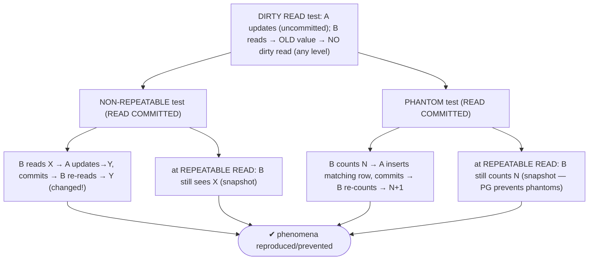
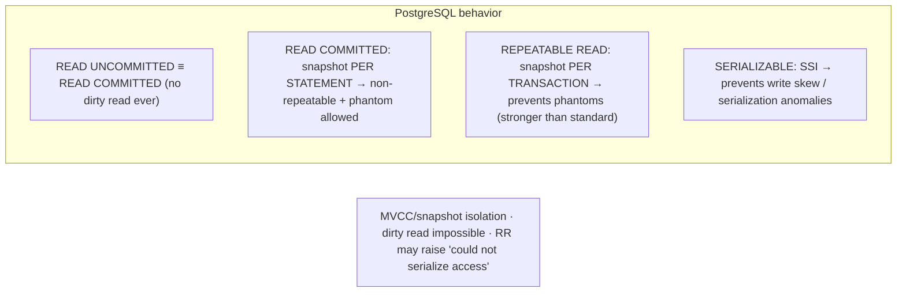

# Lab 103 — Demonstrate All Four Isolation Levels; Reproduce Dirty-Read Absence, Non-Repeatable Read, Phantom

> **Track B · Developer · B4 Transactions & Concurrency · Lab 1 of 8 (Lab 103/222)**
> Teaching package: concept → diagram → steps → verify → quick-ref → self-test → video script.
> **Depends on:** B-track fundamentals, Lab 05 (MVCC visibility). Opens the concurrency track.

---

## 0. Lab Card (at a glance)

| Field | Value |
|---|---|
| **Objective** | Use two concurrent sessions to show that PostgreSQL never allows dirty reads, reproduce non-repeatable reads and phantoms at READ COMMITTED, and see them prevented at REPEATABLE READ. |
| **Success criterion** | Dirty read is impossible at every level; a non-repeatable read and a phantom occur at READ COMMITTED and disappear at REPEATABLE READ. |
| **Scope boundary** | Isolation levels + read phenomena. Locking is Lab 104; serialization failures Lab 106. |
| **Prereqs** | Two psql sessions |
| **Time** | 35–50 min |
| **Difficulty** | ★★★★☆ |
| **Risk** | Low — scratch table; two terminals. |

---

## 1. Learning Objectives

1. **The four levels** and the read phenomena.
2. **PostgreSQL's MVCC behavior** — stricter than the standard.
3. **Dirty-read absence** — at every level.
4. **Non-repeatable read** — at READ COMMITTED.
5. **Phantom** — at READ COMMITTED; prevented at REPEATABLE READ.

---

## 2. Concept Primer — the "why"

**Isolation levels are defined by which read anomalies they allow.** With concurrent transactions, four phenomena can occur:
- **Dirty read** — you read another transaction's **uncommitted** change (which may roll back).
- **Non-repeatable read** — you re-read the **same row** and get a **different value** (another txn committed an `UPDATE` in between).
- **Phantom read** — you re-run the **same range query** and get a **different set of rows** (another txn committed an `INSERT`/`DELETE` matching your predicate).
- **Serialization anomaly** — the concurrent result matches **no** serial ordering (e.g. write skew).

**The SQL-standard matrix (minimums):**

| Level | Dirty read | Non-repeatable | Phantom | Serialization anomaly |
|---|---|---|---|---|
| READ UNCOMMITTED | allowed | allowed | allowed | allowed |
| READ COMMITTED | prevented | allowed | allowed | allowed |
| REPEATABLE READ | prevented | prevented | *allowed* | allowed |
| SERIALIZABLE | prevented | prevented | prevented | prevented |

**PostgreSQL is stricter — this is the key knowledge:**
- **`READ UNCOMMITTED` behaves exactly like `READ COMMITTED`.** PostgreSQL's MVCC **never** exposes uncommitted data — **dirty reads are impossible at every level.** (The lab shows their *absence*.)
- **`READ COMMITTED`** (the **default**): each **statement** sees a snapshot taken at *statement start*. Prevents dirty reads; **allows non-repeatable reads and phantoms** (a later statement sees newly committed data).
- **`REPEATABLE READ`**: the whole transaction sees **one snapshot** taken at its *first query* (snapshot isolation). Prevents dirty reads, non-repeatable reads, **and phantoms** — **stronger than the standard**, which permits phantoms here. (It can still hit serialization anomalies and may raise `could not serialize access` on conflicting updates.)
- **`SERIALIZABLE`**: adds **Serializable Snapshot Isolation (SSI)** — detects serialization anomalies (including write skew) and aborts one transaction with a `serialization_failure`. The result is guaranteed equivalent to some serial order.

**PostgreSQL summary:** dirty read → *never*; non-repeatable/phantom → at READ COMMITTED only; serialization anomaly → possible at REPEATABLE READ, prevented at SERIALIZABLE. The snapshot scope is the crux: **per-statement (READ COMMITTED) vs per-transaction (REPEATABLE READ+).**

---

## 3. Diagrams

### 3.1 Two-session demonstrations



### 3.2 Levels + snapshot scope



---

## 4. Prerequisites — two sessions + data

```bash
sudo -u postgres psql -d shopdb <<'SQL'
DROP TABLE IF EXISTS accounts;
CREATE TABLE accounts (id int PRIMARY KEY, owner text, balance numeric);
INSERT INTO accounts VALUES (1,'Asha',100),(2,'Ravi',200),(3,'Meera',50);
SQL
# Open TWO terminals, each: sudo -u postgres psql -d shopdb
#   Run the [A] steps in terminal A and [B] steps in terminal B, in the numbered order.
```

---

## 5. Step-by-Step (two-session choreography)

### Test 1 — Dirty read is impossible (even at READ UNCOMMITTED)

```text
[A-1] BEGIN;
[A-2] UPDATE accounts SET balance = 9999 WHERE id = 1;      -- NOT committed
[B-1] BEGIN TRANSACTION ISOLATION LEVEL READ UNCOMMITTED;
[B-2] SELECT balance FROM accounts WHERE id = 1;            -- → 100 (OLD committed value), NOT 9999
[A-3] ROLLBACK;                                             -- A's change never existed
[B-3] SELECT balance FROM accounts WHERE id = 1;  COMMIT;   -- → 100
```
**Result:** B never saw 9999 — **dirty read prevented at every level** (READ UNCOMMITTED = READ COMMITTED in PostgreSQL).

### Test 2 — Non-repeatable read AT READ COMMITTED

```text
[B-1] BEGIN TRANSACTION ISOLATION LEVEL READ COMMITTED;
[B-2] SELECT balance FROM accounts WHERE id = 2;            -- → 200
[A-1] BEGIN;
[A-2] UPDATE accounts SET balance = 500 WHERE id = 2;
[A-3] COMMIT;
[B-3] SELECT balance FROM accounts WHERE id = 2;            -- → 500  (CHANGED = non-repeatable read)
[B-4] COMMIT;
```
**Result:** the same row read twice returned different values → **non-repeatable read**.

### Test 3 — Non-repeatable read PREVENTED at REPEATABLE READ

```text
[B-1] BEGIN TRANSACTION ISOLATION LEVEL REPEATABLE READ;
[B-2] SELECT balance FROM accounts WHERE id = 2;            -- → 500 (snapshot taken)
[A-1] BEGIN; UPDATE accounts SET balance = 700 WHERE id = 2; COMMIT;
[B-3] SELECT balance FROM accounts WHERE id = 2;            -- → 500 (STILL — snapshot from txn start)
[B-4] COMMIT;
```
**Result:** B keeps seeing 500 all transaction long → **non-repeatable read prevented**.

### Test 4 — Phantom AT READ COMMITTED

```text
[B-1] BEGIN TRANSACTION ISOLATION LEVEL READ COMMITTED;
[B-2] SELECT count(*) FROM accounts WHERE balance > 100;    -- → N
[A-1] BEGIN; INSERT INTO accounts VALUES (4,'Dev',300); COMMIT;
[B-3] SELECT count(*) FROM accounts WHERE balance > 100;    -- → N+1  (PHANTOM row appeared)
[B-4] COMMIT;
```
**Result:** the same query returned a new row → **phantom read**.

### Test 5 — Phantom PREVENTED at REPEATABLE READ (PG stronger than standard)

```text
[B-1] BEGIN TRANSACTION ISOLATION LEVEL REPEATABLE READ;
[B-2] SELECT count(*) FROM accounts WHERE balance > 100;    -- → M (snapshot)
[A-1] BEGIN; INSERT INTO accounts VALUES (5,'Kiran',400); COMMIT;
[B-3] SELECT count(*) FROM accounts WHERE balance > 100;    -- → M (STILL — no phantom)
[B-4] COMMIT;
```
**Result:** the new row is invisible to B's snapshot → **phantom prevented** (the standard would allow it here).

---

## 6. Verification Checklist

- [ ] Dirty read impossible even at READ UNCOMMITTED
- [ ] Non-repeatable read reproduced at READ COMMITTED
- [ ] Non-repeatable read prevented at REPEATABLE READ
- [ ] Phantom reproduced at READ COMMITTED
- [ ] Phantom prevented at REPEATABLE READ (stronger than standard)
- [ ] Understood per-statement vs per-transaction snapshots
- [ ] Know SERIALIZABLE adds SSI (write-skew prevention)

---

## 7. Troubleshooting

| Symptom | Cause | Fix |
|---|---|---|
| Can't reproduce a dirty read | Correct — PG never allows it | That's the lesson |
| READ UNCOMMITTED acts like READ COMMITTED | PG maps it | Expected |
| No non-repeatable read at REPEATABLE READ | Snapshot isolation | Correct — prevented |
| No phantom at REPEATABLE READ | PG stronger than standard | Correct — prevented |
| "could not serialize access due to concurrent update" | Conflicting update at RR | Retry the transaction |
| SERIALIZABLE `serialization_failure` | Write skew detected (SSI) | Retry (Lab 106) |
| Steps don't interleave | Single session / autocommit | Two connections, explicit `BEGIN`, correct order |

---

## 8. Quick Reference Card (paste-ready)

```sql
BEGIN TRANSACTION ISOLATION LEVEL READ COMMITTED;   -- default: snapshot per STATEMENT
BEGIN TRANSACTION ISOLATION LEVEL REPEATABLE READ;  -- snapshot per TRANSACTION (prevents phantoms in PG)
BEGIN TRANSACTION ISOLATION LEVEL SERIALIZABLE;     -- SSI: prevents serialization anomalies (retry on failure)
-- (READ UNCOMMITTED ≡ READ COMMITTED — no dirty reads ever)

-- PostgreSQL phenomena:
--   dirty read        → NEVER (all levels)
--   non-repeatable    → READ COMMITTED only
--   phantom           → READ COMMITTED only (RR prevents it — stronger than SQL standard)
--   serialization     → possible at RR; prevented at SERIALIZABLE

-- set default: ALTER DATABASE db SET default_transaction_isolation = 'repeatable read';
-- handle: on 'could not serialize access' / serialization_failure → RETRY the transaction
```

---

## 9. Self-Check

1. Name the four isolation levels and the four read phenomena.
2. Does PostgreSQL ever allow dirty reads?
3. What does READ COMMITTED allow?
4. How is PostgreSQL's REPEATABLE READ stronger than the standard?
5. What does SERIALIZABLE add?
6. What's the snapshot scope difference between READ COMMITTED and REPEATABLE READ?

<details>
<summary>Answers</summary>

1. Levels: READ UNCOMMITTED, READ COMMITTED, REPEATABLE READ, SERIALIZABLE. Phenomena: dirty read, non-repeatable read, phantom, serialization anomaly.
2. **No — never**, at any level (READ UNCOMMITTED maps to READ COMMITTED).
3. **Non-repeatable reads and phantoms** (each statement sees a fresh snapshot); dirty reads are still prevented.
4. It uses **snapshot isolation**, so it **prevents phantoms** too — the SQL standard allows phantoms at REPEATABLE READ.
5. **Serializable Snapshot Isolation (SSI)** — detects serialization anomalies/write skew and aborts a transaction with `serialization_failure`.
6. READ COMMITTED: a snapshot **per statement**; REPEATABLE READ: one snapshot **per transaction**.
</details>

---

## 10. Video / Teaching Script

| # | On screen | Say (narration) |
|---|---|---|
| 1 | Title: "What one transaction sees of another" | "Run two transactions at once and strange things can happen — unless the isolation level stops them. Let's watch each anomaly, live, in two terminals." |
| 2 | dirty read | "First: try to read an uncommitted change. Even at the *lowest* level, Postgres shows you the old value. Dirty reads simply don't happen here." |
| 3 | non-repeatable | "At the default level, read a balance, let another transaction change and commit it, read again — it's different. That's a non-repeatable read." |
| 4 | RR fixes it | "Bump to repeatable read, and now your transaction sees one frozen snapshot. The value never changes under you." |
| 5 | phantom | "Same with new rows: at the default, a matching insert appears in your next count. A phantom." |
| 6 | RR stronger | "But Postgres's repeatable read blocks phantoms too — stronger than the SQL standard requires. The new row stays invisible." |
| 7 | Outro | "Pick your isolation on purpose. Next: locking — SELECT FOR UPDATE and deadlocks." |

---

## 11. Glossary

- **Dirty read** — reading uncommitted data (never in PG).
- **Non-repeatable read** — a row's value changes on re-read.
- **Phantom read** — a range query gains/loses rows on re-run.
- **Serialization anomaly** — result matches no serial order.
- **READ COMMITTED / REPEATABLE READ / SERIALIZABLE** — PG's real levels.
- **Snapshot isolation** — per-transaction snapshot (RR+).
- **SSI** — Serializable Snapshot Isolation (write-skew detection).

---
*NETAPORT lab series · PostgreSQL 17 on AlmaLinux 9 · Lab 103/222 · B4 Transactions & Concurrency*
