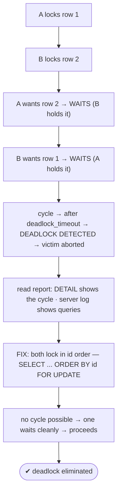
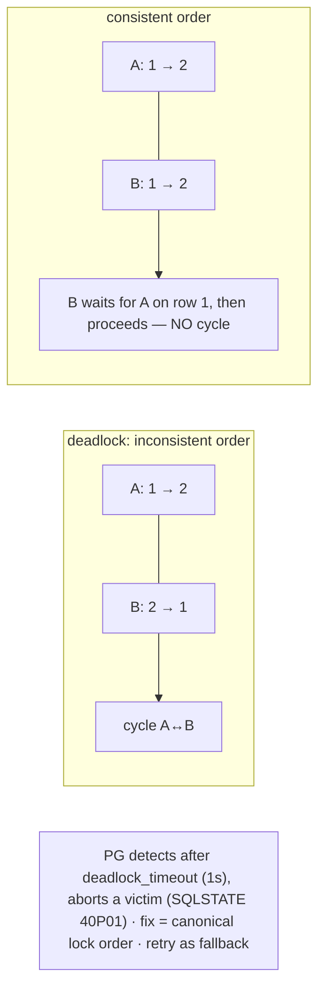

# Lab 104 — Force and Observe a Deadlock; Read the Deadlock Report; Fix with Consistent Lock Ordering

> **Track B · Developer · B4 Transactions & Concurrency · Lab 2 of 8 (Lab 104/222)**
> Teaching package: concept → diagram → steps → verify → quick-ref → self-test → video script.
> **Depends on:** Lab 103 (isolation), Lab 52 (lock diagnosis). **Related:** Lab 106 (retry logic).

---

## 0. Lab Card (at a glance)

| Field | Value |
|---|---|
| **Objective** | Reproduce a deadlock between two sessions, read PostgreSQL's deadlock report, and eliminate it with consistent lock ordering. |
| **Success criterion** | A deadlock is detected and one session aborted; you can read the cycle in the report; the ordered version runs without deadlocking. |
| **Scope boundary** | Deadlocks + lock ordering. Isolation was Lab 103; serialization retries Lab 106. |
| **Prereqs** | Two psql sessions |
| **Time** | 30–45 min |
| **Difficulty** | ★★★★☆ |
| **Risk** | Low — scratch table; two terminals. |

---

## 1. Learning Objectives

1. **What a deadlock is** — a lock cycle.
2. **Force one** with two sessions.
3. **PostgreSQL detection** — `deadlock_timeout`, the victim.
4. **Read the report** — the cycle in `DETAIL`.
5. **Fix** — consistent lock ordering.

---

## 2. Concept Primer — the "why"

**A deadlock is a cycle of lock waits.** Two (or more) transactions each hold a lock the other needs, so **none** can proceed:
- **A** locks **row 1**, then wants **row 2**.
- **B** locks **row 2**, then wants **row 1**.
- A waits for B (row 2, held by B); B waits for A (row 1, held by A) → a **cycle** → stuck forever without intervention.

**PostgreSQL detects and breaks it automatically.** When a transaction has waited for a lock longer than **`deadlock_timeout`** (default **1s**), PostgreSQL checks for a cycle. If it finds one, it picks a **victim** and aborts it, releasing its locks so the others proceed:
```
ERROR:  deadlock detected
DETAIL: Process 1234 waits for ShareLock on transaction 5678; blocked by process 5679.
        Process 5679 waits for ShareLock on transaction 5680; blocked by process 1234.
HINT:   See server log for query details.
```
The **`DETAIL`** spells out the cycle — which process waits for which lock, blocked by which process. The **server log** (always logs deadlocks; `log_lock_waits=on` also logs long waits) shows the actual **queries** involved, which pinpoints the two resources locked in opposite orders.

**The root cause — and the fix.** The cycle can only form because the two transactions **acquire locks in different orders** (A: 1→2; B: 2→1). The fix is **consistent (canonical) lock ordering**: always acquire locks in the same order — e.g. **always lock the lower id first**. If *both* A and B lock row 1 before row 2, no cycle is possible: one simply **waits cleanly** for the other, then proceeds. For a money transfer between two accounts:
```sql
SELECT * FROM accounts WHERE id IN (:a, :b) ORDER BY id FOR UPDATE;   -- lock BOTH in id order, up front
```
This locks both rows in a fixed order regardless of which account is "from" or "to," so concurrent transfers can't deadlock.

**Other mitigations:** keep transactions **short**; acquire all needed row locks **up front, in order** (not interleaved with other work); use advisory locks in a fixed order; and, as a fallback, **retry** the aborted transaction (deadlocks return a specific SQLSTATE `40P01`). But prevention via ordering beats retrying.

---

## 3. Diagrams

### 3.1 Deadlock + fix flow



### 3.2 Cycle vs ordered



---

## 4. Prerequisites — two sessions + data

```bash
sudo -u postgres psql -d shopdb <<'SQL'
DROP TABLE IF EXISTS accounts;
CREATE TABLE accounts (id int PRIMARY KEY, owner text, balance numeric);
INSERT INTO accounts VALUES (1,'Asha',100),(2,'Ravi',200);
SQL
# optional: log long lock waits for diagnosis
sudo -u postgres psql -c "ALTER SYSTEM SET log_lock_waits='on'; SELECT pg_reload_conf();"
sudo -u postgres psql -c "SHOW deadlock_timeout;"    # 1s
# Open TWO terminals: sudo -u postgres psql -d shopdb
```

---

## 5. Step-by-Step (two-session choreography)

### Force the deadlock

```text
[A-1] BEGIN;
[A-2] UPDATE accounts SET balance = balance - 10 WHERE id = 1;   -- A locks row 1
[B-1] BEGIN;
[B-2] UPDATE accounts SET balance = balance - 10 WHERE id = 2;   -- B locks row 2
[A-3] UPDATE accounts SET balance = balance + 10 WHERE id = 2;   -- A wants row 2 → WAITS (B holds it)
[B-3] UPDATE accounts SET balance = balance + 10 WHERE id = 1;   -- B wants row 1 → cycle → DEADLOCK
```
Within ~1s (`deadlock_timeout`), one session gets:
```
ERROR:  deadlock detected
DETAIL: Process ... waits for ShareLock on transaction ...; blocked by process ...
        Process ... waits for ShareLock on transaction ...; blocked by process ...
```

### Read the report + the server log

```bash
# the victim's session rolled back; the survivor can COMMIT. Then inspect the log:
sudo tail -20 /var/lib/pgsql/17/data/log/postgresql-$(date +%a).log | grep -iA4 deadlock
#   → shows the two conflicting UPDATE statements (the opposite lock orders)
```

```text
[survivor] COMMIT;      -- the non-victim proceeds
[victim]   ROLLBACK;    -- (already aborted) — application should RETRY
```

### Fix — consistent lock ordering (no deadlock possible)

```text
-- BOTH sessions lock the rows they need UP FRONT, in id order:
[A-1] BEGIN;
[A-2] SELECT * FROM accounts WHERE id IN (1,2) ORDER BY id FOR UPDATE;   -- locks 1 then 2
[B-1] BEGIN;
[B-2] SELECT * FROM accounts WHERE id IN (1,2) ORDER BY id FOR UPDATE;   -- WAITS for A on row 1 (no cycle)
[A-3] UPDATE accounts SET balance = balance - 10 WHERE id = 1;
[A-4] UPDATE accounts SET balance = balance + 10 WHERE id = 2;
[A-5] COMMIT;                                                            -- A done → B's lock granted
[B-3] UPDATE accounts SET balance = balance - 10 WHERE id = 2;
[B-4] UPDATE accounts SET balance = balance + 10 WHERE id = 1;
[B-5] COMMIT;
```
**Result:** B **waited cleanly** for A (no cycle), then proceeded — **no deadlock**.

### Confirm balances consistent

```bash
sudo -u postgres psql -d shopdb -c "SELECT * FROM accounts ORDER BY id;"
```

---

## 6. Verification Checklist

- [ ] Forced a deadlock with two sessions
- [ ] One session aborted with `ERROR: deadlock detected`
- [ ] Read the cycle in `DETAIL`
- [ ] Server log showed the conflicting queries
- [ ] Ordered version (`ORDER BY id FOR UPDATE`) ran without deadlock
- [ ] Balances remain consistent
- [ ] Know the retry fallback + `deadlock_timeout`

---

## 7. Troubleshooting

| Symptom | Cause | Fix |
|---|---|---|
| Deadlocks keep occurring | Inconsistent lock order | Acquire locks in a canonical order (e.g. by id) |
| Can't reproduce | Timing/interleaving | A locks 1, B locks 2, *then* cross-lock |
| Victim aborted | Normal | Retry the transaction (SQLSTATE `40P01`) |
| Long waits, no deadlock | Contention, not a cycle | `log_lock_waits`; `pg_blocking_pids()` (Lab 52) |
| Deadlock via FK/index locks | Not only row updates | Still enforce consistent ordering |
| Retry storms | Repeated collisions | Add backoff + keep transactions short |
| Detection feels slow | `deadlock_timeout` = 1s | Usually leave it; lowering adds overhead |

---

## 8. Quick Reference Card (paste-ready)

```sql
-- a deadlock is a lock CYCLE (A:1→2 vs B:2→1). PG detects after deadlock_timeout (1s), aborts a VICTIM:
--   ERROR: deadlock detected   (SQLSTATE 40P01)   DETAIL: <the cycle>   → server log has the queries

-- FIX: consistent (canonical) lock ordering — lock all needed rows UP FRONT, same order everywhere:
BEGIN;
  SELECT * FROM accounts WHERE id IN (:a,:b) ORDER BY id FOR UPDATE;   -- both rows, id order → no cycle
  UPDATE accounts SET balance = balance - :amt WHERE id = :from;
  UPDATE accounts SET balance = balance + :amt WHERE id = :to;
COMMIT;

-- also: keep txns short · log_lock_waits=on to diagnose · RETRY on 40P01 as a fallback
```

---

## 9. Self-Check

1. What is a deadlock?
2. How does PostgreSQL handle one?
3. What does the deadlock report tell you?
4. What's the root cause, and the fix?
5. How do you lock multiple rows in a consistent order?
6. What is `deadlock_timeout`?

<details>
<summary>Answers</summary>

1. Two or more transactions each holding a lock the other needs, forming a **cycle** — none can proceed.
2. After `deadlock_timeout` it detects the cycle and **aborts a victim** with `ERROR: deadlock detected`, letting the others continue.
3. The **cycle** — which process waits for which lock, blocked by which process (`DETAIL`); the server log shows the conflicting queries.
4. Locks acquired in **inconsistent orders**; fix with **consistent/canonical lock ordering**.
5. `SELECT … WHERE id IN (…) ORDER BY id FOR UPDATE` — lock them all up front in id order.
6. How long a transaction waits for a lock before PostgreSQL checks for a deadlock cycle (default **1s**).
</details>

---

## 10. Video / Teaching Script

| # | On screen | Say (narration) |
|---|---|---|
| 1 | Title: "Two transactions, frozen forever" | "Deadlock: each transaction holds what the other needs. Left alone, they'd wait forever — so Postgres breaks the tie." |
| 2 | force it | "A locks account one, B locks account two. Then A reaches for two, B reaches for one — and they're stuck. A second later: 'deadlock detected.'" |
| 3 | read report | "The report shows the cycle, and the log shows the two queries — locked in opposite orders. That's your smoking gun." |
| 4 | root cause | "The cause is always the same: different lock orders. One goes one-then-two, the other two-then-one." |
| 5 | fix | "The fix: everyone locks in the *same* order. Grab both rows up front, ordered by id. Now one just waits politely for the other. No cycle, no deadlock." |
| 6 | retry | "And as a safety net, retry the aborted one — but ordering means you rarely will." |
| 7 | Outro | "Order your locks, kill your deadlocks. Next: SKIP LOCKED and serialization retries." |

---

## 11. Glossary

- **Deadlock** — a cycle of lock waits; none can proceed.
- **Victim** — the transaction PostgreSQL aborts to break the cycle.
- **`deadlock_timeout`** — wait before cycle detection (1s).
- **Deadlock report / `DETAIL`** — description of the cycle.
- **Consistent/canonical lock ordering** — the prevention.
- **`ORDER BY id FOR UPDATE`** — lock rows in a fixed order.
- **SQLSTATE 40P01** — the deadlock error code (retry on it).

---
*NETAPORT lab series · PostgreSQL 17 on AlmaLinux 9 · Lab 104/222 · B4 Transactions & Concurrency*
