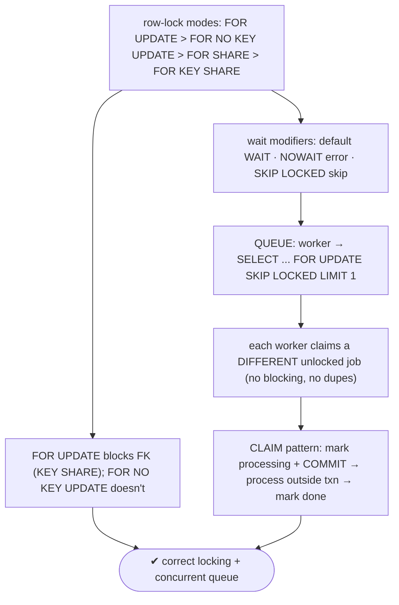
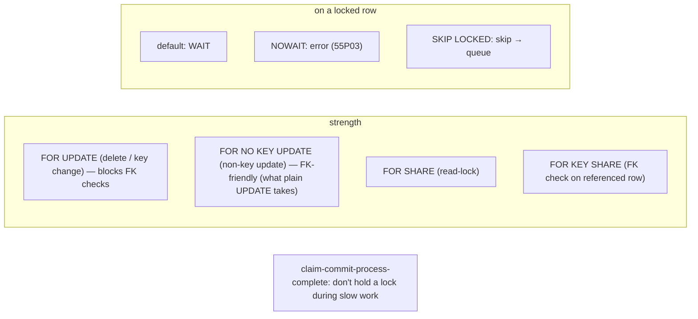

# Lab 105 — `SELECT ... FOR UPDATE` vs `FOR NO KEY UPDATE` vs `SKIP LOCKED` (Queue Pattern)

> **Track B · Developer · B4 Transactions & Concurrency · Lab 3 of 8 (Lab 105/222)**
> Teaching package: concept → diagram → steps → verify → quick-ref → self-test → video script.
> **Depends on:** Lab 103 (isolation), Lab 104 (locks/deadlocks). **Related:** Lab 130 (scheduled jobs), Track C (automation).

---

## 0. Lab Card (at a glance)

| Field | Value |
|---|---|
| **Objective** | Compare the row-lock modes, use `NOWAIT`/`SKIP LOCKED`, and build a concurrent job-queue where multiple workers each claim a different job without blocking. |
| **Success criterion** | You can pick the right lock mode; `FOR UPDATE` and `FOR NO KEY UPDATE` differ on FK contention; `SKIP LOCKED` lets two workers take different jobs concurrently. |
| **Scope boundary** | Row locks + queue pattern. Deadlocks were Lab 104. |
| **Prereqs** | Two psql sessions; a jobs table |
| **Time** | 30–45 min |
| **Difficulty** | ★★★★☆ |
| **Risk** | Low — scratch table; two terminals. |

---

## 1. Learning Objectives

1. **The four row-lock modes** and their strengths.
2. **`FOR UPDATE` vs `FOR NO KEY UPDATE`** — FK contention.
3. **Wait modifiers** — default / `NOWAIT` / `SKIP LOCKED`.
4. **The queue pattern** — concurrent workers, no duplicates.
5. **The claim pattern** — don't hold locks during processing.

---

## 2. Concept Primer — the "why"

**`SELECT … FOR …` takes an explicit row lock** so a row can't be changed out from under you. Four modes, strongest to weakest:

| Mode | Purpose | Conflicts with |
|---|---|---|
| **`FOR UPDATE`** | you'll `UPDATE`/`DELETE` (incl. key columns) | everything, incl. `FOR KEY SHARE` |
| **`FOR NO KEY UPDATE`** | you'll update **non-key** columns | all but `FOR KEY SHARE` |
| **`FOR SHARE`** | ensure the row doesn't change while you read it (shared) | writers + `FOR NO KEY UPDATE`+ |
| **`FOR KEY SHARE`** | protect a key from delete/key-change (what FK checks take) | only `FOR UPDATE` (+ key-change) |

**`FOR UPDATE` vs `FOR NO KEY UPDATE` — the practical distinction.** `FOR UPDATE` conflicts with **`FOR KEY SHARE`**, the lock a **foreign-key check** takes on a referenced row — so a `FOR UPDATE` on a parent row can **block inserts of child rows** that reference it. `FOR NO KEY UPDATE` does **not** conflict with `FOR KEY SHARE`, so FK checks proceed. Therefore: use **`FOR NO KEY UPDATE`** (or a plain non-key `UPDATE`, which takes exactly this lock) when you're updating non-key columns → **less contention** with foreign-key traffic; reserve the heavier **`FOR UPDATE`** for deletes or key/unique-column changes.

**Wait modifiers — how to handle an already-locked row:**
- **default** — **wait** (block) until the lock is free.
- **`NOWAIT`** — **error immediately** (`SQLSTATE 55P03`) if any target row is locked. Fail fast.
- **`SKIP LOCKED`** — **silently skip** rows currently locked, returning only the ones you *could* lock. The foundation of concurrent queues.

**The queue pattern (`SKIP LOCKED`).** A jobs table consumed by many workers. Without `SKIP LOCKED`, workers pile up on the same "next" row (serialized) or risk grabbing the same job. **With `SKIP LOCKED`**, each worker claims a **different** unlocked job:
```sql
BEGIN;
SELECT id FROM jobs WHERE status='pending'
  ORDER BY created_at
  FOR UPDATE SKIP LOCKED LIMIT 1;      -- grab the next job NOT locked by another worker
-- (mark it, then process)
UPDATE jobs SET status='processing' WHERE id = :id;
COMMIT;
```
True parallel consumption — no blocking, no duplicate processing. This is how PostgreSQL-backed queues work (pg-boss, Que, Sidekiq-pg, …). Grab a batch with `LIMIT N`.

**The claim pattern (avoid long-held locks).** Don't hold the row lock during (slow) processing: **claim** it (mark `status='processing'` and **commit**, releasing the lock), process the job **outside** the transaction, then `UPDATE status='done'`. Holding a `FOR UPDATE` lock across a long job blocks nothing else useful and risks stuck rows if the worker dies — so claim-commit-process-complete.

---

## 3. Diagrams

### 3.1 Modes + queue flow



### 3.2 Lock model



---

## 4. Prerequisites — jobs table + two sessions

```bash
sudo -u postgres psql -d shopdb <<'SQL'
DROP TABLE IF EXISTS jobs;
CREATE TABLE jobs (id bigint GENERATED ALWAYS AS IDENTITY PRIMARY KEY,
  status text NOT NULL DEFAULT 'pending', payload text, created_at timestamptz DEFAULT now());
INSERT INTO jobs (payload) SELECT 'job-'||g FROM generate_series(1,10) g;
SQL
# Open TWO terminals: sudo -u postgres psql -d shopdb
```

---

## 5. Step-by-Step

### Step 1 — FOR UPDATE vs FOR NO KEY UPDATE: FK contention

```text
-- parent/child to show FK interaction:
[setup] CREATE TABLE parent (id int PRIMARY KEY);
        CREATE TABLE child (id int, parent_id int REFERENCES parent(id));
        INSERT INTO parent VALUES (1);

[A-1] BEGIN; SELECT * FROM parent WHERE id=1 FOR UPDATE;          -- heavy lock
[B-1] BEGIN; INSERT INTO child VALUES (100, 1);                    -- FK check needs KEY SHARE on parent 1 → WAITS (blocked by A)
[A-2] ROLLBACK;   [B rollback]

[A-1] BEGIN; SELECT * FROM parent WHERE id=1 FOR NO KEY UPDATE;   -- FK-friendly lock
[B-1] BEGIN; INSERT INTO child VALUES (101, 1);                    -- proceeds (KEY SHARE not blocked)
[A-2] COMMIT;  [B-2] COMMIT;
```
**Lesson:** `FOR UPDATE` blocks the FK insert; `FOR NO KEY UPDATE` lets it through.

### Step 2 — NOWAIT: fail fast

```text
[A-1] BEGIN; SELECT * FROM jobs WHERE id=1 FOR UPDATE;             -- A locks job 1
[B-1] SELECT * FROM jobs WHERE id=1 FOR UPDATE NOWAIT;             -- → ERROR: could not obtain lock (55P03), no wait
[A-2] ROLLBACK;
```

### Step 3 — SKIP LOCKED: concurrent queue (two workers, different jobs)

```text
[A-1] BEGIN;
[A-2] SELECT id FROM jobs WHERE status='pending' ORDER BY created_at
        FOR UPDATE SKIP LOCKED LIMIT 1;                           -- A claims job 1 (locked)
[B-1] BEGIN;
[B-2] SELECT id FROM jobs WHERE status='pending' ORDER BY created_at
        FOR UPDATE SKIP LOCKED LIMIT 1;                           -- B SKIPS job 1 → claims job 2
[A-3] UPDATE jobs SET status='processing' WHERE id = <A's id>; COMMIT;
[B-3] UPDATE jobs SET status='processing' WHERE id = <B's id>; COMMIT;
```
**Lesson:** the two workers took **different** jobs, neither blocked — parallel consumption.

### Step 4 — Grab a batch with SKIP LOCKED

```bash
sudo -u postgres psql -d shopdb -c "
BEGIN;
SELECT id FROM jobs WHERE status='pending' ORDER BY created_at FOR UPDATE SKIP LOCKED LIMIT 3;
COMMIT;"
#   claims up to 3 unlocked pending jobs at once
```

### Step 5 — The claim pattern (don't hold the lock while processing)

```bash
sudo -u postgres psql -d shopdb <<'SQL'
-- CLAIM (short txn): lock, mark processing, commit → lock released
BEGIN;
  UPDATE jobs SET status='processing'
   WHERE id = (SELECT id FROM jobs WHERE status='pending' ORDER BY created_at
               FOR UPDATE SKIP LOCKED LIMIT 1)
  RETURNING id, payload;
COMMIT;
-- ... process the job OUTSIDE the transaction ...
-- COMPLETE:
-- UPDATE jobs SET status='done' WHERE id = :claimed_id;
SQL
```

### Step 6 — See the queue state

```bash
sudo -u postgres psql -d shopdb -c "SELECT status, count(*) FROM jobs GROUP BY status;"
```

---

## 6. Verification Checklist

- [ ] `FOR UPDATE` blocked an FK child insert; `FOR NO KEY UPDATE` didn't
- [ ] `NOWAIT` errored immediately on a locked row
- [ ] Two workers with `SKIP LOCKED` took different jobs (no blocking)
- [ ] Batch claim with `LIMIT N` worked
- [ ] Claim pattern (mark processing + commit) demonstrated
- [ ] Understood the four lock modes' strengths
- [ ] Know when to use each mode

---

## 7. Troubleshooting

| Symptom | Cause | Fix |
|---|---|---|
| Workers serialize on the queue | No `SKIP LOCKED` | Add `FOR UPDATE SKIP LOCKED` |
| Duplicate job processing | No row lock / race | `FOR UPDATE SKIP LOCKED` atomically claims |
| `FOR UPDATE` blocks FK inserts | Heavy lock vs FK key-share | Use `FOR NO KEY UPDATE` for non-key updates |
| `NOWAIT` errors | Row locked | Handle the error (retry/skip) |
| Fewer rows than `LIMIT` | Some rows locked | Expected — workers get what's free |
| Lock held too long | Processing inside the txn | Claim-commit-process-complete pattern |
| Stuck 'processing' rows | Worker died mid-job | Add a reclaim by timeout (requeue stale) |

---

## 8. Quick Reference Card (paste-ready)

```sql
-- row-lock modes (strong → weak):
FOR UPDATE            -- delete / key change · blocks FK (KEY SHARE)
FOR NO KEY UPDATE     -- non-key update · FK-friendly (plain UPDATE takes this)
FOR SHARE             -- shared read-lock
FOR KEY SHARE         -- FK check on a referenced row

-- wait modifiers:  (default WAIT) · NOWAIT (error 55P03) · SKIP LOCKED (skip)

-- CONCURRENT QUEUE (each worker claims a different unlocked job):
BEGIN;
  SELECT id FROM jobs WHERE status='pending' ORDER BY created_at
    FOR UPDATE SKIP LOCKED LIMIT 1;          -- or LIMIT N for a batch
  UPDATE jobs SET status='processing' WHERE id = :id;
COMMIT;
-- CLAIM pattern: mark processing + COMMIT (release lock) → process OUTSIDE txn → mark done
```

---

## 9. Self-Check

1. What's the difference between `FOR UPDATE` and `FOR NO KEY UPDATE`?
2. Name the four row-lock modes, strongest to weakest.
3. What does `SKIP LOCKED` do?
4. Write the concurrent-queue pattern.
5. How does `NOWAIT` differ from `SKIP LOCKED`?
6. Why does a plain non-key `UPDATE` take `FOR NO KEY UPDATE`?

<details>
<summary>Answers</summary>

1. `FOR UPDATE` is stronger and conflicts with `FOR KEY SHARE`, so it **blocks FK checks** on the row (use for deletes/key changes); `FOR NO KEY UPDATE` doesn't conflict with `FOR KEY SHARE`, so it's **FK-friendly** (use for non-key updates).
2. `FOR UPDATE`, `FOR NO KEY UPDATE`, `FOR SHARE`, `FOR KEY SHARE`.
3. Silently **skips rows currently locked** (no wait, no error), returning only the rows it could lock.
4. `SELECT id FROM jobs WHERE status='pending' ORDER BY created_at FOR UPDATE SKIP LOCKED LIMIT 1;` then mark it and commit.
5. `NOWAIT` **errors** if any target row is locked; `SKIP LOCKED` **silently skips** locked rows.
6. Because it isn't changing key/unique columns, so it needs only the weaker, FK-friendly lock.
</details>

---

## 10. Video / Teaching Script

| # | On screen | Say (narration) |
|---|---|---|
| 1 | Title: "Locking rows the right way" | "SELECT FOR UPDATE locks a row. But there are four strengths, and the wrong one fights your foreign keys." |
| 2 | FOR UPDATE vs NO KEY | "FOR UPDATE is heavy — it even blocks inserts that reference the row. If you're only updating a non-key column, FOR NO KEY UPDATE lets that traffic through." |
| 3 | NOWAIT | "Don't want to wait on a locked row? NOWAIT fails instantly." |
| 4 | SKIP LOCKED | "And the star: SKIP LOCKED. It walks past rows other workers have locked. Two workers, two different jobs — at the same time, no collisions." |
| 5 | queue | "That's a job queue in one query. Grab the next unlocked pending job, mark it, commit. Scale to as many workers as you like." |
| 6 | claim pattern | "One rule: don't hold the lock while you *do* the work. Claim it, commit, then process. A dead worker won't jam the queue." |
| 7 | Outro | "PostgreSQL is a queue now. Next: serialization failures and retry loops." |

---

## 11. Glossary

- **`FOR UPDATE` / `FOR NO KEY UPDATE`** — strong (blocks FK) / non-key (FK-friendly).
- **`FOR SHARE` / `FOR KEY SHARE`** — shared read-lock / FK-check lock.
- **`NOWAIT`** — error on a locked row (55P03).
- **`SKIP LOCKED`** — skip locked rows (queue enabler).
- **Queue pattern** — `FOR UPDATE SKIP LOCKED LIMIT N`.
- **Claim pattern** — mark + commit before processing.

---
*NETAPORT lab series · PostgreSQL 17 on AlmaLinux 9 · Lab 105/222 · B4 Transactions & Concurrency*
