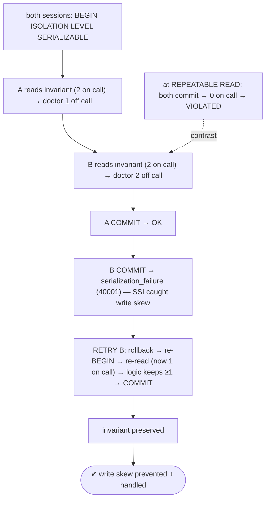
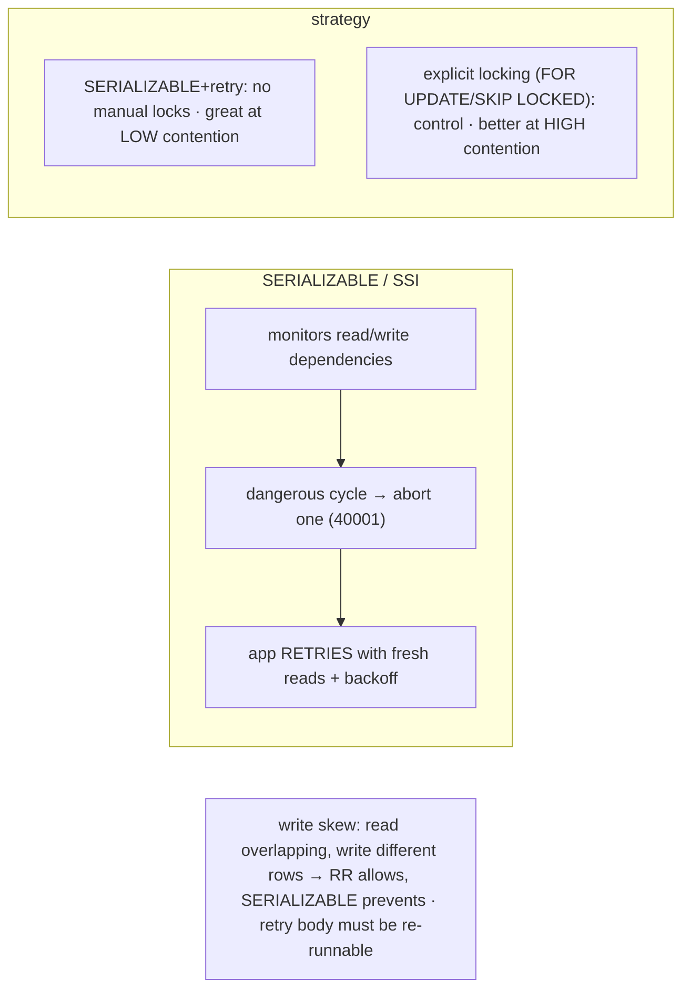

# Lab 106 — Serializable Isolation: Trigger a Serialization Failure and Implement Retry Logic

> **Track B · Developer · B4 Transactions & Concurrency · Lab 4 of 8 (Lab 106/222)**
> Teaching package: concept → diagram → steps → verify → quick-ref → self-test → video script.
> **Depends on:** Lab 103 (isolation levels), Lab 104 (deadlocks), Lab 105 (locks). **Related:** Track C (app patterns).

---

## 0. Lab Card (at a glance)

| Field | Value |
|---|---|
| **Objective** | Use SERIALIZABLE to trigger a write-skew serialization failure (40001) across two sessions, and implement a correct retry loop that preserves the invariant. |
| **Success criterion** | The second commit fails with `serialization_failure`; a retry loop re-runs it with fresh reads and enforces the invariant; you can compare SERIALIZABLE+retry to explicit locking. |
| **Scope boundary** | SSI serialization failures + retry. Isolation basics were Lab 103; locking Lab 105. |
| **Prereqs** | Two psql sessions |
| **Time** | 30–45 min |
| **Difficulty** | ★★★★☆ |
| **Risk** | Low — scratch table; two terminals. |

---

## 1. Learning Objectives

1. **What SERIALIZABLE guarantees** — and how (SSI).
2. **Write skew** — the anomaly it prevents.
3. **Trigger `serialization_failure`** (40001).
4. **Retry logic** — the correct pattern.
5. **SERIALIZABLE+retry vs explicit locking** — the trade-off.

---

## 2. Concept Primer — the "why"

**SERIALIZABLE makes concurrent transactions behave as if run one at a time.** PostgreSQL implements it with **Serializable Snapshot Isolation (SSI)**: it monitors **read/write dependencies** among concurrent transactions and, when it spots a pattern that could yield a result **inconsistent with any serial order**, it **aborts one** transaction with a `serialization_failure` — guaranteeing the committed outcome equals *some* serial ordering. You write each transaction as if it ran alone; the database enforces correctness.

**Write skew — the anomaly lower levels miss.** Two transactions each **read** an overlapping set of rows, then each **writes** based on what it read — but to **different** rows, so there's **no update conflict**. Even **REPEATABLE READ** (snapshot isolation) lets *both* commit, together violating an invariant neither broke alone. The classic example, an invariant "**at least one doctor on call**," with two on call:
- **A** reads "2 on call" → takes **doctor 1** off call.
- **B** reads "2 on call" → takes **doctor 2** off call.
- Each individually leaves ≥1 on call *by what it read*; both commit → **0 on call** → invariant violated.
At REPEATABLE READ both snapshots saw 2, and the writes hit different rows, so nothing conflicts — the anomaly slips through. **SERIALIZABLE detects the read/write dependency cycle and aborts one.**

**`serialization_failure` (SQLSTATE 40001).** The aborted transaction gets:
```
ERROR:  could not serialize access due to read/write dependencies among transactions
HINT:   The transaction might succeed if retried.
```
The **HINT is the instruction**: **retry** the whole transaction. (REPEATABLE READ raises the same 40001 — "could not serialize access due to concurrent update" — on conflicting updates; handle it the same way.)

**Retry logic — the required application pattern.** A serialization failure **aborts** the transaction, so it can't be caught and resumed inside itself — you must **restart the whole transaction, client-side**:
```
for attempt in 1..MAX:
    BEGIN ISOLATION LEVEL SERIALIZABLE
    try:
        ... read, compute, write ...
        COMMIT
        break                       # success
    except SQLSTATE 40001 or 40P01: # serialization_failure or deadlock
        ROLLBACK
        sleep(backoff(attempt))     # exponential backoff
        continue                    # retry
```
Rules: **re-read data on each attempt** (don't reuse stale values from the failed try — the transaction body must be re-runnable), bound the retries (3–5) with **exponential backoff** to avoid contention storms, and keep transactions **short** to shrink the conflict window.

**The trade-off — SERIALIZABLE+retry vs explicit locking (Lab 105).** SERIALIZABLE lets you skip manual locking and lock-ordering reasoning (no self-inflicted deadlocks) — you just handle 40001. It's ideal when conflicts are **rare** (low contention: retries are cheap). Under **high contention**, retries pile up, and explicit locking (`SELECT FOR UPDATE` / `SKIP LOCKED`) or a redesign may be better. Two valid strategies for the same correctness goal.

---

## 3. Diagrams

### 3.1 Trigger + retry flow



### 3.2 SSI + strategy



---

## 4. Prerequisites — the on-call invariant + two sessions

```bash
sudo -u postgres psql -d shopdb <<'SQL'
DROP TABLE IF EXISTS doctors;
CREATE TABLE doctors (id int PRIMARY KEY, name text, on_call boolean);
INSERT INTO doctors VALUES (1,'Asha',true),(2,'Ravi',true),(3,'Meera',false);
-- invariant: at least one doctor on_call
SQL
# Open TWO terminals: sudo -u postgres psql -d shopdb
```

---

## 5. Step-by-Step

### Step 1 — Trigger write skew at SERIALIZABLE

```text
[A-1] BEGIN ISOLATION LEVEL SERIALIZABLE;
[A-2] SELECT count(*) FROM doctors WHERE on_call;                 -- reads 2 (invariant OK to go off)
[B-1] BEGIN ISOLATION LEVEL SERIALIZABLE;
[B-2] SELECT count(*) FROM doctors WHERE on_call;                 -- reads 2
[A-3] UPDATE doctors SET on_call=false WHERE id=1;                -- A takes doctor 1 off
[B-3] UPDATE doctors SET on_call=false WHERE id=2;                -- B takes doctor 2 off (different row!)
[A-4] COMMIT;                                                     -- succeeds
[B-4] COMMIT;                                                     -- → ERROR: could not serialize access ... (40001)
```
**Result:** B is aborted — SSI detected that A+B together would leave 0 on call (a non-serializable outcome).

### Step 2 — Confirm the invariant held (only A's change applied)

```bash
sudo -u postgres psql -d shopdb -c "SELECT count(*) FROM doctors WHERE on_call;"   # 1 (not 0) — invariant preserved
```

### Step 3 — Show REPEATABLE READ would allow the violation

```text
-- reset: UPDATE doctors SET on_call=true WHERE id IN (1,2);
[A] BEGIN ISOLATION LEVEL REPEATABLE READ; SELECT count(*) FROM doctors WHERE on_call;  -- 2
[B] BEGIN ISOLATION LEVEL REPEATABLE READ; SELECT count(*) FROM doctors WHERE on_call;  -- 2
[A] UPDATE doctors SET on_call=false WHERE id=1; COMMIT;
[B] UPDATE doctors SET on_call=false WHERE id=2; COMMIT;   -- BOTH succeed (write skew) → 0 on call → VIOLATED
```

### Step 4 — A retry loop (client-side, bash + psql)

```bash
sudo -u postgres psql -d shopdb -c "UPDATE doctors SET on_call=true WHERE id IN (1,2);"   # reset
cat > /tmp/go_off_call.sh <<'EOF'
#!/bin/bash
DOC=$1; MAX=5; attempt=1
while [ $attempt -le $MAX ]; do
  out=$(sudo -u postgres psql -d shopdb -v ON_ERROR_STOP=1 -qtA 2>&1 <<SQL
BEGIN ISOLATION LEVEL SERIALIZABLE;
-- re-read the invariant EACH attempt (do not reuse stale values):
DO \$\$ BEGIN
  IF (SELECT count(*) FROM doctors WHERE on_call) <= 1 THEN
     RAISE EXCEPTION 'would violate invariant';
  END IF;
  UPDATE doctors SET on_call=false WHERE id=$DOC;
END \$\$;
COMMIT;
SQL
)
  if echo "$out" | grep -q "40001\|could not serialize\|deadlock detected"; then
    echo "attempt $attempt: serialization failure → retry"; sleep $(awk "BEGIN{print 0.1*2^$attempt}")
    attempt=$((attempt+1)); continue
  fi
  echo "attempt $attempt: $out"; break
done
EOF
chmod +x /tmp/go_off_call.sh
/tmp/go_off_call.sh 1     # succeeds (2→1); a concurrent one would 40001 → retry → re-read → refused (keeps ≥1)
```

### Step 5 — Re-run under contention to see a retry happen

```bash
/tmp/go_off_call.sh 1 & /tmp/go_off_call.sh 2 &
wait
sudo -u postgres psql -d shopdb -c "SELECT count(*) FROM doctors WHERE on_call;"   # stays ≥1 — invariant held
```

---

## 6. Verification Checklist

- [ ] Write skew triggered a `serialization_failure` (40001) at SERIALIZABLE
- [ ] Invariant preserved (only one change applied)
- [ ] REPEATABLE READ allowed the violation (contrast)
- [ ] Retry loop catches 40001 and re-runs
- [ ] Retry re-reads data each attempt (not stale values)
- [ ] Backoff + retry cap present
- [ ] Understood the SERIALIZABLE-vs-locking trade-off

---

## 7. Troubleshooting

| Symptom | Cause | Fix |
|---|---|---|
| Frequent 40001 | SERIALIZABLE contention | Retry with backoff; keep txns short; consider locking under high contention |
| Retry produces wrong result | Reusing stale values | Re-read data each attempt |
| Retry storm / livelock | No backoff/cap | Exponential backoff + bounded retries |
| Write skew still happens | Not at SERIALIZABLE | Use `ISOLATION LEVEL SERIALIZABLE` |
| Can't catch 40001 in-txn | Transaction is aborted | Retry the **whole** transaction client-side |
| REPEATABLE READ 40001 | Concurrent update conflict | Same handling — retry |
| High read-only overhead | SSI tracking | `SERIALIZABLE READ ONLY DEFERRABLE` for read-only txns |

---

## 8. Quick Reference Card (paste-ready)

```sql
BEGIN ISOLATION LEVEL SERIALIZABLE;   -- SSI guarantees serial-equivalent outcome
--   ... read invariant, compute, write ...
COMMIT;                                -- may fail: 40001 serialization_failure ("retry" hint)

-- WRITE SKEW: read overlapping rows, write DIFFERENT rows → RR allows, SERIALIZABLE prevents
```
```text
# client-side RETRY LOOP (idempotent body, fresh reads, backoff):
for attempt in 1..MAX:
    BEGIN ISOLATION LEVEL SERIALIZABLE
    try: <re-read + compute + write>; COMMIT; break
    except 40001 or 40P01: ROLLBACK; sleep(backoff(attempt)); continue

# choose: SERIALIZABLE+retry (no manual locks, low contention) vs FOR UPDATE/SKIP LOCKED (high contention)
```

---

## 9. Self-Check

1. What does SERIALIZABLE guarantee, and how?
2. What is write skew?
3. What is SQLSTATE 40001, and what should you do about it?
4. What's the retry pattern?
5. What must the retry body do for correctness?
6. When would you prefer explicit locking over SERIALIZABLE+retry?

<details>
<summary>Answers</summary>

1. That the outcome equals **some serial order**; via **SSI**, which monitors read/write dependencies and aborts a transaction when a non-serializable cycle is detected.
2. Two transactions read overlapping data and write to **different** rows based on it — no update conflict — together violating an invariant neither broke alone (allowed at REPEATABLE READ, prevented at SERIALIZABLE).
3. `serialization_failure` — the transaction was aborted to keep serializability; **retry** the whole transaction.
4. Loop: begin at SERIALIZABLE, run the body, commit; on 40001/40P01 roll back, back off, and retry (bounded).
5. **Re-read data on each attempt** — be re-runnable/idempotent, never reuse stale values from the failed try.
6. Under **high contention**, where retries would pile up — explicit `FOR UPDATE`/`SKIP LOCKED` gives more control.
</details>

---

## 10. Video / Teaching Script

| # | On screen | Say (narration) |
|---|---|---|
| 1 | Title: "Correct by default — then retry" | "SERIALIZABLE lets you write transactions as if they run alone. The database catches any dangerous overlap and tells one to try again." |
| 2 | write skew | "Two doctors on call. Each transaction reads 'two on call,' each takes a *different* one off. Both look fine — together they leave zero. That's write skew." |
| 3 | 40001 | "At serializable, the second commit fails: could not serialize access. The database refused to let them corrupt the invariant." |
| 4 | contrast | "At repeatable read? Both commit. Zero on call. The anomaly slips through." |
| 5 | retry | "So the pattern is: catch the failure, and retry the whole transaction — re-reading fresh data. This time it sees only one on call, and refuses. Invariant safe." |
| 6 | trade-off | "No manual locks, no lock-ordering headaches — just a retry loop. Perfect when conflicts are rare. Under heavy contention, lock explicitly instead." |
| 7 | Outro | "Serializable plus retry — correctness with less code. Next: advisory locks." |

---

## 11. Glossary

- **SERIALIZABLE / SSI** — serial-equivalent isolation via snapshot dependency tracking.
- **Write skew** — read-overlap, write-different-rows anomaly.
- **`serialization_failure` (40001)** — SSI abort; retry.
- **Retry loop** — client-side re-run with fresh reads + backoff.
- **Idempotent/re-runnable** — safe to retry from scratch.
- **Backoff** — increasing delay between retries.

---
*NETAPORT lab series · PostgreSQL 17 on AlmaLinux 9 · Lab 106/222 · B4 Transactions & Concurrency*
