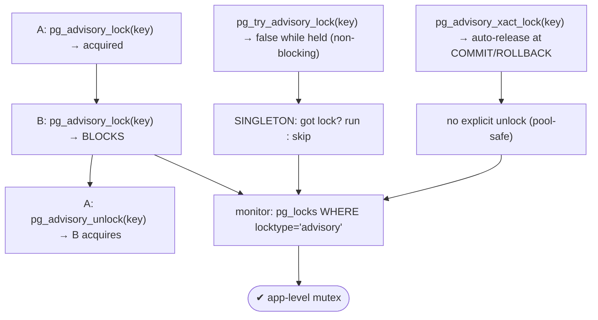
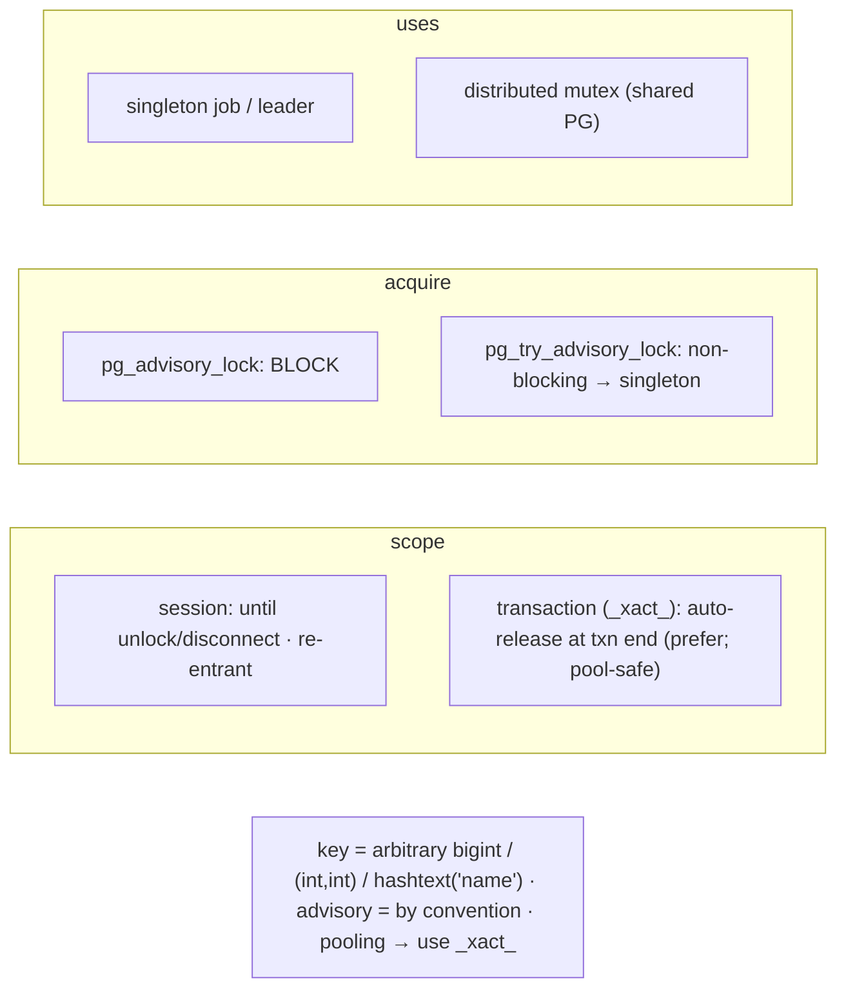

# Lab 107 — Advisory Locks (`pg_advisory_lock`) for App-Level Mutexes

> **Track B · Developer · B4 Transactions & Concurrency · Lab 5 of 8 (Lab 107/222)**
> Teaching package: concept → diagram → steps → verify → quick-ref → self-test → video script.
> **Depends on:** Lab 104 (locks/deadlocks), Lab 37 (pooling). **Related:** Lab 130 (scheduled jobs).

---

## 0. Lab Card (at a glance)

| Field | Value |
|---|---|
| **Objective** | Use advisory locks as application-level mutexes — session vs transaction scope, blocking vs try — to build a singleton-job guard, and know the connection-pooling caveat. |
| **Success criterion** | A second session blocks on the same key; `try_` returns false while held; a transaction-level lock auto-releases; a singleton pattern prevents concurrent runs. |
| **Scope boundary** | Advisory locks. Row locks were Lab 105; deadlocks Lab 104. |
| **Prereqs** | Two psql sessions |
| **Time** | 25–35 min |
| **Difficulty** | ★★★☆☆ |
| **Risk** | Low — no table effects; two terminals. |

---

## 1. Learning Objectives

1. **What an advisory lock is** — app-defined, key-based.
2. **Session vs transaction scope** — release semantics.
3. **Blocking vs `try_`** — and the singleton pattern.
4. **Distributed mutex** across app servers.
5. **The pooling caveat** — transaction-level with poolers.

---

## 2. Concept Primer — the "why"

**An advisory lock is a lock on an arbitrary key that PostgreSQL tracks but doesn't enforce on any data.** You pick a number (a `bigint`, or two `int`s as a namespace + id — often `hashtext('some-name')`), and PostgreSQL records who holds it. It locks **nothing** on tables/rows; the meaning is **entirely by convention** ("advisory"). Its job is to **serialize application logic** that doesn't map to a single row lock:
- **Singleton job / leader** — ensure only **one** instance of a cron/batch/import runs at a time.
- **Distributed mutex** — many app servers connect to the same PostgreSQL, so an advisory key is a **shared lock namespace** across them.
- Coordinating access to an external resource (an API, a file) via the DB, or serializing work on a logical entity without locking its rows.

Unlike row locks, an advisory lock **needs no row to exist** and **doesn't block DML** — other queries ignore it unless they *also* check the same lock.

**Two scopes — this choice matters:**
- **Session-level** (`pg_advisory_lock(key)`) — held until you explicitly **`pg_advisory_unlock(key)`** **or the session disconnects**. Spans multiple transactions; **re-entrant** (locking the same key N times needs N unlocks). Risk: forgetting to unlock leaks the lock until disconnect.
- **Transaction-level** (`pg_advisory_xact_lock(key)`) — held until the **current transaction ends** (COMMIT/ROLLBACK), then **auto-released**. No explicit unlock, no leak. **Prefer this** when the lock's scope is a transaction.

**Blocking vs try:**
- **`pg_advisory_lock(key)`** — **blocks** until the lock is free.
- **`pg_try_advisory_lock(key)`** — returns **`true`/`false` immediately** (non-blocking). The basis of the **singleton pattern**: if you can't get the lock, someone else is already running → **skip**.
- Shared variants (`pg_advisory_lock_shared`) let multiple holders coexist; `pg_advisory_unlock_all()` drops all session locks.

**The singleton-job pattern:**
```sql
SELECT pg_try_advisory_lock(hashtext('nightly-report'));   -- false ⇒ another instance holds it
-- if true: run the job, then  SELECT pg_advisory_unlock(hashtext('nightly-report'));
-- if false: exit — another instance is already running.
```

**Monitoring:** `SELECT * FROM pg_locks WHERE locktype='advisory';` shows held advisory locks.

**The connection-pooling caveat (important).** In a **transaction-pooling** pooler (PgBouncer transaction mode, Labs 37–38), a client doesn't own a physical connection across transactions — so a **session-level** advisory lock can **leak onto a shared connection** and outlive the client that took it. **With transaction pooling, use transaction-level advisory locks** (`pg_advisory_xact_lock`), which release at transaction end and are pool-safe. Also: advisory locks live for the **connection's lifetime** — if the connection drops, the lock releases, so don't rely on them for durable state.

**Deadlocks:** advisory locks can deadlock like any lock if acquired in different orders — apply consistent ordering (Lab 104).

---

## 3. Diagrams

### 3.1 Advisory-lock flow



### 3.2 Scope + use



---

## 4. Prerequisites — two sessions

```bash
# Open TWO terminals: sudo -u postgres psql -d shopdb
sudo -u postgres psql -c "SELECT hashtext('nightly-report');"   # a stable key from a name
```

---

## 5. Step-by-Step

### Step 1 — Session-level lock blocks a second session

```text
[A-1] SELECT pg_advisory_lock(42);              -- A acquires key 42 (returns void)
[B-1] SELECT pg_advisory_lock(42);              -- B BLOCKS (waits for A)
[A-2] SELECT pg_advisory_unlock(42);            -- → true (released); B now acquires
[B-2] SELECT pg_advisory_unlock(42);            -- B releases
```

### Step 2 — try (non-blocking) → the singleton pattern

```text
[A-1] SELECT pg_advisory_lock(hashtext('nightly-report'));    -- instance A "running"
[B-1] SELECT pg_try_advisory_lock(hashtext('nightly-report'));-- → FALSE (A holds it) → B exits (don't run twice)
[A-2] SELECT pg_advisory_unlock(hashtext('nightly-report'));  -- A done
[B-2] SELECT pg_try_advisory_lock(hashtext('nightly-report'));-- → TRUE now → B can run
[B-3] SELECT pg_advisory_unlock(hashtext('nightly-report'));
```

### Step 3 — Transaction-level lock auto-releases (no unlock)

```text
[A-1] BEGIN;
[A-2] SELECT pg_advisory_xact_lock(99);         -- held for THIS transaction only
[B-1] SELECT pg_try_advisory_xact_lock(99);     -- → FALSE (A's txn holds it)
[A-3] COMMIT;                                    -- auto-releases 99 (no explicit unlock)
[B-2] SELECT pg_try_advisory_xact_lock(99);     -- → TRUE now
```

### Step 4 — Monitor held advisory locks

```bash
sudo -u postgres psql -d shopdb -c "
SELECT pid, mode, granted, classid, objid, objsubid FROM pg_locks WHERE locktype='advisory';"
```

### Step 5 — A complete singleton-job guard (script)

```bash
cat > /tmp/singleton_job.sh <<'EOF'
#!/bin/bash
KEY="import-pipeline"
got=$(sudo -u postgres psql -d shopdb -tAqc "SELECT pg_try_advisory_lock(hashtext('$KEY'));")
if [ "$got" != "t" ]; then echo "another instance running — exiting"; exit 0; fi
echo "lock acquired — running job..."
sleep 3                                     # do the work
sudo -u postgres psql -d shopdb -tAqc "SELECT pg_advisory_unlock(hashtext('$KEY'));" >/dev/null
echo "done, lock released"
EOF
chmod +x /tmp/singleton_job.sh
/tmp/singleton_job.sh & /tmp/singleton_job.sh & wait   # only ONE runs; the other exits immediately
```

### Step 6 — (Note) with a transaction pooler, use _xact_ locks

```bash
# under PgBouncer transaction pooling (Labs 37-38): session-level advisory locks can leak across clients.
# use pg_advisory_xact_lock(...) inside a transaction instead — auto-released, pool-safe.
echo "transaction pooling → pg_advisory_xact_lock (not session-level pg_advisory_lock)"
```

---

## 6. Verification Checklist

- [ ] Session lock blocked a second session on the same key
- [ ] `pg_advisory_unlock` released it (returned true)
- [ ] `pg_try_advisory_lock` returned false while held (singleton)
- [ ] `pg_advisory_xact_lock` auto-released at COMMIT
- [ ] `pg_locks` shows advisory locks
- [ ] Singleton script ran only one instance
- [ ] Know the pooling caveat (use `_xact_`)

---

## 7. Troubleshooting

| Symptom | Cause | Fix |
|---|---|---|
| Lock never released | Session-level, not unlocked | Use `pg_advisory_xact_lock`; or ensure unlock; disconnect releases |
| Advisory deadlock | Different acquire orders | Consistent ordering (Lab 104) |
| `try_` returns false | Another holder | Expected — skip/retry |
| Lock vanished | Connection dropped | Session locks die with the connection; don't use for durable state |
| Key collision | Different names hash to same key | Use two-int keys or careful naming |
| Re-entrant not releasing | Locked N times | Unlock N times (or `pg_advisory_unlock_all()`) |
| Leaks under a pooler | Session lock on a shared connection | Transaction pooling → use `_xact_` locks |

---

## 8. Quick Reference Card (paste-ready)

```sql
-- key: arbitrary bigint · two ints (namespace,id) · hashtext('job-name')
-- SESSION-level (until unlock/disconnect, re-entrant):
SELECT pg_advisory_lock(key);          SELECT pg_advisory_unlock(key);
SELECT pg_try_advisory_lock(key);      -- non-blocking → true/false

-- TRANSACTION-level (auto-release at COMMIT/ROLLBACK — prefer; POOL-SAFE):
SELECT pg_advisory_xact_lock(key);     SELECT pg_try_advisory_xact_lock(key);

-- SINGLETON job:
--   if pg_try_advisory_lock(hashtext('job')) then RUN + unlock;  else exit (another instance running)

-- monitor: SELECT * FROM pg_locks WHERE locktype='advisory';
-- advisory = by convention (no DML blocking) · connection lifetime = lock lifetime
-- transaction pooling (PgBouncer) → use _xact_ locks, NOT session-level
```

---

## 9. Self-Check

1. What is an advisory lock?
2. What's the difference between session-level and transaction-level advisory locks?
3. How does `pg_try_advisory_lock` differ from `pg_advisory_lock`?
4. Write the singleton-job pattern.
5. What's the connection-pooling caveat?
6. What releases a session-level advisory lock?

<details>
<summary>Answers</summary>

1. An application-defined lock on an **arbitrary key** that PostgreSQL tracks but doesn't enforce on any table/row — meaning is by convention.
2. Session-level: held until `pg_advisory_unlock` or disconnect (re-entrant, spans transactions); transaction-level (`_xact_`): auto-released at the end of the transaction.
3. `pg_advisory_lock` **blocks** until free; `pg_try_advisory_lock` returns **true/false immediately** (non-blocking).
4. `SELECT pg_try_advisory_lock(hashtext('job'))` — if true, run the job and unlock; if false, exit (another instance is running).
5. With a **transaction-pooling** pooler, session-level locks can leak across clients on a shared connection — use **transaction-level** (`_xact_`) locks.
6. `pg_advisory_unlock(key)`, `pg_advisory_unlock_all()`, or the session **disconnecting**.
</details>

---

## 10. Video / Teaching Script

| # | On screen | Say (narration) |
|---|---|---|
| 1 | Title: "A lock on nothing in particular" | "Sometimes you need to serialize *logic*, not a row. Advisory locks let you lock an arbitrary number — a name, a job, anything." |
| 2 | block | "Session A grabs key 42. Session B asks for the same key — and waits. A releases, B proceeds. A mutex." |
| 3 | try + singleton | "The non-blocking version is the magic: 'can I get the lock?' If no, someone's already running the job — so just exit. That's a singleton in one line." |
| 4 | xact | "The safest scope is transaction-level: it releases automatically when the transaction ends. No forgotten unlocks." |
| 5 | singleton script | "Fire two copies of a job at once — only one runs, the other bows out. Perfect for cron and pipelines." |
| 6 | pooling | "One warning: behind a transaction pooler, use the transaction-level version. Session locks can leak onto a shared connection." |
| 7 | Outro | "App-level coordination, in the database. Next: MVCC and vacuum from the developer's side." |

---

## 11. Glossary

- **Advisory lock** — app-defined lock on an arbitrary key (by convention).
- **`pg_advisory_lock` / `pg_try_advisory_lock`** — blocking / non-blocking.
- **`pg_advisory_xact_lock`** — transaction-scoped (auto-release).
- **Session vs transaction scope** — until unlock/disconnect vs txn end.
- **Singleton job** — one instance via `try_` lock.
- **Distributed mutex** — shared key across app servers.
- **Pooling caveat** — use `_xact_` locks with transaction pooling.

---
*NETAPORT lab series · PostgreSQL 17 on AlmaLinux 9 · Lab 107/222 · B4 Transactions & Concurrency*
