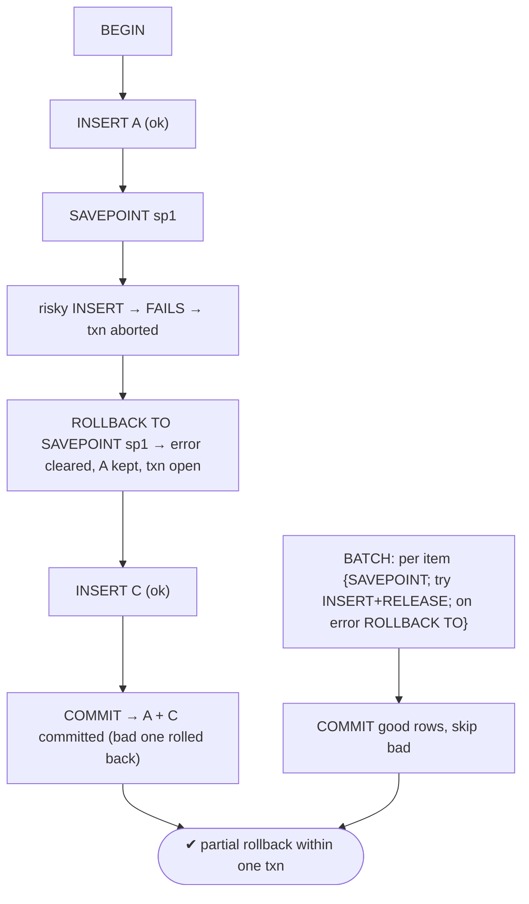
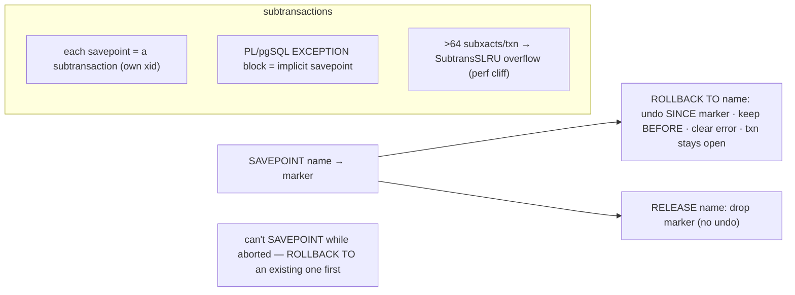

# Lab 108 — Savepoints + Partial Rollback Inside One Transaction

> **Track B · Developer · B4 Transactions & Concurrency · Lab 6 of 8 (Lab 108/222)**
> Teaching package: concept → diagram → steps → verify → quick-ref → self-test → video script.
> **Depends on:** Lab 103 (transactions). **Related:** Lab 110 (PL/pgSQL exceptions).

---

## 0. Lab Card (at a glance)

| Field | Value |
|---|---|
| **Objective** | Use savepoints to recover from a mid-transaction error and to commit the good rows of a batch while skipping failures — all in one transaction. |
| **Success criterion** | After a failing statement, `ROLLBACK TO SAVEPOINT` clears the error and preserves prior work; a batch commits its successful items and skips the bad ones. |
| **Scope boundary** | Savepoints/partial rollback. PL/pgSQL exceptions are Lab 110. |
| **Prereqs** | Lab 103; one psql session |
| **Time** | 25–35 min |
| **Difficulty** | ★★★☆☆ |
| **Risk** | Low — scratch table. |

---

## 1. Learning Objectives

1. **Why savepoints** — errors otherwise abort the whole transaction.
2. **`ROLLBACK TO SAVEPOINT`** — partial undo + error recovery.
3. **`RELEASE SAVEPOINT`** — drop the marker.
4. **The batch pattern** — commit the good, skip the bad.
5. **The subtransaction caveat** — the >64 overflow cliff.

---

## 2. Concept Primer — the "why"

**In PostgreSQL, one failed statement aborts the entire transaction.** After an error, the transaction is in an **aborted state** — every subsequent command fails with *"current transaction is aborted, commands ignored until end of transaction block"* until you `ROLLBACK`. Without savepoints, a single constraint violation throws away *all* the work in the transaction.

**A savepoint is a named marker you can roll back to — without losing the whole transaction.**
- **`SAVEPOINT name;`** — establish a marker.
- **`ROLLBACK TO SAVEPOINT name;`** — undo everything done **since** that savepoint, **keep** the work before it, **keep the transaction open**, and — crucially — **clear the aborted error state** so you can continue. The savepoint stays established (you can roll back to it again).
- **`RELEASE SAVEPOINT name;`** — remove the marker (its work becomes permanent within the transaction; you can no longer roll back to it). `RELEASE` **undoes nothing** — it just drops the marker.

**The key pattern — recover from a mid-transaction error.** Establish a savepoint *before* a risky statement; if it fails, `ROLLBACK TO` the savepoint to clear the error and carry on:
```sql
BEGIN;
INSERT INTO t VALUES (1);          -- good
SAVEPOINT sp;
INSERT INTO t VALUES (1);          -- FAILS (duplicate) → transaction aborted
ROLLBACK TO SAVEPOINT sp;          -- error cleared; the first insert survives
INSERT INTO t VALUES (2);          -- continue
COMMIT;                            -- commits 1 and 2 (the failed one was rolled back)
```
*(You cannot `SAVEPOINT` while aborted — you must `ROLLBACK TO` an **existing** savepoint or `ROLLBACK` to recover first.)*

**The batch pattern.** Process many items, committing the successes and skipping failures — in one transaction:
```
for each item:
    SAVEPOINT s
    try:    INSERT item ; RELEASE SAVEPOINT s
    except: ROLLBACK TO SAVEPOINT s        -- skip this item, keep going
COMMIT
```

**Savepoints are subtransactions** — each has its own transaction id, with overhead. **PL/pgSQL `BEGIN … EXCEPTION WHEN … END` blocks are implicit savepoints** (catching an exception rolls back to the block's start) — so exception handling in functions is subtransactions too (Lab 110).

**The caveat that bites at scale:** more than **64 subtransactions per top-level transaction** triggers **subtransaction SLRU overflow** (`SubtransSLRU` contention) — a real **performance cliff** under concurrency. So **don't overuse savepoints** in hot paths or tight loops; for large batches, prefer a different structure (e.g. validate first, or chunk into separate transactions) over thousands of savepoints.

---

## 3. Diagrams

### 3.1 Recover + batch flow



### 3.2 Savepoint semantics



---

## 4. Prerequisites

```bash
sudo -u postgres psql -d shopdb <<'SQL'
DROP TABLE IF EXISTS sp_demo;
CREATE TABLE sp_demo (id int PRIMARY KEY, val text);
SQL
```

---

## 5. Step-by-Step

### Step 1 — Recover from a mid-transaction error

```bash
sudo -u postgres psql -d shopdb <<'SQL'
BEGIN;
  INSERT INTO sp_demo VALUES (1, 'first');       -- ok
  SAVEPOINT sp1;
  INSERT INTO sp_demo VALUES (1, 'dup');          -- FAILS: duplicate key → transaction aborted
  ROLLBACK TO SAVEPOINT sp1;                       -- clears the error; row 1 survives
  INSERT INTO sp_demo VALUES (2, 'second');        -- continues fine
COMMIT;
SQL
sudo -u postgres psql -d shopdb -c "SELECT * FROM sp_demo ORDER BY id;"   # rows 1 and 2 (not the dup)
```

### Step 2 — Prove the error state without a savepoint (contrast)

```bash
sudo -u postgres psql -d shopdb <<'SQL'
BEGIN;
  INSERT INTO sp_demo VALUES (3, 'x');
  INSERT INTO sp_demo VALUES (1, 'dup');          -- FAILS → aborted
  INSERT INTO sp_demo VALUES (4, 'y');            -- ERROR: current transaction is aborted...
COMMIT;                                            -- effectively a rollback — NOTHING from this txn commits
SQL
sudo -u postgres psql -d shopdb -c "SELECT count(*) FROM sp_demo WHERE id IN (3,4);"   # 0 — all lost
```

### Step 3 — RELEASE SAVEPOINT (drop the marker, keep the work)

```bash
sudo -u postgres psql -d shopdb <<'SQL'
BEGIN;
  INSERT INTO sp_demo VALUES (5, 'five');
  SAVEPOINT sp2;
  INSERT INTO sp_demo VALUES (6, 'six');
  RELEASE SAVEPOINT sp2;                          -- marker gone; row 6 stays (can't roll back to sp2 now)
COMMIT;
SQL
sudo -u postgres psql -d shopdb -c "SELECT * FROM sp_demo WHERE id IN (5,6) ORDER BY id;"   # both present
```

### Step 4 — Batch: commit the good, skip the bad

```bash
sudo -u postgres psql -d shopdb <<'SQL'
BEGIN;
  SAVEPOINT s; INSERT INTO sp_demo VALUES (10,'a'); RELEASE SAVEPOINT s;    -- ok
  SAVEPOINT s; INSERT INTO sp_demo VALUES (1,'dup'); -- fails
  ROLLBACK TO SAVEPOINT s;                                                  -- skip this one
  SAVEPOINT s; INSERT INTO sp_demo VALUES (11,'b'); RELEASE SAVEPOINT s;    -- ok
  SAVEPOINT s; INSERT INTO sp_demo VALUES (10,'dup2'); -- fails
  ROLLBACK TO SAVEPOINT s;                                                  -- skip
  SAVEPOINT s; INSERT INTO sp_demo VALUES (12,'c'); RELEASE SAVEPOINT s;    -- ok
COMMIT;
SQL
sudo -u postgres psql -d shopdb -c "SELECT id FROM sp_demo WHERE id IN (10,11,12) ORDER BY id;"   # 10,11,12 — good rows committed
```

### Step 5 — Nested savepoints

```bash
sudo -u postgres psql -d shopdb <<'SQL'
BEGIN;
  INSERT INTO sp_demo VALUES (20,'a');
  SAVEPOINT outer_sp;
    INSERT INTO sp_demo VALUES (21,'b');
    SAVEPOINT inner_sp;
      INSERT INTO sp_demo VALUES (22,'c');
  ROLLBACK TO SAVEPOINT outer_sp;                  -- undoes 21 and 22 (releases inner_sp too); keeps 20
COMMIT;
SQL
sudo -u postgres psql -d shopdb -c "SELECT id FROM sp_demo WHERE id BETWEEN 20 AND 22 ORDER BY id;"   # only 20
```

---

## 6. Verification Checklist

- [ ] `ROLLBACK TO SAVEPOINT` cleared a mid-transaction error and kept prior work
- [ ] Without a savepoint, an error lost the whole transaction (contrast)
- [ ] `RELEASE SAVEPOINT` dropped the marker without undoing
- [ ] Batch pattern committed good rows, skipped failures
- [ ] Nested savepoint rollback released inner savepoints
- [ ] Know PL/pgSQL EXCEPTION = implicit savepoint
- [ ] Aware of the >64 subtransaction overflow caveat

---

## 7. Troubleshooting

| Symptom | Cause | Fix |
|---|---|---|
| "current transaction is aborted" | A statement failed | `ROLLBACK TO` a savepoint set before it (or `ROLLBACK`) |
| Can't `SAVEPOINT` after an error | Aborted state | `ROLLBACK TO` an existing savepoint first, then continue |
| `ROLLBACK TO` unknown savepoint | Released/never created | Ensure the savepoint exists and isn't released |
| Perf degrades with many savepoints | Subtransaction overhead | Keep <64 subxacts/txn; validate-first or chunk large batches |
| `RELEASE` didn't undo | By design | It only drops the marker |
| Inner savepoint lost after outer rollback | Nested behavior | Rolling back to an outer savepoint releases inner ones |
| PL/pgSQL loop slow with EXCEPTION | Each block is a subtransaction | Avoid `EXCEPTION` in tight loops |

---

## 8. Quick Reference Card (paste-ready)

```sql
BEGIN;
  ...work...
  SAVEPOINT sp;                    -- marker
  ...risky statement...            -- if it fails → transaction aborted
  ROLLBACK TO SAVEPOINT sp;        -- undo SINCE sp · keep earlier · CLEAR error · txn stays open
  RELEASE SAVEPOINT sp;            -- drop marker (no undo; work stays)
COMMIT;

-- BATCH (commit good, skip bad):
--   per item: SAVEPOINT s; <try insert>; on success RELEASE s; on error ROLLBACK TO s;  then COMMIT

-- can't SAVEPOINT while aborted → ROLLBACK TO an existing one first
-- PL/pgSQL BEGIN..EXCEPTION = implicit savepoint (subtransaction)
-- CAVEAT: >64 subtransactions per top-level txn → SubtransSLRU overflow (perf cliff) — don't overuse
```

---

## 9. Self-Check

1. What is a savepoint?
2. What does `ROLLBACK TO SAVEPOINT` do?
3. How do you recover from a mid-transaction error?
4. What does `RELEASE SAVEPOINT` do?
5. What's the batch pattern with savepoints?
6. What's the subtransaction caveat?

<details>
<summary>Answers</summary>

1. A named marker inside a transaction that allows partial rollback to that point without aborting the whole transaction.
2. Undoes work done **since** the savepoint, keeps earlier work, keeps the transaction open, and **clears any aborted error state**.
3. `ROLLBACK TO` a savepoint established **before** the failing statement — it clears the error so you can continue.
4. Removes the marker (its work stays); it undoes nothing and you can no longer roll back to it.
5. Per item: `SAVEPOINT`, try the operation, `RELEASE` on success or `ROLLBACK TO` on failure — then `COMMIT` the successful ones.
6. Each savepoint/`EXCEPTION` block is a subtransaction; **>64 per top-level transaction** causes `SubtransSLRU` overflow and a performance cliff — don't overuse them.
</details>

---

## 10. Video / Teaching Script

| # | On screen | Say (narration) |
|---|---|---|
| 1 | Title: "Undo part of a transaction" | "One failed statement normally kills the whole transaction. Savepoints let you undo just the broken part and keep going." |
| 2 | recover | "Set a savepoint, try something risky. It fails — the transaction's now poisoned. But roll back to the savepoint, and the error's gone. Your earlier work survives." |
| 3 | contrast | "Without one? One duplicate key, and *everything* in the transaction is lost. That's the difference." |
| 4 | batch | "The real use: a batch. Savepoint each item, keep the good ones, roll back the failures. Commit once, with only the rows that worked." |
| 5 | nested | "They nest too — roll back to an outer savepoint and the inner ones vanish with it." |
| 6 | caveat | "One warning: each savepoint is a subtransaction. Cross sixty-four in one transaction and performance falls off a cliff. Use them deliberately, not by the thousand." |
| 7 | Outro | "Partial rollback, mastered. Next: PL/pgSQL and stored procedures." |

---

## 11. Glossary

- **Savepoint** — a named marker for partial rollback.
- **`ROLLBACK TO SAVEPOINT`** — undo since the marker; keep earlier; clear error.
- **`RELEASE SAVEPOINT`** — drop the marker (no undo).
- **Aborted transaction state** — post-error state savepoints recover from.
- **Subtransaction** — what each savepoint/EXCEPTION block is.
- **SubtransSLRU overflow** — the >64-subxact performance cliff.

---
*NETAPORT lab series · PostgreSQL 17 on AlmaLinux 9 · Lab 108/222 · B4 Transactions & Concurrency*
