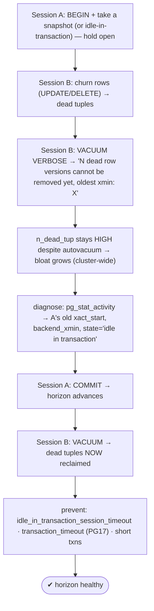
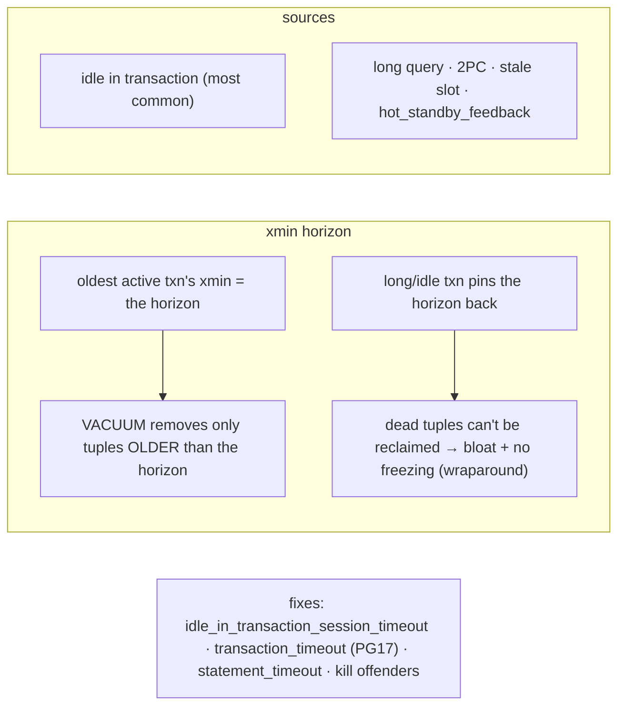

# Lab 110 — Long-Transaction Impact: Hold One Open and Watch Vacuum/Bloat and the `xmin` Horizon Stall

> **Track B · Developer · B4 Transactions & Concurrency · Lab 8 of 8 (Lab 110/222 · B4 complete)**
> Teaching package: concept → diagram → steps → verify → quick-ref → self-test → video script.
> **Depends on:** Lab 109 (MVCC), Lab 58/59 (vacuum), Lab 60 (wraparound), Lab 27 (slots).

---

## 0. Lab Card (at a glance)

| Field | Value |
|---|---|
| **Objective** | Hold a transaction open, observe that VACUUM can't reclaim dead tuples (the xmin horizon stalls), diagnose it via `pg_stat_activity`, and prevent it with timeouts. |
| **Success criterion** | With a long transaction open, `VACUUM VERBOSE` reports "cannot remove yet"; ending it lets vacuum reclaim; `idle_in_transaction_session_timeout`/`transaction_timeout` auto-terminate offenders. |
| **Scope boundary** | Long-transaction operational impact. MVCC internals were Lab 109; vacuum ops Lab 58. |
| **Prereqs** | Labs 109/58/60; two sessions |
| **Time** | 30–45 min |
| **Difficulty** | ★★★★☆ |
| **Risk** | Low — scratch table; two terminals. |

---

## 1. Learning Objectives

1. **The xmin horizon** — what pins dead-tuple removal.
2. **The stall** — VACUUM can't reclaim behind a long txn.
3. **Diagnose** via `pg_stat_activity`.
4. **The wraparound link** — the same horizon blocks freezing.
5. **Prevent** — timeouts and short transactions.

---

## 2. Concept Primer — the "why"

**VACUUM can only remove dead tuples older than the xmin horizon.** Every active transaction's snapshot has an `xmin` (the oldest XID it still considers in-progress). The database's **xmin horizon** is the **minimum across all active transactions** — the oldest XID any current transaction might still need to see. A dead tuple can be reclaimed **only if it's dead to *everyone*** — i.e., older than the horizon. If any open transaction's snapshot predates a tuple's deletion, that old transaction might still need the pre-delete version, so VACUUM **must keep it**.

**A long transaction holds the horizon back — cluster-wide.** While a transaction stays open, the horizon is frozen at *its* snapshot. VACUUM/autovacuum still **run**, but they **cannot remove** any dead tuples created after that snapshot — in *any* table, *any* database. `VACUUM VERBOSE` says it plainly:
```
N dead row versions cannot be removed yet, oldest xmin: 12345
```
So the visible symptoms are: **`n_dead_tup` keeps climbing despite autovacuum running**, tables and indexes **bloat**, and the physical files grow (and stay grown until VACUUM FULL/pg_repack even after the transaction ends).

**The same horizon blocks freezing → wraparound risk (Lab 60).** Because the held xmin also prevents advancing the frozen horizon, `age(datfrozenxid)` climbs. **A long/idle transaction is the #1 real cause of *both* runaway bloat *and* wraparound emergencies.**

**Where held horizons come from:**
- **Long-running queries/transactions** (a big analytical query, a batch job).
- **`idle in transaction`** — an app ran `BEGIN`, did some work, and never committed (left the transaction open across think-time or a bug). **The most common cause.**
- Abandoned **prepared (2PC)** transactions.
- **Stale replication slots** (Lab 27) — hold `xmin` on the primary for a standby.
- Standby long queries with **`hot_standby_feedback=on`** propagating `xmin` to the primary.

**Diagnose with `pg_stat_activity`:** find the oldest transaction by `xact_start`, check `state` (`idle in transaction`!), `backend_xmin`, and `query`. `age(backend_xmin)` shows how far back a backend pins the horizon; `now() - xact_start` its duration. Replication-slot holders show in `pg_replication_slots.xmin`.

**Prevent it:**
- **`idle_in_transaction_session_timeout`** — auto-terminate transactions idle-in-transaction beyond a limit (e.g. `'5min'`). **Set this** — it kills the most common offender.
- **`transaction_timeout`** (**PG17, new**) — cap the *total* duration of any transaction (idle *or* active) and terminate it when exceeded. A stronger, PG17-specific guard.
- **`statement_timeout`** — cap a single query's duration.
- Keep transactions **short**, commit promptly, and monitor/kill offenders (`pg_terminate_backend`). *(Note: the old `old_snapshot_threshold` escape hatch was **removed in PG17** — it isn't a tool here anymore.)*

---

## 3. Diagrams

### 3.1 Stall + fix flow



### 3.2 Concept



---

## 4. Prerequisites — table + two sessions

```bash
sudo -u postgres psql -d shopdb <<'SQL'
DROP TABLE IF EXISTS churn;
CREATE TABLE churn (id int PRIMARY KEY, v int);
INSERT INTO churn SELECT g, g FROM generate_series(1,200000) g;
ALTER TABLE churn SET (autovacuum_enabled = off);   -- so we control VACUUM manually for the demo
ANALYZE churn;
SQL
# Open TWO terminals: sudo -u postgres psql -d shopdb   (call them A and B)
```

---

## 5. Step-by-Step

### Step 1 — Session A: open a transaction and hold a snapshot

```text
[A-1] BEGIN ISOLATION LEVEL REPEATABLE READ;
[A-2] SELECT count(*) FROM churn;        -- takes a snapshot → pins the xmin horizon here
       -- LEAVE THIS SESSION OPEN (do not commit yet)
```

### Step 2 — Session B: churn rows (create dead tuples) and try to vacuum

```text
[B-1] UPDATE churn SET v = v + 1;         -- 200k dead tuples
[B-2] UPDATE churn SET v = v + 1;         -- another 200k
[B-3] VACUUM (VERBOSE) churn;
```
Look for:
```
tuples: 0 removed, 200000 remain, 400000 are dead but not yet removable, oldest xmin: <A's xid>
```
→ VACUUM ran but **removed nothing** — A's snapshot pins the horizon.

```bash
sudo -u postgres psql -d shopdb -c "SELECT n_dead_tup FROM pg_stat_user_tables WHERE relname='churn';"   # still high
```

### Step 3 — Diagnose the offender via pg_stat_activity

```bash
sudo -u postgres psql -d shopdb -c "
SELECT pid, state, now()-xact_start AS txn_age, age(backend_xmin) AS xmin_age, left(query,40) AS query
FROM pg_stat_activity
WHERE backend_xmin IS NOT NULL AND state <> 'idle'
ORDER BY xact_start;"
#   → Session A shows up: old xact_start, a backend_xmin holding the horizon
```

### Step 4 — Session A: commit → horizon advances

```text
[A-3] COMMIT;      -- releases the snapshot; the horizon can move forward
```

### Step 5 — Session B: vacuum again → now it reclaims

```text
[B-4] VACUUM (VERBOSE) churn;
```
```
tuples: 400000 removed, 200000 remain, 0 are dead but not yet removable
```
```bash
sudo -u postgres psql -d shopdb -c "SELECT n_dead_tup FROM pg_stat_user_tables WHERE relname='churn';"   # now ~0
```

### Step 6 — Prevent: timeouts that auto-terminate offenders

```bash
# kill app-forgotten idle transactions:
sudo -u postgres psql -c "ALTER SYSTEM SET idle_in_transaction_session_timeout = '5min'; SELECT pg_reload_conf();"
# PG17: cap TOTAL transaction duration (idle OR active):
sudo -u postgres psql -c "ALTER SYSTEM SET transaction_timeout = '15min'; SELECT pg_reload_conf();" 2>/dev/null \
  || echo "transaction_timeout is PG17+"
# also useful: statement_timeout for runaway queries
sudo -u postgres psql -c "SHOW idle_in_transaction_session_timeout; SHOW transaction_timeout;" 2>/dev/null
```

### Step 7 — Check the wraparound link + slot holders

```bash
sudo -u postgres psql -d shopdb -c "SELECT datname, age(datfrozenxid) FROM pg_database ORDER BY 2 DESC LIMIT 3;"  # a held horizon also raises this (Lab 60)
sudo -u postgres psql -c "SELECT slot_name, age(xmin) AS slot_xmin_age FROM pg_replication_slots WHERE xmin IS NOT NULL;"  # stale slots pin xmin too (Lab 27)
```

---

## 6. Verification Checklist

- [ ] Held a transaction open (snapshot taken)
- [ ] `VACUUM VERBOSE` reported "dead but not yet removable, oldest xmin"
- [ ] `n_dead_tup` stayed high despite vacuum
- [ ] Diagnosed the offender in `pg_stat_activity` (old `xact_start`/`backend_xmin`)
- [ ] After COMMIT, vacuum reclaimed the dead tuples
- [ ] Set `idle_in_transaction_session_timeout` (and PG17 `transaction_timeout`)
- [ ] Understood the wraparound + replication-slot links

---

## 7. Troubleshooting

| Symptom | Cause | Fix |
|---|---|---|
| Bloat grows despite autovacuum | Held xmin horizon | Find/end the long or idle transaction |
| `VACUUM` "cannot remove yet" | Oldest xmin pinned | Check `pg_stat_activity` for old `backend_xmin` |
| Recurring idle-in-transaction | App leaves txns open | `idle_in_transaction_session_timeout` |
| Long active queries | No cap | `statement_timeout` / `transaction_timeout` (PG17) |
| Slot holds xmin | Stale replication slot | Drop/advance the slot (Lab 27) |
| Standby query pins primary xmin | `hot_standby_feedback=on` | Tune it / accept the trade-off |
| Expected `old_snapshot_threshold` | Removed in PG17 | Use the timeouts instead |

---

## 8. Quick Reference Card (paste-ready)

```sql
-- WHY: VACUUM removes only dead tuples OLDER than the xmin horizon (oldest active snapshot).
--   a long/idle transaction pins the horizon → dead tuples can't be reclaimed → bloat + wraparound risk (cluster-wide)

-- SEE IT: VACUUM (VERBOSE) t;   → "N dead row versions cannot be removed yet, oldest xmin: X"

-- DIAGNOSE offenders:
SELECT pid, state, now()-xact_start AS txn_age, age(backend_xmin) AS xmin_age, query
FROM pg_stat_activity WHERE backend_xmin IS NOT NULL ORDER BY xact_start;   -- oldest first (idle in transaction!)
SELECT slot_name, age(xmin) FROM pg_replication_slots WHERE xmin IS NOT NULL;   -- stale slots (Lab 27)

-- PREVENT:
ALTER SYSTEM SET idle_in_transaction_session_timeout = '5min';   -- kill forgotten idle txns
ALTER SYSTEM SET transaction_timeout = '15min';                  -- PG17: cap TOTAL txn duration
ALTER SYSTEM SET statement_timeout = '30s';                      -- runaway queries
-- keep transactions SHORT · pg_terminate_backend(pid) to kill an offender · (old_snapshot_threshold REMOVED in PG17)
```

---

## 9. Self-Check

1. What is the xmin horizon?
2. How does a long transaction affect VACUUM?
3. What's the most common source of a held horizon?
4. How do you diagnose it?
5. What are the prevention tools (incl. a PG17 one)?
6. How does this connect to wraparound?

<details>
<summary>Answers</summary>

1. The oldest XID any active transaction might still need to see (the minimum snapshot xmin across all backends); VACUUM can't remove dead tuples newer than it.
2. It pins the horizon at its snapshot, so VACUUM **cannot reclaim** dead tuples created after that — cluster-wide — and bloat accumulates.
3. **`idle in transaction`** — an application left a transaction open without committing.
4. `pg_stat_activity`: oldest `xact_start`, `backend_xmin`, `state='idle in transaction'`; `VACUUM VERBOSE` "cannot remove yet, oldest xmin".
5. `idle_in_transaction_session_timeout`, **`transaction_timeout` (PG17)**, `statement_timeout`, short transactions, and killing offenders.
6. The same held horizon blocks **freezing**, so `age(datfrozenxid)` climbs → wraparound risk (Lab 60).
</details>

---

## 10. Video / Teaching Script

| # | On screen | Say (narration) |
|---|---|---|
| 1 | Title: "One forgotten transaction, cluster-wide damage" | "This is the single most common operational hazard in Postgres: a transaction left open. Watch what it does to vacuum." |
| 2 | hold + churn | "Session A opens a transaction and just… sits there. Session B updates a table hard, making dead rows." |
| 3 | vacuum stalls | "Vacuum it — and read the message: 'cannot be removed yet, oldest xmin.' Nothing reclaimed. The dead rows pile up." |
| 4 | diagnose | "Who's to blame? pg_stat_activity. There's Session A — idle in transaction, holding the horizon hostage." |
| 5 | commit fixes | "Commit A, vacuum again — and now the dead rows vanish. The horizon moved forward." |
| 6 | prevent | "So set timeouts. Idle-in-transaction timeout for forgotten transactions; and in 17, transaction-timeout caps the whole thing. Never let a transaction linger." |
| 7 | Outro | "Short transactions save your database. That completes Transactions and Concurrency." |

---

## 11. Glossary

- **xmin horizon** — oldest XID any active snapshot needs (bounds vacuum).
- **`backend_xmin`** — the horizon a backend pins.
- **idle in transaction** — an open, uncommitted, idle transaction.
- **"cannot remove yet"** — VACUUM blocked by the horizon.
- **`idle_in_transaction_session_timeout`** — auto-kill idle txns.
- **`transaction_timeout`** — cap total txn duration (PG17).
- **Held horizon → wraparound** — blocks freezing too (Lab 60).

---
*NETAPORT lab series · PostgreSQL 17 on AlmaLinux 9 · Lab 110/222 · **B4 Transactions & Concurrency complete***
