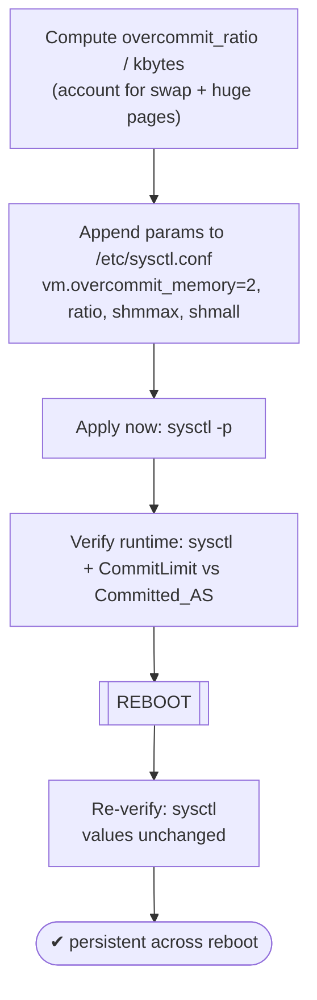
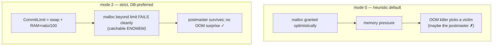

# Lab 11 — Kernel Params (`vm.overcommit_memory=2`, `kernel.shmmax`) in `/etc/sysctl.conf` + Reboot-Test Persistence

> **Track A · DBA · A2 Configuration & Tuning · Lab 3 of 7 (Lab 11/222)**
> Teaching package: concept → diagram → steps → verify → quick-ref → self-test → video script.
> **Depends on:** Labs 01–10 (running cluster; you used `sysctl` for huge pages in Lab 10).

---

## 0. Lab Card (at a glance)

| Field | Value |
|---|---|
| **Objective** | Set `vm.overcommit_memory=2` (+ a sized `overcommit_ratio`) and `kernel.shmmax`/`shmall` in `/etc/sysctl.conf`, apply them, and **prove they persist across a reboot**. |
| **Success criterion** | `sysctl` shows the values before **and after** a reboot; `CommitLimit` in `/proc/meminfo` comfortably exceeds observed `Committed_AS`. |
| **Scope boundary** | These memory-related kernel params + persistence. Full VM/scheduler tuning is a broader topic; huge-page reservation was Lab 10. |
| **Prereqs** | Labs 01–10; `sudo`; ability to reboot |
| **Time** | 20–30 min (includes a reboot) |
| **Difficulty** | ★★★☆☆ |
| **Risk** | **Medium** — a badly sized `overcommit_ratio` under mode 2 makes allocations fail early. Reversible via sysctl. |

---

## 1. Learning Objectives

1. **What memory overcommit is** — modes 0/1/2, and why a database prefers **2** (fail a `malloc` cleanly instead of an OOM-killer surprise on the postmaster).
2. **Size mode 2 correctly** — `CommitLimit = swap + RAM × overcommit_ratio/100`, and how to verify it against real usage.
3. **Why `kernel.shmmax` barely matters for modern PostgreSQL** — mmap replaced System V shared memory in 9.3; set it anyway, understand why it's mostly ceremony.
4. **Persist and prove** — apply with `sysctl`, then **reboot** and confirm the values survived.

---

## 2. Concept Primer — the "why"

**Memory overcommit (`vm.overcommit_memory`).** Linux lets processes reserve more virtual memory than physically exists, betting they won't all use it. The mode controls that bet:

- **0 (default)** — *heuristic*: the kernel guesses and allows some overcommit. Under real pressure the **OOM killer** picks a victim — possibly your postmaster, taking the whole database down.
- **1** — *always* overcommit; never refuse. Worst choice for a database.
- **2** — *strict*: total committed memory can't exceed a hard `CommitLimit`. Allocations beyond it **fail at `malloc` time** (a clean, catchable error) instead of being granted and later OOM-killed.

For a dedicated DB server, **mode 2** is the PostgreSQL-recommended choice: a failed allocation is a controlled error; an OOM kill of the postmaster is a catastrophe (whole-cluster crash recovery).

**But mode 2 has a sizing catch.** In mode 2:
```
CommitLimit = swap + (RAM × vm.overcommit_ratio / 100)
```
With the default `overcommit_ratio=50` and little swap, `CommitLimit` can land near **half** your RAM — so allocations start failing while RAM looks free. You must **raise `overcommit_ratio`** (or set the absolute `vm.overcommit_kbytes`) so `CommitLimit` exceeds real peak usage. **With huge pages reserved (Lab 10), that locked memory skews the ratio math**, so `vm.overcommit_kbytes` (an absolute limit) is often cleaner than a percentage. Always verify `CommitLimit` vs `Committed_AS` in `/proc/meminfo`.

**`kernel.shmmax` / `kernel.shmall` — mostly a relic.** These cap a single System V shared-memory segment (`shmmax`, bytes) and total shared pages (`shmall`, pages). This *used* to be critical: pre-9.3 PostgreSQL allocated `shared_buffers` as one big System V segment, so `shmmax` had to be ≥ it. **Since PostgreSQL 9.3, the server uses anonymous `mmap` (POSIX) for the bulk of shared memory and only a *few-KB* System V segment.** So on modern PostgreSQL, `shmmax` almost never needs changing — and the RHEL 9 default is already astronomically large. We set it for completeness and to practice persistence; just know it's not the lever it once was.

**`/etc/sysctl.conf` vs `/etc/sysctl.d/`.** This lab uses `/etc/sysctl.conf` as asked. On RHEL 9 the **preferred** modern practice is drop-in files in `/etc/sysctl.d/*.conf` (as we did for huge pages). Load order matters: `sysctl --system` reads all directories and **later files override earlier** ones — so a value in `sysctl.conf` can be overridden by a higher-numbered drop-in. Keep your PostgreSQL kernel params in one place to avoid surprises.

---

## 3. Diagrams

### 3.1 Set → apply → persist flow



### 3.2 Overcommit modes



---

## 4. Prerequisites

```bash
# baselines
sysctl vm.overcommit_memory vm.overcommit_ratio kernel.shmmax kernel.shmall
grep -E "CommitLimit|Committed_AS|SwapTotal|MemTotal" /proc/meminfo
```

---

## 5. Step-by-Step

### Step 1 — Compute sane values

```bash
RAM_BYTES=$(( $(awk '/MemTotal/{print $2}' /proc/meminfo) * 1024 ))
PAGESZ=$(getconf PAGE_SIZE)                       # 4096
# shmmax: set generous (= RAM bytes). Modern PG needs only a tiny SysV segment — this is mostly documentation.
SHMMAX=$RAM_BYTES
SHMALL=$(( SHMMAX / PAGESZ ))
# overcommit: mode 2. Pick a ratio that keeps CommitLimit above real usage (80 is a common start).
# If huge pages are reserved, prefer an absolute overcommit_kbytes instead of a ratio.
RATIO=80
echo "SHMMAX=$SHMMAX SHMALL=$SHMALL RATIO=$RATIO"
```

### Step 2 — Write the params to `/etc/sysctl.conf`

```bash
sudo tee -a /etc/sysctl.conf >/dev/null <<EOF

# --- PostgreSQL kernel tuning (Lab 11) ---
vm.overcommit_memory = 2
vm.overcommit_ratio  = $RATIO
kernel.shmmax = $SHMMAX
kernel.shmall = $SHMALL
EOF
```
> Modern-preferred alternative: put the same lines in `/etc/sysctl.d/98-postgresql.conf`. If huge pages are reserved, consider `vm.overcommit_kbytes = <bytes>` instead of `vm.overcommit_ratio`.

### Step 3 — Apply immediately and verify runtime

```bash
sudo sysctl -p                                    # loads /etc/sysctl.conf
sysctl vm.overcommit_memory vm.overcommit_ratio kernel.shmmax kernel.shmall

# check the resulting limit vs actual usage:
grep -E "CommitLimit|Committed_AS" /proc/meminfo
#   CommitLimit must be comfortably ABOVE Committed_AS
```
*If `CommitLimit` is too close to `Committed_AS`, raise `overcommit_ratio` (or set `overcommit_kbytes`) and re-apply.*

### Step 4 — Reboot

```bash
sudo reboot
```

### Step 5 — After reboot: prove persistence (the point of the lab)

```bash
sysctl vm.overcommit_memory vm.overcommit_ratio kernel.shmmax kernel.shmall
#   → same values as before the reboot
grep -E "CommitLimit|Committed_AS" /proc/meminfo
systemctl is-active postgresql-17                 # DB came back up fine
```

---

## 6. Verification Checklist

- [ ] `/etc/sysctl.conf` contains the four params
- [ ] `sysctl -p` applied with no errors
- [ ] `vm.overcommit_memory` = **2**, `overcommit_ratio` set as intended
- [ ] `kernel.shmmax`/`shmall` set (and consistent: `shmall ≈ shmmax / PAGE_SIZE`)
- [ ] `CommitLimit` **>** `Committed_AS` with headroom
- [ ] **After reboot**, all values persist unchanged
- [ ] PostgreSQL starts and runs normally post-reboot

---

## 7. Troubleshooting

| Symptom | Cause | Fix |
|---|---|---|
| Apps/forks fail with "out of memory" though RAM looks free | Mode 2 `CommitLimit` too low (ratio too small / no swap) | Raise `overcommit_ratio` or set `vm.overcommit_kbytes`; re-check `CommitLimit` vs `Committed_AS` |
| Values reset after reboot | Wrong file, typo, or a higher-numbered `sysctl.d` drop-in overrides | `sysctl --system` shows load order; consolidate; fix syntax |
| `sysctl -p` errors on a key | Typo / unknown param name | Correct the key; re-run |
| `shmall` seems wrong | Set in bytes instead of pages | `shmall = shmmax / PAGE_SIZE` (page units) |
| Huge pages + mode 2 misbehave | Ratio math skewed by locked huge-page memory | Use absolute `vm.overcommit_kbytes` instead of ratio |
| "Why bother with shmmax?" | Modern PG uses mmap; default already huge | Correct — set for completeness; it's not the old lever |

---

## 8. Quick Reference Card (paste-ready)

```bash
RAM_BYTES=$(( $(awk '/MemTotal/{print $2}' /proc/meminfo) * 1024 ))
PAGESZ=$(getconf PAGE_SIZE); SHMMAX=$RAM_BYTES; SHMALL=$(( SHMMAX / PAGESZ )); RATIO=80

sudo tee -a /etc/sysctl.conf >/dev/null <<EOF

# --- PostgreSQL kernel tuning (Lab 11) ---
vm.overcommit_memory = 2
vm.overcommit_ratio  = $RATIO
kernel.shmmax = $SHMMAX
kernel.shmall = $SHMALL
EOF

sudo sysctl -p
sysctl vm.overcommit_memory vm.overcommit_ratio kernel.shmmax kernel.shmall
grep -E "CommitLimit|Committed_AS" /proc/meminfo     # CommitLimit must exceed Committed_AS

sudo reboot
# after reboot — persistence proof:
sysctl vm.overcommit_memory vm.overcommit_ratio kernel.shmmax kernel.shmall

# CommitLimit(mode 2) = SwapTotal + RAM × overcommit_ratio/100
# With huge pages reserved, prefer:  vm.overcommit_kbytes = <bytes>  (instead of ratio)
```

---

## 9. Self-Check

1. What does `vm.overcommit_memory=2` do differently from the default 0, and why do databases prefer it?
2. What sets `CommitLimit` in mode 2, and what happens if `overcommit_ratio` is too low?
3. Why is `kernel.shmmax` mostly irrelevant for PostgreSQL 9.3+?
4. Which command applies `/etc/sysctl.conf` now, and how do you prove the settings persist?
5. Where does RHEL 9 prefer custom sysctls, and what's the load-order gotcha?
6. Which two `/proc/meminfo` fields tell you whether mode 2 is sized correctly?

<details>
<summary>Answers</summary>

1. Mode 2 enforces a strict `CommitLimit` so over-limit allocations **fail cleanly**; mode 0 optimistically grants and lets the OOM killer choose a victim later (possibly the postmaster). Clean failure beats an OOM surprise.
2. `CommitLimit = swap + RAM × overcommit_ratio/100`. Too low → allocations fail prematurely even with free RAM.
3. Since 9.3 PostgreSQL uses anonymous `mmap`/POSIX shared memory plus only a tiny System V segment, so the large default `shmmax` already suffices.
4. `sudo sysctl -p`. Prove persistence by **rebooting** and re-running `sysctl <keys>`.
5. `/etc/sysctl.d/*.conf`; later (higher-numbered) files override earlier ones, and `sysctl --system` loads them all.
6. `CommitLimit` and `Committed_AS` — the former must exceed the latter with headroom.
</details>

---

## 10. Video / Teaching Script

| # | On screen | Say (narration) |
|---|---|---|
| 1 | Title: "Two kernel knobs for a stable PostgreSQL" | "Below PostgreSQL sits the kernel's memory policy. Two settings decide whether a memory squeeze is a clean error or a crash." |
| 2 | `sysctl vm.overcommit_memory` (=0) | "By default Linux over-promises memory and lets the OOM killer sort it out — and it might pick your database." |
| 3 | explain mode 2 + CommitLimit | "Mode 2 draws a hard line: allocations past the limit fail cleanly, catchably — no OOM surprise on the postmaster." |
| 4 | append to sysctl.conf, `sysctl -p` | "We write the params and apply them. Note the ratio — it decides that hard line." |
| 5 | `CommitLimit` vs `Committed_AS` | "And here's the check people skip: the limit must sit comfortably *above* what's actually committed, or you'll fail allocations for no reason." |
| 6 | shmmax honesty | "shmmax? We set it, but be honest — modern PostgreSQL uses mmap, so it's mostly ceremony now." |
| 7 | `reboot` then re-check | "The real test of any sysctl is a reboot. Back up — and the values held. That's persistence." |
| 8 | Outro | "Kernel memory policy set and proven. Next: the ALTER SYSTEM versus postgresql.conf question." |

---

## 11. Glossary

- **`vm.overcommit_memory`** — 0 heuristic / 1 always / 2 strict overcommit policy.
- **`vm.overcommit_ratio` / `_kbytes`** — percentage / absolute cap feeding `CommitLimit` in mode 2.
- **`CommitLimit` / `Committed_AS`** — the ceiling / current committed memory, in `/proc/meminfo`.
- **`kernel.shmmax` / `shmall`** — max System V shm segment (bytes) / total shm (pages); largely legacy for PG.
- **mmap vs System V shm** — PostgreSQL 9.3+ uses anonymous mmap for shared memory.
- **`sysctl -p` / `--system`** — apply `sysctl.conf` / apply all sysctl sources.

---
*NETAPORT lab series · PostgreSQL 17 on AlmaLinux 9 · Lab 11/222 · A2 Configuration & Tuning*
