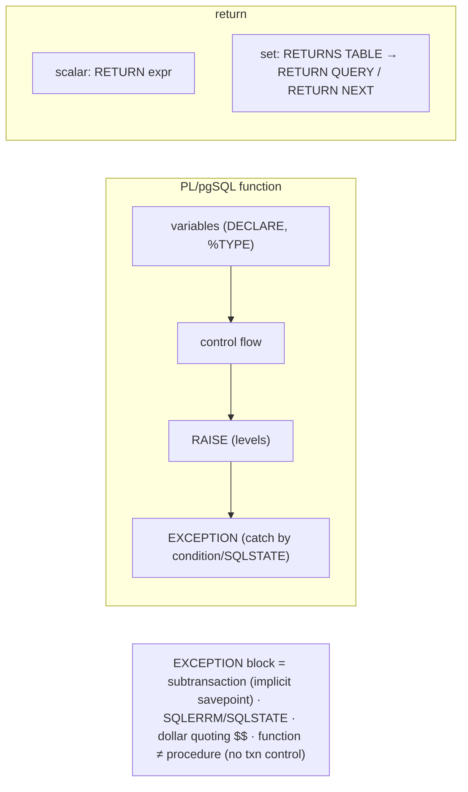

# Lab 110 — PL/pgSQL Functions: Control Flow, `RAISE`, Exception Blocks, `RETURNS TABLE`

> **Track B · Developer · B5 Server-Side Programming · Lab 1 of 8 (Lab 110/222)**
> Teaching package: concept → diagram → steps → verify → quick-ref → self-test → video script.
> **Depends on:** B1–B4. Opens server-side programming. **Feeds:** Labs 111–117 (triggers, procedures, cursors).

---

## 0. Lab Card (at a glance)

| Field | Value |
|---|---|
| **Objective** | Write PL/pgSQL functions using control flow, `RAISE` for messages/errors, exception blocks for recovery, and `RETURNS TABLE` for set-returning functions. |
| **Success criterion** | A function branches/loops correctly, raises notices and custom errors, catches an exception and recovers, and a `RETURNS TABLE` function returns rows via `RETURN QUERY`. |
| **Scope boundary** | PL/pgSQL functions. Triggers are Lab 111; procedures/txn control Lab 112; cursors Lab 113. |
| **Prereqs** | B1–B4; a database |
| **Time** | 30–40 min |
| **Difficulty** | ★★★☆☆ |
| **Risk** | Low — scratch objects. |

---

## 1. Learning Objectives

1. **Function structure** — DECLARE/BEGIN/END, dollar quoting.
2. **Control flow** — IF/CASE, loops, FOR-over-query.
3. **`RAISE`** — levels, custom errors.
4. **Exception blocks** — catch and recover.
5. **`RETURNS TABLE`** — set-returning functions.

---

## 2. Concept Primer — the "why"

**PL/pgSQL adds procedural logic to SQL** — variables, branching, loops, and error handling — so you can encapsulate business logic in the database.

**Structure:**
```sql
CREATE OR REPLACE FUNCTION fname(arg1 int, arg2 text) RETURNS numeric
LANGUAGE plpgsql AS $$
DECLARE
  total numeric := 0;          -- variables (with optional default); %TYPE / %ROWTYPE infer types
BEGIN
  -- body
  RETURN total;
END;
$$;
```
The `$$` (or `$tag$`) **dollar quoting** avoids escaping quotes inside the body.

**Control flow:**
- **`IF … THEN … ELSIF … ELSE … END IF;`** and **`CASE … WHEN … THEN … END CASE;`**.
- Loops: plain **`LOOP … END LOOP`** (with `EXIT [WHEN]`/`CONTINUE [WHEN]`), **`WHILE cond LOOP`**, **`FOR i IN 1..10 LOOP`**, and **`FOR rec IN SELECT … LOOP`** to iterate query results, plus `FOREACH x IN ARRAY`.

**Variables & assignment:** `var := expr;` or `SELECT … INTO var;` (use `INTO STRICT` to require exactly one row — it raises `no_data_found`/`too_many_rows` otherwise).

**`RAISE` — messages and errors:**
```sql
RAISE NOTICE 'value is %', x;                    -- informational (also DEBUG/LOG/INFO/WARNING)
RAISE EXCEPTION 'bad amount: %', amt              -- aborts (rolls back the subtransaction)
  USING ERRCODE = 'check_violation', HINT = 'must be positive';
```
Levels run from `DEBUG`/`LOG`/`INFO`/`NOTICE`/`WARNING` (informational) up to **`EXCEPTION`** (the default — it **raises an error** and aborts). Use `%` placeholders; attach `ERRCODE`/`HINT`/`DETAIL` with `USING`.

**Exception blocks — catch and recover:**
```sql
BEGIN
  ... risky SQL ...
EXCEPTION
  WHEN unique_violation THEN ...        -- named condition
  WHEN division_by_zero THEN ...
  WHEN OTHERS THEN                        -- catch-all
     RAISE NOTICE 'caught: % (%s)', SQLERRM, SQLSTATE;
END;
```
Each `BEGIN…EXCEPTION…END` block is a **subtransaction** (an implicit savepoint, Lab 108/109): if an error fires, changes **inside the block roll back**, then the handler runs — so the function can **recover** instead of aborting. Catch by **condition name** (`unique_violation`, `foreign_key_violation`, `no_data_found`, …) or `SQLSTATE`; read `SQLERRM` (message) and `SQLSTATE` (code), or `GET STACKED DIAGNOSTICS` for detail. *(Exception blocks cost a subtransaction each — avoid them in tight loops, per Lab 108's >64 caveat.)*

**Returning result sets — `RETURNS TABLE`:**
```sql
CREATE FUNCTION customer_orders(cust int) RETURNS TABLE(order_id bigint, amount numeric)
LANGUAGE plpgsql AS $$
BEGIN
  RETURN QUERY SELECT o.id, o.amount FROM orders o WHERE o.customer_id = cust;
END; $$;
-- call it like a table:  SELECT * FROM customer_orders(1);
```
- **`RETURN QUERY <select>`** appends a query's rows to the result set; **`RETURN NEXT var`** appends one row at a time (row-by-row construction). `RETURNS SETOF type` is the equivalent for a named row/scalar type. A scalar function uses `RETURN expr` instead.

**Functions vs procedures (preview):** a **function** returns a value and is called in a query; it **can't** do transaction control. A **procedure** (Lab 112) is `CALL`ed and **can** `COMMIT`/`ROLLBACK`.

---

## 3. Diagrams

### 3.1 Build-a-function flow

```mermaid
flowchart TD
    A["CREATE FUNCTION ... RETURNS ... LANGUAGE plpgsql AS $$ DECLARE ... BEGIN ... END $$"] --> B["control flow: IF/CASE · LOOP/WHILE/FOR · FOR rec IN SELECT"]
    B --> C["RAISE NOTICE (info) / RAISE EXCEPTION (error, USING ERRCODE/HINT)"]
    C --> D["BEGIN ... EXCEPTION WHEN cond THEN ... (subtransaction: rollback + recover)"]
    D --> E["RETURNS TABLE(...) → RETURN QUERY <select> / RETURN NEXT row"]
    E --> F["call: SELECT f(...)  /  SELECT * FROM f(...)"]
    F --> G([✔ server-side logic])
```



### 3.2 Concept



---

## 4. Prerequisites

```bash
sudo -u postgres psql -d shopdb <<'SQL'
DROP TABLE IF EXISTS orders_f, users_f;
CREATE TABLE users_f (id int PRIMARY KEY, email text UNIQUE, name text);
CREATE TABLE orders_f (id bigint GENERATED ALWAYS AS IDENTITY, customer_id int, amount numeric);
INSERT INTO users_f VALUES (1,'a@co','Asha'),(2,'r@co','Ravi');
INSERT INTO orders_f (customer_id, amount) VALUES (1,100),(1,250),(2,90);
SQL
```

---

## 5. Step-by-Step

### Step 1 — Scalar function with control flow

```bash
sudo -u postgres psql -d shopdb <<'SQL'
CREATE OR REPLACE FUNCTION tier(amount numeric) RETURNS text
LANGUAGE plpgsql AS $$
BEGIN
  IF amount >= 200 THEN RETURN 'gold';
  ELSIF amount >= 100 THEN RETURN 'silver';
  ELSE RETURN 'bronze';
  END IF;
END; $$;
SQL
sudo -u postgres psql -d shopdb -c "SELECT amount, tier(amount) FROM orders_f;"
```

### Step 2 — Loops (FOR over a range, and over query rows)

```bash
sudo -u postgres psql -d shopdb <<'SQL'
CREATE OR REPLACE FUNCTION sum_orders(cust int) RETURNS numeric
LANGUAGE plpgsql AS $$
DECLARE
  rec   orders_f%ROWTYPE;      -- row type
  total numeric := 0;
BEGIN
  FOR rec IN SELECT * FROM orders_f WHERE customer_id = cust LOOP
    total := total + rec.amount;
  END LOOP;
  RETURN total;
END; $$;
SQL
sudo -u postgres psql -d shopdb -c "SELECT sum_orders(1);"   # 350
```

### Step 3 — RAISE: notices and a custom error

```bash
sudo -u postgres psql -d shopdb <<'SQL'
CREATE OR REPLACE FUNCTION charge(amount numeric) RETURNS numeric
LANGUAGE plpgsql AS $$
BEGIN
  RAISE NOTICE 'charging %', amount;
  IF amount <= 0 THEN
    RAISE EXCEPTION 'amount must be positive, got %', amount
      USING ERRCODE = 'check_violation', HINT = 'pass a positive amount';
  END IF;
  RETURN amount * 1.18;   -- add tax
END; $$;
SQL
sudo -u postgres psql -d shopdb -c "SELECT charge(100);"    # NOTICE + result
sudo -u postgres psql -d shopdb -c "SELECT charge(-5);" 2>&1 | tail -2   # custom EXCEPTION
```

### Step 4 — Exception block: catch and recover

```bash
sudo -u postgres psql -d shopdb <<'SQL'
CREATE OR REPLACE FUNCTION add_user(p_id int, p_email text, p_name text) RETURNS text
LANGUAGE plpgsql AS $$
BEGIN
  INSERT INTO users_f VALUES (p_id, p_email, p_name);
  RETURN 'inserted';
EXCEPTION
  WHEN unique_violation THEN
    RETURN 'skipped: duplicate ('|| SQLERRM ||')';      -- caught → recover, no abort
  WHEN OTHERS THEN
    RETURN 'error: '|| SQLERRM ||' ['|| SQLSTATE ||']';
END; $$;
SQL
sudo -u postgres psql -d shopdb -c "SELECT add_user(3,'m@co','Meera');"   # inserted
sudo -u postgres psql -d shopdb -c "SELECT add_user(1,'a@co','Dup');"     # skipped: duplicate (caught)
```

### Step 5 — RETURNS TABLE with RETURN QUERY

```bash
sudo -u postgres psql -d shopdb <<'SQL'
CREATE OR REPLACE FUNCTION customer_orders(cust int)
RETURNS TABLE(order_id bigint, amount numeric)
LANGUAGE plpgsql AS $$
BEGIN
  RETURN QUERY SELECT o.id, o.amount FROM orders_f o WHERE o.customer_id = cust ORDER BY o.amount DESC;
END; $$;
SQL
sudo -u postgres psql -d shopdb -c "SELECT * FROM customer_orders(1);"    # a result SET
```

### Step 6 — RETURN NEXT (row-by-row) + SELECT INTO STRICT

```bash
sudo -u postgres psql -d shopdb <<'SQL'
CREATE OR REPLACE FUNCTION countdown(n int) RETURNS SETOF int
LANGUAGE plpgsql AS $$
BEGIN
  FOR i IN REVERSE n..1 LOOP
    RETURN NEXT i;              -- append one row at a time
  END LOOP;
END; $$;

CREATE OR REPLACE FUNCTION user_name(p_id int) RETURNS text
LANGUAGE plpgsql AS $$
DECLARE nm text;
BEGIN
  SELECT name INTO STRICT nm FROM users_f WHERE id = p_id;   -- STRICT: exactly one row or error
  RETURN nm;
END; $$;
SQL
sudo -u postgres psql -d shopdb -c "SELECT * FROM countdown(5);"
sudo -u postgres psql -d shopdb -c "SELECT user_name(1);"
sudo -u postgres psql -d shopdb -c "SELECT user_name(999);" 2>&1 | tail -1   # no_data_found (STRICT)
```

---

## 6. Verification Checklist

- [ ] Scalar function with IF/ELSIF/ELSE works
- [ ] FOR-over-query loop sums correctly (`%ROWTYPE` used)
- [ ] `RAISE NOTICE` prints; `RAISE EXCEPTION` throws a custom error
- [ ] Exception block catches `unique_violation` and recovers
- [ ] `RETURNS TABLE` + `RETURN QUERY` returns a result set
- [ ] `RETURN NEXT` builds rows; `SELECT INTO STRICT` enforces one row
- [ ] Know function vs procedure (no txn control here)

---

## 7. Troubleshooting

| Symptom | Cause | Fix |
|---|---|---|
| Error not caught | No matching `WHEN` | Add `WHEN OTHERS` or the right condition |
| Slow function with EXCEPTION in a loop | Each block = subtransaction | Avoid `EXCEPTION` in tight loops (Lab 108) |
| "query has no destination for result data" | Set function using plain `SELECT` | Use `RETURN QUERY` / `PERFORM` |
| `SELECT INTO` picks wrong count | Not STRICT | `INTO STRICT` (or handle `too_many_rows`) |
| Variable/column name clash | Ambiguity | Qualify (`table.col`), rename, or `#variable_conflict` |
| Quote-escaping mess | Body has quotes | Use `$$`/`$tag$` dollar quoting |
| `RAISE EXCEPTION` aborts unexpectedly | It's the default level | Use `RAISE NOTICE` for info |

---

## 8. Quick Reference Card (paste-ready)

```sql
CREATE OR REPLACE FUNCTION f(arg int) RETURNS <type>|SETOF <type>|TABLE(col type, ...)
LANGUAGE plpgsql AS $$
DECLARE v <type> := ...;        -- %TYPE / %ROWTYPE to infer
BEGIN
  IF cond THEN ... ELSIF ... ELSE ... END IF;         -- CASE ... END CASE
  FOR rec IN SELECT ... LOOP ... END LOOP;             -- FOR i IN 1..n / WHILE / LOOP + EXIT/CONTINUE
  RAISE NOTICE 'x=%', v;                                -- info; RAISE EXCEPTION '...' USING ERRCODE=..,HINT=..
  RETURN v;                                             -- scalar
  -- set: RETURN QUERY SELECT ...;  or  RETURN NEXT v;
EXCEPTION
  WHEN unique_violation THEN ...                        -- catch by condition or SQLSTATE
  WHEN OTHERS THEN RAISE NOTICE '% (%)', SQLERRM, SQLSTATE;
END; $$;
-- call: SELECT f(1);  |  SELECT * FROM f(1);   · SELECT ... INTO STRICT v ...  · $$ dollar-quoting
-- EXCEPTION block = subtransaction · function ≠ procedure (no COMMIT/ROLLBACK — Lab 112)
```

---

## 9. Self-Check

1. What's the basic structure of a PL/pgSQL function?
2. Which control-flow constructs are available?
3. What are the `RAISE` levels, and which aborts?
4. How does an exception block let a function recover?
5. How do you return a result set with `RETURNS TABLE`?
6. What's the difference between a function and a procedure?

<details>
<summary>Answers</summary>

1. `CREATE FUNCTION … RETURNS … LANGUAGE plpgsql AS $$ DECLARE … BEGIN … END $$;`.
2. `IF/ELSIF/ELSE`, `CASE`, `LOOP`/`WHILE`/`FOR` (incl. `FOR rec IN SELECT`), with `EXIT`/`CONTINUE`.
3. `DEBUG/LOG/INFO/NOTICE/WARNING` (informational) and `EXCEPTION` (raises an error — the default, which aborts).
4. `BEGIN…EXCEPTION WHEN condition THEN…` runs as a subtransaction; on error the block's changes roll back and the handler runs, so the function continues instead of aborting.
5. Declare `RETURNS TABLE(col type, …)` and use `RETURN QUERY <select>` (or `RETURN NEXT` row-by-row); call it as `SELECT * FROM f(...)`.
6. A function returns a value and can't do transaction control; a procedure is `CALL`ed and can `COMMIT`/`ROLLBACK`.
</details>

---

## 10. Video / Teaching Script

| # | On screen | Say (narration) |
|---|---|---|
| 1 | Title: "Logic that lives in the database" | "PL/pgSQL turns SQL into a real programming language — variables, branches, loops, error handling. Business logic, right where the data is." |
| 2 | control flow | "If/else, loops, and — the useful one — a for-loop straight over a query's rows. Sum them, transform them, whatever you need." |
| 3 | RAISE | "RAISE talks back: a NOTICE to inform, or an EXCEPTION to stop everything with your own error message and hint." |
| 4 | exception | "And here's the recovery: wrap risky code in an exception block. A duplicate key? Catch it, handle it, keep going — no crash." |
| 5 | RETURNS TABLE | "Best of all, a function can return a *table*. RETURN QUERY, and you select from your function like it's a view." |
| 6 | strict | "One safety tip: SELECT INTO STRICT insists on exactly one row — no silent surprises." |
| 7 | Outro | "Server-side logic, unlocked. Next: triggers that fire it automatically." |

---

## 11. Glossary

- **PL/pgSQL** — PostgreSQL's procedural language.
- **DECLARE/BEGIN/END** — variable section / body.
- **`RAISE`** — emit a message or error (levels up to EXCEPTION).
- **Exception block** — `WHEN condition THEN` handler (a subtransaction).
- **`SQLERRM` / `SQLSTATE`** — error message / code.
- **`RETURNS TABLE` / `RETURN QUERY` / `RETURN NEXT`** — set-returning function.
- **Dollar quoting** — `$$`/`$tag$` to avoid escaping.

---
*NETAPORT lab series · PostgreSQL 17 on AlmaLinux 9 · Lab 110/222 · B5 Server-Side Programming*
