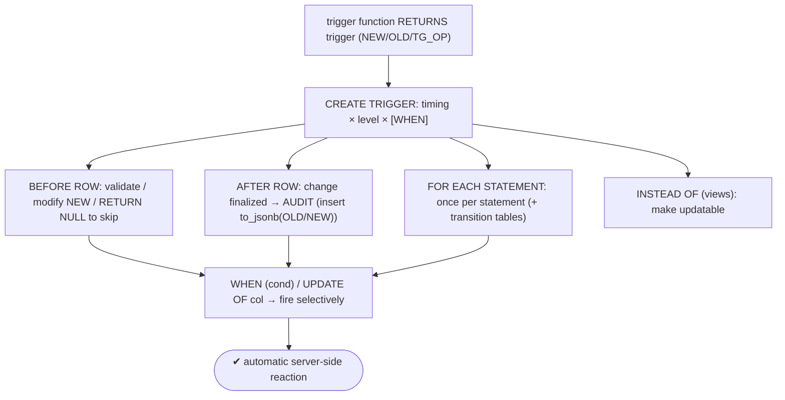
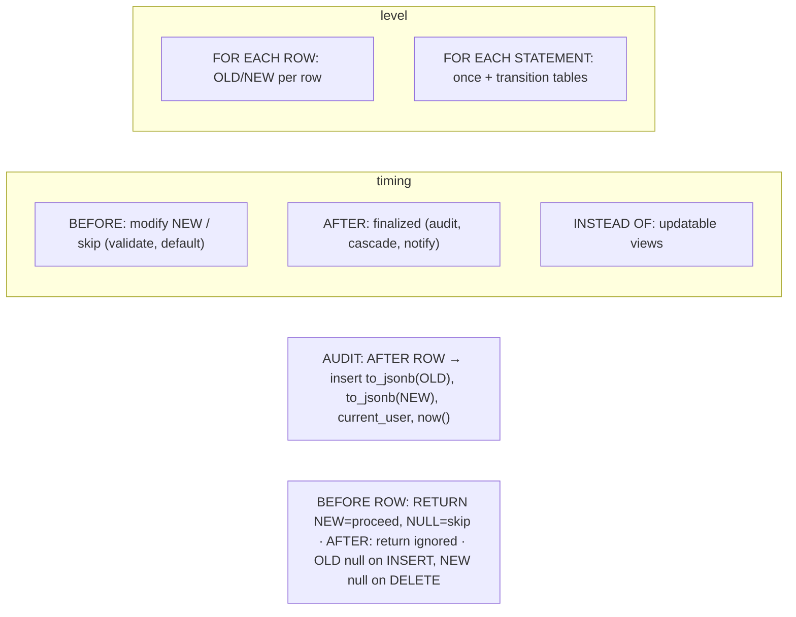

# Lab 111 — Triggers: `BEFORE`/`AFTER`, Row vs Statement, an Audit-Trail Trigger

> **Track B · Developer · B5 Server-Side Programming · Lab 2 of 8 (Lab 111/222)**
> Teaching package: concept → diagram → steps → verify → quick-ref → self-test → video script.
> **Depends on:** Lab 110 (PL/pgSQL), Lab 116 (jsonb, used for audit). **Related:** Lab 48 (pgAudit).

---

## 0. Lab Card (at a glance)

| Field | Value |
|---|---|
| **Objective** | Build `BEFORE` triggers (validate/auto-set), an `AFTER` audit-trail trigger capturing every change as JSONB, and compare row vs statement level and conditional `WHEN`. |
| **Success criterion** | A BEFORE trigger modifies/validates rows; an AFTER row trigger logs INSERT/UPDATE/DELETE with old/new JSONB + user + time; row and statement triggers differ in fire count. |
| **Scope boundary** | Triggers on tables. Procedures/txn control are Lab 112; pgAudit was Lab 48. |
| **Prereqs** | Lab 110; a table |
| **Time** | 30–45 min |
| **Difficulty** | ★★★★☆ |
| **Risk** | Low — scratch objects. |

---

## 1. Learning Objectives

1. **Trigger anatomy** — function + `CREATE TRIGGER`.
2. **Timing** — BEFORE / AFTER / INSTEAD OF.
3. **Level** — ROW vs STATEMENT (+ transition tables).
4. **Special variables** — NEW/OLD/TG_OP/…
5. **The audit-trail pattern** — AFTER row → JSONB log.

---

## 2. Concept Primer — the "why"

**A trigger runs a function automatically on a table event.** It's a **trigger function** (PL/pgSQL `RETURNS trigger`) plus a `CREATE TRIGGER` binding it to a table, an event (`INSERT`/`UPDATE`/`DELETE`/`TRUNCATE`), a **timing**, and a **level**.

**Timing — BEFORE / AFTER / INSTEAD OF:**
- **`BEFORE`** — fires *before* the operation. It can **modify the row** (`NEW`) or **skip the operation** entirely (`RETURN NULL`). Use for **validation, defaulting, normalizing** (e.g. set `updated_at := now()`, reject bad data).
- **`AFTER`** — fires *after* the change is applied. `NEW` is already committed to the row, so you can't change it here. Use for **auditing, cascading to other tables, notifications**.
- **`INSTEAD OF`** — only on **views**; it *replaces* the operation, making a view **updatable**.

**Level — ROW / STATEMENT:**
- **`FOR EACH ROW`** — fires **once per affected row**, with access to **`OLD`** (pre-change) and **`NEW`** (post-change). For per-row logic and per-row audit.
- **`FOR EACH STATEMENT`** (default) — fires **once per statement**, no per-row `OLD`/`NEW`. Use for statement-level actions (log that a bulk op ran, refresh a cache); access all affected rows via **transition tables** (`REFERENCING OLD/NEW TABLE AS …`, PG10+).

**Trigger-function special variables:** `NEW` / `OLD` (the rows), **`TG_OP`** (`'INSERT'`/`'UPDATE'`/`'DELETE'`/`'TRUNCATE'`), `TG_TABLE_NAME`, `TG_WHEN` (BEFORE/AFTER), `TG_LEVEL` (ROW/STATEMENT), `TG_ARGV` (args).

**Return-value semantics (get this right):**
- **BEFORE ROW:** `RETURN NEW` to proceed (with any modifications); **`RETURN NULL` to skip** the operation for that row.
- **AFTER ROW / STATEMENT:** the return value is **ignored** (convention: `RETURN NULL`).

**`CREATE TRIGGER`:**
```sql
CREATE TRIGGER name
  {BEFORE|AFTER} {INSERT|UPDATE|DELETE} [OR …] ON tbl
  FOR EACH {ROW|STATEMENT}
  [WHEN (condition)]                    -- only fire when true (on OLD/NEW)
  EXECUTE FUNCTION fn(args);
-- also: UPDATE OF col1, col2  → fire only when those columns change
```

**The audit-trail pattern (the centerpiece).** An `AFTER … FOR EACH ROW` trigger that records every change to an audit table, using **`to_jsonb(OLD)`/`to_jsonb(NEW)`** to snapshot the whole row flexibly:
```sql
INSERT INTO audit_log (table_name, op, old_data, new_data, changed_by, changed_at)
VALUES (TG_TABLE_NAME, TG_OP,
        CASE WHEN TG_OP <> 'INSERT' THEN to_jsonb(OLD) END,   -- OLD is null on INSERT
        CASE WHEN TG_OP <> 'DELETE' THEN to_jsonb(NEW) END,   -- NEW is null on DELETE
        current_user, now());
```
`AFTER` so the change is final; `FOR EACH ROW` to capture each change; `to_jsonb` to store any schema. This is a compact, tamper-evident change history — who, when, what, before/after.

---

## 3. Diagrams

### 3.1 Trigger flow



### 3.2 Dimensions + audit



---

## 4. Prerequisites

```bash
sudo -u postgres psql -d shopdb <<'SQL'
DROP TABLE IF EXISTS accounts_t, audit_log;
CREATE TABLE accounts_t (id int PRIMARY KEY, owner text, balance numeric, updated_at timestamptz);
CREATE TABLE audit_log (
  id bigint GENERATED ALWAYS AS IDENTITY PRIMARY KEY,
  table_name text, op text, old_data jsonb, new_data jsonb,
  changed_by text DEFAULT current_user, changed_at timestamptz DEFAULT now());
INSERT INTO accounts_t VALUES (1,'Asha',100,now()),(2,'Ravi',200,now());
SQL
```

---

## 5. Step-by-Step

### Step 1 — BEFORE ROW: auto-set updated_at + validate

```bash
sudo -u postgres psql -d shopdb <<'SQL'
CREATE OR REPLACE FUNCTION before_acct() RETURNS trigger LANGUAGE plpgsql AS $$
BEGIN
  IF NEW.balance < 0 THEN
    RAISE EXCEPTION 'balance cannot be negative (%).', NEW.balance;    -- validation
  END IF;
  NEW.updated_at := now();                                            -- modify NEW
  RETURN NEW;                                                          -- proceed
END; $$;
CREATE TRIGGER trg_before_acct BEFORE INSERT OR UPDATE ON accounts_t
  FOR EACH ROW EXECUTE FUNCTION before_acct();
SQL
sudo -u postgres psql -d shopdb -c "UPDATE accounts_t SET balance=150 WHERE id=1; SELECT id, balance, updated_at FROM accounts_t WHERE id=1;"
sudo -u postgres psql -d shopdb -c "UPDATE accounts_t SET balance=-5 WHERE id=1;" 2>&1 | tail -1   # rejected
```

### Step 2 — AFTER ROW: the audit-trail trigger

```bash
sudo -u postgres psql -d shopdb <<'SQL'
CREATE OR REPLACE FUNCTION audit_fn() RETURNS trigger LANGUAGE plpgsql AS $$
BEGIN
  INSERT INTO audit_log (table_name, op, old_data, new_data)
  VALUES (TG_TABLE_NAME, TG_OP,
          CASE WHEN TG_OP <> 'INSERT' THEN to_jsonb(OLD) END,
          CASE WHEN TG_OP <> 'DELETE' THEN to_jsonb(NEW) END);
  RETURN NULL;                                                         -- AFTER: return ignored
END; $$;
CREATE TRIGGER trg_audit AFTER INSERT OR UPDATE OR DELETE ON accounts_t
  FOR EACH ROW EXECUTE FUNCTION audit_fn();
SQL
```

### Step 3 — Exercise it: every change is logged

```bash
sudo -u postgres psql -d shopdb <<'SQL'
INSERT INTO accounts_t VALUES (3,'Meera',300,now());
UPDATE accounts_t SET balance = 500 WHERE id = 3;
DELETE FROM accounts_t WHERE id = 2;
SQL
sudo -u postgres psql -d shopdb -c "
SELECT op, changed_by, old_data->>'balance' AS old_bal, new_data->>'balance' AS new_bal
FROM audit_log ORDER BY id;"
#   INSERT (old null), UPDATE (old+new), DELETE (new null) — all captured with who/when
```

### Step 4 — Conditional trigger with WHEN (only on status change)

```bash
sudo -u postgres psql -d shopdb <<'SQL'
ALTER TABLE accounts_t ADD COLUMN status text DEFAULT 'active';
CREATE OR REPLACE FUNCTION on_status_change() RETURNS trigger LANGUAGE plpgsql AS $$
BEGIN RAISE NOTICE 'status % → % for id %', OLD.status, NEW.status, NEW.id; RETURN NULL; END; $$;
CREATE TRIGGER trg_status AFTER UPDATE ON accounts_t
  FOR EACH ROW WHEN (OLD.status IS DISTINCT FROM NEW.status)          -- only when status actually changes
  EXECUTE FUNCTION on_status_change();
SQL
sudo -u postgres psql -d shopdb -c "UPDATE accounts_t SET balance=600 WHERE id=3;"        # no notice (status unchanged)
sudo -u postgres psql -d shopdb -c "UPDATE accounts_t SET status='frozen' WHERE id=3;"    # NOTICE fires
```

### Step 5 — Row vs statement fire count

```bash
sudo -u postgres psql -d shopdb <<'SQL'
CREATE OR REPLACE FUNCTION stmt_fn() RETURNS trigger LANGUAGE plpgsql AS $$
BEGIN RAISE NOTICE 'STATEMENT trigger fired once (op=%)', TG_OP; RETURN NULL; END; $$;
CREATE TRIGGER trg_stmt AFTER UPDATE ON accounts_t FOR EACH STATEMENT EXECUTE FUNCTION stmt_fn();
SQL
sudo -u postgres psql -d shopdb -c "UPDATE accounts_t SET balance = balance + 1;"
#   → row-level audit fires PER ROW; statement trigger fires ONCE for the whole UPDATE
```

### Step 6 — (Statement + transition table: all affected rows as a set)

```bash
sudo -u postgres psql -d shopdb <<'SQL'
CREATE OR REPLACE FUNCTION bulk_summary() RETURNS trigger LANGUAGE plpgsql AS $$
DECLARE n int;
BEGIN
  SELECT count(*) INTO n FROM changed_rows;      -- transition table
  RAISE NOTICE 'bulk update touched % rows', n;
  RETURN NULL;
END; $$;
CREATE TRIGGER trg_bulk AFTER UPDATE ON accounts_t
  REFERENCING NEW TABLE AS changed_rows
  FOR EACH STATEMENT EXECUTE FUNCTION bulk_summary();
SQL
sudo -u postgres psql -d shopdb -c "UPDATE accounts_t SET balance = balance + 1;"   # NOTICE: bulk update touched N rows
```

---

## 6. Verification Checklist

- [ ] BEFORE trigger set `updated_at` and rejected a negative balance
- [ ] AFTER audit trigger logged INSERT/UPDATE/DELETE as JSONB with user/time
- [ ] `OLD` null on INSERT, `NEW` null on DELETE handled
- [ ] `WHEN` trigger fired only on the intended change
- [ ] Row trigger fired per row; statement trigger fired once
- [ ] Transition table gave the affected-row set
- [ ] Understood return semantics (NEW to proceed, NULL to skip)

---

## 7. Troubleshooting

| Symptom | Cause | Fix |
|---|---|---|
| BEFORE change not applied | Didn't `RETURN NEW` | Return the (modified) `NEW` |
| Row silently skipped | BEFORE returned NULL | Return `NEW` to proceed |
| Can't modify row in AFTER | Change already applied | Use a BEFORE trigger |
| STATEMENT trigger has no OLD/NEW | Not per-row | Use transition tables or row-level |
| Trigger fires too often | Every event | Add `WHEN` / `UPDATE OF cols` |
| Trigger recursion/loop | Trigger updates same table | Guard with `WHEN`, `pg_trigger_depth()`, or a flag |
| Slow on bulk ops | Per-row trigger | Statement-level + transition tables |

---

## 8. Quick Reference Card (paste-ready)

```sql
-- trigger function
CREATE FUNCTION fn() RETURNS trigger LANGUAGE plpgsql AS $$
BEGIN
  -- NEW/OLD, TG_OP, TG_TABLE_NAME, TG_WHEN, TG_LEVEL
  RETURN NEW;   -- BEFORE ROW: NEW=proceed, NULL=skip · AFTER/STMT: ignored
END; $$;

CREATE TRIGGER t {BEFORE|AFTER} {INSERT|UPDATE|DELETE [OR ...]} ON tbl
  FOR EACH {ROW|STATEMENT} [WHEN (OLD.x IS DISTINCT FROM NEW.x)] EXECUTE FUNCTION fn();
--   BEFORE: validate/modify/skip · AFTER: audit/cascade · INSTEAD OF: views
--   UPDATE OF col → only when col changes · REFERENCING NEW TABLE AS t → transition table (statement)

-- AUDIT TRAIL (AFTER ROW):
INSERT INTO audit_log(table_name,op,old_data,new_data,changed_by,changed_at)
VALUES (TG_TABLE_NAME, TG_OP,
        CASE WHEN TG_OP<>'INSERT' THEN to_jsonb(OLD) END,   -- OLD null on INSERT
        CASE WHEN TG_OP<>'DELETE' THEN to_jsonb(NEW) END,   -- NEW null on DELETE
        current_user, now());
```

---

## 9. Self-Check

1. What's the difference between BEFORE and AFTER triggers?
2. Row vs statement level?
3. Name the key trigger special variables.
4. What are the BEFORE-ROW return semantics?
5. Describe the audit-trail trigger pattern.
6. When do you use INSTEAD OF?

<details>
<summary>Answers</summary>

1. BEFORE fires before the operation and can **modify `NEW`** or **skip** it (return NULL — validate/default); AFTER fires after the change is finalized — for audit/cascade (can't modify the row).
2. `FOR EACH ROW` fires once per affected row (with `OLD`/`NEW`); `FOR EACH STATEMENT` fires once per statement (no per-row rows; use transition tables).
3. `NEW`, `OLD`, `TG_OP`, `TG_TABLE_NAME`, `TG_WHEN`, `TG_LEVEL`, `TG_ARGV`.
4. `RETURN NEW` proceeds with that (possibly modified) row; `RETURN NULL` skips the operation.
5. An `AFTER INSERT/UPDATE/DELETE FOR EACH ROW` trigger inserting `to_jsonb(OLD)`/`to_jsonb(NEW)` plus `current_user`/`now()` into an audit table.
6. On **views**, to make them updatable.
</details>

---

## 10. Video / Teaching Script

| # | On screen | Say (narration) |
|---|---|---|
| 1 | Title: "Code that runs itself" | "A trigger fires automatically whenever a row changes. Two choices define it: *when* it runs, and *how often*." |
| 2 | BEFORE | "BEFORE runs first — so it can fix the row or reject it. Stamp an updated-at, or block a negative balance before it's ever saved." |
| 3 | AFTER audit | "AFTER runs once the change is locked in — perfect for auditing. Every insert, update, delete, captured as JSON with who and when." |
| 4 | see the log | "Look: the full history. Old values, new values, the operation, the user. A change log you never have to write by hand." |
| 5 | WHEN + level | "Fire only when something specific changes with a WHEN clause. And choose per-row or once-per-statement — bulk updates don't need a thousand trigger calls." |
| 6 | transition table | "For bulk, a statement trigger with a transition table sees *all* the changed rows at once." |
| 7 | Outro | "Automatic, enforced, audited. Next: procedures with transaction control." |

---

## 11. Glossary

- **Trigger / trigger function** — auto-run function + its binding.
- **BEFORE / AFTER / INSTEAD OF** — timing (modify/skip / finalized / views).
- **FOR EACH ROW / STATEMENT** — per-row / once-per-statement.
- **NEW / OLD / TG_OP** — the rows / the operation.
- **`WHEN` / `UPDATE OF`** — conditional firing.
- **Transition table** — all affected rows (statement level).
- **Audit trail** — AFTER-row JSONB change log.

---
*NETAPORT lab series · PostgreSQL 17 on AlmaLinux 9 · Lab 111/222 · B5 Server-Side Programming*
