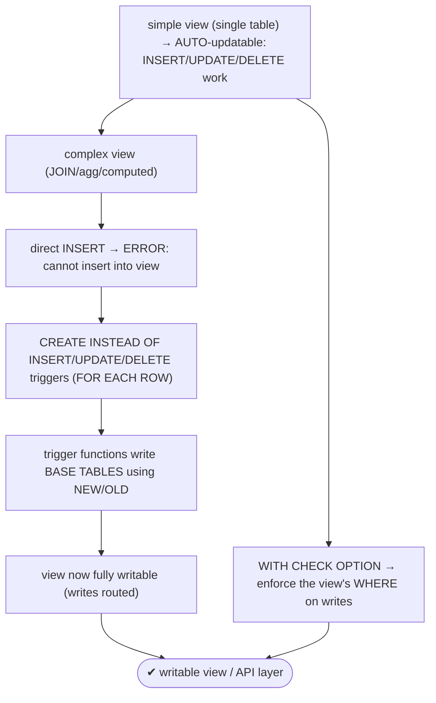
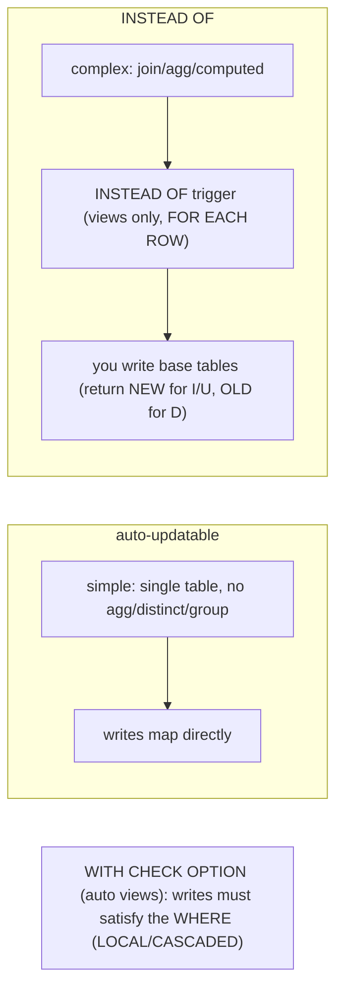

# Lab 112 — `INSTEAD OF` Triggers on a View to Make It Writable

> **Track B · Developer · B5 Server-Side Programming · Lab 3 of 8 (Lab 112/222)**
> Teaching package: concept → diagram → steps → verify → quick-ref → self-test → video script.
> **Depends on:** Lab 110 (PL/pgSQL), Lab 111 (triggers). **Related:** Lab 79 (schema/joins).

---

## 0. Lab Card (at a glance)

| Field | Value |
|---|---|
| **Objective** | See which views are auto-updatable, make a complex (JOIN) view writable with `INSTEAD OF` triggers that route writes to base tables, and apply `WITH CHECK OPTION`. |
| **Success criterion** | A simple view auto-updates; a JOIN view rejects a direct INSERT; `INSTEAD OF` triggers make the JOIN view fully writable; `WITH CHECK OPTION` enforces the view predicate. |
| **Scope boundary** | View writability + INSTEAD OF. General triggers were Lab 111. |
| **Prereqs** | Lab 111; base tables |
| **Time** | 30–40 min |
| **Difficulty** | ★★★★☆ |
| **Risk** | Low — scratch objects. |

---

## 1. Learning Objectives

1. **Auto-updatable views** — what qualifies.
2. **Why complex views are read-only.**
3. **`INSTEAD OF` triggers** — constraints and role.
4. **Routing writes** to base tables.
5. **`WITH CHECK OPTION`** — enforcing the predicate.

---

## 2. Concept Primer — the "why"

**A view is a stored query — read-only by default, with one automatic exception.**
- **Simple views** — a `SELECT` over a **single table** with no aggregation/`DISTINCT`/`GROUP BY`/window functions — are **automatically updatable** (PG9.3+): PostgreSQL maps `INSERT`/`UPDATE`/`DELETE` on the view straight to the base table.
- **Complex views** — **joins**, **aggregates**, **computed columns**, `DISTINCT`, `GROUP BY`, `UNION` — are **not** auto-updatable, because PostgreSQL can't infer how a write should map to the underlying tables. Writing to them errors with *"cannot insert into view."*

**`INSTEAD OF` triggers make complex views writable — you define the mapping.** An `INSTEAD OF` trigger **replaces** the operation on the view with your function, which performs the *real* writes to the base tables using `NEW`/`OLD`. Constraints:
- **Only on views** (never tables).
- **`FOR EACH ROW` only** (INSTEAD OF is inherently row-level).
- **Return convention:** `RETURN NEW` for `INSERT`/`UPDATE`, `RETURN OLD` for `DELETE`.

```sql
CREATE TRIGGER v_ins INSTEAD OF INSERT ON myview
  FOR EACH ROW EXECUTE FUNCTION myview_insert();   -- function does INSERT INTO base_table ... using NEW
```

**The classic use — a writable JOIN view / API layer.** Present apps a friendly, denormalized view (e.g. orders joined with customer names), and let `INSTEAD OF` triggers translate writes to the normalized schema: an `INSERT` looks up (or creates) the customer and inserts the order; an `UPDATE` updates the right base rows; a `DELETE` removes the order. This decouples the app's mental model from the physical schema — and lets you evolve the schema behind a stable view interface.

**Related: `WITH CHECK OPTION` (for auto-updatable views).** On an *automatically* updatable view with a `WHERE`, `WITH CHECK OPTION` ensures that rows inserted/updated **through** the view still satisfy the view's `WHERE` (so you can't insert a row the view wouldn't show, then "lose" it):
```sql
CREATE VIEW active_users AS SELECT * FROM users WHERE active WITH CHECK OPTION;   -- can't insert active=false through it
```
`LOCAL` checks only this view's condition; `CASCADED` (default) checks underlying views' conditions too. *(This is for auto-updatable views, not INSTEAD OF ones — INSTEAD OF triggers enforce their own logic.)*

---

## 3. Diagrams

### 3.1 Make-a-view-writable flow



### 3.2 View writability model



---

## 4. Prerequisites — base tables

```bash
sudo -u postgres psql -d shopdb <<'SQL'
DROP TABLE IF EXISTS orders_v, customers_v CASCADE;
CREATE TABLE customers_v (id int GENERATED ALWAYS AS IDENTITY PRIMARY KEY, name text UNIQUE);
CREATE TABLE orders_v (id bigint GENERATED ALWAYS AS IDENTITY PRIMARY KEY,
  customer_id int REFERENCES customers_v(id), amount numeric);
INSERT INTO customers_v (name) VALUES ('Asha'),('Ravi');
INSERT INTO orders_v (customer_id, amount) VALUES (1,100),(2,200);
SQL
```

---

## 5. Step-by-Step

### Step 1 — Simple view is auto-updatable

```bash
sudo -u postgres psql -d shopdb <<'SQL'
CREATE VIEW big_orders AS SELECT id, customer_id, amount FROM orders_v WHERE amount >= 100;
INSERT INTO big_orders (customer_id, amount) VALUES (1, 500);   -- works (single-table view)
UPDATE big_orders SET amount = 550 WHERE id = (SELECT max(id) FROM orders_v);
SQL
sudo -u postgres psql -d shopdb -c "SELECT * FROM orders_v ORDER BY id;"   # the auto-updates applied to the base table
```

### Step 2 — Complex (JOIN) view is NOT auto-updatable

```bash
sudo -u postgres psql -d shopdb -c "
CREATE VIEW order_summary AS
  SELECT o.id, c.name AS customer_name, o.amount
  FROM orders_v o JOIN customers_v c ON c.id = o.customer_id;"
sudo -u postgres psql -d shopdb -c "INSERT INTO order_summary (customer_name, amount) VALUES ('Asha', 999);" 2>&1 | tail -1
#   → ERROR: cannot insert into view "order_summary" (it's a JOIN)
```

### Step 3 — INSTEAD OF INSERT: route the write to base tables

```bash
sudo -u postgres psql -d shopdb <<'SQL'
CREATE OR REPLACE FUNCTION os_insert() RETURNS trigger LANGUAGE plpgsql AS $$
DECLARE cid int;
BEGIN
  -- find or create the customer by name:
  SELECT id INTO cid FROM customers_v WHERE name = NEW.customer_name;
  IF cid IS NULL THEN
    INSERT INTO customers_v (name) VALUES (NEW.customer_name) RETURNING id INTO cid;
  END IF;
  INSERT INTO orders_v (customer_id, amount) VALUES (cid, NEW.amount);   -- the real write
  RETURN NEW;                                                            -- convention for INSTEAD OF INSERT
END; $$;
CREATE TRIGGER os_ins INSTEAD OF INSERT ON order_summary FOR EACH ROW EXECUTE FUNCTION os_insert();
SQL
sudo -u postgres psql -d shopdb -c "INSERT INTO order_summary (customer_name, amount) VALUES ('Meera', 999);"  # now works!
sudo -u postgres psql -d shopdb -c "SELECT * FROM order_summary ORDER BY id;"
```

### Step 4 — INSTEAD OF UPDATE and DELETE

```bash
sudo -u postgres psql -d shopdb <<'SQL'
CREATE OR REPLACE FUNCTION os_update() RETURNS trigger LANGUAGE plpgsql AS $$
BEGIN
  UPDATE orders_v SET amount = NEW.amount WHERE id = OLD.id;     -- update the order
  RETURN NEW;
END; $$;
CREATE TRIGGER os_upd INSTEAD OF UPDATE ON order_summary FOR EACH ROW EXECUTE FUNCTION os_update();

CREATE OR REPLACE FUNCTION os_delete() RETURNS trigger LANGUAGE plpgsql AS $$
BEGIN
  DELETE FROM orders_v WHERE id = OLD.id;
  RETURN OLD;                                                    -- convention for INSTEAD OF DELETE
END; $$;
CREATE TRIGGER os_del INSTEAD OF DELETE ON order_summary FOR EACH ROW EXECUTE FUNCTION os_delete();
SQL
sudo -u postgres psql -d shopdb -c "UPDATE order_summary SET amount = 1234 WHERE customer_name='Meera';"
sudo -u postgres psql -d shopdb -c "DELETE FROM order_summary WHERE customer_name='Meera';"
sudo -u postgres psql -d shopdb -c "SELECT * FROM order_summary ORDER BY id;"   # update+delete routed to base
```

### Step 5 — WITH CHECK OPTION on an auto-updatable view

```bash
sudo -u postgres psql -d shopdb <<'SQL'
CREATE VIEW small_orders AS SELECT * FROM orders_v WHERE amount < 300 WITH CHECK OPTION;
INSERT INTO small_orders (customer_id, amount) VALUES (1, 50);      -- OK (satisfies WHERE)
SQL
sudo -u postgres psql -d shopdb -c "INSERT INTO small_orders (customer_id, amount) VALUES (1, 999);" 2>&1 | tail -1
#   → ERROR: new row violates check option (999 wouldn't be visible in the view)
```

### Step 6 — Confirm base tables reflect all view writes

```bash
sudo -u postgres psql -d shopdb -c "SELECT c.name, o.amount FROM orders_v o JOIN customers_v c ON c.id=o.customer_id ORDER BY o.id;"
```

---

## 6. Verification Checklist

- [ ] Simple single-table view auto-updated the base table
- [ ] JOIN view rejected a direct INSERT
- [ ] `INSTEAD OF INSERT` routed the write (find/create customer + insert order)
- [ ] `INSTEAD OF UPDATE`/`DELETE` routed to base tables
- [ ] Return conventions used (NEW for I/U, OLD for D)
- [ ] `WITH CHECK OPTION` blocked a row outside the view's WHERE
- [ ] Base tables reflect all writes made through the view

---

## 7. Troubleshooting

| Symptom | Cause | Fix |
|---|---|---|
| "cannot insert into view" | Complex view, no INSTEAD OF | Add `INSTEAD OF INSERT` trigger |
| `INSTEAD OF` on a table errors | Only views allowed | Use it on a view |
| "INSTEAD OF triggers must be FOR EACH ROW" | Statement-level | Use `FOR EACH ROW` |
| Write does nothing | Function didn't write base tables / wrong return | Write base tables; `RETURN NEW`/`OLD` |
| Ambiguous which table to write | Multi-table view | Encode routing logic in the function |
| Auto-view rejects write | Not a simple view | Add INSTEAD OF, or simplify the view |
| Row "disappears" after insert | Row outside view's WHERE | Add `WITH CHECK OPTION` (auto views) |

---

## 8. Quick Reference Card (paste-ready)

```sql
-- SIMPLE (single-table) view → auto-updatable (writes map directly)
CREATE VIEW v AS SELECT ... FROM t WHERE ... [WITH CHECK OPTION];   -- CHECK OPTION: writes must satisfy WHERE

-- COMPLEX (join/agg/computed) view → make writable with INSTEAD OF (views only, FOR EACH ROW):
CREATE FUNCTION v_ins() RETURNS trigger LANGUAGE plpgsql AS $$
BEGIN ...write base tables using NEW...; RETURN NEW; END; $$;      -- RETURN NEW (I/U), OLD (D)
CREATE TRIGGER t_ins INSTEAD OF INSERT ON v FOR EACH ROW EXECUTE FUNCTION v_ins();
-- (same for INSTEAD OF UPDATE / DELETE)

-- use: writable JOIN views · API abstraction (stable view, evolving schema) · controlled writes
```

---

## 9. Self-Check

1. Which views are writable by default?
2. What makes a complex view writable?
3. What are the constraints on `INSTEAD OF` triggers?
4. What does the `INSTEAD OF` function actually do?
5. What are the return-value conventions?
6. What does `WITH CHECK OPTION` do, and for which views?

<details>
<summary>Answers</summary>

1. **Simple** single-table views (no aggregation/DISTINCT/GROUP BY) are auto-updatable; complex views are read-only.
2. **`INSTEAD OF` triggers** that define how writes on the view map to the base tables.
3. Only on **views**, **`FOR EACH ROW`** only, and they **replace** the operation.
4. It performs the real `INSERT`/`UPDATE`/`DELETE` on the underlying base tables using `NEW`/`OLD`.
5. `RETURN NEW` for `INSERT`/`UPDATE`, `RETURN OLD` for `DELETE`.
6. It ensures rows written **through an auto-updatable view** satisfy the view's `WHERE` (`LOCAL` = this view; `CASCADED` = underlying views too) — not for INSTEAD OF views.
</details>

---

## 10. Video / Teaching Script

| # | On screen | Say (narration) |
|---|---|---|
| 1 | Title: "Writing through a view" | "A simple view you can write to directly. But a *join* view? Postgres throws up its hands — it doesn't know which table you mean. INSTEAD OF triggers tell it." |
| 2 | auto vs fail | "Single table: insert works, straight through. Add a join, and the same insert fails: 'cannot insert into view.'" |
| 3 | INSTEAD OF INSERT | "So we take over. An INSTEAD OF trigger replaces the insert with *our* logic: find the customer, or create one, then insert the order. Now it works." |
| 4 | update/delete | "Same for update and delete — route each to the right base table." |
| 5 | API layer | "This is powerful: apps see one friendly view, while you reshape the real schema underneath. A stable interface over an evolving database." |
| 6 | check option | "And for simple views, WITH CHECK OPTION stops you inserting a row the view would immediately hide." |
| 7 | Outro | "Views that write back. Next: procedures with real transaction control." |

---

## 11. Glossary

- **Auto-updatable view** — simple single-table view that maps writes directly.
- **Complex view** — join/aggregate/computed; read-only by default.
- **`INSTEAD OF` trigger** — replaces a view write with custom logic (views only, per-row).
- **Base table** — the real table(s) the trigger writes.
- **Return convention** — `NEW` (INSERT/UPDATE), `OLD` (DELETE).
- **`WITH CHECK OPTION`** — enforce the view's WHERE on writes (LOCAL/CASCADED).

---
*NETAPORT lab series · PostgreSQL 17 on AlmaLinux 9 · Lab 112/222 · B5 Server-Side Programming*
