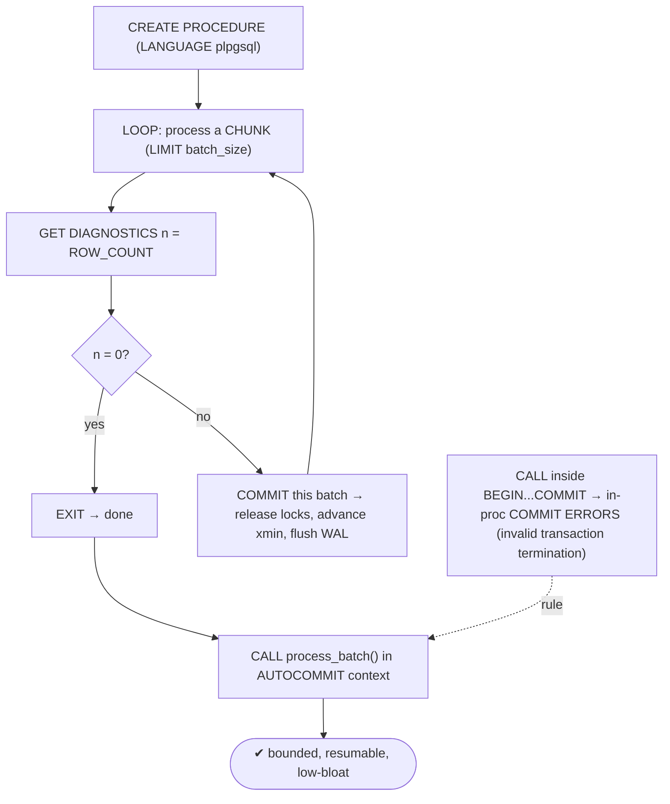
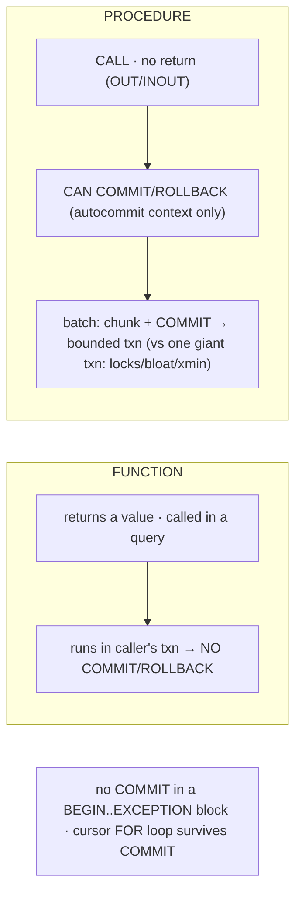

# Lab 113 — Stored Procedures with In-Procedure `COMMIT`/`ROLLBACK` (Batch Processing)

> **Track B · Developer · B5 Server-Side Programming · Lab 4 of 8 (Lab 113/222)**
> Teaching package: concept → diagram → steps → verify → quick-ref → self-test → video script.
> **Depends on:** Lab 110 (PL/pgSQL), Lab 108 (savepoints), Lab 110-concurrency (long-txn impact). **Related:** Track D (ETL).

---

## 0. Lab Card (at a glance)

| Field | Value |
|---|---|
| **Objective** | Write a procedure that commits inside a loop to process a large table in bounded batches, and understand why functions can't do this and when `COMMIT` is allowed. |
| **Success criterion** | A procedure processes rows in chunks with a `COMMIT` per batch; committed batches persist; the transaction stays bounded; the `COMMIT`-in-a-transaction-block error is understood. |
| **Scope boundary** | Procedures + in-procedure transaction control. Functions were Lab 110. |
| **Prereqs** | Lab 110; a large table |
| **Time** | 30–40 min |
| **Difficulty** | ★★★★☆ |
| **Risk** | Low — scratch table. |

---

## 1. Learning Objectives

1. **Function vs procedure** — transaction control.
2. **`CREATE PROCEDURE` / `CALL`** — syntax.
3. **The batch pattern** — chunk + commit.
4. **Why bounded transactions matter** — locks/bloat/xmin.
5. **The rules** — when `COMMIT` is (dis)allowed.

---

## 2. Concept Primer — the "why"

**Functions can't manage transactions; procedures can.**
- A **function** (Lab 110) returns a value and runs **inside** the caller's transaction — it's part of an ongoing statement, so it **cannot `COMMIT`/`ROLLBACK`**.
- A **procedure** (PG11+) is called with **`CALL proc(args)`**, returns no value (it can have `OUT`/`INOUT` params), and **can do transaction control** — `COMMIT` and `ROLLBACK` inside its body.

**Why in-procedure `COMMIT` matters — batch processing.** To process a huge table (millions of rows), doing it in **one** transaction is a trap: it holds locks the whole time, accumulates WAL, bloats tables, and — critically (Lab 110) — **pins the xmin horizon** so nothing gets vacuumed while it runs. A procedure can instead loop, process a **chunk**, **`COMMIT`**, and repeat:
```sql
CREATE OR REPLACE PROCEDURE process_batch(batch_size int DEFAULT 10000)
LANGUAGE plpgsql AS $$
DECLARE n int;
BEGIN
  LOOP
    UPDATE big SET processed = true
     WHERE id IN (SELECT id FROM big WHERE NOT processed LIMIT batch_size);
    GET DIAGNOSTICS n = ROW_COUNT;      -- rows affected this chunk
    EXIT WHEN n = 0;                     -- done
    COMMIT;                              -- finalize this batch → release locks, advance xmin
    RAISE NOTICE 'processed % rows', n;
  END LOOP;
END; $$;
CALL process_batch();
```
Each `COMMIT` **bounds the transaction**: locks release, WAL flushes, autovacuum can reclaim between batches, and the xmin horizon advances. The job is also **interruptible/restartable** — committed batches persist, so a crash/cancel resumes from where it stopped, and progress is visible.

**The rules (get these right):**
- **`COMMIT`/`ROLLBACK` are allowed only when the procedure is called with no enclosing transaction** — i.e. `CALL` in **autocommit** context. If you `CALL` it **inside an explicit `BEGIN … COMMIT` block** (or from a function), the in-procedure `COMMIT` errors with **`invalid transaction termination`**.
- After a `COMMIT`/`ROLLBACK`, a **new transaction begins automatically** for the following statements.
- **You can't `COMMIT` inside a `BEGIN … EXCEPTION … END` block** — that block is a subtransaction (Lab 108). Keep transaction control out of exception handlers.
- **Cursors:** `COMMIT` normally closes cursors, but a **cursor `FOR` loop** over a query in a procedure keeps its cursor across the commit (implicitly held, PG11+), so you *can* `COMMIT` inside such a loop; a manually-declared cursor needs `WITH HOLD`.

**Choosing:** use a **function** for computed values and set-returning logic; use a **procedure** for **multi-step jobs with transaction control** — batch ETL, incremental maintenance, migrations.

---

## 3. Diagrams

### 3.1 Batch-procedure flow



### 3.2 Function vs procedure



---

## 4. Prerequisites — a large table to batch-process

```bash
sudo -u postgres psql -d shopdb <<'SQL'
DROP TABLE IF EXISTS big;
CREATE TABLE big (id bigint GENERATED ALWAYS AS IDENTITY PRIMARY KEY, val int, processed boolean DEFAULT false);
INSERT INTO big (val) SELECT (random()*1000)::int FROM generate_series(1, 500000);
ANALYZE big;
SQL
```

---

## 5. Step-by-Step

### Step 1 — A batch-processing procedure

```bash
sudo -u postgres psql -d shopdb <<'SQL'
CREATE OR REPLACE PROCEDURE process_batch(batch_size int DEFAULT 50000)
LANGUAGE plpgsql AS $$
DECLARE n int; total bigint := 0;
BEGIN
  LOOP
    UPDATE big SET processed = true, val = val + 1
     WHERE id IN (SELECT id FROM big WHERE NOT processed LIMIT batch_size);
    GET DIAGNOSTICS n = ROW_COUNT;
    EXIT WHEN n = 0;
    total := total + n;
    COMMIT;                                   -- commit each batch
    RAISE NOTICE 'batch: % rows (running total %)', n, total;
  END LOOP;
  RAISE NOTICE 'done: % rows total', total;
END; $$;
SQL
```

### Step 2 — CALL it (autocommit context) and watch incremental commits

```bash
sudo -u postgres psql -d shopdb -c "CALL process_batch();"
#   → NOTICEs per batch; each COMMIT bounds the transaction
sudo -u postgres psql -d shopdb -c "SELECT count(*) FILTER (WHERE processed) AS done, count(*) AS total FROM big;"
```

### Step 3 — Committed batches persist (interruptible/restartable)

```bash
sudo -u postgres psql -d shopdb -c "UPDATE big SET processed=false;"   # reset
# run, then cancel mid-way (Ctrl-C in a real terminal) — already-committed batches STAY processed:
sudo -u postgres psql -d shopdb -c "CALL process_batch(50000);" &
sleep 0.5; kill %1 2>/dev/null
sudo -u postgres psql -d shopdb -c "SELECT count(*) FILTER (WHERE processed) AS committed_so_far FROM big;"
#   → the batches that committed before the cancel are still processed → re-CALL resumes
```

### Step 4 — The rule: COMMIT fails inside a transaction block

```bash
sudo -u postgres psql -d shopdb <<'SQL'
BEGIN;
  CALL process_batch(50000);    -- in-procedure COMMIT → ERROR: invalid transaction termination
ROLLBACK;
SQL
#   CALL a transaction-controlling procedure in AUTOCOMMIT (no enclosing BEGIN)
```

### Step 5 — COMMIT inside a cursor FOR loop (allowed)

```bash
sudo -u postgres psql -d shopdb <<'SQL'
CREATE OR REPLACE PROCEDURE per_row_commit()
LANGUAGE plpgsql AS $$
DECLARE rec record; c int := 0;
BEGIN
  FOR rec IN SELECT id FROM big WHERE id <= 5 ORDER BY id LOOP   -- implicit held cursor
    UPDATE big SET val = val + 100 WHERE id = rec.id;
    c := c + 1;
    COMMIT;                                                       -- COMMIT inside the FOR loop — OK
  END LOOP;
  RAISE NOTICE 'committed % rows individually', c;
END; $$;
CALL per_row_commit();
SQL
```

### Step 6 — Contrast: a function can't COMMIT

```bash
sudo -u postgres psql -d shopdb -c "
CREATE FUNCTION bad_fn() RETURNS void LANGUAGE plpgsql AS \$\$ BEGIN COMMIT; END; \$\$;
SELECT bad_fn();" 2>&1 | tail -1
#   → ERROR: COMMIT is not allowed in a non-atomic function / (functions can't do transaction control)
```

---

## 6. Verification Checklist

- [ ] Procedure processes in batches with a `COMMIT` per chunk
- [ ] `GET DIAGNOSTICS … ROW_COUNT` drives the loop; `EXIT WHEN n=0`
- [ ] Progress `NOTICE`s appeared
- [ ] Committed batches persisted after a cancel (restartable)
- [ ] `CALL` inside `BEGIN` → `invalid transaction termination`
- [ ] `COMMIT` inside a cursor `FOR` loop worked
- [ ] A function `COMMIT` was rejected

---

## 7. Troubleshooting

| Symptom | Cause | Fix |
|---|---|---|
| "invalid transaction termination" | `COMMIT` inside an enclosing txn (CALL in BEGIN, or from a function) | `CALL` in autocommit (no `BEGIN`) |
| `COMMIT` rejected in a function | Functions can't do txn control | Use a `PROCEDURE` |
| `COMMIT` in exception block errors | It's a subtransaction | Move txn control out of `EXCEPTION` blocks |
| Cursor closed after `COMMIT` | Manual cursor | `DECLARE … WITH HOLD`, or use a `FOR` loop |
| Batch never ends | `EXIT` condition/chunk query wrong | Ensure the chunk makes progress; `EXIT WHEN n=0` |
| Locks held too long | Batch too big | Smaller `batch_size` |
| One giant transaction anyway | No `COMMIT` in the loop | Add `COMMIT` per batch |

---

## 8. Quick Reference Card (paste-ready)

```sql
-- PROCEDURE: CALLed, no return, CAN do transaction control (autocommit context only)
CREATE OR REPLACE PROCEDURE process_batch(batch_size int DEFAULT 10000)
LANGUAGE plpgsql AS $$
DECLARE n int;
BEGIN
  LOOP
    UPDATE t SET ... WHERE id IN (SELECT id FROM t WHERE <pending> LIMIT batch_size);
    GET DIAGNOSTICS n = ROW_COUNT;
    EXIT WHEN n = 0;
    COMMIT;                    -- bound the txn: release locks, advance xmin, flush WAL
  END LOOP;
END; $$;
CALL process_batch();          -- run in AUTOCOMMIT (NOT inside BEGIN..COMMIT, NOT from a function)

-- rules: COMMIT/ROLLBACK not allowed inside a BEGIN..EXCEPTION block · cursor FOR loop survives COMMIT
-- function vs procedure: function returns a value, no txn control · procedure = CALL + COMMIT/ROLLBACK
-- one giant txn = locks + bloat + pinned xmin (Lab 110) → batch + COMMIT instead
```

---

## 9. Self-Check

1. What's the transaction-control difference between a function and a procedure?
2. Why commit inside a batch procedure?
3. When is `COMMIT` allowed inside a procedure?
4. What's the batch-processing loop pattern?
5. Can you `COMMIT` inside an exception block?
6. How do you invoke a procedure?

<details>
<summary>Answers</summary>

1. A function **can't** `COMMIT`/`ROLLBACK` (it runs in the caller's transaction, returns a value); a procedure **can** (called with `CALL`, no return).
2. To keep each transaction **bounded** — release locks, flush WAL, let autovacuum reclaim, and advance the xmin horizon — instead of one giant transaction that causes locks/bloat (Lab 110).
3. Only when the procedure is `CALL`ed with **no enclosing transaction** (autocommit) — not inside `BEGIN…COMMIT` or from a function.
4. `LOOP`: process a chunk (`LIMIT batch_size`), `GET DIAGNOSTICS n = ROW_COUNT`, `EXIT WHEN n = 0`, `COMMIT` per batch.
5. **No** — a `BEGIN…EXCEPTION` block is a subtransaction; `COMMIT` isn't allowed there.
6. `CALL proc(args);`.
</details>

---

## 10. Video / Teaching Script

| # | On screen | Say (narration) |
|---|---|---|
| 1 | Title: "Commit as you go" | "Processing a million rows in one transaction is a mistake — locks, bloat, a frozen cleanup horizon. Procedures let you commit as you go." |
| 2 | function can't | "A function can't commit — it's stuck inside the caller's transaction. A procedure can. That's the whole difference." |
| 3 | batch loop | "So loop: grab a chunk, update it, commit. Grab the next chunk, commit. Each batch is its own small, safe transaction." |
| 4 | run it | "Call it, and watch the batches roll by. Locks release between each; vacuum can breathe." |
| 5 | restartable | "And it's restartable — cancel it, and the committed batches stay done. Run it again, it picks up where it left off." |
| 6 | the rule | "One rule: call it in autocommit. Wrap it in a BEGIN and the commit inside errors out — you can't end a transaction you didn't start." |
| 7 | Outro | "Bounded, resumable batch jobs. Next: cursors for row-by-row processing." |

---

## 11. Glossary

- **Procedure** — `CALL`ed routine that can do transaction control.
- **Function** — returns a value; no `COMMIT`/`ROLLBACK`.
- **`CALL`** — invoke a procedure.
- **Batch processing** — chunk + `COMMIT` per batch.
- **`GET DIAGNOSTICS … ROW_COUNT`** — rows affected by the last statement.
- **invalid transaction termination** — `COMMIT` inside an enclosing txn.
- **Bounded transaction** — small, per-batch (avoids locks/bloat/xmin pinning).

---
*NETAPORT lab series · PostgreSQL 17 on AlmaLinux 9 · Lab 113/222 · B5 Server-Side Programming*
