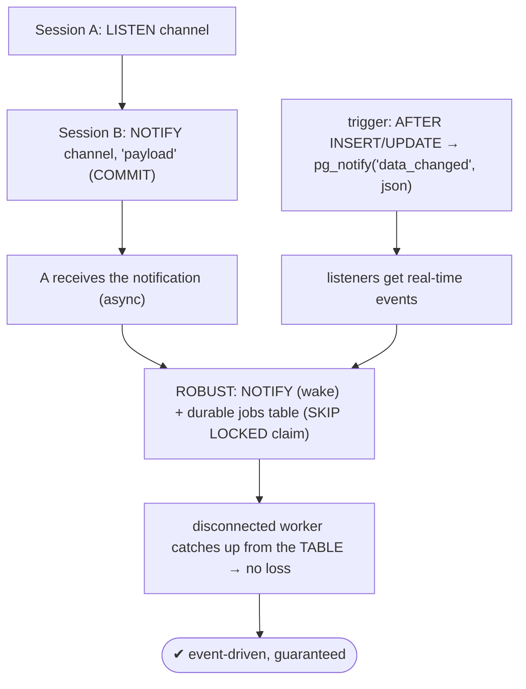
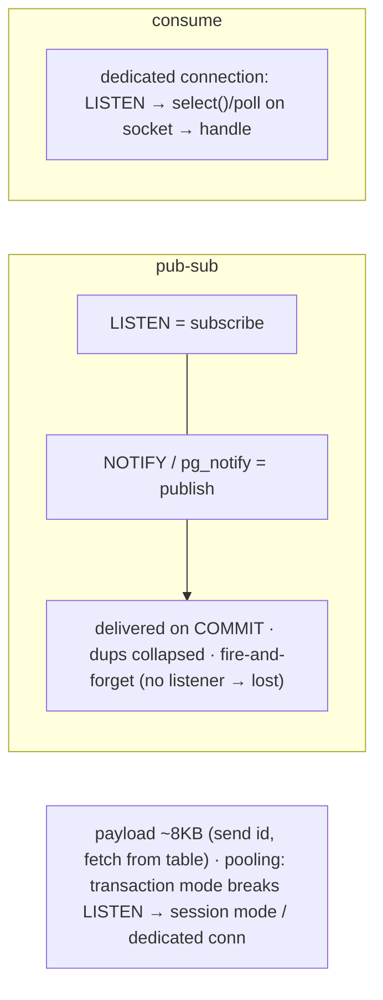

# Lab 114 — `LISTEN`/`NOTIFY` Pub-Sub; Consume Events from a Client

> **Track B · Developer · B5 Server-Side Programming · Lab 5 of 8 (Lab 114/222)**
> Teaching package: concept → diagram → steps → verify → quick-ref → self-test → video script.
> **Depends on:** Lab 111 (triggers), Lab 105 (SKIP LOCKED queue), Lab 37 (pooling). **Related:** Track C (n8n/automation).

---

## 0. Lab Card (at a glance)

| Field | Value |
|---|---|
| **Objective** | Use `LISTEN`/`NOTIFY` for async pub-sub, drive real-time events from a trigger via `pg_notify`, consume them from a client, and combine with a durable table for guaranteed delivery. |
| **Success criterion** | A listener receives notifications on commit; a trigger emits table-change events; you understand fire-and-forget semantics and the durable-queue pattern. |
| **Scope boundary** | LISTEN/NOTIFY pub-sub. The durable queue itself was Lab 105. |
| **Prereqs** | Lab 111; two sessions |
| **Time** | 30–45 min |
| **Difficulty** | ★★★★☆ |
| **Risk** | Low — messaging only. |

---

## 1. Learning Objectives

1. **LISTEN/NOTIFY/pg_notify** — the pub-sub primitives.
2. **Transactional delivery** — on commit only.
3. **Trigger integration** — real-time table events.
4. **Consuming from a client** — driver socket wait.
5. **The durable pattern + pooling caveat.**

---

## 2. Concept Primer — the "why"

**`LISTEN`/`NOTIFY` is PostgreSQL's built-in asynchronous pub-sub — event-driven, no polling.**
- **`LISTEN channel;`** — the session **subscribes** to a channel.
- **`NOTIFY channel [, 'payload'];`** — **publish** a message (with an optional text payload) to that channel; every listening session receives it.
- **`pg_notify('channel', 'payload')`** — the **function form**, for dynamic channels/payloads (e.g. inside a trigger).
- **`UNLISTEN channel;`** — unsubscribe.

**Two defining behaviors:**
1. **Transactional delivery.** Notifications are queued and delivered **only when the notifying transaction commits** — a rollback sends nothing. (Duplicate notifications, same channel+payload, within one transaction are **collapsed** into one.) Delivery is in commit order.
2. **Fire-and-forget — not durable.** If **no listener is connected** when the `NOTIFY` fires, the message is **simply dropped**. There's no persistence, no queue, no replay. It's best-effort delivery to *currently-connected* listeners.

**Payload:** a text string (channel + payload are size-limited — payload up to ~8KB). Usually an **id or a small JSON**, with the full data fetched from a table.

**Trigger + `pg_notify` — the common integration.** Emit real-time events when a table changes:
```sql
CREATE FUNCTION notify_change() RETURNS trigger LANGUAGE plpgsql AS $$
BEGIN
  PERFORM pg_notify('data_changed',
    json_build_object('table', TG_TABLE_NAME, 'op', TG_OP, 'id', NEW.id)::text);
  RETURN NEW;
END; $$;
CREATE TRIGGER trg AFTER INSERT OR UPDATE ON t FOR EACH ROW EXECUTE FUNCTION notify_change();
```
Now every insert signals listeners — cache invalidation, real-time UI updates, waking a worker, triggering an n8n/webhook flow.

**Consuming from a client.** A real app uses a **dedicated listener connection**: `LISTEN chan`, then **`select()`/`poll()` on the socket** to block until a notification arrives, then handle it. Drivers expose this — psycopg's `conn.notifies`, libpq `PQnotifies` after `PQconsumeInput`, Go pgx `WaitForNotification`, node-postgres `client.on('notification', …)`. (psql shows notifications when it's idle between commands — fine for demos, not a blocking listener.)

**The robust production pattern — NOTIFY + a durable table.** Because NOTIFY is lossy, don't use it as the *source of truth*. Use it as a **low-latency wake-up signal** on top of a **durable jobs table** (Lab 105 `SKIP LOCKED`): the row is inserted (durable), a trigger `NOTIFY`s workers to wake immediately, and workers **claim jobs from the table**. If a worker was disconnected during a NOTIFY, it **catches up by querying the table** on reconnect — nothing is lost. This gives you SKIP LOCKED's exactly-once durability *and* NOTIFY's instant latency (no polling).

**Pooling caveat.** Under **transaction pooling** (PgBouncer transaction mode, Lab 37), a client doesn't keep a persistent session, so **`LISTEN` doesn't work reliably** — the listener may not be on the same backend that receives the NOTIFY. Use **session pooling** or a **dedicated (non-pooled) listener connection**.

---

## 3. Diagrams

### 3.1 Pub-sub + durable flow



### 3.2 Semantics + client



---

## 4. Prerequisites — two sessions

```bash
sudo -u postgres psql -d shopdb -c "SELECT 1;"
# Open TWO terminals: sudo -u postgres psql -d shopdb   (A = listener, B = notifier)
```

---

## 5. Step-by-Step

### Step 1 — Basic LISTEN / NOTIFY

```text
[A-1] LISTEN events;
[B-1] NOTIFY events, 'hello from B';
[A-2] -- run any command (e.g., SELECT 1;) — psql then prints:
      -- Asynchronous notification "events" with payload "hello from B" received from server process ...
```

### Step 2 — Transactional delivery (commit vs rollback)

```text
[B-1] BEGIN;
[B-2] NOTIFY events, 'inside txn';
[B-3] ROLLBACK;                 -- → A gets NOTHING (rolled back)
[B-4] BEGIN; NOTIFY events, 'committed'; COMMIT;   -- → A receives it on commit
[A]   (run a command to flush) — sees only 'committed'
```

### Step 3 — pg_notify with a JSON payload

```bash
sudo -u postgres psql -d shopdb -c "SELECT pg_notify('events', json_build_object('type','order','id',42)::text);"
#   (a listener on 'events' receives the JSON string)
```

### Step 4 — Trigger emits real-time table events

```bash
sudo -u postgres psql -d shopdb <<'SQL'
DROP TABLE IF EXISTS live_orders;
CREATE TABLE live_orders (id bigint GENERATED ALWAYS AS IDENTITY PRIMARY KEY, customer text, amount numeric);
CREATE OR REPLACE FUNCTION notify_order() RETURNS trigger LANGUAGE plpgsql AS $$
BEGIN
  PERFORM pg_notify('order_events',
    json_build_object('op', TG_OP, 'id', NEW.id, 'customer', NEW.customer, 'amount', NEW.amount)::text);
  RETURN NEW;
END; $$;
CREATE TRIGGER trg_order AFTER INSERT ON live_orders FOR EACH ROW EXECUTE FUNCTION notify_order();
SQL
# [A] LISTEN order_events;   then:
sudo -u postgres psql -d shopdb -c "INSERT INTO live_orders (customer, amount) VALUES ('Asha', 250);"
#   → the listener on 'order_events' receives the JSON event
```

### Step 5 — A shell listener loop (demo consumer)

```bash
cat > /tmp/listener.sh <<'EOF'
#!/bin/bash
# a simple blocking-ish listener via psql: LISTEN, then poll for notifications
sudo -u postgres psql -d shopdb -At <<'SQL'
LISTEN order_events;
\watch 1
SQL
EOF
#   real apps use a driver that select()s on the socket (psycopg conn.notifies / pgx WaitForNotification /
#   node-postgres client.on('notification')) — a dedicated, non-pooled connection.
echo "run /tmp/listener.sh in one terminal; INSERT into live_orders in another to see events"
```

### Step 6 — The durable pattern (NOTIFY wakes, table is the source of truth)

```bash
sudo -u postgres psql -d shopdb <<'SQL'
-- jobs table (durable) + NOTIFY on insert:
CREATE TABLE IF NOT EXISTS jobs_q (id bigint GENERATED ALWAYS AS IDENTITY PRIMARY KEY, status text DEFAULT 'pending', payload text);
CREATE OR REPLACE FUNCTION jobs_wake() RETURNS trigger LANGUAGE plpgsql AS $$
BEGIN PERFORM pg_notify('jobs', 'new'); RETURN NEW; END; $$;
CREATE TRIGGER trg_jobs AFTER INSERT ON jobs_q FOR EACH ROW EXECUTE FUNCTION jobs_wake();

-- worker (conceptual): LISTEN jobs;  on wake OR on reconnect →
--   SELECT id FROM jobs_q WHERE status='pending' ORDER BY id FOR UPDATE SKIP LOCKED LIMIT 1;  (Lab 105)
-- → NOTIFY = instant wake; the TABLE guarantees nothing is lost even if the worker missed the NOTIFY.
INSERT INTO jobs_q (payload) VALUES ('do-work');
SQL
```

---

## 6. Verification Checklist

- [ ] LISTEN + NOTIFY delivered a message between sessions
- [ ] Rollback sent no notification; commit did (transactional)
- [ ] `pg_notify` sent a JSON payload
- [ ] A trigger emitted a real-time table-change event
- [ ] Consumed events from a client (loop / driver understood)
- [ ] Understood fire-and-forget (no listener → lost)
- [ ] Know the durable pattern (NOTIFY + table) and pooling caveat

---

## 7. Troubleshooting

| Symptom | Cause | Fix |
|---|---|---|
| Notification not received | No listener connected at NOTIFY time | Fire-and-forget; use a durable table for guarantees |
| NOTIFY didn't fire | Transaction rolled back | NOTIFY delivers on **commit** only |
| psql shows nothing | Delivered when idle/next command | Run a command; use a driver that waits on the socket |
| Pooler swallows LISTEN | Transaction pooling, non-persistent session | Session pooling / dedicated non-pooled listener |
| Payload too big | ~8KB limit | Send an id; fetch details from the table |
| Duplicates missing | Same channel+payload in one txn collapsed | Expected |
| Queue backing up | High notify volume | Monitor `pg_notification_queue_usage()` |

---

## 8. Quick Reference Card (paste-ready)

```sql
LISTEN channel;                          -- subscribe (a session)
NOTIFY channel, 'payload';               -- publish (delivered on COMMIT)
SELECT pg_notify('channel', 'payload');  -- function form (dynamic)
UNLISTEN channel;                        -- unsubscribe

-- trigger → real-time events:
CREATE FUNCTION f() RETURNS trigger LANGUAGE plpgsql AS $$
BEGIN PERFORM pg_notify('order_events', row_to_json(NEW)::text); RETURN NEW; END; $$;
CREATE TRIGGER t AFTER INSERT ON tbl FOR EACH ROW EXECUTE FUNCTION f();

-- semantics: on COMMIT · dups collapsed · FIRE-AND-FORGET (no listener → lost) · payload ~8KB
-- consume: dedicated conn LISTEN + select()/poll (psycopg notifies / pgx WaitForNotification / node client.on)
-- ROBUST: NOTIFY (wake) + durable jobs table (SKIP LOCKED, Lab 105) → no loss on reconnect
-- pooling: transaction mode breaks LISTEN → session mode / dedicated connection
```

---

## 9. Self-Check

1. What are `LISTEN`, `NOTIFY`, and `pg_notify`?
2. When are notifications delivered?
3. Is `LISTEN`/`NOTIFY` durable?
4. How does a trigger integrate with it?
5. What's the robust pattern for guaranteed delivery?
6. What's the connection-pooling caveat?

<details>
<summary>Answers</summary>

1. Async pub-sub: `LISTEN` subscribes a session to a channel, `NOTIFY`/`pg_notify` publishes a message to it, and listeners receive it.
2. Only when the notifying transaction **commits** (rollback sends none); duplicates in one transaction are collapsed; delivery is in commit order.
3. **No** — fire-and-forget; if no listener is connected, the message is **lost** (no persistence/queue).
4. A trigger calls `pg_notify()` on table changes to emit real-time events to listeners.
5. `NOTIFY` as a **wake-up signal** on top of a **durable jobs table** (`SKIP LOCKED`) — the table is the source of truth, so nothing is lost even if a listener missed the NOTIFY.
6. **Transaction pooling** breaks `LISTEN` (no persistent session) — use **session pooling** or a **dedicated non-pooled** listener connection.
</details>

---

## 10. Video / Teaching Script

| # | On screen | Say (narration) |
|---|---|---|
| 1 | Title: "The database can push events" | "Instead of polling 'anything new yet?', let Postgres *tell* you. LISTEN and NOTIFY — built-in pub-sub." |
| 2 | listen/notify | "One session listens on a channel; another notifies it. The message arrives — no polling, no middleware." |
| 3 | transactional | "It's transactional: notify inside a transaction, and it only fires if you commit. Roll back, and it's as if it never happened." |
| 4 | trigger | "Wire it to a trigger, and every new order becomes a live event — instant cache invalidation, real-time dashboards, waking a worker." |
| 5 | fire-and-forget | "But one warning: if nobody's listening, the message is *gone*. It's not a queue." |
| 6 | durable | "So the pro pattern: notify to *wake* the workers, but keep the jobs in a table. Miss a notification? You catch up from the table. Instant *and* reliable." |
| 7 | Outro | "Event-driven Postgres. Next: SECURITY DEFINER functions, done safely." |

---

## 11. Glossary

- **LISTEN / NOTIFY** — subscribe / publish on a channel.
- **`pg_notify`** — function form (dynamic channel/payload).
- **Channel / payload** — the topic / the message (~8KB).
- **Transactional delivery** — on commit; dups collapsed.
- **Fire-and-forget** — no listener → message lost (not durable).
- **Durable pattern** — NOTIFY wake + `SKIP LOCKED` jobs table.
- **Pooling caveat** — transaction pooling breaks LISTEN.

---
*NETAPORT lab series · PostgreSQL 17 on AlmaLinux 9 · Lab 114/222 · B5 Server-Side Programming*
