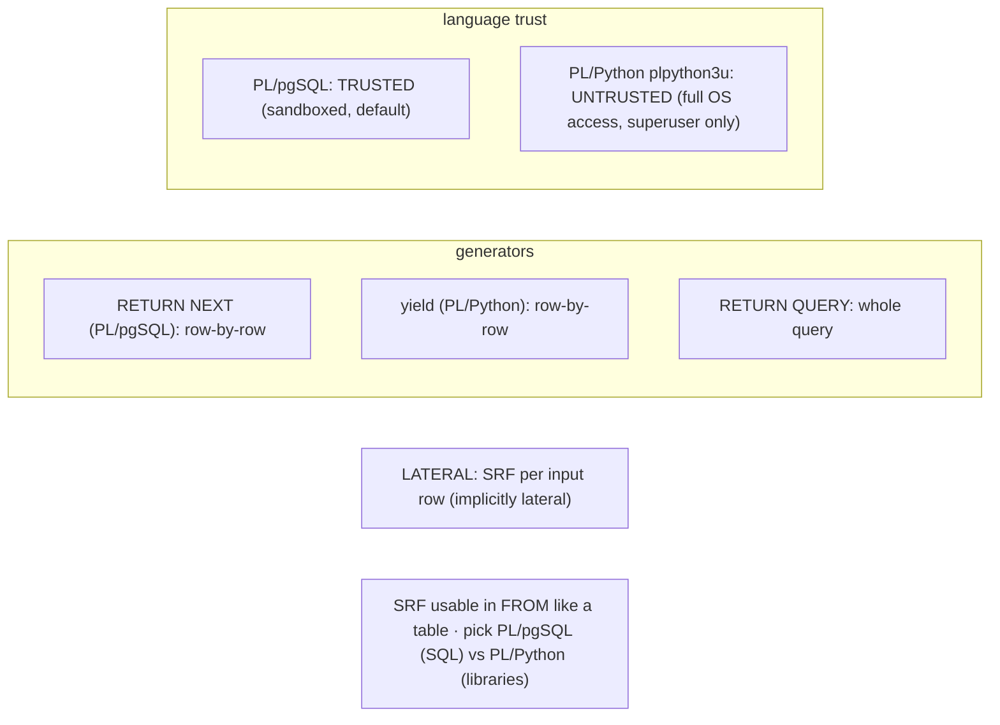

# Lab 115 — Set-Returning Functions + `LATERAL`; Write a PL/Python or PL/pgSQL Generator

> **Track B · Developer · B5 Server-Side Programming · Lab 6 of 8 (Lab 115/222)**
> Teaching package: concept → diagram → steps → verify → quick-ref → self-test → video script.
> **Depends on:** Lab 110 (PL/pgSQL, RETURN QUERY/NEXT), Lab 90 (LATERAL). **Related:** Lab 70 (extensions).

---

## 0. Lab Card (at a glance)

| Field | Value |
|---|---|
| **Objective** | Write set-returning functions as generators (PL/pgSQL `RETURN NEXT` and PL/Python `yield`), and call them per-row with `LATERAL`. |
| **Success criterion** | A PL/pgSQL generator yields a computed series; a PL/Python generator yields rows; an SRF used with `LATERAL` expands each table row. |
| **Scope boundary** | SRFs + generators + LATERAL. General PL/pgSQL was Lab 110; LATERAL joins Lab 90. |
| **Prereqs** | Lab 110; PL/Python needs `postgresql17-plpython3` |
| **Time** | 30–45 min |
| **Difficulty** | ★★★★☆ |
| **Risk** | Low — `plpython3u` is untrusted (superuser). |

---

## 1. Learning Objectives

1. **Set-returning functions** — SETOF / TABLE.
2. **The generator pattern** — `RETURN NEXT` vs `RETURN QUERY`.
3. **SRFs with LATERAL** — per-row expansion.
4. **PL/Python generators** — `yield` → rows.
5. **Trusted vs untrusted** languages — PL/pgSQL vs PL/Python.

---

## 2. Concept Primer — the "why"

**A set-returning function (SRF) returns *many rows*** — usable in `FROM` like a table, or in a `SELECT` list. Built-ins you know are SRFs: `generate_series`, `unnest`, `jsonb_array_elements`, `regexp_split_to_table`.

**Defining SRFs:**
- **`RETURNS SETOF type`** — a set of a scalar or row type.
- **`RETURNS TABLE(col type, …)`** — rows with named columns (Lab 110).

**The generator pattern — `RETURN NEXT` vs `RETURN QUERY`:**
- **`RETURN QUERY <select>`** — append a whole query's rows at once.
- **`RETURN NEXT expr`** — append **one row at a time**, typically in a loop, **building the set programmatically**. This is a **generator**: produce rows by computation, not from a table.
```sql
CREATE FUNCTION fib(n int) RETURNS SETOF bigint LANGUAGE plpgsql AS $$
DECLARE a bigint := 0; b bigint := 1; t bigint;
BEGIN
  FOR i IN 1..n LOOP
    RETURN NEXT a;              -- yield the current value
    t := a + b; a := b; b := t;
  END LOOP;
END; $$;
SELECT * FROM fib(10);
```

**SRFs with `LATERAL` — per-row expansion (Lab 90).** SRFs in `FROM` are **implicitly lateral**: they run **once per row** of the preceding table, seeing its columns. So a table + a generator SRF expands each row into many:
```sql
SELECT t.id, s.* FROM t, LATERAL my_generator(t.col) s;   -- keyword optional for SRFs
```
Classic uses: expand a range/series based on a column, split a string per row, fan out array/JSON elements.

**PL/Python generators — `yield` maps naturally to rows.** PostgreSQL runs functions in other languages too. **PL/Python** (`plpython3u`) lets you write in Python, and a Python **generator's `yield` becomes SRF rows**:
```sql
CREATE FUNCTION py_range(n int) RETURNS SETOF int LANGUAGE plpython3u AS $$
for i in range(n):
    yield i                    -- each yield → a row
$$;
```
Use PL/Python for logic that's easier in Python or needs Python **libraries** (numpy, requests, …). For a `RETURNS TABLE`, yield a **dict or tuple** per row.

**Trusted vs untrusted — the security point.** **PL/pgSQL is *trusted*** (sandboxed — can't touch the OS/filesystem/network) and available by default. **PL/Python is *untrusted*** (`plpython3u` — the `u` means untrusted): it can run **arbitrary Python** with full system access (files, network) **as the postgres OS user**, so **only a superuser can create** `plpython3u` functions. There's no trusted Python variant. Treat it like giving code OS access — great power, real risk.

**Choosing:** **PL/pgSQL** for SQL-oriented logic (always available, trusted, tight SQL integration); **PL/Python** when the logic is genuinely easier in Python or needs libraries — accepting the untrusted/superuser trade-off (needs the `postgresql17-plpython3` package).

---

## 3. Diagrams

### 3.1 SRF + generator + LATERAL flow

```mermaid
flowchart TD
    A["SRF: RETURNS SETOF type / TABLE(cols)"] --> B["PL/pgSQL generator: FOR ... LOOP RETURN NEXT expr"]
    A --> C["PL/Python generator: for ...: yield row (plpython3u)"]
    A --> D["RETURN QUERY <select> (bulk)"]
    B & C & D --> E["use in FROM: SELECT * FROM f(args)"]
    E --> F["LATERAL: SELECT t.*, s.* FROM t, LATERAL f(t.col) s  (per-row expansion, implicitly lateral)"]
    F --> G([✔ rows generated per input])
```



### 3.2 Concept



---

## 4. Prerequisites

```bash
# PL/Python (optional; for the Python generator):
sudo dnf install -y postgresql17-plpython3 2>/dev/null || echo "install postgresql17-plpython3 for PL/Python"
sudo -u postgres psql -d shopdb -c "CREATE EXTENSION IF NOT EXISTS plpython3u;" 2>&1 | tail -1   # superuser (untrusted)
```

---

## 5. Step-by-Step

### Step 1 — PL/pgSQL generator with RETURN NEXT

```bash
sudo -u postgres psql -d shopdb <<'SQL'
CREATE OR REPLACE FUNCTION fib(n int) RETURNS SETOF bigint LANGUAGE plpgsql AS $$
DECLARE a bigint := 0; b bigint := 1; t bigint;
BEGIN
  FOR i IN 1..n LOOP
    RETURN NEXT a;
    t := a + b; a := b; b := t;
  END LOOP;
END; $$;
SQL
sudo -u postgres psql -d shopdb -c "SELECT * FROM fib(10);"   # 0 1 1 2 3 5 8 13 21 34
```

### Step 2 — RETURNS TABLE generator (named columns)

```bash
sudo -u postgres psql -d shopdb <<'SQL'
CREATE OR REPLACE FUNCTION countdown(n int) RETURNS TABLE(step int, label text)
LANGUAGE plpgsql AS $$
BEGIN
  FOR i IN REVERSE n..1 LOOP
    step := i; label := 'T-' || i;
    RETURN NEXT;                       -- yields the current OUT columns
  END LOOP;
END; $$;
SQL
sudo -u postgres psql -d shopdb -c "SELECT * FROM countdown(3);"
```

### Step 3 — Use an SRF with LATERAL (per-row expansion)

```bash
sudo -u postgres psql -d shopdb <<'SQL'
CREATE TABLE IF NOT EXISTS reports (id int, days int);
TRUNCATE reports; INSERT INTO reports VALUES (1,3),(2,5);
-- expand each report row into 'days' rows via a generator SRF:
SELECT r.id, s.n
FROM reports r, LATERAL generate_series(1, r.days) AS s(n)     -- built-in SRF, implicitly lateral
ORDER BY r.id, s.n;
SQL
```

### Step 4 — LATERAL with a custom generator

```bash
sudo -u postgres psql -d shopdb <<'SQL'
CREATE OR REPLACE FUNCTION split_amounts(total numeric, parts int)
RETURNS SETOF numeric LANGUAGE plpgsql AS $$
BEGIN
  FOR i IN 1..parts LOOP RETURN NEXT round(total/parts, 2); END LOOP;
END; $$;
-- per report row, split a total into equal parts:
SELECT r.id, a.amount
FROM (VALUES (1, 100.0, 4), (2, 90.0, 3)) r(id, total, parts),
     LATERAL split_amounts(r.total, r.parts) a(amount)
ORDER BY r.id;
SQL
```

### Step 5 — PL/Python generator with yield

```bash
sudo -u postgres psql -d shopdb <<'SQL'
CREATE OR REPLACE FUNCTION py_primes(n int) RETURNS SETOF int LANGUAGE plpython3u AS $$
def is_prime(k):
    if k < 2: return False
    for d in range(2, int(k**0.5)+1):
        if k % d == 0: return False
    return True
count = 0; k = 1
while count < n:
    k += 1
    if is_prime(k):
        count += 1
        yield k          # each yield → a row
$$;
SQL
sudo -u postgres psql -d shopdb -c "SELECT * FROM py_primes(8);"   # 2 3 5 7 11 13 17 19
```

### Step 6 — PL/Python RETURNS TABLE (yield dicts)

```bash
sudo -u postgres psql -d shopdb <<'SQL'
CREATE OR REPLACE FUNCTION py_grid(w int, h int) RETURNS TABLE(x int, y int)
LANGUAGE plpython3u AS $$
for i in range(w):
    for j in range(h):
        yield {'x': i, 'y': j}       # dict per row for named columns
$$;
SQL
sudo -u postgres psql -d shopdb -c "SELECT * FROM py_grid(2,2);"
```

---

## 6. Verification Checklist

- [ ] PL/pgSQL `RETURN NEXT` generator yields a computed series
- [ ] `RETURNS TABLE` generator returns named columns
- [ ] Built-in SRF (`generate_series`) with `LATERAL` expands rows
- [ ] A custom generator used with `LATERAL`
- [ ] PL/Python `yield` generator returns rows (if installed)
- [ ] PL/Python `RETURNS TABLE` via yielded dicts
- [ ] Understood trusted (PL/pgSQL) vs untrusted (plpython3u)

---

## 7. Troubleshooting

| Symptom | Cause | Fix |
|---|---|---|
| `plpython3u` not found | Package/extension missing | `dnf install postgresql17-plpython3`; `CREATE EXTENSION plpython3u` (superuser) |
| Can't create plpython3u function | Untrusted → superuser only | Create as superuser (runs as postgres OS user) |
| `RETURN NEXT` then `RETURN` empties | Bare `RETURN` ends the function | Omit or use `RETURN;` after the loop |
| SRF in SELECT vs FROM confusion | Both valid | Prefer `FROM` (+ LATERAL) for clarity |
| LATERAL "needed" for a subquery | SRFs implicitly lateral | Keyword optional for functions |
| PL/Python column mismatch | Wrong yield shape | Yield dict/tuple matching `RETURNS TABLE` |
| Large set uses memory | SRF materializes | Stream/limit; consider set-based SQL |

---

## 8. Quick Reference Card (paste-ready)

```sql
-- PL/pgSQL generator (RETURN NEXT):
CREATE FUNCTION g(n int) RETURNS SETOF bigint LANGUAGE plpgsql AS $$
BEGIN FOR i IN 1..n LOOP RETURN NEXT <expr>; END LOOP; END; $$;
-- RETURNS TABLE(col type): set OUT cols then RETURN NEXT;  · bulk: RETURN QUERY <select>;

-- PL/Python generator (untrusted → superuser): CREATE EXTENSION plpython3u;
CREATE FUNCTION pg(n int) RETURNS SETOF int LANGUAGE plpython3u AS $$
for i in range(n): yield i
$$;   -- RETURNS TABLE → yield {'col': val, ...} or a tuple

-- USE: SELECT * FROM g(10);
-- LATERAL (per-row expansion; SRFs implicitly lateral):
SELECT t.*, s.* FROM t, LATERAL g(t.col) s;

-- PL/pgSQL = TRUSTED (default) · plpython3u = UNTRUSTED (full OS access, superuser-only, postgres OS user)
```

---

## 9. Self-Check

1. What is a set-returning function?
2. What's the difference between `RETURN QUERY` and `RETURN NEXT`?
3. How do SRFs interact with `LATERAL`?
4. How do you write a generator in PL/Python?
5. When would you choose PL/Python over PL/pgSQL?
6. What's the difference between a trusted and untrusted language?

<details>
<summary>Answers</summary>

1. A function that returns a **set of rows**, usable in `FROM` like a table (or in a `SELECT` list).
2. `RETURN QUERY` appends a whole query's rows; `RETURN NEXT` appends **one row at a time** (the generator pattern — build the set programmatically).
3. SRFs in `FROM` are **implicitly lateral** — called once **per row** of the preceding table, referencing its columns.
4. `LANGUAGE plpython3u` with a Python **`yield`** per row (yield a dict/tuple for `RETURNS TABLE`).
5. When the logic is easier in Python or needs Python **libraries** — accepting the untrusted/superuser trade-off.
6. **Trusted** (PL/pgSQL) is sandboxed — no OS/filesystem/network access; **untrusted** (`plpython3u`) has full system access, runs as the postgres OS user, and only a superuser can create it.
</details>

---

## 10. Video / Teaching Script

| # | On screen | Say (narration) |
|---|---|---|
| 1 | Title: "Functions that make rows" | "Some functions return one value. Set-returning functions return *many* — and you can query them like a table." |
| 2 | RETURN NEXT | "The generator pattern: loop, and RETURN NEXT each row. Here's Fibonacci — computed, not stored." |
| 3 | LATERAL | "Now the magic combo: put a generator next to a table with LATERAL, and it runs *per row*. Expand each report into a row per day. Instantly." |
| 4 | PL/Python | "And you're not limited to PL/pgSQL. In Python, a plain yield becomes rows. Great when Python's just easier — or you need its libraries." |
| 5 | trust | "But Python here is *untrusted* — it can touch the filesystem and network, as the database's OS user. Superuser only. Powerful, and a real responsibility." |
| 6 | choose | "So: PL/pgSQL for SQL-shaped logic, trusted and always there. Python when you truly need it." |
| 7 | Outro | "Rows on demand. Next: SECURITY DEFINER, done safely." |

---

## 11. Glossary

- **Set-returning function (SRF)** — returns a set of rows.
- **`RETURNS SETOF` / `RETURNS TABLE`** — set of a type / named columns.
- **`RETURN NEXT` / `RETURN QUERY`** — row-by-row / bulk.
- **Generator** — an SRF that produces rows by computation.
- **LATERAL** — per-row invocation (SRFs implicitly lateral).
- **PL/Python (`plpython3u`)** — untrusted Python language; `yield` → rows.
- **Trusted / untrusted** — sandboxed / full OS access (superuser).

---
*NETAPORT lab series · PostgreSQL 17 on AlmaLinux 9 · Lab 115/222 · B5 Server-Side Programming*
