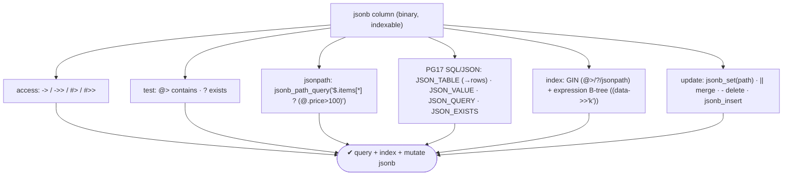
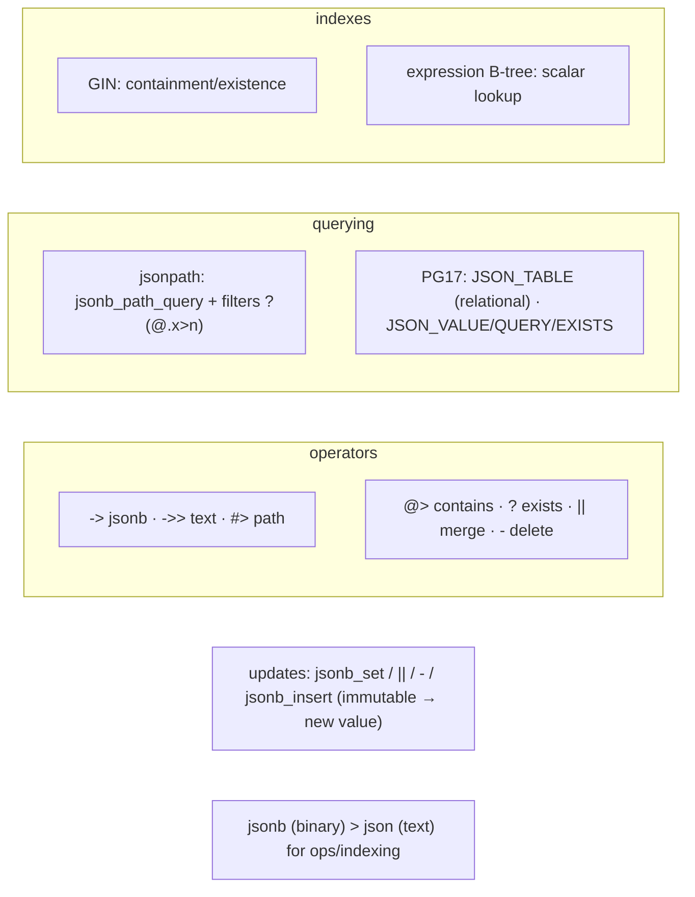

# Lab 116 — `jsonb` Deep-Dive: Operators, `jsonb_path_query`, Indexing, Partial Updates with `jsonb_set`

> **Track B · Developer · B6 Modern Types & Advanced Features · Lab 1 of 8 (Lab 116/222)**
> Teaching package: concept → diagram → steps → verify → quick-ref → self-test → video script.
> **Depends on:** Lab 100 (GIN), Lab 98 (expression index), Lab 109 (jsonb updates & bloat). Opens the modern-types track.

---

## 0. Lab Card (at a glance)

| Field | Value |
|---|---|
| **Objective** | Use the jsonb operator set, query with jsonpath (`jsonb_path_query`) and PG17 SQL/JSON functions, index jsonb two ways, and do partial updates with `jsonb_set`. |
| **Success criterion** | Operators extract/test/merge; jsonpath filters work; `JSON_TABLE` shreds JSON to rows; GIN + expression indexes serve their queries; `jsonb_set` updates a nested field. |
| **Scope boundary** | jsonb querying/indexing/updates. GIN internals were Lab 100. |
| **Prereqs** | Lab 100/98; a jsonb dataset |
| **Time** | 35–50 min |
| **Difficulty** | ★★★★☆ |
| **Risk** | Low — scratch table. |

---

## 1. Learning Objectives

1. **jsonb vs json** and the operator toolkit.
2. **jsonpath** — `jsonb_path_query` and filters.
3. **PG17 SQL/JSON** — `JSON_TABLE`/`JSON_VALUE`/`JSON_QUERY`/`JSON_EXISTS`.
4. **Indexing** — GIN + expression.
5. **Partial updates** — `jsonb_set`/`||`/`-`/`jsonb_insert`.

---

## 2. Concept Primer — the "why"

**`jsonb` is binary, parsed JSON — indexable and operator-rich.** Unlike `json` (stored as exact text, preserving whitespace/key order/duplicates), `jsonb` is decomposed on input: keys deduped, whitespace dropped, stored for **fast access and indexing**. Use `jsonb` for essentially everything; use `json` only when you must preserve the exact input text.

**The operator toolkit:**
- **Access:** `->` (get field/element as **jsonb**), `->>` (as **text**), `#>` (get at a **path** as jsonb), `#>>` (path as text). `data->'a'`, `data->>'a'`, `data#>'{a,b}'`.
- **Test:** `@>` **contains** (`data @> '{"k":"v"}'`), `<@` contained-by, `?` **key exists**, `?|` any, `?&` all.
- **Modify (return a new jsonb):** `||` **merge/concat**, `-` **delete key/element**, `#-` delete at path.
- **jsonpath:** `@?` exists, `@@` match.
*(Rule of thumb: `->` when you'll keep navigating jsonb; `->>` when you want a text value to compare or display.)*

**jsonpath — a query language for JSON (PG12+).** Like XPath for XML: `$` root, `.key`, `[*]` all array elements, `[0]` index, `?(@ > 5)` filter, `@` current, methods (`.size()`, `.type()`, `.double()`).
- **`jsonb_path_query(data, '$.items[*].price')`** → matching values as a **set** (SRF).
- `jsonb_path_query_first` / `_array`, `jsonb_path_exists` (≡ `@?`), `jsonb_path_match` (≡ `@@`).
- Filter: `$.items[*] ? (@.price > 100)` → items over 100.

**PG17 SQL/JSON functions (new — SQL:2023 standard):**
- **`JSON_TABLE`** — **shred JSON into a relational table** (rows/columns). The headline PG17 feature for turning documents into tabular data:
  ```sql
  SELECT * FROM JSON_TABLE(data, '$.items[*]'
    COLUMNS (name text PATH '$.name', price numeric PATH '$.price'));
  ```
- **`JSON_VALUE(data, '$.k')`** — extract a **scalar**; **`JSON_QUERY(data, '$.p')`** — extract a **JSON fragment**; **`JSON_EXISTS(data, '$.p')`** — **boolean**.

**Indexing (Labs 100/98):**
- **GIN** for containment/existence/jsonpath: `USING gin (data)` (jsonb_ops — all operators) or `USING gin (data jsonb_path_ops)` (`@>` only, smaller/faster).
- **Expression B-tree** for a **specific scalar**: `CREATE INDEX ON t ((data->>'sku'));` — equality/range on that field.
- Combine: GIN for `@>`/`?`, expression B-tree for hot scalar lookups.

**Partial updates — `jsonb_set` and friends.** jsonb values are **immutable**; a "partial update" builds a **new** jsonb with the change and assigns it (the whole column value is rewritten — a new MVCC version, Lab 109 — so frequent deep updates bloat like any update). The functions let you express the change concisely:
- **`jsonb_set(target, path, new_value [, create_if_missing])`** — set a value at a path (`path` is a `text[]`): `jsonb_set(data, '{address,city}', '"Mumbai"')`.
- **`||`** — shallow merge (add/overwrite top-level keys): `data || '{"active":true}'`.
- **`-` / `#-`** — delete a key / at a path.
- **`jsonb_insert(target, path, value, insert_after)`** — insert into an array at a position.

---

## 3. Diagrams

### 3.1 jsonb workflow



### 3.2 Concept map



---

## 4. Prerequisites — jsonb documents

```bash
sudo -u postgres psql -d shopdb <<'SQL'
DROP TABLE IF EXISTS docs;
CREATE TABLE docs (id bigint GENERATED ALWAYS AS IDENTITY PRIMARY KEY, data jsonb);
INSERT INTO docs (data) VALUES
 ('{"sku":"A1","name":"Widget","price":50,"tags":["sale","new"],"address":{"city":"Pune"},"items":[{"n":"x","price":30},{"n":"y","price":120}]}'),
 ('{"sku":"B2","name":"Gadget","price":200,"tags":["clearance"],"address":{"city":"Delhi"},"items":[{"n":"z","price":250}]}');
SQL
```

---

## 5. Step-by-Step

### Step 1 — Access + test operators

```bash
sudo -u postgres psql -d shopdb -c "
SELECT data->>'sku'          AS sku,          -- text
       data->'tags'          AS tags_jsonb,   -- jsonb
       data#>>'{address,city}' AS city,        -- path as text
       data @> '{\"price\":50}' AS is_50,      -- containment
       data ? 'name'         AS has_name       -- key exists
FROM docs;"
```

### Step 2 — Modify operators (merge, delete)

```bash
sudo -u postgres psql -d shopdb -c "SELECT (data || '{\"active\":true}')->>'active' AS merged FROM docs WHERE id=1;"   # || merge
sudo -u postgres psql -d shopdb -c "SELECT (data - 'tags') ? 'tags' AS tags_removed FROM docs WHERE id=1;"             # - delete
```

### Step 3 — jsonpath with jsonb_path_query + filter

```bash
sudo -u postgres psql -d shopdb -c "
SELECT id, jsonb_path_query(data, '\$.items[*] ? (@.price > 100)') AS pricey_item
FROM docs;"                                        # items over 100 across docs
sudo -u postgres psql -d shopdb -c "
SELECT id, jsonb_path_query_array(data, '\$.tags[*]') AS tags,
       jsonb_path_exists(data, '\$.address.city') AS has_city
FROM docs;"
```

### Step 4 — PG17 SQL/JSON: JSON_TABLE + JSON_VALUE/QUERY/EXISTS

```bash
sudo -u postgres psql -d shopdb -c "
SELECT d.id, jt.name, jt.price
FROM docs d,
     JSON_TABLE(d.data, '\$.items[*]' COLUMNS (name text PATH '\$.n', price numeric PATH '\$.price')) AS jt
ORDER BY d.id, jt.price;"                          # PG17: JSON → relational rows
sudo -u postgres psql -d shopdb -c "
SELECT JSON_VALUE(data, '\$.name')  AS name,       -- scalar
       JSON_QUERY(data, '\$.tags')  AS tags,       -- fragment
       JSON_EXISTS(data, '\$.address.city') AS has_city
FROM docs;" 2>&1 | tail -4
```

### Step 5 — Indexing: GIN (containment) + expression (scalar)

```bash
sudo -u postgres psql -d shopdb <<'SQL'
CREATE INDEX docs_gin ON docs USING gin (data);                 -- @>, ?, jsonpath
CREATE INDEX docs_sku ON docs ((data->>'sku'));                 -- scalar equality (Lab 98)
ANALYZE docs;
SQL
sudo -u postgres psql -d shopdb -c "EXPLAIN (COSTS OFF) SELECT * FROM docs WHERE data @> '{\"price\":200}';"   # GIN
sudo -u postgres psql -d shopdb -c "EXPLAIN (COSTS OFF) SELECT * FROM docs WHERE data->>'sku' = 'A1';"          # expression index
```

### Step 6 — Partial updates: jsonb_set, jsonb_insert

```bash
sudo -u postgres psql -d shopdb <<'SQL'
-- update a nested field without rewriting the whole doc:
UPDATE docs SET data = jsonb_set(data, '{address,city}', '"Mumbai"') WHERE id=1;
-- add a new nested key (create_if_missing default true):
UPDATE docs SET data = jsonb_set(data, '{address,zip}', '"411001"') WHERE id=1;
-- append to an array:
UPDATE docs SET data = jsonb_insert(data, '{tags,0}', '"featured"', true) WHERE id=1;
SQL
sudo -u postgres psql -d shopdb -c "SELECT data#>>'{address,city}' AS city, data->'tags' AS tags FROM docs WHERE id=1;"
```

---

## 6. Verification Checklist

- [ ] `->`/`->>`/`#>>` extract values; `@>`/`?` test
- [ ] `||` merged and `-` deleted keys
- [ ] `jsonb_path_query` with a filter returned matches
- [ ] `JSON_TABLE` shredded JSON into rows (PG17)
- [ ] `JSON_VALUE`/`JSON_QUERY`/`JSON_EXISTS` worked
- [ ] GIN serves `@>`; expression index serves `->>' sku'`
- [ ] `jsonb_set`/`jsonb_insert` did partial updates

---

## 7. Troubleshooting

| Symptom | Cause | Fix |
|---|---|---|
| `->` vs `->>` confusion | `->` = jsonb, `->>` = text | Use `->>` for text compare/output |
| jsonpath returns nothing | Path/syntax | `$` root, `[*]` array, `?(@.x>n)` filter |
| `jsonb_set` didn't change | Wrong path / type | `path` is `text[]`; value is jsonb |
| Index not used | Wrong opclass/operator | GIN for `@>`/`?`; expression for scalar (Labs 100/98) |
| Deep merge wrong | `||` is shallow | `jsonb_set` per path (no built-in deep merge) |
| `JSON_TABLE` unknown | Pre-PG17 | PG17+ feature |
| Frequent doc updates bloat | Whole value rewritten (immutable) | Fewer/targeted updates; HOT if column unindexed (Lab 109) |

---

## 8. Quick Reference Card (paste-ready)

```sql
-- ACCESS:  data->'k' (jsonb) · data->>'k' (text) · data#>'{a,b}' · data#>>'{a,b}'
-- TEST:    data @> '{"k":"v"}' · data ? 'k' · ?| ?& · @? @@ (jsonpath)
-- MODIFY:  data || '{"k":v}' (merge) · data - 'k' · data #- '{a,b}'

-- jsonpath:
SELECT jsonb_path_query(data, '$.items[*] ? (@.price > 100)') FROM t;   -- set of matches
--   jsonb_path_query_first/_array · jsonb_path_exists (@?) · jsonb_path_match (@@)

-- PG17 SQL/JSON:
SELECT * FROM JSON_TABLE(data, '$.items[*]' COLUMNS (name text PATH '$.n', price numeric PATH '$.price'));
SELECT JSON_VALUE(data,'$.k'), JSON_QUERY(data,'$.p'), JSON_EXISTS(data,'$.p');

-- INDEX:  USING gin (data)  /  USING gin (data jsonb_path_ops)  ·  ((data->>'sku'))  -- expression B-tree
-- UPDATE: jsonb_set(data,'{a,b}', '"v"')  ·  ||  ·  -  ·  jsonb_insert(data,'{arr,0}','"v"', true)
-- jsonb (binary/indexable) > json (text) · values immutable → updates rewrite the value
```

---

## 9. Self-Check

1. What's the difference between `jsonb` and `json`?
2. What's the difference between `->` and `->>`?
3. What is jsonpath, and what does `jsonb_path_query` do?
4. What new SQL/JSON functions did PG17 add?
5. How do you index jsonb for containment vs a scalar lookup?
6. How do you do a partial (nested) update?

<details>
<summary>Answers</summary>

1. `jsonb` is binary/parsed (deduped keys, indexable, fast ops); `json` is raw text (preserves exact input).
2. `->` returns **jsonb**; `->>` returns **text**.
3. A JSON path query language; `jsonb_path_query` returns matching values as a set and supports filters like `?(@.price > 100)`.
4. `JSON_TABLE` (JSON → relational rows), `JSON_VALUE` (scalar), `JSON_QUERY` (fragment), `JSON_EXISTS` (boolean).
5. **GIN** (`USING gin (data)`) for `@>`/`?`/jsonpath; an **expression B-tree** (`((data->>'sku'))`) for equality/range on a specific scalar.
6. `jsonb_set(data, '{path}', value)` (or `||` to merge, `jsonb_insert` for arrays) — producing a new jsonb value.
</details>

---

## 10. Video / Teaching Script

| # | On screen | Say (narration) |
|---|---|---|
| 1 | Title: "JSON, but a first-class citizen" | "jsonb isn't just a text blob — it's binary, indexable, and packed with operators. Let's really work with it." |
| 2 | operators | "Arrow for jsonb, double-arrow for text. Contains, key-exists, merge, delete — a whole toolkit in punctuation." |
| 3 | jsonpath | "For anything deep, jsonpath: 'all items over a hundred rupees' in one expression, with a filter." |
| 4 | JSON_TABLE | "And new in 17 — JSON_TABLE turns a JSON array straight into rows and columns. Your document becomes a table." |
| 5 | index | "Index it two ways: GIN for containment, a plain index for a specific field. Fast either way." |
| 6 | jsonb_set | "Change one nested value without rewriting the whole document — jsonb_set, point at the path, done." |
| 7 | Outro | "jsonb, mastered. Next: arrays and array operators." |

---

## 11. Glossary

- **jsonb / json** — binary indexable / raw text JSON.
- **`->` / `->>` / `#>` / `#>>`** — get jsonb/text, at path.
- **`@>` / `?` / `||` / `-`** — contains / key-exists / merge / delete.
- **jsonpath / `jsonb_path_query`** — JSON query language / value SRF.
- **`JSON_TABLE` (PG17)** — shred JSON into relational rows.
- **GIN / expression index** — containment/existence / scalar lookup.
- **`jsonb_set` / `jsonb_insert`** — partial update / array insert.

---
*NETAPORT lab series · PostgreSQL 17 on AlmaLinux 9 · Lab 116/222 · B6 Modern Types & Advanced Features*
