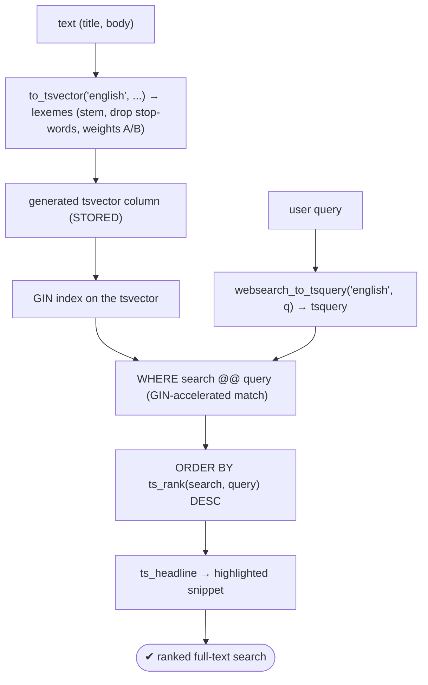

# Lab 117 — Full-Text Search: `tsvector`/`tsquery`, Ranking, a Generated `tsvector` Column + GIN Index

> **Track B · Developer · B6 Modern Types & Advanced Features · Lab 2 of 8 (Lab 117/222)**
> Teaching package: concept → diagram → steps → verify → quick-ref → self-test → video script.
> **Depends on:** Lab 83 (generated columns), Lab 100 (GIN). **Related:** Lab 70 (pg_trgm fuzzy).

---

## 0. Lab Card (at a glance)

| Field | Value |
|---|---|
| **Objective** | Build full-text search: `to_tsvector`/`tsquery` matching with `@@`, relevance ranking with `ts_rank`/`setweight`, and a generated `tsvector` column + GIN index for performance. |
| **Success criterion** | Stemmed matching works; queries rank by relevance; a generated tsvector column + GIN index serves `@@` queries; `websearch_to_tsquery` handles raw input; `ts_headline` highlights. |
| **Scope boundary** | FTS core. Fuzzy/trigram search was Lab 70; jsonb Lab 116. |
| **Prereqs** | Lab 83/100; a text dataset |
| **Time** | 35–50 min |
| **Difficulty** | ★★★★☆ |
| **Risk** | Low — scratch table. |

---

## 1. Learning Objectives

1. **tsvector / tsquery** — lexemes and query operators.
2. **Matching** with `@@` and text-search configs.
3. **Query builders** — `to_/plainto_/phraseto_/websearch_`.
4. **Ranking** — `ts_rank`, `setweight`, `ts_headline`.
5. **The performant pattern** — generated column + GIN.

---

## 2. Concept Primer — the "why"

**Full-text search normalizes language; `LIKE '%x%'` doesn't.** `LIKE` is literal substring matching — no stemming, no ranking, and unindexable for leading wildcards. FTS parses text into **lexemes** (normalized word roots), removes noise, and matches/ranks like a search engine.

**The two types:**
- **`tsvector`** — a sorted set of distinct **lexemes** with positions, from **`to_tsvector(config, text)`**. `to_tsvector('english', 'The quick brown foxes')` → `'brown':3 'fox':4 'quick':2` — **stemmed** (foxes→fox), **stop-words removed** ("the"), positions kept. The **configuration** (`'english'`, `'simple'`, …) drives stemming/stop-words: `'english'` stems and drops stop-words; `'simple'` just lowercases and keeps everything.
- **`tsquery`** — search terms with operators: `&` AND, `|` OR, `!` NOT, `<->` **followed-by** (phrase), `<N>` distance.

**Matching — the `@@` operator:** `tsvector @@ tsquery` → true if the document matches. Use the **same config** on both sides.

**Building queries — pick the right constructor:**
- **`to_tsquery('english', 'quick & fox')`** — full operator syntax (you control `&`/`|`/`!`).
- **`plainto_tsquery('english', 'quick fox')`** — treats input as AND-ed words (`quick & fox`).
- **`phraseto_tsquery('english', 'quick fox')`** — a **phrase** (`quick <-> fox`, adjacent).
- **`websearch_to_tsquery('english', 'fox OR cat -dog "quick brown"')`** — **web-search syntax** (quotes = phrase, OR, `-` exclude). **Safe for raw user input** — no syntax errors on arbitrary text; use this for search boxes.

**Ranking — order by relevance:**
- **`ts_rank(tsvector, tsquery)`** — score by lexeme frequency/position; **`ts_rank_cd`** — cover-density (proximity-aware).
- **`setweight(to_tsvector(...), 'A')`** — assign weights **A/B/C/D** to different fields (title=A, body=B), so `ts_rank` counts title hits more. Order with `ORDER BY ts_rank(...) DESC`.
- **`ts_headline(config, document, query)`** — returns the document with matched terms **highlighted** (for result snippets).

**The performant pattern — generated tsvector column + GIN index.** FTS `@@` queries need a **GIN index** on the tsvector. The modern approach (PG12+) is a **generated `STORED` column** (Lab 83) that computes the tsvector, plus a GIN index on it — replacing the old trigger-maintained column:
```sql
ALTER TABLE t ADD COLUMN search tsvector
  GENERATED ALWAYS AS (setweight(to_tsvector('english', coalesce(title,'')), 'A') ||
                       setweight(to_tsvector('english', coalesce(body ,'')), 'B')) STORED;
CREATE INDEX t_search_gin ON t USING gin (search);
```
The generated column stays correct automatically; the GIN index makes `WHERE search @@ query` fast. *(The config in a generated column must be a literal — `to_tsvector('english', …)` is immutable; a dynamic per-row config isn't allowed there.)*

---

## 3. Diagrams

### 3.1 FTS pipeline



### 3.2 Concept

```mermaid
flowchart LR
    subgraph TYPES [types]
      TV["tsvector: lexemes+positions (config: stem/stop-words)"]
      TQ["tsquery: & | ! <-> operators"]
    end
    TV -->|@@| TQ
    subgraph BUILD [query builders]
      B1["to_tsquery (operators)"]
      B2["plainto (AND words)"]
      B3["phraseto (<-> phrase)"]
      B4["websearch (web syntax, SAFE for user input)"]
    end
    subgraph RANK [rank]
      R1["ts_rank / ts_rank_cd"]
      R2["setweight A/B/C/D (field importance)"]
      R3["ts_headline (highlight)"]
    end
    note["performant: generated tsvector column + GIN · vs LIKE (no stem/rank/index)"]
```

---

## 4. Prerequisites — articles

```bash
sudo -u postgres psql -d shopdb <<'SQL'
DROP TABLE IF EXISTS articles;
CREATE TABLE articles (id bigint GENERATED ALWAYS AS IDENTITY PRIMARY KEY, title text, body text);
INSERT INTO articles (title, body) VALUES
 ('Fast foxes', 'The quick brown fox jumps over the lazy dogs repeatedly.'),
 ('Database indexing', 'PostgreSQL indexing strategies including GIN and B-tree for fast queries.'),
 ('Running tips', 'Runners run faster with proper training and running shoes.'),
 ('GIN internals', 'The GIN index accelerates full text search and jsonb containment.');
SQL
```

---

## 5. Step-by-Step

### Step 1 — to_tsvector / to_tsquery basics + stemming

```bash
sudo -u postgres psql -d shopdb -c "SELECT to_tsvector('english', 'The quick brown foxes jumping');"   # stems, drops 'the'
sudo -u postgres psql -d shopdb -c "
SELECT title FROM articles
WHERE to_tsvector('english', body) @@ to_tsquery('english', 'run');"   # matches 'Running tips' (run/runners/running stem to run)
```

### Step 2 — Query builder variants

```bash
sudo -u postgres psql -d shopdb -c "SELECT to_tsquery('english','quick & fox') AS to_tsq,
                                            plainto_tsquery('english','quick fox') AS plain,
                                            phraseto_tsquery('english','quick fox') AS phrase,
                                            websearch_to_tsquery('english','fox -dog \"brown fox\"') AS websearch;"
```

### Step 3 — Ranking with ts_rank + weights

```bash
sudo -u postgres psql -d shopdb -c "
SELECT title,
       ts_rank(setweight(to_tsvector('english', title), 'A') ||
               setweight(to_tsvector('english', body ), 'B'),
               to_tsquery('english', 'gin | index')) AS rank
FROM articles
WHERE (setweight(to_tsvector('english', title),'A') || setweight(to_tsvector('english', body),'B'))
      @@ to_tsquery('english', 'gin | index')
ORDER BY rank DESC;"
#   title matches rank higher (weight A)
```

### Step 4 — Highlighting with ts_headline

```bash
sudo -u postgres psql -d shopdb -c "
SELECT ts_headline('english', body, to_tsquery('english', 'fox'),
                   'StartSel=<b>, StopSel=</b>') AS snippet
FROM articles WHERE to_tsvector('english', body) @@ to_tsquery('english', 'fox');"
```

### Step 5 — Generated tsvector column + GIN index (the pattern)

```bash
sudo -u postgres psql -d shopdb <<'SQL'
ALTER TABLE articles ADD COLUMN search tsvector
  GENERATED ALWAYS AS (
    setweight(to_tsvector('english', coalesce(title,'')), 'A') ||
    setweight(to_tsvector('english', coalesce(body ,'')), 'B')
  ) STORED;
CREATE INDEX articles_search_gin ON articles USING gin (search);
ANALYZE articles;
SQL
```

### Step 6 — Ranked search using the index (EXPLAIN shows GIN)

```bash
sudo -u postgres psql -d shopdb -c "
EXPLAIN (COSTS OFF)
SELECT id FROM articles WHERE search @@ websearch_to_tsquery('english', 'gin index');"   # Bitmap Index Scan on the GIN
sudo -u postgres psql -d shopdb -c "
SELECT title, ts_rank(search, q) AS rank
FROM articles, websearch_to_tsquery('english', 'gin index') q
WHERE search @@ q ORDER BY rank DESC;"
```

---

## 6. Verification Checklist

- [ ] `to_tsvector` stems and drops stop-words
- [ ] `@@` matched via stemming (run/running/runners)
- [ ] Query builders behave (to_/plainto_/phraseto_/websearch_)
- [ ] `ts_rank` + `setweight` ranked title hits higher
- [ ] `ts_headline` highlighted matches
- [ ] Generated tsvector column + GIN index created
- [ ] `EXPLAIN` shows GIN for `search @@ query`

---

## 7. Troubleshooting

| Symptom | Cause | Fix |
|---|---|---|
| No matches | Config mismatch (english vs simple) | Use the same config on tsvector and tsquery |
| Slow FTS | No GIN index | Generated tsvector column + GIN |
| Common word ignored | Stop-word removed | Expected; use `'simple'` config to keep all |
| `to_tsquery` syntax error on user input | Raw text has operators/spaces | Use `websearch_to_tsquery`/`plainto_tsquery` |
| Ranking meaningless | No weights | `setweight` A–D; `ts_rank_cd` for proximity |
| Generated column rejected | Non-literal config | Use a literal config (`to_tsvector('english', …)`) |
| Highlight not HTML | Options | `ts_headline(..., 'StartSel=..,StopSel=..')` |

---

## 8. Quick Reference Card (paste-ready)

```sql
-- match: to_tsvector('english', doc) @@ tsquery
-- build query: to_tsquery('english','a & b') · plainto_tsquery · phraseto_tsquery (<->) · websearch_to_tsquery (user input)

-- PERFORMANT pattern: generated tsvector column + GIN
ALTER TABLE t ADD COLUMN search tsvector GENERATED ALWAYS AS (
  setweight(to_tsvector('english', coalesce(title,'')),'A') ||
  setweight(to_tsvector('english', coalesce(body ,'')),'B')) STORED;
CREATE INDEX ON t USING gin (search);

-- query + rank + highlight:
SELECT id, ts_rank(search, q) FROM t, websearch_to_tsquery('english', :q) q
WHERE search @@ q ORDER BY ts_rank(search, q) DESC;
SELECT ts_headline('english', body, q, 'StartSel=<b>,StopSel=</b>') FROM ...;

-- config drives stem/stop-words ('english' stems, 'simple' keeps all) · vs LIKE (no stem/rank/index)
```

---

## 9. Self-Check

1. What are `tsvector` and `tsquery`?
2. What does `to_tsvector` do to text?
3. What operator matches a document to a query?
4. What are the query-builder variants, and which is safe for user input?
5. How do you rank results and weight fields?
6. What's the performant FTS pattern?

<details>
<summary>Answers</summary>

1. `tsvector` is a document's normalized **lexemes + positions**; `tsquery` is the **search terms with operators** (`&`/`|`/`!`/`<->`).
2. Parses it into lexemes — **stemming**, **stop-word removal**, normalization — per the text-search configuration.
3. **`@@`** (`tsvector @@ tsquery`).
4. `to_tsquery` (operators), `plainto_tsquery` (AND words), `phraseto_tsquery` (phrase), `websearch_to_tsquery` — the last is **safe for raw user input**.
5. `ts_rank`/`ts_rank_cd`, with `setweight('A'–'D')` to prioritize fields (title=A); `ORDER BY ts_rank(...) DESC`.
6. A **generated `tsvector` column (STORED)** + a **GIN index**, queried with `@@` and `ts_rank`.
</details>

---

## 10. Video / Teaching Script

| # | On screen | Say (narration) |
|---|---|---|
| 1 | Title: "Search that understands words" | "LIKE finds substrings. Full-text search finds *meaning* — 'running' matches 'run', ranks by relevance, and it's fast." |
| 2 | tsvector | "to_tsvector breaks text into word-roots, drops the noise words, and remembers positions. That's a searchable document." |
| 3 | @@ + stemming | "Search for 'run' and you match 'running', 'runners' — all the same root. Try that with LIKE." |
| 4 | websearch | "For a search box, use websearch-to-tsquery — quotes, OR, minus-to-exclude — and it never chokes on weird input." |
| 5 | ranking | "Rank by relevance, and weight the title higher than the body, so a title match wins." |
| 6 | generated + GIN | "Make it fast and permanent: a generated column that builds the search vector, and a GIN index on it. Query, rank, highlight." |
| 7 | Outro | "Real search, built in. Next: arrays and array operators." |

---

## 11. Glossary

- **Full-text search** — lexeme-based, ranked text matching.
- **tsvector / tsquery** — document lexemes / search terms.
- **Lexeme / stemming / stop-word** — normalized root / reduce to root / dropped noise.
- **`@@`** — the FTS match operator.
- **`websearch_to_tsquery`** — user-safe query builder.
- **`ts_rank` / `setweight`** — relevance / field weighting (A–D).
- **Generated tsvector column + GIN** — the performant pattern.

---
*NETAPORT lab series · PostgreSQL 17 on AlmaLinux 9 · Lab 117/222 · B6 Modern Types & Advanced Features*
