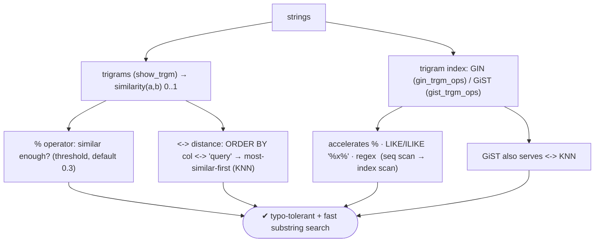
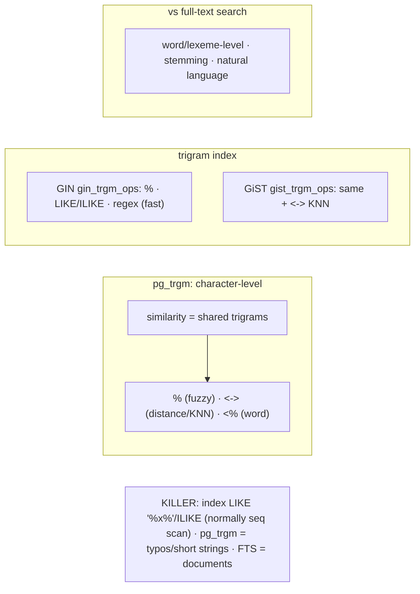

# Lab 118 — Fuzzy Search with `pg_trgm` Similarity + Trigram Index

> **Track B · Developer · B6 Modern Types & Advanced Features · Lab 3 of 8 (Lab 118/222)**
> Teaching package: concept → diagram → steps → verify → quick-ref → self-test → video script.
> **Depends on:** Lab 70 (pg_trgm), Lab 100 (GIN), Lab 101 (GiST/KNN), Lab 117 (FTS contrast).

---

## 0. Lab Card (at a glance)

| Field | Value |
|---|---|
| **Objective** | Use `pg_trgm` for typo-tolerant fuzzy matching (`similarity`, `%`, `<->`), and add a trigram index to accelerate similarity queries and `LIKE '%x%'`/`ILIKE`. |
| **Success criterion** | Fuzzy matches survive typos; `<->` orders by similarity; a trigram GIN/GiST index turns a `ILIKE '%x%'` seq scan into an index scan. |
| **Scope boundary** | Trigram fuzzy search. Word-level FTS was Lab 117. |
| **Prereqs** | Lab 70; a string dataset |
| **Time** | 30–40 min |
| **Difficulty** | ★★★☆☆ |
| **Risk** | Low — read-mostly. |

---

## 1. Learning Objectives

1. **Trigrams + `similarity`** — how fuzzy matching scores.
2. **`%` and `<->`** — fuzzy match and KNN distance.
3. **Thresholds** — tuning looseness.
4. **Trigram indexes** — GIN vs GiST.
5. **The killer feature** — indexing `LIKE '%x%'`/`ILIKE`.

---

## 2. Concept Primer — the "why"

**A trigram is a 3-character slice; similarity counts shared trigrams.** `pg_trgm` breaks strings into trigrams (`show_trgm('cat')` → `{"  c"," ca","cat","at "}`, space-padded) and scores **`similarity(a, b)`** as the fraction of trigrams they share — **0 to 1** (1 = identical). This is **character-level** matching, so it tolerates **typos and spelling variations** — perfect for "did you mean," name matching, and short strings.

**Complement to full-text search (Lab 117):**
- **FTS** — word/lexeme-level, stemming, whole-word concepts ("find documents about *running*").
- **pg_trgm** — character-level similarity, **typo-tolerant**, works on short strings (names, SKUs, misspellings), and **accelerates substring search**.
Use FTS for natural-language documents; use pg_trgm for fuzzy/partial string matching.

**Operators:**
- **`%`** — similarity operator: `a % b` is true when `similarity(a,b) ≥ pg_trgm.similarity_threshold` (default **0.3**). "Are these similar enough?"
- **`<->`** — **distance** (`1 - similarity`), for **KNN ordering**: `ORDER BY col <-> 'query'` returns most-similar-first.
- **`<%`** / **`<<->`** — **word** similarity/distance (is a *word within* the string similar).
- Functions: `similarity()`, `word_similarity()`, `strict_word_similarity()`.

**Thresholds** tune looseness: `pg_trgm.similarity_threshold` for `%` (lower = more matches), `pg_trgm.word_similarity_threshold` for `<%`. Set per session with `SET`.

**Trigram indexes — GIN vs GiST:**
- **GIN** (`gin_trgm_ops`): `CREATE INDEX ON t USING gin (col gin_trgm_ops);` — accelerates `%`, **`LIKE`/`ILIKE '%x%'`**, and regex (`~`). Faster lookups, larger index.
- **GiST** (`gist_trgm_ops`): `USING gist (col gist_trgm_ops)` — the same, **plus `<->` KNN** ordering (GiST supports nearest-neighbor; GIN does not). Smaller, and the choice for `ORDER BY col <-> 'query' LIMIT k`.
Rule: **GIN** for `%`/`LIKE` lookups; **GiST** when you need top-N most-similar (`<->`).

**The killer feature — indexing `LIKE '%x%'`/`ILIKE`.** A leading-wildcard `LIKE '%foo%'` normally forces a **sequential scan** (a B-tree can't help — Lab 95). A **trigram index makes it indexable**: `WHERE col ILIKE '%foo%'` uses the trigram GIN/GiST index → fast substring search across huge tables. This alone justifies pg_trgm for many apps.

---

## 3. Diagrams

### 3.1 Fuzzy-search flow



### 3.2 Concept + contrast



---

## 4. Prerequisites — names + a big table

```bash
sudo -u postgres psql -d shopdb <<'SQL'
CREATE EXTENSION IF NOT EXISTS pg_trgm;
DROP TABLE IF EXISTS people;
CREATE TABLE people (id bigint GENERATED ALWAYS AS IDENTITY PRIMARY KEY, name text);
INSERT INTO people (name) VALUES ('Rajesh Kumar'),('Rajeev Sharma'),('Rakesh Kumar'),('Suresh Menon'),('Ramesh Nair');
-- add bulk rows for the index demo:
INSERT INTO people (name) SELECT 'user '||md5(g::text) FROM generate_series(1,500000) g;
ANALYZE people;
SQL
```

---

## 5. Step-by-Step

### Step 1 — Trigrams + similarity

```bash
sudo -u postgres psql -d shopdb -c "SELECT show_trgm('Rajesh');"
sudo -u postgres psql -d shopdb -c "
SELECT name, similarity(name, 'Rajish Kumar') AS sim
FROM people WHERE id <= 5 ORDER BY sim DESC;"   # typo 'Rajish' → 'Rajesh Kumar' highest
```

### Step 2 — % operator (fuzzy match with threshold)

```bash
sudo -u postgres psql -d shopdb -c "SHOW pg_trgm.similarity_threshold;"   # 0.3
sudo -u postgres psql -d shopdb -c "SELECT name FROM people WHERE id<=5 AND name % 'Rajish Kumar';"   # similar-enough
sudo -u postgres psql -d shopdb -c "SET pg_trgm.similarity_threshold = 0.2; SELECT name FROM people WHERE id<=5 AND name % 'Rakish';"  # looser
```

### Step 3 — <-> distance for KNN "most similar"

```bash
sudo -u postgres psql -d shopdb -c "
SELECT name, name <-> 'Rakesh Kuma' AS dist
FROM people WHERE id<=5 ORDER BY name <-> 'Rakesh Kuma' LIMIT 3;"   # nearest first
```

### Step 4 — The killer feature: index LIKE '%x%' (before)

```bash
sudo -u postgres psql -d shopdb -c "EXPLAIN (ANALYZE, COSTS OFF) SELECT count(*) FROM people WHERE name ILIKE '%kumar%';"
#   → Seq Scan (500k rows) — no trigram index yet
```

### Step 5 — Add a trigram GIN index → LIKE/ILIKE/% use it

```bash
sudo -u postgres psql -d shopdb -c "CREATE INDEX people_name_trgm ON people USING gin (name gin_trgm_ops); ANALYZE people;"
sudo -u postgres psql -d shopdb -c "EXPLAIN (ANALYZE, COSTS OFF) SELECT count(*) FROM people WHERE name ILIKE '%kumar%';"
#   → Bitmap Index Scan on people_name_trgm — substring search now indexed
sudo -u postgres psql -d shopdb -c "EXPLAIN (COSTS OFF) SELECT name FROM people WHERE name % 'Rajish Kumar';"   # % also uses it
```

### Step 6 — GiST index for <-> KNN ordering

```bash
sudo -u postgres psql -d shopdb -c "CREATE INDEX people_name_gist ON people USING gist (name gist_trgm_ops); ANALYZE people;"
sudo -u postgres psql -d shopdb -c "
EXPLAIN (COSTS OFF) SELECT name FROM people ORDER BY name <-> 'Rakesh Kuma' LIMIT 5;"
#   → Index Scan using the GiST index (KNN) — GIN can't do this
```

---

## 6. Verification Checklist

- [ ] `similarity` ranked a typo'd query correctly
- [ ] `%` matched with the default threshold; looser at 0.2
- [ ] `<->` ordered by nearest (KNN)
- [ ] `ILIKE '%x%'` was a Seq Scan before the index
- [ ] Trigram GIN index turned it into an index scan
- [ ] `%` used the GIN index
- [ ] GiST index served `ORDER BY <->` KNN

---

## 7. Troubleshooting

| Symptom | Cause | Fix |
|---|---|---|
| `%` returns nothing | Below threshold | Lower `pg_trgm.similarity_threshold` |
| `LIKE '%x%'` still seq scan | No trigram index | `CREATE INDEX … USING gin (col gin_trgm_ops)` |
| `<->` KNN not using an index | GIN can't do KNN | Use GiST (`gist_trgm_ops`) |
| Poor matches on short input | <3 chars = few trigrams | Trigrams need 3+ characters |
| `similarity` vs `word_similarity` | Whole-string vs word-in-string | Use `word_similarity`/`<%` for substrings |
| Accents mismatch | Diacritics differ | Combine with the `unaccent` extension |
| GIN big / slow build | Large data | Expected; GiST smaller (slower lookups) |

---

## 8. Quick Reference Card (paste-ready)

```sql
CREATE EXTENSION pg_trgm;
-- similarity: SELECT similarity('Rajesh','Rajish');      -- 0..1 (shared trigrams)
-- fuzzy match: WHERE col % 'query'                        -- >= pg_trgm.similarity_threshold (0.3)
-- KNN nearest: ORDER BY col <-> 'query' LIMIT k           -- distance = 1 - similarity
-- word-in-string: col <% 'word'  /  word_similarity()

-- INDEX:
CREATE INDEX ON t USING gin  (col gin_trgm_ops);   -- % · LIKE/ILIKE '%x%' · regex  (fast lookups)
CREATE INDEX ON t USING gist (col gist_trgm_ops);  -- same + <-> KNN ordering

-- KILLER: trigram index makes LIKE '%x%' / ILIKE indexable (normally a Seq Scan)
-- SET pg_trgm.similarity_threshold = 0.2;   · pg_trgm = char-level/typos · FTS = word-level (Lab 117)
```

---

## 9. Self-Check

1. What is a trigram, and how does `similarity` work?
2. What does the `%` operator do?
3. What does `<->` do?
4. What are the two trigram index types and their difference?
5. What's the "killer feature" of a trigram index?
6. How does pg_trgm differ from full-text search?

<details>
<summary>Answers</summary>

1. A **3-character sequence**; `similarity(a,b)` is the fraction of trigrams the two strings share (0–1).
2. `a % b` is true when `similarity(a,b) ≥ pg_trgm.similarity_threshold` (default 0.3) — a fuzzy "similar enough" match.
3. **Distance** (`1 - similarity`), used for KNN ordering: `ORDER BY col <-> 'query'` returns most-similar-first.
4. **GIN** (`gin_trgm_ops`): fast for `%`/`LIKE`/`ILIKE`/regex; **GiST** (`gist_trgm_ops`): same **plus `<->` KNN**.
5. It makes **`LIKE '%x%'`/`ILIKE`** substring queries **indexable** (normally a sequential scan).
6. pg_trgm is **character-level** (typo-tolerant, short strings, LIKE acceleration); FTS is **word/lexeme-level** (stemming, natural-language documents).
</details>

---

## 10. Video / Teaching Script

| # | On screen | Say (narration) |
|---|---|---|
| 1 | Title: "Search that forgives typos" | "Users misspell. pg_trgm doesn't care — it matches by shared three-letter chunks, so 'Rajish' still finds 'Rajesh'." |
| 2 | similarity | "Similarity scores it, zero to one. And the percent operator asks 'close enough?' — with a threshold you can loosen or tighten." |
| 3 | KNN | "Want the *most* similar? The distance operator orders by nearest. Perfect for 'did you mean'." |
| 4 | LIKE seq scan | "Now the big one. LIKE percent-x-percent — a substring search — normally scans every row. Watch: half a million rows, sequential." |
| 5 | index | "Add a trigram index, and that same query becomes an index scan. Substring search, finally fast." |
| 6 | GiST | "One nuance: for the nearest-neighbor ordering, use GiST — GIN can't do it." |
| 7 | Outro | "Fuzzy and fast. Next: arrays and array operators." |

---

## 11. Glossary

- **Trigram** — a 3-character sequence.
- **`similarity` / `%`** — shared-trigram score / fuzzy-match operator.
- **`<->`** — trigram distance (KNN ordering).
- **`word_similarity` / `<%`** — word-in-string similarity.
- **`gin_trgm_ops` / `gist_trgm_ops`** — GIN / GiST trigram index (KNN with GiST).
- **LIKE acceleration** — trigram index indexes `LIKE '%x%'`.
- **`similarity_threshold`** — the `%` cutoff (default 0.3).

---
*NETAPORT lab series · PostgreSQL 17 on AlmaLinux 9 · Lab 118/222 · B6 Modern Types & Advanced Features*
