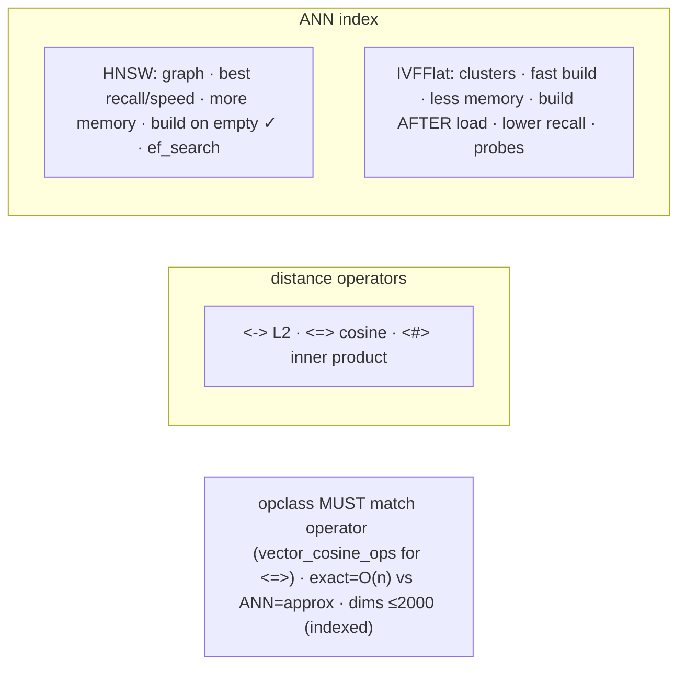

# Lab 119 — Vector Search with `pgvector`: Store Embeddings, HNSW/IVFFlat Index, ANN Query

> **Track B · Developer · B6 Modern Types & Advanced Features · Lab 4 of 8 (Lab 119/222)**
> Teaching package: concept → diagram → steps → verify → quick-ref → self-test → video script.
> **Depends on:** Lab 70 (extensions), Lab 101 (GiST/KNN concepts), Lab 95 (EXPLAIN). **Aligns with:** PharmaGraph pgvector.

---

## 0. Lab Card (at a glance)

| Field | Value |
|---|---|
| **Objective** | Store embeddings in a `vector` column, run exact and approximate (ANN) nearest-neighbor queries, build HNSW and IVFFlat indexes with the right operator class, and tune recall. |
| **Success criterion** | Exact KNN works (seq scan); an HNSW/IVFFlat index turns it into an index scan; the opclass matches the distance operator; `ef_search`/`probes` trade recall vs speed. |
| **Scope boundary** | pgvector storage/indexing/ANN. Generating embeddings is out of scope. |
| **Prereqs** | Lab 70; the `pgvector` package |
| **Time** | 35–50 min |
| **Difficulty** | ★★★★☆ |
| **Risk** | Low — read-mostly. |

---

## 1. Learning Objectives

1. **The `vector` type** — storing embeddings.
2. **Distance operators** — L2/cosine/inner product.
3. **Exact vs ANN** — the accuracy/speed trade-off.
4. **HNSW vs IVFFlat** — building and choosing.
5. **Tuning recall + hybrid filtering.**

---

## 2. Concept Primer — the "why"

**pgvector stores ML embeddings and finds the nearest ones — semantic/similarity search.** An embedding is a fixed-length float vector representing text/image/etc. meaning; "similar" items have nearby vectors. Store them as a **`vector(N)`** column (N = the model's dimensions — 384, 768, 1536, …). *(pgvector also has `halfvec` for half-precision, `sparsevec`, and `bit` for binary.)*

**Distance operators — pick the metric your model uses:**
- **`<->`** — **L2** (Euclidean) distance.
- **`<=>`** — **cosine** distance (`1 - cosine similarity`) — the common choice for **normalized text embeddings**.
- **`<#>`** — negative **inner product** (for max-inner-product search).
- **`<+>`** — L1 (Manhattan).
A KNN query: `ORDER BY embedding <=> '[query]' LIMIT k` → the k nearest rows.

**Exact vs Approximate (ANN):**
- **No index → exact KNN**: computes the distance to **every** row → 100% accurate but **O(n)** (a sequential scan) — fine for small tables, slow for large ones.
- **ANN index → approximate**: **much faster**, at a small **recall** cost (occasionally misses a true neighbor). This is what makes vector search scale.

**The two ANN indexes — the core choice:**

**HNSW (Hierarchical Navigable Small World)** — a multi-layer proximity **graph**.
```sql
CREATE INDEX ON items USING hnsw (embedding vector_cosine_ops) WITH (m = 16, ef_construction = 64);
```
- **Best recall + query speed**; **slower to build**, **more memory**. `m` = connections/node (16), `ef_construction` = build candidate list (64, higher = better/slower).
- **Can be built on an empty table** (added incrementally) — no need to pre-load.
- Query-time recall: **`SET hnsw.ef_search = 40;`** (higher = better recall, slower). **The default choice** for most workloads.

**IVFFlat (Inverted File Flat)** — k-means **clusters** (`lists`), searching the nearest `probes` clusters.
```sql
CREATE INDEX ON items USING ivfflat (embedding vector_cosine_ops) WITH (lists = 100);
```
- **Faster build, less memory**; **lower recall/speed** than HNSW.
- **Must be built AFTER loading data** (it clusters existing rows — building on an empty/small table gives bad clusters). `lists` ≈ rows/1000 (up to ~1M) or √rows (larger).
- Query-time recall: **`SET ivfflat.probes = 10;`** (more = better recall, slower; default 1).

**Choosing:** **HNSW by default** (best quality, build-on-empty). **IVFFlat** for very large datasets where HNSW memory is a concern or fast builds matter.

**The opclass must match the operator.** Create the index with the operator class for your query's distance: `vector_cosine_ops` for `<=>`, `vector_l2_ops` for `<->`, `vector_ip_ops` for `<#>` — or the index won't be used.

**Hybrid filter + vector.** `WHERE category='x' ORDER BY embedding <=> q LIMIT k` combines a filter with ANN. Before pgvector 0.8 a selective filter could return **fewer than k** results (the ANN scan didn't know about the filter); **pgvector 0.8** adds **iterative index scans** (`SET hnsw.iterative_scan = 'relaxed_order'`) to keep fetching until k pass the filter.

*(Index dimension limit: HNSW/IVFFlat index up to **2000** dims; use `halfvec` (up to 4000) for larger. `maintenance_work_mem` matters for HNSW build.)*

---

## 3. Diagrams

### 3.1 Vector-search flow

```mermaid
flowchart TD
    A["CREATE EXTENSION vector → vector(N) column"] --> B["insert embeddings (from an ML model)"]
    B --> C["exact KNN: ORDER BY embedding <=> q LIMIT k → Seq Scan (O(n), accurate)"]
    C --> D{ANN index}
    D -->|HNSW (graph, build-on-empty OK, best recall)| E["ANN query → Index Scan (fast, approximate)"]
    D -->|IVFFlat (clusters, build AFTER load)| E
    E --> F["tune recall: hnsw.ef_search / ivfflat.probes"]
    F --> G["hybrid: WHERE filter ... ORDER BY <=> q LIMIT k (0.8 iterative scan)"]
    G --> H([✔ semantic search at scale])
```

### 3.2 Concept + index choice



---

## 4. Prerequisites — pgvector + data

```bash
sudo dnf install -y pgvector_17 2>/dev/null || echo "install pgvector (package name varies: pgvector_17 / postgresql17-pgvector)"
sudo -u postgres psql -d shopdb -c "CREATE EXTENSION IF NOT EXISTS vector;"
sudo -u postgres psql -d shopdb -c "SELECT extversion FROM pg_extension WHERE extname='vector';"
```

---

## 5. Step-by-Step

### Step 1 — A vector column + readable small vectors

```bash
sudo -u postgres psql -d shopdb <<'SQL'
DROP TABLE IF EXISTS embeddings;
CREATE TABLE embeddings (id bigint GENERATED ALWAYS AS IDENTITY PRIMARY KEY, label text, vec vector(3));
INSERT INTO embeddings (label, vec) VALUES
 ('a','[1,0,0]'), ('b','[0.9,0.1,0]'), ('c','[0,1,0]'), ('d','[0,0,1]'), ('e','[0.8,0.2,0.1]');
SQL
# nearest to [1,0,0] by cosine:
sudo -u postgres psql -d shopdb -c "
SELECT label, vec <=> '[1,0,0]' AS cosine_dist FROM embeddings ORDER BY vec <=> '[1,0,0]' LIMIT 3;"
```

### Step 2 — A larger table + exact KNN (seq scan)

```bash
sudo -u postgres psql -d shopdb <<'SQL'
DROP TABLE IF EXISTS docs_vec;
CREATE TABLE docs_vec (id bigint GENERATED ALWAYS AS IDENTITY PRIMARY KEY, category text, vec vector(384));
-- simulate 200k random 384-dim embeddings (real ones come from a model):
INSERT INTO docs_vec (category, vec)
SELECT (ARRAY['med','bio','chem'])[1+(random()*2)::int],
       (SELECT ('['||string_agg((random())::text, ',')||']')::vector FROM generate_series(1,384))
FROM generate_series(1, 200000);
ANALYZE docs_vec;
SQL
sudo -u postgres psql -d shopdb <<'SQL'
\set q (SELECT vec FROM docs_vec WHERE id=1)
EXPLAIN (ANALYZE, COSTS OFF)
SELECT id FROM docs_vec ORDER BY vec <=> (SELECT vec FROM docs_vec WHERE id=1) LIMIT 5;
SQL
#   → Seq Scan / exact KNN over 200k rows
```

### Step 3 — HNSW index → ANN query

```bash
sudo -u postgres psql -d shopdb -c "SET maintenance_work_mem='512MB';
CREATE INDEX docs_vec_hnsw ON docs_vec USING hnsw (vec vector_cosine_ops) WITH (m=16, ef_construction=64);
ANALYZE docs_vec;"
sudo -u postgres psql -d shopdb -c "
EXPLAIN (ANALYZE, COSTS OFF)
SELECT id FROM docs_vec ORDER BY vec <=> (SELECT vec FROM docs_vec WHERE id=1) LIMIT 5;"
#   → Index Scan using docs_vec_hnsw — approximate, much faster
```

### Step 4 — Tune recall with ef_search

```bash
sudo -u postgres psql -d shopdb -c "SET hnsw.ef_search = 100;   -- higher recall, a bit slower (default 40)
SELECT id, vec <=> (SELECT vec FROM docs_vec WHERE id=1) AS d FROM docs_vec
ORDER BY vec <=> (SELECT vec FROM docs_vec WHERE id=1) LIMIT 5;"
```

### Step 5 — IVFFlat (contrast: build AFTER load, tune probes)

```bash
sudo -u postgres psql -d shopdb -c "
CREATE INDEX docs_vec_ivf ON docs_vec USING ivfflat (vec vector_cosine_ops) WITH (lists=200);  -- rows/1000
SET ivfflat.probes = 10;   -- more probes = better recall (default 1)
EXPLAIN (COSTS OFF) SELECT id FROM docs_vec ORDER BY vec <=> (SELECT vec FROM docs_vec WHERE id=1) LIMIT 5;"
#   (opclass vector_cosine_ops matches <=>)
```

### Step 6 — Hybrid: filter + vector (pgvector 0.8 iterative scan)

```bash
sudo -u postgres psql -d shopdb -c "SET hnsw.iterative_scan = 'relaxed_order';   -- pgvector 0.8: keep fetching until k pass the filter
SELECT id, category FROM docs_vec
WHERE category = 'med'
ORDER BY vec <=> (SELECT vec FROM docs_vec WHERE id=1) LIMIT 5;" 2>&1 | tail -6
#   filter + ANN together
```

---

## 6. Verification Checklist

- [ ] `vector(N)` column stores embeddings
- [ ] Cosine `<=>` KNN returns nearest rows
- [ ] Exact KNN was a Seq Scan on the large table
- [ ] HNSW index turned it into an Index Scan (ANN)
- [ ] `ef_search` tuned recall vs speed
- [ ] IVFFlat built after load; `probes` tuned (opclass matched)
- [ ] Hybrid filter + vector query worked

---

## 7. Troubleshooting

| Symptom | Cause | Fix |
|---|---|---|
| Index not used | opclass ≠ operator | Match: `vector_cosine_ops` for `<=>`, `vector_l2_ops` for `<->` |
| IVFFlat poor recall | Built on empty / few probes | Build **after** loading; raise `probes` |
| HNSW build slow / OOM | High `ef_construction`/`m`, low mem | Defaults; raise `maintenance_work_mem` |
| Dims > 2000 | Index limit | Use `halfvec` (≤4000) or reduce dims |
| Filtered query returns < k | Pre-0.8 ANN + filter | pgvector 0.8 `SET hnsw.iterative_scan`; or over-fetch |
| Recall too low | Small search list | Raise `ef_search` (HNSW) / `probes` (IVFFlat) |
| Wrong "similarity" | Metric mismatch | Use the operator your model expects (normalize for cosine) |

---

## 8. Quick Reference Card (paste-ready)

```sql
CREATE EXTENSION vector;
-- column: vec vector(384)   -- N = model dims (halfvec for >2000 dims indexed)
-- distance: <-> L2 · <=> cosine · <#> inner product   → ORDER BY vec <=> '[...]' LIMIT k  (KNN)

-- HNSW (default: best recall/speed, build-on-empty OK):
CREATE INDEX ON t USING hnsw (vec vector_cosine_ops) WITH (m=16, ef_construction=64);
SET hnsw.ef_search = 40;         -- ↑ recall, ↓ speed

-- IVFFlat (faster build; build AFTER loading data; lower recall):
CREATE INDEX ON t USING ivfflat (vec vector_cosine_ops) WITH (lists=100);   -- ≈ rows/1000
SET ivfflat.probes = 10;         -- ↑ recall

-- opclass MUST match operator (vector_cosine_ops ↔ <=>) · exact=O(n) vs ANN=approx
-- hybrid: WHERE filter ORDER BY vec <=> q LIMIT k  (pgvector 0.8: SET hnsw.iterative_scan)
```

---

## 9. Self-Check

1. What does pgvector store and do?
2. What are the distance operators?
3. What's the difference between exact and ANN search?
4. HNSW vs IVFFlat — key differences?
5. Why must the index opclass match the operator?
6. How do you tune recall?

<details>
<summary>Answers</summary>

1. It stores **vector embeddings** and does **nearest-neighbor similarity search** over them.
2. `<->` L2, `<=>` cosine, `<#>` inner product (and `<+>` L1).
3. **Exact** computes the distance to every row (accurate, O(n), seq scan); **ANN** uses an index for a fast **approximate** result (slight recall cost).
4. **HNSW**: graph, best recall/speed, more memory, **builds on an empty table**, tuned by `ef_search`. **IVFFlat**: clusters, faster build, less memory, **must build after loading data**, lower recall, tuned by `probes`.
5. The index is built for a specific metric; a query using a different distance operator can't use it (`vector_cosine_ops` ↔ `<=>`).
6. Raise **`hnsw.ef_search`** (HNSW) or **`ivfflat.probes`** (IVFFlat) — higher recall, slower.
</details>

---

## 10. Video / Teaching Script

| # | On screen | Say (narration) |
|---|---|---|
| 1 | Title: "Search by meaning" | "Embeddings turn text into vectors, and near vectors mean similar meaning. pgvector finds the nearest — that's semantic search." |
| 2 | distance | "Three ways to measure closeness — but for text embeddings, cosine distance is the usual pick." |
| 3 | exact seq scan | "Without an index, it compares your query to *every* row. Accurate — but on two hundred thousand vectors, slow." |
| 4 | HNSW | "Add an HNSW index — a graph of neighbors — and the same search becomes an index scan. Fast, and nearly as accurate." |
| 5 | tune | "Turn a knob — ef-search — to trade a little speed for more recall. And match the index's metric to your query, or it won't be used." |
| 6 | IVFFlat + hybrid | "IVFFlat builds faster but must see your data first. And you can combine a filter with the vector search — category *and* similarity." |
| 7 | Outro | "Vectors, indexed and searched. Next: arrays and array operators." |

---

## 11. Glossary

- **pgvector / `vector(N)`** — vector extension / N-dim embedding column.
- **Embedding** — a model's vector representation of an item.
- **`<->` / `<=>` / `<#>`** — L2 / cosine / inner-product distance.
- **KNN / ANN** — exact / approximate nearest neighbors.
- **HNSW / IVFFlat** — graph / cluster ANN index.
- **`ef_search` / `probes`** — recall knobs (HNSW / IVFFlat).
- **Operator class** — `vector_cosine_ops` etc., matched to the operator.

---
*NETAPORT lab series · PostgreSQL 17 on AlmaLinux 9 · Lab 119/222 · B6 Modern Types & Advanced Features*
