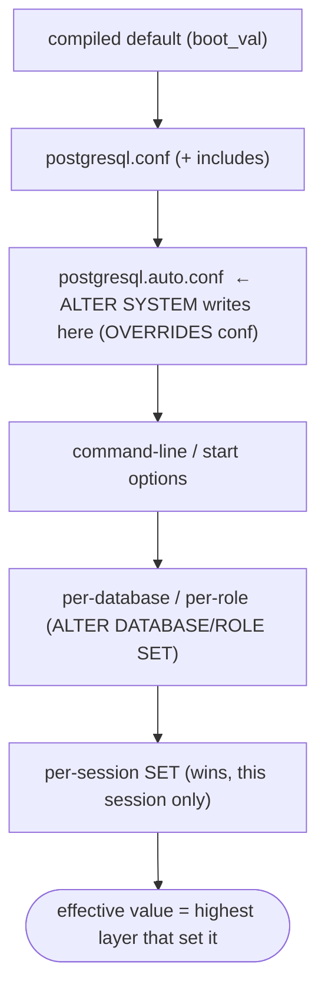
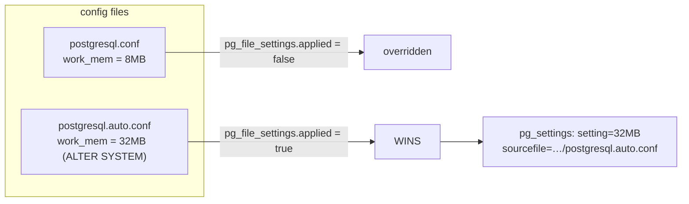

# Lab 12 — `ALTER SYSTEM` vs Editing `postgresql.conf`; Inspect `postgresql.auto.conf` and `pg_settings`

> **Track A · DBA · A2 Configuration & Tuning · Lab 4 of 7 (Lab 12/222)**
> Teaching package: concept → diagram → steps → verify → quick-ref → self-test → video script.
> **Depends on:** Labs 01–11 (you've used `ALTER SYSTEM` in Labs 9–11; now understand what it actually does).

---

## 0. Lab Card (at a glance)

| Field | Value |
|---|---|
| **Objective** | Compare the two persistent config methods, watch `postgresql.auto.conf` **override** `postgresql.conf` live, and trace any setting to its exact source with `pg_settings` / `pg_file_settings`. |
| **Success criterion** | You can set one GUC via both methods and prove which wins (via `sourcefile` / `applied`); you can revert cleanly with `ALTER SYSTEM RESET`. |
| **Scope boundary** | Persistent config layering + inspection. Per-role/db/session overrides are touched conceptually; logging config is Lab 14. |
| **Prereqs** | Labs 01–11; superuser access |
| **Time** | 20–30 min |
| **Difficulty** | ★★☆☆☆ |
| **Risk** | Low (config only; nothing destructive). |

---

## 1. Learning Objectives

1. **The precedence ladder** — defaults → `postgresql.conf` → `postgresql.auto.conf` → command line → per-db/role → session; **later wins**.
2. **What `ALTER SYSTEM` really does** — writes `postgresql.auto.conf`, never touches `postgresql.conf`, and validates.
3. **The override gotcha** — why "I edited `postgresql.conf` but nothing changed" almost always means an `ALTER SYSTEM` value is shadowing it.
4. **Trace any setting** — `pg_settings` (`source`, `sourcefile`, `sourceline`, `context`, `pending_restart`) and `pg_file_settings` (`applied`).
5. **Pick one source of truth** — why mixing the two methods causes drift.

---

## 2. Concept Primer — the "why"

**Config is layered; the last layer wins.** For any GUC, PostgreSQL resolves the effective value by walking sources in order, each overriding the previous:

1. Compiled-in **default** (`boot_val`)
2. **`postgresql.conf`** (plus anything it `include`s)
3. **`postgresql.auto.conf`** — read **after** `postgresql.conf`, so it **overrides** it
4. **Command-line** / server start options
5. **Per-database** (`ALTER DATABASE SET`), **per-role** (`ALTER ROLE SET`)
6. **Per-session** (`SET`) — beats everything, for that session only

The one people trip on: **`postgresql.auto.conf` overrides `postgresql.conf`.** They're both "config files," but auto.conf is processed last.

**`ALTER SYSTEM` — the SQL way.**
- Writes/updates `postgresql.auto.conf` in the data dir. **It never edits `postgresql.conf`.**
- **Validated** by the server — no chance of a typo that breaks startup.
- Works **remotely over SQL**; no shell or file access needed.
- `ALTER SYSTEM RESET <param>` removes that line; `ALTER SYSTEM RESET ALL` clears the file.
- Needs superuser (or the `ALTER SYSTEM`/`pg_write_all_settings` privilege in PG15+).
- Like any config change, still needs a **reload** (SIGHUP params) or **restart** (postmaster params) to take effect.

**Editing `postgresql.conf` — the file way.**
- Requires shell + file access and **correct syntax** (a bad line can block startup/reload).
- **Version-controllable** — the file lives in Git/Ansible; changes are reviewable; you can modularize with `include`/`include_dir`. This is the config-as-code path (Lab 128).

**When to use which — and the drift trap.**

| | `ALTER SYSTEM` | Edit `postgresql.conf` |
|---|---|---|
| Access needed | SQL only (remote OK) | shell/file |
| Safety | validated | typo can break startup |
| Version control | awkward (machine-managed file) | natural (Git/Ansible) |
| Best for | ad-hoc / emergency / no-shell | config-as-code, reviewed changes |

The real hazard is **mixing** them: someone sets `work_mem` in `postgresql.conf`, someone else runs `ALTER SYSTEM SET work_mem`, auto.conf silently wins, and everyone's confused. **Pick one source of truth per cluster** — IaC shops usually standardize on `postgresql.conf` via Ansible and avoid `ALTER SYSTEM`, or vice versa.

**Inspection tools.**
- **`pg_settings`** — one row per GUC: `setting` (effective value), `source` (where it came from), `sourcefile`/`sourceline` (**exact file + line** — this is how you tell `postgresql.conf` from `postgresql.auto.conf`), `context` (when it applies: `postmaster`=restart, `sighup`=reload, `user`=SET…), and `pending_restart` (changed but awaiting restart).
- **`pg_file_settings`** — one row per setting **occurrence across all files**, with `applied` (true/false). A `false` means that line was **overridden** by a later file — the clearest view of the layering.

---

## 3. Diagrams

### 3.1 Precedence ladder



### 3.2 The override, made visible



---

## 4. Prerequisites

```bash
PGDATA=/var/lib/pgsql/17/data
sudo -u postgres psql -c "SHOW config_file;"          # active postgresql.conf path
ls -l "$PGDATA/postgresql.auto.conf"                  # exists once ALTER SYSTEM has run
```

---

## 5. Step-by-Step

### Step 1 — Baseline: trace a setting to its source

```bash
sudo -u postgres psql -c "SELECT name, setting, source, sourcefile, sourceline, context, pending_restart
                          FROM pg_settings WHERE name='work_mem';"
```

### Step 2 — Set it via `postgresql.conf` (the file way)

```bash
CONF=$(sudo -u postgres psql -tAc "SHOW config_file;")
echo "work_mem = '8MB'" | sudo -u postgres tee -a "$CONF"
sudo systemctl reload postgresql-17
sudo -u postgres psql -c "SELECT setting, sourcefile FROM pg_settings WHERE name='work_mem';"
#   → 8MB,  sourcefile = …/postgresql.conf
```

### Step 3 — Now set it via `ALTER SYSTEM` and watch auto.conf win

```bash
sudo -u postgres psql -c "ALTER SYSTEM SET work_mem = '32MB';"
sudo systemctl reload postgresql-17
sudo -u postgres psql -c "SELECT setting, sourcefile FROM pg_settings WHERE name='work_mem';"
#   → 32MB,  sourcefile = …/postgresql.auto.conf   ← auto.conf OVERRODE postgresql.conf
```

### Step 4 — See the layering explicitly with `pg_file_settings`

```bash
sudo -u postgres psql -c "SELECT sourcefile, sourceline, setting, applied
                          FROM pg_file_settings WHERE name='work_mem' ORDER BY seqno;"
#   …/postgresql.conf       | 8MB  | f     ← overridden (applied=false)
#   …/postgresql.auto.conf  | 32MB | t     ← winner (applied=true)
```

### Step 5 — Inspect the actual auto.conf file (never hand-edit it)

```bash
sudo cat "$PGDATA/postgresql.auto.conf"
#   # Do not edit this file manually!
#   # It will be overwritten by the ALTER SYSTEM command.
#   work_mem = '32MB'
```

### Step 6 — See `pending_restart` with a postmaster-context param

```bash
sudo -u postgres psql -c "ALTER SYSTEM SET shared_buffers = '512MB';"   # postmaster context
sudo systemctl reload postgresql-17                                      # reload does NOT apply it
sudo -u postgres psql -c "SELECT name, setting, context, pending_restart
                          FROM pg_settings WHERE name='shared_buffers';"
#   → pending_restart = t   (needs a restart, not just reload)
sudo -u postgres psql -c "ALTER SYSTEM RESET shared_buffers;"           # undo (avoid an accidental restart change)
```

### Step 7 — Revert cleanly

```bash
sudo -u postgres psql -c "ALTER SYSTEM RESET work_mem;"                 # remove the auto.conf line
sudo systemctl reload postgresql-17
sudo -u postgres psql -c "SELECT setting, sourcefile FROM pg_settings WHERE name='work_mem';"
#   → back to 8MB from postgresql.conf (or default if you also remove the conf line)
```

---

## 6. Verification Checklist

- [ ] `pg_settings.sourcefile` correctly shows `postgresql.conf` then `postgresql.auto.conf` as you switch methods
- [ ] `pg_file_settings.applied` = **false** for the overridden conf line, **true** for auto.conf
- [ ] `postgresql.auto.conf` carries the `ALTER SYSTEM` value and its "do not edit" header
- [ ] `pending_restart` = **true** for a postmaster-context change after only a reload
- [ ] `ALTER SYSTEM RESET` reverts the value and updates `sourcefile`
- [ ] You can state which method your cluster will standardize on

---

## 7. Troubleshooting

| Symptom | Cause | Fix |
|---|---|---|
| Edited `postgresql.conf`, reloaded, value unchanged | An `ALTER SYSTEM` value in auto.conf overrides it | Check `sourcefile` / `pg_file_settings.applied`; `ALTER SYSTEM RESET <param>` |
| `ALTER SYSTEM SET x` → error "cannot be changed" | Param is externally set (e.g., `data_directory`, `config_file`) | Set it in `postgresql.conf`/startup, not `ALTER SYSTEM` |
| Change made but not in effect | `context=postmaster` (needs restart) or forgot reload | Check `context` / `pending_restart`; restart if needed |
| Hand-edited `postgresql.auto.conf` lost | Overwritten by next `ALTER SYSTEM` | Never edit it manually; use the SQL command |
| Reload fails / server won't start after conf edit | Syntax error in `postgresql.conf` | Check log and `pg_file_settings.error`; fix the line |
| `permission denied` for `ALTER SYSTEM` | Not superuser | Use superuser or grant the `ALTER SYSTEM` privilege (PG15+) |

---

## 8. Quick Reference Card (paste-ready)

```bash
PGDATA=/var/lib/pgsql/17/data
CONF=$(sudo -u postgres psql -tAc "SHOW config_file;")

# trace ANY setting to its exact origin + when it applies:
sudo -u postgres psql -c "SELECT name,setting,source,sourcefile,sourceline,context,pending_restart
                          FROM pg_settings WHERE name='work_mem';"

# see every file occurrence + which one wins:
sudo -u postgres psql -c "SELECT sourcefile,sourceline,setting,applied FROM pg_file_settings
                          WHERE name='work_mem' ORDER BY seqno;"

# two ways to set persistently:
echo "work_mem='8MB'" | sudo -u postgres tee -a "$CONF"      # file way (Git/Ansible-friendly)
sudo -u postgres psql -c "ALTER SYSTEM SET work_mem='32MB';" # SQL way (auto.conf, OVERRIDES conf)
sudo systemctl reload postgresql-17

# inspect / revert auto.conf:
sudo cat "$PGDATA/postgresql.auto.conf"
sudo -u postgres psql -c "ALTER SYSTEM RESET work_mem;"      # remove one line
sudo -u postgres psql -c "ALTER SYSTEM RESET ALL;"           # clear the whole auto.conf
sudo systemctl reload postgresql-17

# Precedence: default < postgresql.conf < postgresql.auto.conf < cmdline < db/role < session SET
```

---

## 9. Self-Check

1. Where does `ALTER SYSTEM` write, and does it modify `postgresql.conf`?
2. For the same GUC set in both files, which value wins and why?
3. Which `pg_settings` columns tell you *where* a value came from and *when* a change takes effect?
4. Which view shows every file-based occurrence and flags the overridden ones?
5. You edited `postgresql.conf` and reloaded but nothing changed — likely cause, how to confirm, how to fix?
6. How do you revert a single `ALTER SYSTEM` change, and all of them?

<details>
<summary>Answers</summary>

1. It writes `postgresql.auto.conf` in the data dir; it **never** edits `postgresql.conf`.
2. `postgresql.auto.conf` wins — it's read **after** `postgresql.conf`, so it overrides it.
3. `sourcefile`/`sourceline` (and `source`) for origin; `context` (+ `pending_restart`) for when it applies.
4. `pg_file_settings` — the `applied` column is `false` for overridden lines.
5. An `ALTER SYSTEM` value in `postgresql.auto.conf` is shadowing it; confirm via `pg_settings.sourcefile` / `pg_file_settings.applied`; fix with `ALTER SYSTEM RESET <param>`.
6. `ALTER SYSTEM RESET <param>` for one; `ALTER SYSTEM RESET ALL` for the whole file (then reload).
</details>

---

## 10. Video / Teaching Script

| # | On screen | Say (narration) |
|---|---|---|
| 1 | Title: "Two ways to configure PostgreSQL — and which one wins" | "You can change settings in a file or over SQL. They don't rank equally, and that catches people out." |
| 2 | precedence ladder | "Config is layered, and the last layer wins. Note where ALTER SYSTEM sits — *above* postgresql.conf." |
| 3 | set work_mem in postgresql.conf, `sourcefile` | "Set it the classic way — the file. pg_settings confirms it came from postgresql.conf." |
| 4 | `ALTER SYSTEM SET`, `sourcefile` flips | "Now the same setting over SQL. Watch the source flip to auto.conf — it just overrode our file." |
| 5 | `pg_file_settings` applied flags | "Here's the whole story: both lines exist, but the file one is applied=false. Overridden." |
| 6 | `cat postgresql.auto.conf` | "That's auto.conf — and see the header: never hand-edit it." |
| 7 | pending_restart demo | "One more: some settings need a restart. pending_restart tells you when a reload isn't enough." |
| 8 | `RESET` | "Reverting is one command. RESET the line, and control returns to the file." |
| 9 | Outro | "The lesson: pick one source of truth. Mixing them is how clusters drift. Next: reload versus restart in depth." |

---

## 11. Glossary

- **GUC** — a PostgreSQL configuration parameter.
- **`postgresql.conf`** — the primary, hand-editable config file (Git/Ansible-friendly).
- **`postgresql.auto.conf`** — machine-managed file written by `ALTER SYSTEM`; overrides `postgresql.conf`.
- **`ALTER SYSTEM` / `RESET`** — SQL to set / remove persistent settings in auto.conf.
- **`pg_settings`** — view of effective GUCs with `source`, `sourcefile`, `context`, `pending_restart`.
- **`pg_file_settings`** — view of every file-based setting occurrence, with `applied`.
- **`context`** — when a change applies: `postmaster` (restart), `sighup` (reload), `user` (SET), etc.

---
*NETAPORT lab series · PostgreSQL 17 on AlmaLinux 9 · Lab 12/222 · A2 Configuration & Tuning*
