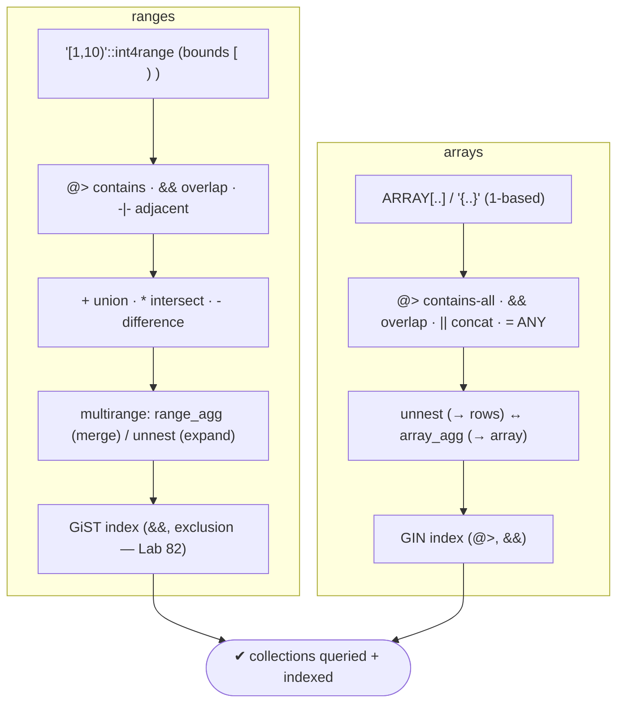
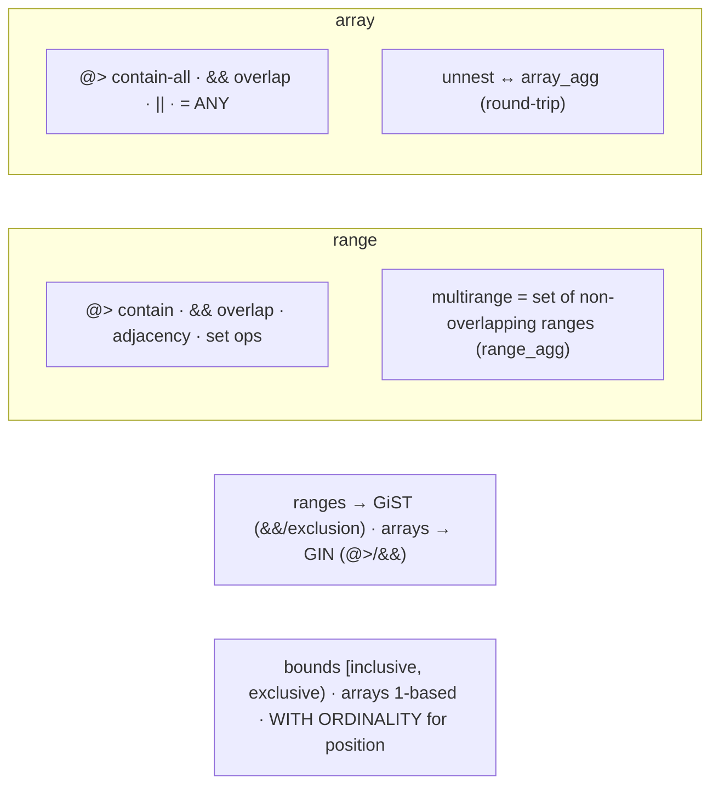

# Lab 120 — Range Types + Arrays: Containment, Overlap, `unnest`, Aggregation

> **Track B · Developer · B6 Modern Types & Advanced Features · Lab 5 of 8 (Lab 120/222)**
> Teaching package: concept → diagram → steps → verify → quick-ref → self-test → video script.
> **Depends on:** Lab 82 (ranges/exclusion), Lab 90 (unnest/LATERAL), Lab 100 (GIN). **Related:** Lab 86 (temporal).

---

## 0. Lab Card (at a glance)

| Field | Value |
|---|---|
| **Objective** | Use range types (containment, overlap, adjacency, set ops, multiranges) and arrays (containment, overlap, `unnest`/`array_agg`), and index both. |
| **Success criterion** | Range `@>`/`&&`/set-ops work; multiranges built with `range_agg`; array `@>`/`&&`/`= ANY` work; `unnest`↔`array_agg` round-trip; GIN/GiST indexes serve the ops. |
| **Scope boundary** | Ranges + arrays. Exclusion constraints were Lab 82; temporal Lab 86. |
| **Prereqs** | Lab 82/90/100 |
| **Time** | 30–40 min |
| **Difficulty** | ★★★☆☆ |
| **Risk** | Low — read-mostly. |

---

## 1. Learning Objectives

1. **Range types** — bounds, `@>`, `&&`, set ops.
2. **Multiranges** — `range_agg`, `unnest`.
3. **Arrays** — operators, 1-based indexing.
4. **`unnest` ↔ `array_agg`** — the round-trip.
5. **Indexing** — GiST (ranges) / GIN (arrays).

---

## 2. Concept Primer — the "why"

**Range types model intervals as a single value.** Built-ins: `int4range`, `int8range`, `numrange`, `tsrange`, `tstzrange`, `daterange`. Bounds are **`[inclusive, exclusive)`** by default (`'[1,10)'` = 1..9); other forms: `'[1,10]'`, `'(1,10)'`. Special: `'empty'`, unbounded `'[1,)'` / `'(,10]'`.

**Range operators:**
- **`@>`** contains — `'[1,10)'::int4range @> 5` (element) or `@> '[2,4)'` (range).
- **`<@`** contained-by; **`&&`** **overlap** (share any point); **`-|-`** adjacent; **`<<`**/`>>` strictly left/right.
- **`+`** union, **`*`** intersection, **`-`** difference.
- Accessors: `lower(r)`, `upper(r)`, `lower_inc(r)`, `upper_inf(r)`, `isempty(r)`.
Uses: time slots, price bands, validity periods (Lab 86), IP ranges, exclusion constraints (Lab 82).

**Multiranges (PG14+)** hold a **set of non-overlapping ranges** as one value: `'{[1,5), [10,20)}'::int4multirange`. Build one by merging with **`range_agg(range)`** (an aggregate), expand with **`unnest(multirange)`** → individual ranges. Great for representing gaps or a union of intervals.

**Arrays are ordered collections of any type.** `ARRAY[1,2,3]`, `'{a,b,c}'::text[]`. **Indexing is 1-based** (`arr[1]` is the first; `arr[2:3]` slices). Length: `array_length(arr,1)` / `cardinality(arr)`.

**Array operators:**
- **`@>`** contains-all — `arr @> ARRAY['a','b']`; **`<@`** contained-by; **`&&`** overlap (share any element).
- **`||`** concatenate — `a || b`, `arr || elem`.
- **`= ANY(arr)`** membership — `x = ANY(arr)`; also `x = ALL(arr)`, `5 > ANY(arr)`.

**The `unnest` ↔ `array_agg` round-trip (the pattern to internalize):**
- **`unnest(arr)`** — expand an array into **rows** (a set-returning function, Lab 90/115): `SELECT id, tag FROM t, unnest(tags) AS tag;`.
- **`array_agg(expr)`** — aggregate rows back **into an array** (the inverse), with `ORDER BY`/`DISTINCT`/`FILTER` (Lab 93): `array_agg(DISTINCT tag ORDER BY tag)`.
- `unnest … WITH ORDINALITY` gives each element's position.

**Indexing — different index types for different collections:**
- **Ranges** → **GiST** for `&&`/`@>` and exclusion constraints (Lab 82); B-tree for range ordering/equality.
- **Arrays** → **GIN** for `@>`/`<@`/`&&` (Lab 100): `CREATE INDEX ON t USING gin (tags);`.

---

## 3. Diagrams

### 3.1 Ranges + arrays flow



### 3.2 Concept



---

## 4. Prerequisites — data

```bash
sudo -u postgres psql -d shopdb <<'SQL'
DROP TABLE IF EXISTS slots, tagged;
CREATE TABLE slots (id int, during int4range);
INSERT INTO slots VALUES (1,'[1,5)'),(2,'[4,8)'),(3,'[10,15)'),(4,'[14,20)');
CREATE TABLE tagged (id int, tags text[]);
INSERT INTO tagged VALUES (1,'{sale,new}'),(2,'{clearance,sale}'),(3,'{new,featured}');
SQL
```

---

## 5. Step-by-Step

### Step 1 — Range containment, overlap, set ops

```bash
sudo -u postgres psql -d shopdb -c "
SELECT '[1,10)'::int4range @> 5              AS contains_5,
       '[1,5)'::int4range && '[4,8)'::int4range AS overlaps,
       '[1,5)'::int4range -|- '[5,8)'::int4range AS adjacent,
       '[1,5)'::int4range * '[3,8)'::int4range AS intersection,
       lower('[1,10)'::int4range) AS lo, upper('[1,10)'::int4range) AS hi;"
```

### Step 2 — Find overlapping slots

```bash
sudo -u postgres psql -d shopdb -c "
SELECT a.id, b.id, a.during, b.during
FROM slots a JOIN slots b ON a.id < b.id AND a.during && b.during;"   # (1,2) and (3,4) overlap
```

### Step 3 — Multirange: merge with range_agg, expand with unnest

```bash
sudo -u postgres psql -d shopdb -c "SELECT range_agg(during) AS merged FROM slots;"   # {[1,8), [10,20)} (overlaps merged)
sudo -u postgres psql -d shopdb -c "SELECT unnest(range_agg(during)) AS piece FROM slots;"
```

### Step 4 — Array operators

```bash
sudo -u postgres psql -d shopdb -c "
SELECT id, tags,
       tags @> ARRAY['sale']        AS has_sale,      -- contains
       tags && ARRAY['new','x']     AS has_any,        -- overlap
       'featured' = ANY(tags)       AS is_featured,    -- membership
       tags || ARRAY['hot']         AS with_hot        -- concat
FROM tagged;"
sudo -u postgres psql -d shopdb -c "SELECT id, tags[1] AS first_tag, cardinality(tags) AS n FROM tagged;"   # 1-based
```

### Step 5 — unnest ↔ array_agg round-trip

```bash
# expand tags to rows (with position):
sudo -u postgres psql -d shopdb -c "SELECT id, tag, ord FROM tagged, unnest(tags) WITH ORDINALITY AS u(tag, ord) ORDER BY id, ord;"
# aggregate back: distinct tags per... and overall
sudo -u postgres psql -d shopdb -c "
SELECT array_agg(DISTINCT tag ORDER BY tag) AS all_tags
FROM tagged, unnest(tags) AS tag;"
# count tag frequency (unnest → group → aggregate):
sudo -u postgres psql -d shopdb -c "
SELECT tag, count(*) FROM tagged, unnest(tags) AS tag GROUP BY tag ORDER BY count(*) DESC;"
```

### Step 6 — Index both

```bash
sudo -u postgres psql -d shopdb <<'SQL'
CREATE INDEX slots_gist ON slots USING gist (during);   -- ranges: && / exclusion (Lab 82)
CREATE INDEX tagged_gin ON tagged USING gin (tags);      -- arrays: @> / &&  (Lab 100)
ANALYZE slots; ANALYZE tagged;
SQL
sudo -u postgres psql -d shopdb -c "EXPLAIN (COSTS OFF) SELECT * FROM slots WHERE during && '[3,6)';"        # GiST
sudo -u postgres psql -d shopdb -c "EXPLAIN (COSTS OFF) SELECT * FROM tagged WHERE tags @> ARRAY['sale'];"   # GIN
```

---

## 6. Verification Checklist

- [ ] Range `@>`/`&&`/`-|-`/`*` and accessors work
- [ ] Overlapping slots found with `&&`
- [ ] `range_agg` merged ranges into a multirange; `unnest` expanded it
- [ ] Array `@>`/`&&`/`= ANY`/`||` work; 1-based indexing
- [ ] `unnest ↔ array_agg` round-trip (with `WITH ORDINALITY`)
- [ ] GiST index serves range `&&`; GIN serves array `@>`
- [ ] Bounds semantics understood (`[ )`)

---

## 7. Troubleshooting

| Symptom | Cause | Fix |
|---|---|---|
| Range bounds surprise | `[ )` default | Check inclusive/exclusive |
| `&&` vs `@>` confusion | overlap vs contains | `&&` = share a point; `@>` = fully contains |
| Array element not found | 1-based, or wrong op | `arr[1]` is first; `= ANY` for membership |
| `unnest` loses order | No ordinality | `unnest(...) WITH ORDINALITY` |
| `array_agg` includes NULLs | Aggregates NULLs | `FILTER (WHERE x IS NOT NULL)` |
| Range index not used | Wrong index type | **GiST** for ranges (not GIN) |
| Array index not used | Wrong index type | **GIN** for arrays (`@>`/`&&`) |

---

## 8. Quick Reference Card (paste-ready)

```sql
-- RANGES (bounds [inclusive, exclusive) by default)
'[1,10)'::int4range @> 5          -- contains element/range
r1 && r2                          -- overlap · -|- adjacent · << >> · + * - (union/intersect/diff)
range_agg(r)                      -- merge → multirange · unnest(mr) → ranges
CREATE INDEX ON t USING gist (r); -- && / exclusion (Lab 82)

-- ARRAYS (1-based)
arr @> ARRAY[...]                 -- contains-all · && overlap · <@ · || concat · x = ANY(arr)
arr[1]  arr[2:3]  cardinality(arr)
SELECT id, e FROM t, unnest(arr) WITH ORDINALITY AS u(e, ord);   -- expand → rows
SELECT array_agg(DISTINCT e ORDER BY e) FROM ...;                -- rows → array (inverse)
CREATE INDEX ON t USING gin (arr);                               -- @> / &&  (Lab 100)
```

---

## 9. Self-Check

1. What range operators give containment and overlap?
2. What is a multirange, and how do you build/expand one?
3. What are the array containment/overlap operators?
4. What's the difference between `unnest` and `array_agg`?
5. What's the array indexing base?
6. Which index type for ranges vs arrays?

<details>
<summary>Answers</summary>

1. `@>` contains (element or range); `&&` overlap (share any point).
2. A set of **non-overlapping ranges** as one value (PG14+); build with `range_agg(range)` (merges), expand with `unnest(multirange)`.
3. `@>` contains-all, `<@` contained-by, `&&` overlap (share any element).
4. `unnest` **expands** an array into rows (SRF); `array_agg` **aggregates** rows into an array (the inverse).
5. **1-based** — `arr[1]` is the first element.
6. **GiST** for ranges (overlap/exclusion); **GIN** for arrays (`@>`/`&&`).
</details>

---

## 10. Video / Teaching Script

| # | On screen | Say (narration) |
|---|---|---|
| 1 | Title: "Intervals and collections" | "Two types that pack a lot into one column: ranges — an interval — and arrays — a list. Both come with rich operators." |
| 2 | ranges | "A range knows if it contains a value, and — crucially — if it overlaps another. That's how you find double-booked slots in one join." |
| 3 | multirange | "Merge a bunch of overlapping ranges and you get a multirange — a clean set of intervals. Perfect for 'when is this free?'" |
| 4 | arrays | "Arrays: contains, overlaps, concatenate, 'is this in the list?' — all one operator each. And remember, they count from one." |
| 5 | unnest/agg | "The move to master: unnest turns an array into rows, array_agg turns rows back into an array. Explode, process, recombine." |
| 6 | index | "Index them right — GiST for ranges, GIN for arrays — and containment and overlap fly." |
| 7 | Outro | "Ranges and arrays, handled. Next: composite types and custom operators." |

---

## 11. Glossary

- **Range type** — an interval value (`[lo, hi)` bounds).
- **`@>` / `&&` / `-|-`** — contains / overlap / adjacent.
- **Multirange** — a set of non-overlapping ranges (`range_agg`).
- **Array** — an ordered collection (1-based).
- **`= ANY` / `@>` / `&&` / `||`** — membership / contains / overlap / concat.
- **`unnest` / `array_agg`** — array→rows / rows→array.
- **GiST / GIN** — range / array index types.

---
*NETAPORT lab series · PostgreSQL 17 on AlmaLinux 9 · Lab 120/222 · B6 Modern Types & Advanced Features*
