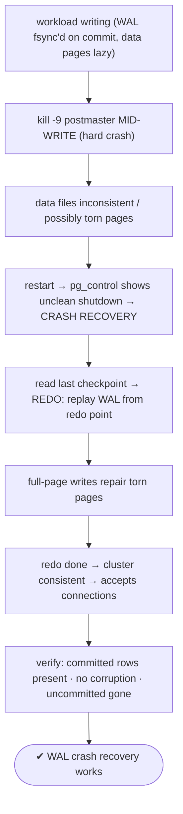
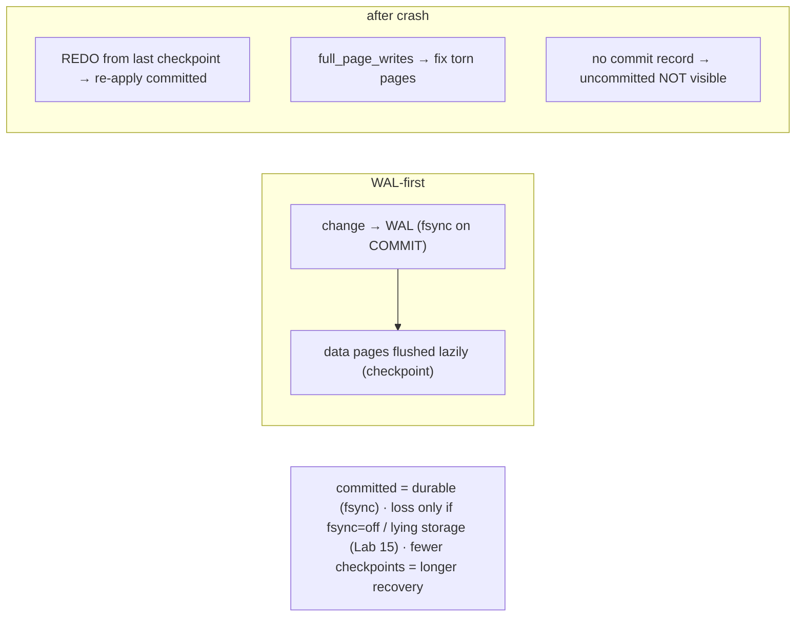

# Lab 121 — Kill `-9` the Postmaster Mid-Write; Confirm Crash Recovery Replays WAL Cleanly

> **Track C · Cross-Cutting · C1 Chaos & Failure Drills · Lab 1 of 6 (Lab 121/222)**
> Teaching package: concept → diagram → steps → verify → quick-ref → self-test → video script.
> **Depends on:** Lab 15 (WAL/fsync), Lab 57 (checkpoints), Lab 05 (checksums). Opens the chaos-drills track.

---

## 0. Lab Card (at a glance)

| Field | Value |
|---|---|
| **Objective** | Hard-kill PostgreSQL mid-write, restart, and confirm automatic WAL-based crash recovery brings the cluster to a consistent state with no committed-data loss. |
| **Success criterion** | The log shows automatic recovery (redo starts/done); the cluster starts; committed rows survive; no corruption. |
| **Scope boundary** | Crash recovery (REDO). PITR was Lab 21; replication failover Lab 30. |
| **Prereqs** | Labs 15/57; a scratch cluster + workload |
| **Time** | 25–35 min |
| **Difficulty** | ★★★☆☆ |
| **Risk** | Medium — hard-kills the server; use a lab cluster (recovery is safe). |

---

## 1. Learning Objectives

1. **WAL durability** — logged before data pages.
2. **Crash recovery (REDO)** — what restart does.
3. **Full-page writes** — torn-page protection.
4. **The guarantee** — committed survives, uncommitted vanishes.
5. **Read the recovery log** and verify consistency.

---

## 2. Concept Primer — the "why"

**Write-Ahead Logging is the durability guarantee.** Every change is written to the **WAL** log **before** the corresponding data page is flushed to disk, and WAL is **fsync'd on commit**. Data pages are written **lazily** (at checkpoints, Lab 57). So at any instant the data files may be *behind* the WAL — but the WAL is the source of truth.

**A hard crash leaves data files inconsistent — WAL fixes that.** When PostgreSQL dies uncleanly (`kill -9`, power loss, OOM kill), some data pages were flushed and some weren't; a page might even be **torn** (a partial write). On restart, PostgreSQL sees from **`pg_control`** that the cluster **wasn't shut down cleanly** and enters **crash recovery**:
1. Read the **last checkpoint** from `pg_control`.
2. **REDO**: replay **all WAL records from that checkpoint's redo point forward**, re-applying every logged change — including committed changes that hadn't been flushed yet.
3. **Full-page writes** repair torn pages: the **first** change to a page after a checkpoint writes the **entire page image** into WAL, so replay overwrites any partial write with a known-good image. *(This is why `full_page_writes=on` is essential for crash safety.)*
4. When replay reaches the end of WAL, the cluster is **consistent** and opens for connections.

**The guarantee:** **committed transactions survive** (their commit records were fsync'd, so recovery replays them), and **uncommitted transactions vanish** (no commit record → their changes are never made visible; they're treated as aborted). Recovery is **automatic** — no operator action beyond restarting.

**What could still lose committed data:** only a broken durability contract — **`fsync=off`** (never in production) or **lying storage** that acknowledges an fsync it didn't honor (Lab 15). If fsync is real, crash recovery loses **nothing** committed.

**Recovery speed** depends on how much WAL accumulated since the last checkpoint: **more frequent checkpoints → faster recovery** but more I/O — the trade-off you tuned in Lab 57.

**Shutdown modes for context:** smart (wait for clients), fast (abort txns, clean), **immediate** (`-m immediate` / `SIGQUIT` — terminate now, recover on restart). `kill -9` (SIGKILL) is even blunter — the OS kills the process with no cleanup; the next start recovers.

---

## 3. Diagrams

### 3.1 Crash-and-recover flow



### 3.2 Durability model



---

## 4. Prerequisites — a workload

```bash
sudo -u postgres psql -c "SHOW fsync; SHOW full_page_writes;"   # both should be on (durability)
sudo -u postgres psql -d benchdb -c "CREATE TABLE IF NOT EXISTS crashtest (id bigint GENERATED ALWAYS AS IDENTITY PRIMARY KEY, ts timestamptz DEFAULT clock_timestamp());" 2>/dev/null
sudo -u postgres pgbench -i -s 5 benchdb >/dev/null 2>&1 || true
```

---

## 5. Step-by-Step

### Step 1 — Commit a known set of rows (the survivors)

```bash
sudo -u postgres psql -d benchdb -c "INSERT INTO crashtest DEFAULT VALUES; INSERT INTO crashtest DEFAULT VALUES; INSERT INTO crashtest DEFAULT VALUES;"
sudo -u postgres psql -d benchdb -c "SELECT count(*) AS committed_before_crash FROM crashtest;"
# note this count — these are COMMITTED and MUST survive
```

### Step 2 — Start a heavy write workload in the background

```bash
sudo -u postgres pgbench -c 8 -j 4 -T 60 benchdb >/dev/null 2>&1 &   # continuous writes
PGB=$!
# also a continuous insert loop into crashtest:
sudo -u postgres psql -d benchdb -c "INSERT INTO crashtest SELECT FROM generate_series(1,200000);" &
sleep 2
```

### Step 3 — HARD KILL mid-write (the chaos action)

```bash
sudo pkill -9 postgres        # SIGKILL every postgres process — a hard crash, no clean shutdown
kill $PGB 2>/dev/null
echo "postmaster hard-killed mid-write"
sudo -u postgres pg_controldata /var/lib/pgsql/17/data | grep -i "cluster state"   # likely "in production" (unclean)
```

### Step 4 — Restart → watch crash recovery in the log

```bash
sudo systemctl start postgresql-17
sleep 3
sudo grep -iE "not properly shut down|automatic recovery|redo starts|redo done|ready to accept" \
  /var/lib/pgsql/17/data/log/postgresql-$(date +%a).log | tail -8
#   → "database system was not properly shut down; automatic recovery in progress"
#      "redo starts at X" ... "redo done at Y" ... "database system is ready to accept connections"
```

### Step 5 — Verify committed data survived + cluster consistent

```bash
sudo -u postgres psql -d benchdb -c "SELECT count(*) AS after_recovery FROM crashtest;"
#   → the 3 explicitly-committed rows are ALL present (plus however many of the loop committed before the kill)
sudo -u postgres pg_controldata /var/lib/pgsql/17/data | grep -i "cluster state"   # now "in production" (recovered)
```

### Step 6 — Confirm no corruption

```bash
sudo -u postgres psql -d benchdb -c "CREATE EXTENSION IF NOT EXISTS amcheck;"
sudo -u postgres pg_amcheck -d benchdb --heapallindexed 2>&1 | tail -3; echo "amcheck exit: $?"   # 0 = clean (Lab 64)
sudo -u postgres psql -d benchdb -c "SELECT count(*) FROM pgbench_accounts;"   # pgbench data intact/consistent
```

---

## 6. Verification Checklist

- [ ] `fsync` and `full_page_writes` were on
- [ ] Hard-killed the postmaster mid-write
- [ ] Restart triggered automatic crash recovery
- [ ] Log showed "not properly shut down" + "redo starts/done" + "ready"
- [ ] All explicitly-committed rows survived
- [ ] `pg_controldata` cluster state consistent after recovery
- [ ] `pg_amcheck` reports no corruption

---

## 7. Troubleshooting

| Symptom | Cause | Fix |
|---|---|---|
| Won't restart (stale pid) | Leftover `postmaster.pid` | Usually auto-handled; remove only if no process is running |
| Recovery takes long | Much WAL since last checkpoint | More frequent checkpoints (Lab 57) — recovery-time trade-off |
| Committed data lost | fsync failure | Ensure `fsync=on`; check for lying storage (Lab 15) |
| Corruption after crash | `full_page_writes=off` | Keep `full_page_writes=on` |
| Orphaned backends after `pkill` | Children linger briefly | They exit; the new postmaster recovers |
| "could not open control file" | Data-dir problem | Investigate storage; restore from backup if needed |
| Recovery loops / fails | WAL corruption | Restore + PITR (Lab 21) |

---

## 8. Quick Reference Card (paste-ready)

```bash
# WAL-first durability: change → WAL (fsync on COMMIT) → data pages lazy (checkpoint)
# ensure durability: SHOW fsync;  SHOW full_page_writes;   (both ON)

# CHAOS: hard crash mid-write
sudo pkill -9 postgres            # SIGKILL all postgres (or kill -9 the postmaster PID)

# RECOVER: just restart — recovery is AUTOMATIC
sudo systemctl start postgresql-17
grep -iE "not properly shut down|redo starts|redo done|ready to accept" <datadir>/log/postgresql-*.log

# VERIFY: committed rows present · pg_controldata "cluster state" · pg_amcheck (no corruption)
# committed = durable (fsync) · uncommitted = gone (no commit record) · faster recovery = more checkpoints
```

---

## 9. Self-Check

1. What is WAL, and why does it enable crash recovery?
2. What happens on restart after a hard crash?
3. What protects against torn pages?
4. Are committed transactions lost in a crash?
5. What could cause committed-data loss *despite* recovery?
6. How do you make recovery faster?

<details>
<summary>Answers</summary>

1. The Write-Ahead Log: every change is written to WAL (and fsync'd on commit) **before** its data page is flushed, so replaying WAL after a crash restores consistency and durability.
2. PostgreSQL detects the unclean shutdown (via `pg_control`) and runs **crash recovery (REDO)** — replaying WAL from the last checkpoint to a consistent state — automatically.
3. **Full-page writes** — the first change to a page after a checkpoint writes the whole page image to WAL, so replay overwrites any partial write.
4. **No** — commit records are fsync'd, so recovery replays committed changes; uncommitted transactions have no commit record and are treated as aborted.
5. A broken durability contract — `fsync=off` or **lying storage** that fakes fsync (Lab 15).
6. **More frequent checkpoints** — less WAL to replay (at the cost of more I/O, Lab 57).
</details>

---

## 10. Video / Teaching Script

| # | On screen | Say (narration) |
|---|---|---|
| 1 | Title: "Pull the plug — on purpose" | "The scariest thing you can do to a database is kill it mid-write. So let's do exactly that, and prove Postgres survives it." |
| 2 | WAL | "The secret is write-ahead logging: every change hits the log, fsync'd, *before* the table. The log is the truth." |
| 3 | kill -9 | "Start a heavy write load, then — kill dash nine. Every process, gone. No clean shutdown, no mercy." |
| 4 | restart + log | "Restart, and read the log: 'not properly shut down, automatic recovery in progress.' Redo starts… redo done. It fixed itself." |
| 5 | verify | "Every committed row is right there. Nothing lost. The database is consistent." |
| 6 | the caveat | "The only way to lose committed data is if your storage *lied* about fsync. If it's honest, crash recovery is bulletproof." |
| 7 | Outro | "Crashes: survived by design. Next: disk-full and out-of-memory drills." |

---

## 11. Glossary

- **WAL** — Write-Ahead Log; changes logged before data pages.
- **Crash recovery / REDO** — replay WAL from the last checkpoint.
- **Checkpoint** — where data pages are flushed; recovery starts here.
- **Full-page writes** — full page image in WAL (torn-page protection).
- **`pg_control`** — cluster state (detects unclean shutdown).
- **fsync** — the durability primitive; loss only if it fails/lies.
- **Committed vs uncommitted** — survives / vanishes on crash.

---
*NETAPORT lab series · PostgreSQL 17 on AlmaLinux 9 · Lab 121/222 · C1 Chaos & Failure Drills*
