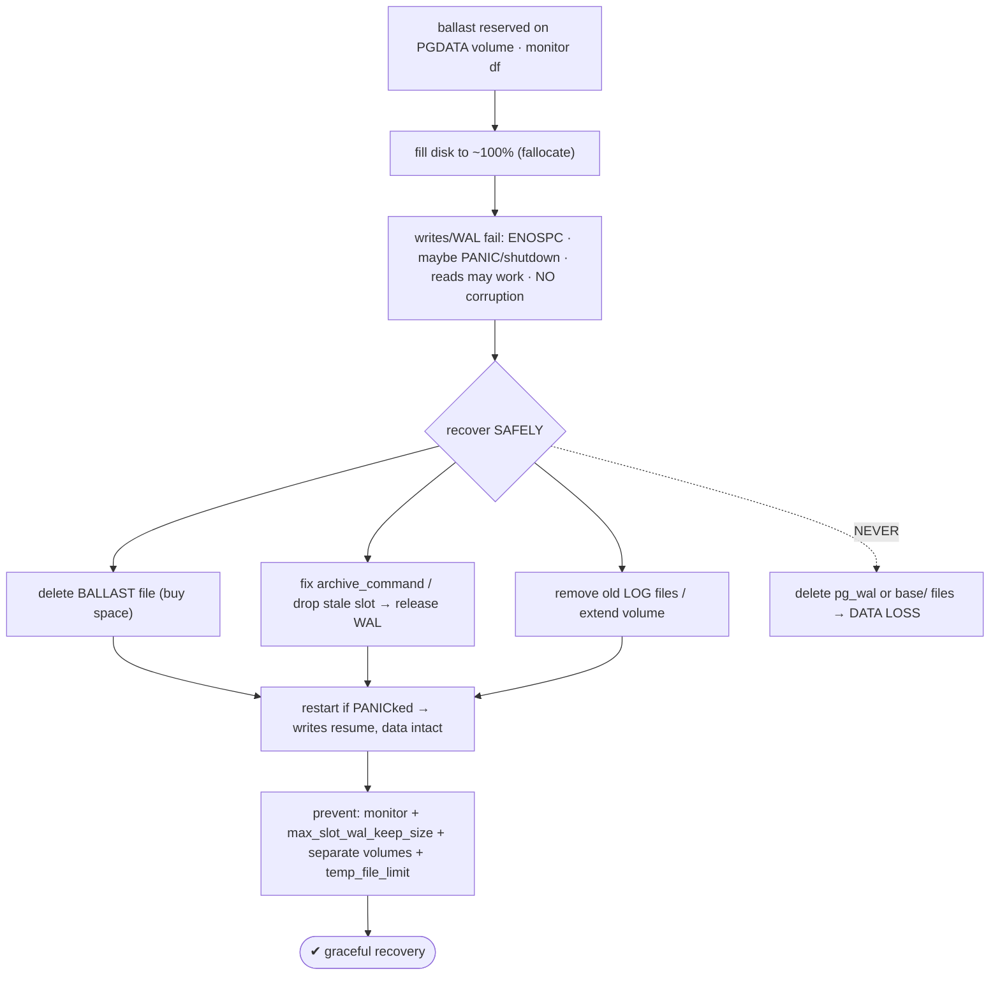
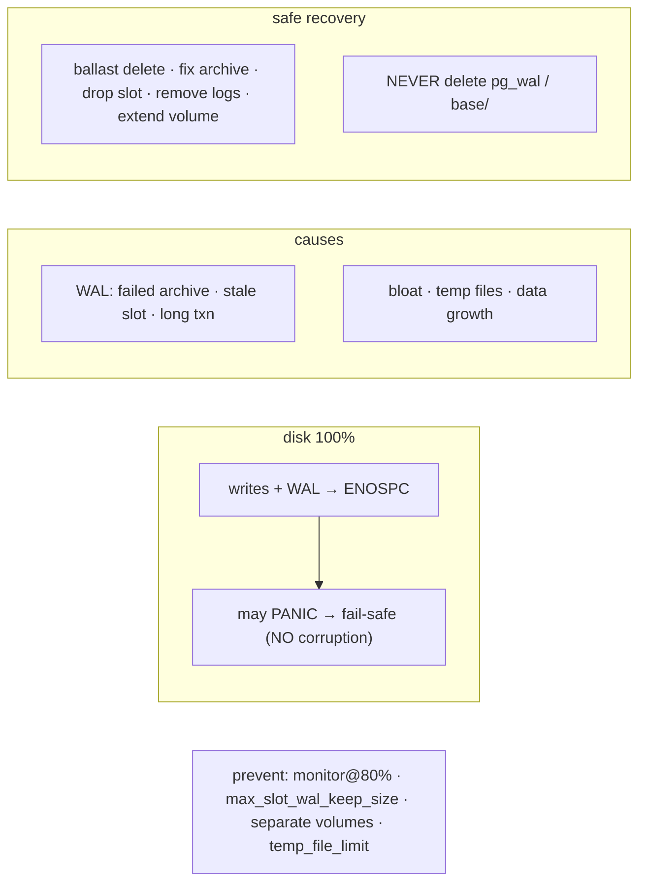

# Lab 122 — Fill the Data Disk to 100%; Observe Behavior, Recover Gracefully

> **Track C · Cross-Cutting · C1 Chaos & Failure Drills · Lab 2 of 6 (Lab 122/222)**
> Teaching package: concept → diagram → steps → verify → quick-ref → self-test → video script.
> **Depends on:** Lab 121 (crash recovery), Lab 20 (WAL archiving), Lab 27 (slots), Lab 55 (monitoring).

---

## 0. Lab Card (at a glance)

| Field | Value |
|---|---|
| **Objective** | Fill the PGDATA filesystem, observe PostgreSQL's fail-safe behavior (ENOSPC/PANIC, no corruption), and recover safely — without ever deleting WAL/data files. |
| **Success criterion** | Writes fail with ENOSPC while data stays intact; freeing space (safely) restores writes; you know the safe vs forbidden recovery actions and prevention. |
| **Scope boundary** | Disk-full behavior + safe recovery. Crash recovery was Lab 121. |
| **Prereqs** | Labs 20/27; a **dedicated lab volume** for PGDATA |
| **Time** | 30–40 min |
| **Difficulty** | ★★★★☆ |
| **Risk** | **Medium-High** — filling a disk. Use a lab volume; a reversible ballast file (not real data). |

---

## 1. Learning Objectives

1. **What happens** when the data disk fills.
2. **Fail-safe** — no corruption, but writes stop.
3. **The forbidden action** — never delete `pg_wal`/`base`.
4. **Safe recovery** — ballast, fix archive, drop slots, extend.
5. **Prevention** — caps, monitoring, separate volumes.

---

## 2. Concept Primer — the "why"

**A full disk stops writes — safely.** PostgreSQL needs free space for WAL, extending data files, temp files (sorts/hashes), and checkpoints. When the filesystem hits **100%**:
- **Writes fail** with `No space left on device` (**ENOSPC**): inserts/updates that must extend a file, and — critically — **WAL writes** fail, so transactions **can't commit**.
- **PANIC/shutdown** in severe cases: if it can't write WAL or checkpoint, PostgreSQL emits `PANIC: could not write to file … No space left on device` and **shuts down/restarts** — deliberately, to avoid corruption.
- **Reads usually still work** (they need no space — unless a query needs temp space for a sort).
- **No corruption.** The database **fails safe**: it refuses writes rather than damaging data. Once space is freed, it resumes (or restarts cleanly).

**The most common real cause is WAL accumulation, not data growth:**
- **Failed `archive_command`** (Lab 20) — WAL can't be archived, so `pg_wal` grows without bound.
- **Stale/inactive replication slot** (Lab 27) — retains WAL for a standby that isn't consuming it.
- A **long-running transaction** or held xmin horizon preventing WAL cleanup (Lab 110).
- Also: **bloat** (unvacuumed dead tuples), **large temp files**, log files, and genuine data growth.

**The forbidden action — never manually delete files in `pg_wal/` or `base/`.** Deleting WAL that hasn't been applied/archived, or data files, **causes the data loss you were trying to avoid**. This is the #1 way admins turn a recoverable disk-full into an unrecoverable disaster.

**Safe ways to free space:**
- **Fix the root cause** — repair the `archive_command` (WAL then archives and is removed), or **drop a stale replication slot** (`pg_drop_replication_slot`) to release retained WAL.
- **Remove old *log* files** (in `log/`) — safe, not data.
- **Delete a ballast file** — the classic trick: pre-create a reserved empty file (a few hundred MB) on the PGDATA filesystem; in an emergency, **delete it to buy space** to run recovery commands.
- **Extend the volume** (LVM extend / add a disk) — the real fix.
- Delete unrelated files *outside* PGDATA on the same filesystem.

**Prevention:**
- **Monitor** disk usage, `pg_wal` size, and slot retention; **alert at ~80%**, not 100% (Lab 55).
- **`max_slot_wal_keep_size`** (Lab 27) — cap WAL retained for slots so a dead slot can't fill the disk.
- Reliable **archiving** + `pg_stat_archiver` monitoring (Lab 20).
- **Separate volumes** for `pg_wal`, logs, and data — so log/temp growth can't kill the data volume.
- **Tuned autovacuum** (Lab 59) to control bloat; **`temp_file_limit`** to cap per-session temp usage.

---

## 3. Diagrams

### 3.1 Fill → observe → recover flow



### 3.2 Concept



---

## 4. Prerequisites — a lab volume + ballast

```bash
# ⚠ Use a DEDICATED lab volume for PGDATA. Identify it:
df -h /var/lib/pgsql/17/data
FS=$(df --output=target /var/lib/pgsql/17/data | tail -1)
# pre-create a BALLAST file (safe emergency reserve) on that filesystem:
sudo fallocate -l 500M "$FS/BALLAST.reserve" 2>/dev/null || sudo dd if=/dev/zero of="$FS/BALLAST.reserve" bs=1M count=500 2>/dev/null
sudo -u postgres psql -d benchdb -c "CREATE TABLE IF NOT EXISTS fulltest (id bigint GENERATED ALWAYS AS IDENTITY PRIMARY KEY, pad text);"
sudo -u postgres psql -d benchdb -c "INSERT INTO fulltest (pad) VALUES ('committed-before');"   # a survivor row
```

---

## 5. Step-by-Step

### Step 1 — Fill the filesystem to ~100%

```bash
FS=$(df --output=target /var/lib/pgsql/17/data | tail -1)
# consume almost all remaining space (leave the ballast; fill the rest):
sudo bash -c "fallocate -l \$(df --output=avail -B1 $FS | tail -1) $FS/FILL.tmp 2>/dev/null || dd if=/dev/zero of=$FS/FILL.tmp bs=1M 2>/dev/null"
df -h "$FS"     # ~100% used
```

### Step 2 — Observe the failure (ENOSPC / PANIC)

```bash
sudo -u postgres psql -d benchdb -c "INSERT INTO fulltest (pad) SELECT repeat('x',1000) FROM generate_series(1,100000);" 2>&1 | tail -2
#   → ERROR: could not extend file ... No space left on device   (or the session drops if the server PANICked)
sudo grep -iE "No space left|PANIC|could not write|could not extend" /var/lib/pgsql/17/data/log/postgresql-$(date +%a).log | tail -5
sudo systemctl status postgresql-17 --no-pager | head -3   # may have restarted after a PANIC
```

### Step 3 — Recover: delete the FILL (and ballast if needed)

```bash
FS=$(df --output=target /var/lib/pgsql/17/data | tail -1)
sudo rm -f "$FS/FILL.tmp"                    # free the simulated fill
#   in a REAL emergency with no fill file: delete the BALLAST to buy space:
#   sudo rm -f "$FS/BALLAST.reserve"
df -h "$FS"                                  # space freed
```

### Step 4 — Restart if it PANICked; confirm writes resume

```bash
sudo systemctl start postgresql-17 2>/dev/null; sleep 3
sudo -u postgres psql -d benchdb -c "INSERT INTO fulltest (pad) VALUES ('committed-after-recovery');"   # writes work again
sudo -u postgres psql -d benchdb -c "SELECT count(*) FROM fulltest WHERE pad IN ('committed-before','committed-after-recovery');"  # both present → no loss
```

### Step 5 — Real-cause recovery: a stale slot / failed archive

```bash
# if pg_wal was the culprit, find WAL retainers:
sudo -u postgres psql -c "SELECT slot_name, active, pg_size_pretty(pg_wal_lsn_diff(pg_current_wal_lsn(), restart_lsn)) AS retained FROM pg_replication_slots;"
#   drop a confirmed-stale slot to release WAL (Lab 27):
#   sudo -u postgres psql -c "SELECT pg_drop_replication_slot('stale_slot');"
sudo -u postgres psql -c "SELECT failed_count, last_failed_time FROM pg_stat_archiver;"   # failed archiving grows pg_wal (Lab 20)
du -sh /var/lib/pgsql/17/data/pg_wal          # WAL size
```

### Step 6 — Prevention settings

```bash
sudo -u postgres psql -c "ALTER SYSTEM SET max_slot_wal_keep_size = '10GB';   -- cap slot WAL retention (Lab 27)
ALTER SYSTEM SET temp_file_limit = '5GB';                                      -- cap per-session temp
SELECT pg_reload_conf();"
sudo -u postgres psql -c "SHOW max_slot_wal_keep_size; SHOW temp_file_limit;"
# + monitor disk/WAL/slots and alert at ~80% (Lab 55); separate volumes for pg_wal/logs/data
```

---

## 6. Verification Checklist

- [ ] Disk filled to ~100% on the lab volume
- [ ] Writes failed with ENOSPC (and/or a PANIC/restart)
- [ ] Data was **not** corrupted; reads worked
- [ ] Freed space **safely** (fill/ballast) — no `pg_wal`/`base` deletion
- [ ] Writes resumed after recovery; both survivor rows present
- [ ] Checked WAL retainers (slots) and archiver status
- [ ] Set `max_slot_wal_keep_size` / `temp_file_limit`

---

## 7. Troubleshooting

| Symptom | Cause | Fix |
|---|---|---|
| Writes fail ENOSPC | Disk full | Free space **safely**; extend the volume |
| PANIC / server restart | Couldn't write WAL | Free space, restart — recovers, no corruption |
| `pg_wal` huge | Failed archive / stale slot / long txn | Fix `archive_command`; drop stale slot; end long txn |
| Tempted to delete WAL | — | **Never** — data loss; fix the cause / extend instead |
| Can't free anything | Culprit unknown | `du -sh`; drop ballast; extend volume |
| Recurs | No guardrails | `max_slot_wal_keep_size`, monitoring, separate volumes, `temp_file_limit` |
| Reads also fail | Query needs temp space | Free space; `temp_file_limit`; raise `work_mem` |

---

## 8. Quick Reference Card (paste-ready)

```bash
# DISK FULL → writes/WAL fail (ENOSPC), maybe PANIC → FAIL-SAFE (no corruption)
# common cause = WAL accumulation: failed archive_command / stale replication slot / long txn (not just data)

# ⚠ NEVER delete files in pg_wal/ or base/ to free space → DATA LOSS
# SAFE recovery: delete a BALLAST file · fix archive_command · pg_drop_replication_slot('stale') · rm old log/ files · EXTEND the volume

# diagnose WAL retention:
SELECT slot_name, active, restart_lsn FROM pg_replication_slots;      -- stale slots hold WAL (Lab 27)
SELECT failed_count FROM pg_stat_archiver;                            -- failed archiving grows pg_wal (Lab 20)
du -sh $PGDATA/pg_wal

# PREVENT: monitor disk/WAL/slots (alert @80%) · max_slot_wal_keep_size · separate volumes (pg_wal/logs/data) · temp_file_limit
# ballast trick: pre-create a reserved file; delete it in an emergency to buy recovery space
```

---

## 9. Self-Check

1. What happens when the data disk fills?
2. What are the most common causes (beyond data growth)?
3. What must you never delete to free space, and why?
4. What are the safe ways to free space?
5. What's the "ballast" trick?
6. How do you prevent disk-full?

<details>
<summary>Answers</summary>

1. Writes and WAL fail with `ENOSPC`; the server may `PANIC`/restart; reads usually work; the database **fails safe — no corruption**.
2. **WAL accumulation** — a failed `archive_command`, a stale replication slot, or a long-running transaction — plus bloat and large temp files.
3. Never delete files in **`pg_wal/`** or **`base/`** — that causes real data loss/corruption; fix the cause instead.
4. Delete a **ballast** file, fix the `archive_command`, **drop a stale slot**, remove old **log** files, or **extend the volume**.
5. Pre-create a reserved empty file on the PGDATA filesystem; delete it in an emergency to buy space for recovery.
6. Monitor disk/WAL/slots (alert at ~80%), `max_slot_wal_keep_size`, reliable archiving, **separate volumes**, tuned autovacuum, and `temp_file_limit`.
</details>

---

## 10. Video / Teaching Script

| # | On screen | Say (narration) |
|---|---|---|
| 1 | Title: "When the disk hits 100%" | "A full disk feels like a disaster. It isn't — Postgres fails *safe*. But the recovery has one trap that turns it into a real disaster." |
| 2 | fill + fail | "Fill the volume, try to write — 'no space left on device.' Maybe a PANIC and restart. But look: the data's fine. It refused to write, not to protect itself." |
| 3 | the trap | "Now the trap. Do NOT delete files in pg_wal to make room. That's not recovery — that's data loss. Ever." |
| 4 | safe recovery | "Instead: delete a ballast file you kept for exactly this. Or fix the real cause — a stale replication slot hoarding WAL, a broken archive command." |
| 5 | resume | "Free the space, restart if needed — and writes flow again. Nothing lost." |
| 6 | prevent | "Then prevent it: cap WAL for slots, put logs on their own volume, and alert at eighty percent, not a hundred." |
| 7 | Outro | "Disk-full: survived, safely. Next: the OOM killer." |

---

## 11. Glossary

- **ENOSPC** — "No space left on device" (write failure).
- **PANIC** — fatal error → deliberate shutdown (fail-safe).
- **WAL accumulation** — `pg_wal` growth from failed archive / stale slot.
- **Ballast file** — reserved space deleted in an emergency.
- **`max_slot_wal_keep_size`** — cap on WAL retained for a slot.
- **`temp_file_limit`** — per-session temp-file cap.
- **Separate volumes** — pg_wal/logs/data isolated.

---
*NETAPORT lab series · PostgreSQL 17 on AlmaLinux 9 · Lab 122/222 · C1 Chaos & Failure Drills*
