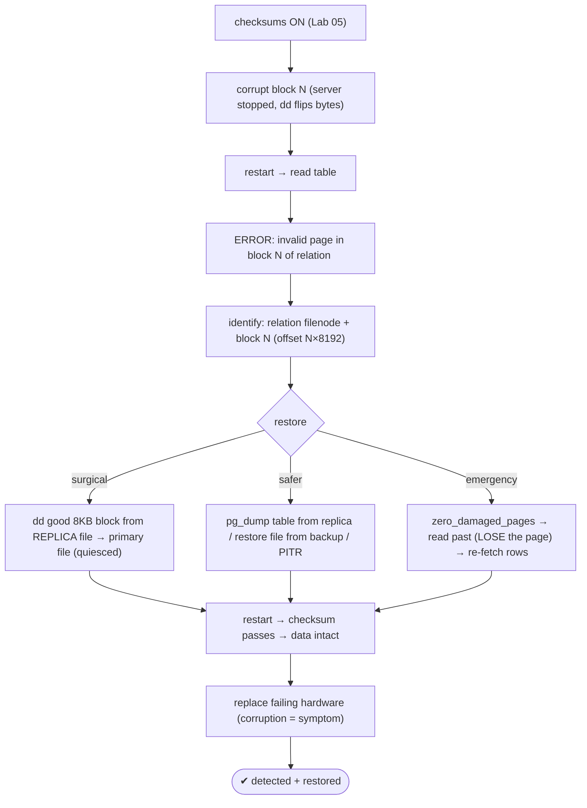

# Lab 123 — Corrupt a Heap Page on Disk; Detect via Checksums; Restore the Block from a Replica/Backup

> **Track C · Cross-Cutting · C1 Chaos & Failure Drills · Lab 3 of 6 (Lab 123/222)**
> Teaching package: concept → diagram → steps → verify → quick-ref → self-test → video script.
> **Depends on:** Lab 05 (checksums), Lab 64 (corruption/amcheck), Lab 26 (replica), Lab 21 (PITR).

---

## 0. Lab Card (at a glance)

| Field | Value |
|---|---|
| **Objective** | Deliberately corrupt a heap page, detect it via checksums, and restore the specific block from a replica (block-level `dd`) or via a safer table/file/PITR restore. |
| **Success criterion** | The read raises `invalid page in block N`; you identify the relation/block; restoring the good block makes the checksum pass and data reads cleanly. |
| **Scope boundary** | Physical page corruption + block/table restore. Structural corruption was Lab 64. |
| **Prereqs** | Lab 05 (checksums on); a replica or backup |
| **Time** | 35–50 min |
| **Difficulty** | ★★★★☆ |
| **Risk** | **Medium** — corrupts data; use a lab table only. |

---

## 1. Learning Objectives

1. **Checksum detection** — the error and what it names.
2. **Corrupt a block** safely (offline `dd`).
3. **Restore the block** from a replica (surgical `dd`).
4. **Safer restores** — table/file/PITR.
5. **`zero_damaged_pages`** — the emergency escape.

---

## 2. Concept Primer — the "why"

**Data-page checksums catch physical corruption on read (Lab 05).** With `initdb -k`, every 8KB page carries a checksum in its header. When PostgreSQL **reads** a page, it verifies the checksum; a mismatch (bit rot, bad storage, a torn write) raises:
```
WARNING: page verification failed, calculated checksum X but expected Y
ERROR:  invalid page in block N of relation base/<db>/<filenode>
```
The error **names the relation and the block number** — everything you need to locate the damage. *(Checksums catch **physical** corruption; `amcheck` (Lab 64) catches **structural**.)*

**Corruption is node-local → a replica has a good copy.** A checksum failure on the primary is damage on *its* storage; a healthy streaming replica, on separate disks, has the correct block (Lab 64). So recovery is a **restore** from a clean source. Options, from surgical to safe:

**1. Restore the specific block (the literal "restore the block").** A page lives at a **fixed offset** in the relation's file: **block N is at byte `N × 8192`** in the main-fork file (files segment at 1 GB, i.e. every 131072 blocks — block N lives in segment `N / 131072` at offset `(N mod 131072) × 8192`). With the file **quiesced** (server stopped), copy the good 8KB block from the replica's corresponding file to the primary's at the same offset:
```
dd if=<replica_file> bs=8192 skip=N count=1 of=<primary_file> seek=N count=1 conv=notrunc
```
Restart → the checksum passes. **Caveat:** the replica's block must represent the **same committed state** as the primary's (true for an in-sync physical replica applying the same WAL). This is a **last-resort surgical repair** — precise but easy to get wrong.

**2. Restore the whole relation/table (safer).** `pg_dump` the table from a good **replica** and reload it, or restore the relation's **file** from a **base backup** — no offset arithmetic, harder to botch.

**3. PITR (safest, whole-cluster).** Restore from a base backup and replay WAL (Lab 21) to a consistent point — rebuilds everything cleanly.

**4. `zero_damaged_pages` (emergency, data loss).** When even *reading* the table is blocked by one bad page and you need the *rest* of the data: `SET zero_damaged_pages = on;` makes PostgreSQL **zero out** damaged pages instead of erroring — you can read past the corruption, **but the bad page's rows are lost**. Use it to extract the good data, then **re-fetch the lost rows** from a replica/backup. *(Do **not** use `ignore_checksum_failure` in production — it reads the corrupt bytes as if valid; forensics only.)*

**Root cause:** corruption is a **symptom** — recurring checksum failures mean **failing hardware** (bad disk/RAM/controller). Restore the data *and* replace the hardware.

---

## 3. Diagrams

### 3.1 Detect + restore flow



### 3.2 Concept

```mermaid
flowchart LR
    CK["page checksum: verified on READ → ERROR 'invalid page in block N'"]
    subgraph RESTORE [restore sources (corruption is node-local)]
      R1["block-level: dd from replica @ offset N×8192 (surgical)"]
      R2["table/file: pg_dump from replica / backup restore (safer)"]
      R3["PITR: base backup + WAL replay (safest)"]
      R4["zero_damaged_pages: read past, LOSE page (emergency)"]
    end
    note["physical corruption (checksums) vs structural (amcheck, Lab 64) · recurring = failing hardware · NOT ignore_checksum_failure in prod"]
```

---

## 4. Prerequisites — checksums + a target table

```bash
sudo -u postgres psql -c "SHOW data_checksums;"   # must be 'on' (Lab 05); if off, initdb -k required
sudo -u postgres psql -d benchdb <<'SQL'
DROP TABLE IF EXISTS corrupt_demo;
CREATE TABLE corrupt_demo (id int PRIMARY KEY, v text);
INSERT INTO corrupt_demo SELECT g, 'row-'||g FROM generate_series(1,50000) g;
CHECKPOINT;   -- ensure it's flushed to disk
SQL
# locate the file:
sudo -u postgres psql -d benchdb -tAc "SELECT pg_relation_filepath('corrupt_demo');"
```

---

## 5. Step-by-Step

### Step 1 — Corrupt a specific heap block (offline)

```bash
REL=$(sudo -u postgres psql -d benchdb -tAc "SELECT pg_relation_filepath('corrupt_demo');")
FILE="/var/lib/pgsql/17/data/$REL"
sudo systemctl stop postgresql-17           # stop so we corrupt on-disk, not the cache
# flip bytes in the MIDDLE of block 3 (offset 3*8192 + 100):
sudo dd if=/dev/urandom of="$FILE" bs=1 count=200 seek=$((3*8192 + 100)) conv=notrunc 2>/dev/null
sudo systemctl start postgresql-17
```

### Step 2 — Detect: the checksum error names the block

```bash
sudo -u postgres psql -d benchdb -c "SELECT count(*) FROM corrupt_demo;" 2>&1 | tail -2
#   → ERROR: invalid page in block 3 of relation base/<db>/<filenode>
sudo grep -iE "invalid page|checksum" /var/lib/pgsql/17/data/log/postgresql-$(date +%a).log | tail -3
```

### Step 3 — Restore the block from a replica (surgical dd)

```bash
# assume a healthy replica has the same file. (replica_datadir = its PGDATA)
# BOTH must be quiesced for the block copy: stop primary; read replica's block (replica can stay up if you copy its file's block while consistent — safest is stop replica too or use a base backup file).
REL=$(sudo -u postgres psql -d benchdb -tAc "SELECT pg_relation_filepath('corrupt_demo');" 2>/dev/null)
PRIMARY_FILE="/var/lib/pgsql/17/data/$REL"
# REPLICA_FILE="/path/to/replica/$REL"   (same relative path on the replica)
sudo systemctl stop postgresql-17
# copy the good 8KB block 3 from the replica's file into the primary's file at the same offset:
#   sudo dd if="$REPLICA_FILE" bs=8192 skip=3 count=1 of="$PRIMARY_FILE" seek=3 count=1 conv=notrunc
echo "block-level restore: dd good block 3 from replica → primary at offset 3*8192"
sudo systemctl start postgresql-17
```

### Step 4 — Safer alternative: table restore from a replica/backup

```bash
# instead of raw block copy, restore the whole table from a good source:
#   from replica:  pg_dump -h replica -d benchdb -t corrupt_demo | psql -d benchdb   (drop/recreate first)
#   from backup:   restore the relation file, or full PITR (Lab 21)
echo "safer: pg_dump the table from the replica and reload, or restore file/PITR"
```

### Step 5 — Emergency: read past corruption (accepting page loss)

```bash
# if you must read the REST of the table right now and the block can't be restored yet:
sudo -u postgres psql -d benchdb -c "SET zero_damaged_pages = on; SELECT count(*) FROM corrupt_demo;" 2>&1 | tail -2
#   → zeroes the bad page (its rows LOST), returns the rest → then re-fetch the lost rows from a replica/backup
#   (NEVER use ignore_checksum_failure in production)
```

### Step 6 — Verify the page reads clean

```bash
sudo -u postgres psql -d benchdb -c "SELECT count(*) FROM corrupt_demo;"        # no checksum error after restore
sudo -u postgres psql -d benchdb -c "CREATE EXTENSION IF NOT EXISTS amcheck; SELECT 1;"
sudo -u postgres pg_amcheck -d benchdb -t corrupt_demo 2>&1 | tail -2; echo "amcheck exit: $?"   # 0 = clean
```

---

## 6. Verification Checklist

- [ ] Checksums confirmed on
- [ ] A specific heap block corrupted offline
- [ ] Read raised `invalid page in block N` naming the relation
- [ ] Identified the file, filenode, and block offset (N×8192)
- [ ] Restored the block (surgical `dd`) or the table (safer)
- [ ] `zero_damaged_pages` demonstrated (emergency, page loss)
- [ ] Post-restore read is clean; `pg_amcheck` passes

---

## 7. Troubleshooting

| Symptom | Cause | Fix |
|---|---|---|
| `invalid page in block N` | Physical page corruption | Restore that block/table from replica/backup |
| Whole table unreadable | One bad page blocks scans | `zero_damaged_pages` to read the rest, then restore |
| Block copy wrong data | Wrong offset / out-of-sync replica | Block N at `N×8192`; segments at 1 GB; use an in-sync source |
| Reads corrupt data silently | `ignore_checksum_failure=on` | Never in prod (forensics only) |
| Corruption recurs | Failing hardware | Replace disk/RAM/controller |
| Restore didn't fix it | Wrong block/file | Recompute offset; verify the filenode |
| `zero_damaged_pages` lost rows | Page zeroed | Re-insert the lost rows from replica/backup |

---

## 8. Quick Reference Card (paste-ready)

```sql
-- detect: reading a corrupt page → ERROR: invalid page in block N of relation base/<db>/<filenode>
-- locate: SELECT pg_relation_filepath('t');   · block N is at byte offset N*8192 (segments every 1GB = 131072 blocks)
```
```bash
# RESTORE the block (surgical; files quiesced) — copy good block from a healthy source:
dd if=<good_file> bs=8192 skip=N count=1 of=<primary_file> seek=N count=1 conv=notrunc

# SAFER: pg_dump the table from a replica & reload · restore the file from backup · full PITR (Lab 21)
# EMERGENCY: SET zero_damaged_pages=on;  → read past (LOSE the page) → re-fetch rows   (NOT ignore_checksum_failure)
# corruption is NODE-LOCAL (replica good) · recurring = FAILING HARDWARE (replace it)
```

---

## 9. Self-Check

1. What do checksums detect, and what does the error tell you?
2. How do you restore the specific corrupt block from a replica?
3. What are the safer restore options?
4. What is `zero_damaged_pages`, and its cost?
5. Why does a replica have a good copy?
6. What does recurring corruption indicate?

<details>
<summary>Answers</summary>

1. **Physical page corruption**; on read the checksum is verified and a mismatch raises `invalid page in block N of relation …`, naming the **relation and block**.
2. With files quiesced, `dd` the good 8KB block from the replica's corresponding file to the primary's at **offset `N × 8192`** (mind 1 GB segment boundaries).
3. `pg_dump` the table from a good replica and reload, restore the relation file from a backup, or **PITR** (safest).
4. A GUC that **zeroes damaged pages** instead of erroring — you can read past the corruption, but that page's **rows are lost** (then re-fetch them).
5. Corruption is **node-local** — the replica's separate storage isn't affected.
6. **Failing hardware** (bad disk/RAM/controller) — restore *and* replace it.
</details>

---

## 10. Video / Teaching Script

| # | On screen | Say (narration) |
|---|---|---|
| 1 | Title: "Bit rot, caught red-handed" | "Storage lies sometimes — a bit flips, a page rots. Checksums catch it the instant you read. Let's cause it and fix it." |
| 2 | corrupt + detect | "Stop the server, scramble a few bytes in one block, restart. Read the table — 'invalid page in block three.' It tells you exactly where." |
| 3 | node-local | "Here's the key: that damage is on *this* disk. Your replica, on other disks, has the block, perfect." |
| 4 | block restore | "So the surgical fix: copy that one 8-kilobyte block from the replica to the primary, at the same offset. Restart — checksum passes." |
| 5 | safer | "Nervous about offsets? Just restore the whole table from the replica, or the file from backup. Safer, harder to botch." |
| 6 | emergency | "And if one bad page is blocking the whole table? Zero-damaged-pages reads past it — but you lose that page. Grab the rest, then refill from backup." |
| 7 | Outro | "And if it keeps happening — replace the hardware. Corruption is a symptom. Next: replica promotion under load." |

---

## 11. Glossary

- **Page checksum** — per-8KB integrity check verified on read.
- **`invalid page in block N`** — the corruption error (names relation/block).
- **Block offset** — `N × 8192` in the file (1 GB segments).
- **Block-level restore** — `dd` a good block from a replica/backup.
- **`zero_damaged_pages`** — read past corruption, losing the page.
- **`ignore_checksum_failure`** — read corrupt bytes (forensics only).
- **Node-local** — corruption on one node's storage (replica spared).

---
*NETAPORT lab series · PostgreSQL 17 on AlmaLinux 9 · Lab 123/222 · C1 Chaos & Failure Drills*
