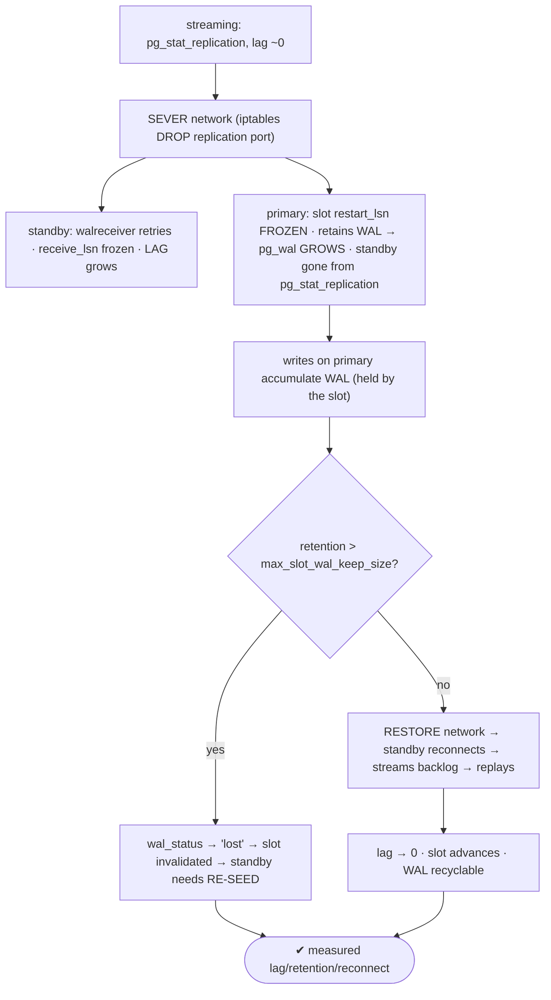
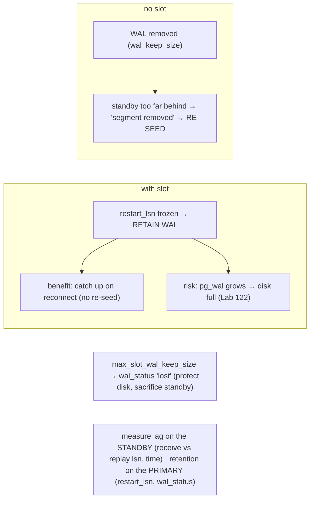

# Lab 124 — Sever the Primary↔Standby Network; Measure Lag, Reconnection, Slot WAL Retention

> **Track C · Cross-Cutting · C1 Chaos & Failure Drills · Lab 4 of 6 (Lab 124/222)**
> Teaching package: concept → diagram → steps → verify → quick-ref → self-test → video script.
> **Depends on:** Lab 26 (streaming replication), Lab 27 (slots), Lab 54 (lag), Lab 122 (disk-full).

---

## 0. Lab Card (at a glance)

| Field | Value |
|---|---|
| **Objective** | Sever the replication link, measure the growing lag and slot WAL retention on the primary, then restore the network and observe reconnection and catch-up. |
| **Success criterion** | Lag grows during the partition; a slot freezes `restart_lsn` and retains WAL (`pg_wal` grows); on reconnect the standby streams the backlog and catches up; you can bound retention with `max_slot_wal_keep_size`. |
| **Scope boundary** | Partition resilience + slot retention. Failover/promotion is Lab 125. |
| **Prereqs** | Labs 26/27; a primary + standby with a slot |
| **Time** | 35–50 min |
| **Difficulty** | ★★★★☆ |
| **Risk** | Medium — network manipulation; remove the firewall rule after. |

---

## 1. Learning Objectives

1. **Partition effect** — lag grows.
2. **Slot retention** — WAL held; the benefit/risk.
3. **No-slot outcome** — WAL removed → re-seed.
4. **Reconnection** — retry, stream backlog, catch up.
5. **Bounding retention** — `max_slot_wal_keep_size`.

---

## 2. Concept Primer — the "why"

**A partition stops the standby receiving WAL → lag grows.** The standby's **walreceiver** loses its connection to the primary's **walsender**. The primary keeps accepting writes; the standby falls behind, so **replication lag** (bytes and time) grows the longer the partition lasts. The standby's walreceiver **retries** to reconnect (`wal_retrieve_retry_interval`, default 5s).

**On the primary, the replication slot is the crux (Lab 27):**
- **With a slot:** the slot's **`restart_lsn` freezes** at the last position the standby confirmed. The primary **retains all WAL from that point** — it *cannot* recycle it, because the slot says the standby still needs it. So **`pg_wal` grows** on the primary for the duration of the partition. This is the slot's **benefit** (on reconnect the standby streams exactly the WAL it missed → catches up cleanly, no re-seed) **and its risk** (a long partition or a dead standby → **unbounded `pg_wal` growth → disk full**, Lab 122).
- **Without a slot:** the primary removes WAL per its normal policy (`wal_keep_size`, checkpoints). If the standby is gone long enough that the needed WAL is recycled, on reconnect it gets **`requested WAL segment has already been removed`** → it **cannot catch up** and needs a **fresh base backup** (re-seed). Slots exist to prevent exactly this.

**On reconnection (network restored):** the walreceiver reconnects, requests WAL from its restart point, the primary streams the **retained backlog**, the standby **replays** it, lag shrinks to ~0, and the slot's `restart_lsn` advances so the primary can finally **recycle** the WAL. (If the WAL is gone, reconnection fails → re-seed.)

**Measuring:**
- **Lag** — during the partition the standby is *gone* from `pg_stat_replication` (disconnected), so measure on the **standby**: `pg_last_wal_receive_lsn()` vs `pg_last_wal_replay_lsn()` (bytes), and `now() - pg_last_xact_replay_timestamp()` (time). Bytes behind the primary: `pg_wal_lsn_diff`.
- **Slot retention** — on the primary: `pg_replication_slots` → **`restart_lsn`** (frozen), **`wal_status`** (`reserved` → `extended` → **`lost`**), and retained WAL: `pg_wal_lsn_diff(pg_current_wal_lsn(), restart_lsn)`. Watch `pg_wal` grow.

**Bounding retention — `max_slot_wal_keep_size`.** Cap how much WAL a slot may retain. If the retained WAL exceeds it, the slot's `wal_status` becomes **`lost`** (invalidated) — this **protects the primary's disk** at the cost of the standby needing a **re-seed**. The trade-off: unbounded retention (disk-full risk) vs a bounded cap (a very-behind standby gets sacrificed).

---

## 3. Diagrams

### 3.1 Partition → reconnect flow



### 3.2 Slot behavior



---

## 4. Prerequisites — primary + standby with a slot

```bash
# primary 5432, standby streaming from it with a slot 'standby1' (Labs 26/27)
sudo -u postgres psql -p 5432 -c "SELECT application_name, state, replay_lag FROM pg_stat_replication;"   # streaming
sudo -u postgres psql -p 5432 -c "SELECT slot_name, active, wal_status, restart_lsn FROM pg_replication_slots;"
```

---

## 5. Step-by-Step

### Step 1 — Baseline: lag ~0, slot active

```bash
sudo -u postgres psql -p 5432 -x -c "SELECT application_name, state,
  pg_size_pretty(pg_wal_lsn_diff(sent_lsn, replay_lsn)) AS behind, replay_lag FROM pg_stat_replication;"
sudo -u postgres psql -p 5432 -c "SELECT pg_size_pretty(pg_wal_lsn_diff(pg_current_wal_lsn(), restart_lsn)) AS slot_retained FROM pg_replication_slots;"
du -sh /var/lib/pgsql/17/data/pg_wal    # baseline pg_wal size
```

### Step 2 — Sever the network (block the replication port)

```bash
# on the PRIMARY, drop packets from the standby to the replication port (adjust standby IP):
STANDBY_IP=10.0.0.2
sudo iptables -A INPUT -p tcp --dport 5432 -s $STANDBY_IP -j DROP
#   (or on the standby: block OUTPUT to the primary's 5432) — the link is now severed
echo "network severed"
```

### Step 3 — Measure LAG on the standby (it's disconnected on the primary)

```bash
# on the STANDBY:
sudo -u postgres psql -p 5433 -x -c "
SELECT pg_last_wal_receive_lsn() AS received,
       pg_last_wal_replay_lsn()  AS replayed,
       now() - pg_last_xact_replay_timestamp() AS time_lag;"
sudo -u postgres psql -p 5433 -c "SELECT status, receive_start_lsn FROM pg_stat_wal_receiver;" 2>/dev/null  # streaming/retrying
# standby log shows retries:
sudo grep -iE "terminating walreceiver|could not connect|streaming" /var/lib/pgsql/17/data/log/postgresql-$(date +%a).log | tail -3
```

### Step 4 — Generate writes on the primary; watch slot RETAIN WAL

```bash
sudo -u postgres pgbench -c 4 -T 30 benchdb >/dev/null 2>&1 &   # writes accumulate WAL
sleep 15
sudo -u postgres psql -p 5432 -c "
SELECT slot_name, active, wal_status,
       pg_size_pretty(pg_wal_lsn_diff(pg_current_wal_lsn(), restart_lsn)) AS retained
FROM pg_replication_slots;"                                     # restart_lsn frozen, retained WAL growing
du -sh /var/lib/pgsql/17/data/pg_wal    # pg_wal GROWING (slot holding WAL for the absent standby)
wait
```

### Step 5 — Restore the network → reconnect + catch up

```bash
STANDBY_IP=10.0.0.2
sudo iptables -D INPUT -p tcp --dport 5432 -s $STANDBY_IP -j DROP   # remove the block
sleep 10
sudo -u postgres psql -p 5432 -c "SELECT application_name, state, replay_lag FROM pg_stat_replication;"  # reappears, catching up
sudo -u postgres psql -p 5432 -c "SELECT slot_name, wal_status, pg_size_pretty(pg_wal_lsn_diff(pg_current_wal_lsn(), restart_lsn)) AS retained FROM pg_replication_slots;"  # advancing
```

### Step 6 — Bound retention with max_slot_wal_keep_size

```bash
sudo -u postgres psql -p 5432 -c "ALTER SYSTEM SET max_slot_wal_keep_size = '2GB'; SELECT pg_reload_conf();"
#   if a future partition retains > 2GB, wal_status → 'lost' (slot invalidated) → protects the disk, standby re-seeds
sudo -u postgres psql -p 5432 -c "SHOW max_slot_wal_keep_size;"
```

---

## 6. Verification Checklist

- [ ] Baseline: lag ~0, slot active
- [ ] Network severed (iptables); standby left `pg_stat_replication`
- [ ] Lag measured on the standby (receive vs replay lsn, time)
- [ ] Slot `restart_lsn` frozen; retained WAL + `pg_wal` grew during writes
- [ ] Network restored → standby reconnected and caught up
- [ ] Slot advanced; retained WAL shrank
- [ ] `max_slot_wal_keep_size` set (retention cap understood)

---

## 7. Troubleshooting

| Symptom | Cause | Fix |
|---|---|---|
| Standby can't reconnect | Needed WAL removed (no slot / cap exceeded) | Re-seed from base backup; or restore from archive |
| `pg_wal` grows unbounded on primary | Slot retaining WAL for an absent standby | `max_slot_wal_keep_size`; fix/drop the slot if standby is dead |
| Slot `wal_status = lost` | Retention exceeded the cap | Re-seed the standby (slot was invalidated) |
| No lag shown on primary | Standby disconnected | Measure on the **standby** (receive/replay lsn) |
| Slow catch-up | Large backlog / bandwidth | Expected; monitor until lag ~0 |
| iptables rule lingering | Not removed | `iptables -D …` after the drill |
| Feedback lost during partition | Standby can't send | `hot_standby_feedback` resumes on reconnect |

---

## 8. Quick Reference Card (paste-ready)

```sql
-- MEASURE (during partition, standby is gone from pg_stat_replication):
--   on STANDBY: pg_last_wal_receive_lsn() vs pg_last_wal_replay_lsn() · now()-pg_last_xact_replay_timestamp()
--   on PRIMARY (slot retention):
SELECT slot_name, active, wal_status, pg_size_pretty(pg_wal_lsn_diff(pg_current_wal_lsn(), restart_lsn)) AS retained
FROM pg_replication_slots;   -- restart_lsn frozen · wal_status reserved→extended→lost · pg_wal grows
```
```bash
# SEVER: sudo iptables -A INPUT -p tcp --dport 5432 -s <standby_ip> -j DROP
# RESTORE: sudo iptables -D INPUT -p tcp --dport 5432 -s <standby_ip> -j DROP   → standby reconnects, streams backlog, catches up
```
```sql
-- SLOT: with slot = retain WAL (catch up, no re-seed) BUT pg_wal grows (disk-full risk) · no slot = WAL removed → re-seed
ALTER SYSTEM SET max_slot_wal_keep_size = '2GB';   -- cap retention → wal_status 'lost' if exceeded (protect disk)
```

---

## 9. Self-Check

1. What happens to lag when the network is severed?
2. What does a replication slot do during a partition, and its benefit/risk?
3. What happens without a slot?
4. What happens on reconnection?
5. What bounds slot WAL retention, and at what cost?
6. Where do you measure lag during a partition?

<details>
<summary>Answers</summary>

1. The standby stops receiving WAL, so lag (bytes and time) **grows** while the primary keeps writing.
2. It **freezes `restart_lsn` and retains all WAL** from that point. Benefit: the standby catches up on reconnect (no re-seed). Risk: `pg_wal` grows unbounded → disk full.
3. The primary may **recycle** the needed WAL; if the standby is too far behind, it gets `WAL segment already removed` and must be **re-seeded**.
4. The walreceiver reconnects, streams the **retained backlog**, the standby replays it, lag → ~0, and the slot advances so WAL can be recycled.
5. **`max_slot_wal_keep_size`** — if retention exceeds it, `wal_status` becomes **`lost`** (slot invalidated), protecting the disk but forcing a standby **re-seed**.
6. On the **standby** (`pg_last_wal_receive_lsn` vs `pg_last_wal_replay_lsn`, and the time lag) — it's disconnected from `pg_stat_replication`.
</details>

---

## 10. Video / Teaching Script

| # | On screen | Say (narration) |
|---|---|---|
| 1 | Title: "Cut the wire" | "Replication is happy — until the network isn't. Let's sever the link between primary and standby and watch what breaks, and what saves us." |
| 2 | sever + lag | "One firewall rule, and the standby's cut off. It starts falling behind, retrying to reconnect. Lag climbs." |
| 3 | slot retention | "On the primary, the replication slot freezes — and starts hoarding WAL for the standby that isn't there. Watch pg_wal grow." |
| 4 | benefit/risk | "That's the deal: the slot guarantees the standby can catch up — but if the standby stays gone, that WAL fills your disk." |
| 5 | reconnect | "Restore the network, and the standby reconnects, drinks the backlog, and catches right up. The slot lets go." |
| 6 | cap | "So cap it — max-slot-wal-keep-size. If a standby's hopelessly behind, sacrifice it before it takes down your primary's disk." |
| 7 | Outro | "Partitions, understood. Next: promoting a replica under load." |

---

## 11. Glossary

- **Partition** — severed primary↔standby link.
- **walsender / walreceiver** — primary / standby replication processes.
- **Replication slot / `restart_lsn`** — WAL-retention marker (frozen during partition).
- **`wal_status`** — reserved → extended → lost.
- **Retained WAL** — WAL the slot keeps (grows `pg_wal`).
- **`max_slot_wal_keep_size`** — retention cap (invalidates the slot if exceeded).
- **Re-seed** — rebuild a standby from a base backup.

---
*NETAPORT lab series · PostgreSQL 17 on AlmaLinux 9 · Lab 124/222 · C1 Chaos & Failure Drills*
