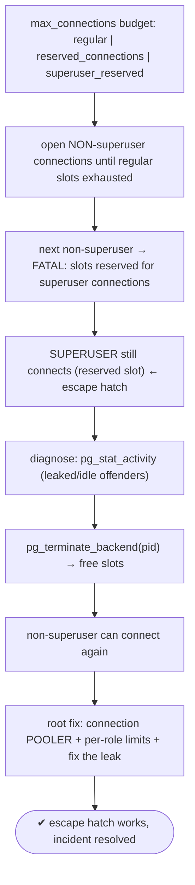
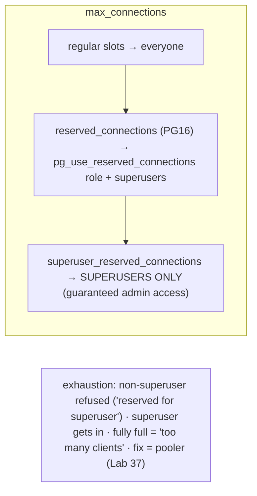

# Lab 125 — Exhaust Connections (`max_connections`); Prove the Reserved Superuser Slots Still Let You In

> **Track C · Cross-Cutting · C1 Chaos & Failure Drills · Lab 5 of 6 (Lab 125/222)**
> Teaching package: concept → diagram → steps → verify → quick-ref → self-test → video script.
> **Depends on:** Lab 39/40 (connection limits), Lab 37 (pooling), Lab 52 (terminate backends).

---

## 0. Lab Card (at a glance)

| Field | Value |
|---|---|
| **Objective** | Exhaust the non-reserved connection slots, prove that non-superusers are refused while a superuser still connects via reserved slots, and run the emergency recovery workflow. |
| **Success criterion** | Non-superusers get the "reserved slots" error at exhaustion; a superuser connects and terminates offenders to free slots; you understand the reservation tiers (incl. PG16 `reserved_connections`). |
| **Scope boundary** | Connection exhaustion + reserved slots. Pooling was Lab 37; per-role limits Lab 40. |
| **Prereqs** | Labs 39/40; ability to restart (change `max_connections`) |
| **Time** | 25–35 min |
| **Difficulty** | ★★★☆☆ |
| **Risk** | Medium — lowers `max_connections` (restart); a lab cluster. |

---

## 1. Learning Objectives

1. **The connection budget** and reservation tiers.
2. **`superuser_reserved_connections`** — the admin escape hatch.
3. **`reserved_connections`** (PG16) — privileged non-superusers.
4. **Exhaustion behavior** — who gets refused, and the errors.
5. **Emergency recovery** and the root-cause fix.

---

## 2. Concept Primer — the "why"

**`max_connections` is a budget split into tiers.** The default is 100. Of those, some slots are **reserved** so that privileged roles can always get in even when the app has consumed everything:

| Tier | Who can use it | Setting |
|---|---|---|
| Regular | everyone | `max_connections − reserved − superuser_reserved` |
| **`reserved_connections`** (PG16) | members of `pg_use_reserved_connections` (+ superusers) | `reserved_connections` (default 0) |
| **`superuser_reserved_connections`** | **superusers only** | default 3 |

So the last **`superuser_reserved_connections`** (3) slots are for **superusers only** — the guaranteed **admin escape hatch**. When active connections reach `max_connections − superuser_reserved_connections`, **new non-superuser connections are refused**, but a **superuser can still connect** into the reserved slots to diagnose and fix the problem. **`reserved_connections`** (PG16) adds a middle tier: reserve slots for a **privileged non-superuser** role (monitoring/admin) via the `pg_use_reserved_connections` predefined role — access above the superuser-only reserve, without granting full superuser.

**The errors at exhaustion:**
- Non-superuser refused while reserved slots remain: **`FATAL: remaining connection slots are reserved for non-replication superuser connections`**.
- Fully full (even superuser slots gone): **`FATAL: sorry, too many clients already`**.

**Why this matters.** Connection exhaustion is a **common incident** — an app leaks connections, has no pooler, or hits a traffic spike, and fills every slot. Without reserved slots, an admin would be **locked out** and unable to fix it. The reserved slots guarantee you can always connect to run the recovery.

**Emergency recovery workflow:** a superuser connects via the reserved slot → `SELECT … FROM pg_stat_activity` to find the offenders (leaked/idle connections) → **`pg_terminate_backend(pid)`** them (Lab 52) → slots free up → the app can connect again.

**The root-cause fix is a pooler, not more slots.** Raising `max_connections` costs memory per connection and doesn't stop a leak. The real fix is a **connection pooler** (PgBouncer, Lab 37/38) so apps share a bounded set of backend connections, plus fixing the leak and setting **per-role connection limits** (Lab 40). Reserved slots are the *safety net*; the pooler is the *prevention*.

---

## 3. Diagrams

### 3.1 Exhaust → recover flow



### 3.2 Reservation tiers



---

## 4. Prerequisites — settings + a low limit for the demo

```bash
sudo -u postgres psql -c "SHOW max_connections; SHOW superuser_reserved_connections; SHOW reserved_connections;"
# make it small + testable:
sudo -u postgres psql -c "ALTER SYSTEM SET max_connections = 10; ALTER SYSTEM SET superuser_reserved_connections = 3;"
sudo systemctl restart postgresql-17    # max_connections needs a restart
# a non-superuser app role:
sudo -u postgres psql -c "CREATE ROLE app LOGIN PASSWORD 'App!1';" 2>/dev/null || true
sudo -u postgres psql -c "GRANT CONNECT ON DATABASE benchdb TO app;"
HBA=$(sudo -u postgres psql -tAc "SHOW hba_file;"); grep -q "host benchdb app" "$HBA" || echo "host benchdb app 127.0.0.1/32 scram-sha-256" | sudo tee -a "$HBA"; sudo systemctl reload postgresql-17
```

---

## 5. Step-by-Step

### Step 1 — Fill the non-reserved slots as a non-superuser

```bash
# max_connections=10, superuser_reserved=3 → 7 slots for non-superusers.
# open 7 held-open 'app' connections in the background:
for i in $(seq 1 7); do
  PGPASSWORD='App!1' psql -h 127.0.0.1 -U app -d benchdb -c "SELECT pg_sleep(60);" >/dev/null 2>&1 &
done
sleep 2
sudo -u postgres psql -c "SELECT count(*) FROM pg_stat_activity WHERE usename='app';"   # ~7
```

### Step 2 — The next non-superuser connection is REFUSED

```bash
PGPASSWORD='App!1' psql -h 127.0.0.1 -U app -d benchdb -c "SELECT 1;" 2>&1 | tail -1
#   → FATAL: remaining connection slots are reserved for non-replication superuser connections
```

### Step 3 — A SUPERUSER STILL connects (the escape hatch)

```bash
sudo -u postgres psql -c "SELECT 'superuser got in via reserved slot' AS proof;"   # succeeds despite exhaustion
```

### Step 4 — Emergency recovery: diagnose + terminate offenders

```bash
sudo -u postgres psql -x -c "
SELECT pid, usename, state, now()-state_change AS idle_for, left(query,30) AS query
FROM pg_stat_activity WHERE usename='app' ORDER BY state_change;"
# free slots by terminating the runaway/idle 'app' backends:
sudo -u postgres psql -c "SELECT pg_terminate_backend(pid) FROM pg_stat_activity WHERE usename='app';"
sleep 1
sudo -u postgres psql -c "SELECT count(*) FROM pg_stat_activity WHERE usename='app';"   # freed
```

### Step 5 — Non-superuser can connect again

```bash
PGPASSWORD='App!1' psql -h 127.0.0.1 -U app -d benchdb -c "SELECT 'app can connect again' AS ok;"   # works now
```

### Step 6 — (PG16) reserved_connections for a privileged non-superuser

```bash
sudo -u postgres psql <<'SQL'
ALTER SYSTEM SET reserved_connections = 2;               -- (needs restart to take effect)
CREATE ROLE ops LOGIN PASSWORD 'Ops!1';
GRANT pg_use_reserved_connections TO ops;                 -- ops can use the reserved (non-superuser) slots
SQL
#   after restart: when regular slots are full, 'ops' still connects (before the superuser-only reserve)
echo "ops role granted pg_use_reserved_connections (PG16 reserved tier)"
```

### Step 7 — Restore the demo settings

```bash
sudo -u postgres psql -c "ALTER SYSTEM RESET max_connections; ALTER SYSTEM RESET reserved_connections; ALTER SYSTEM RESET superuser_reserved_connections;"
# (restart to apply) — and remember: the real fix is a POOLER (Lab 37), not just more slots
```

---

## 6. Verification Checklist

- [ ] Non-superuser slots filled (7 of 10)
- [ ] Extra non-superuser connection refused with the reserved-slots error
- [ ] Superuser connected despite exhaustion (reserved slot)
- [ ] Diagnosed offenders in `pg_stat_activity`
- [ ] `pg_terminate_backend` freed slots
- [ ] Non-superuser reconnected after recovery
- [ ] (PG16) `reserved_connections` + `pg_use_reserved_connections` understood

---

## 7. Troubleshooting

| Symptom | Cause | Fix |
|---|---|---|
| "sorry, too many clients already" | Even superuser slots full | Raise `superuser_reserved_connections`; local/emergency kill; restart |
| Superuser can't connect | Connecting as non-superuser / all full | Use a real superuser role; ensure reserved slots exist |
| App exhausts slots repeatedly | Leak / no pooler | Add PgBouncer (Lab 37); fix the leak; per-role limits (Lab 40) |
| `reserved_connections` not honored | Role lacks the grant / pre-PG16 | `GRANT pg_use_reserved_connections`; upgrade |
| Change to `max_connections` ignored | Needs restart | Restart (postmaster param) |
| Terminated backend slot not freed | Client hasn't disconnected | `pg_terminate_backend` sends SIGTERM; wait/confirm |
| Idle connections hold slots | Idle apps / no pooler | Pooler + idle timeout |

---

## 8. Quick Reference Card (paste-ready)

```sql
-- BUDGET (tiers): max_connections = regular + reserved_connections + superuser_reserved_connections
SHOW max_connections; SHOW superuser_reserved_connections; SHOW reserved_connections;
--   last superuser_reserved (3) = SUPERUSERS ONLY (guaranteed admin access)
--   reserved_connections (PG16) = pg_use_reserved_connections role members (+ superusers)

-- exhaustion: non-superuser → FATAL "remaining connection slots are reserved..." · fully full → "too many clients already"

-- EMERGENCY (as superuser, via reserved slot):
SELECT pid, usename, state, query FROM pg_stat_activity ORDER BY state_change;
SELECT pg_terminate_backend(pid) FROM pg_stat_activity WHERE usename='app';   -- free slots

-- PG16 privileged non-superuser reserve:
ALTER SYSTEM SET reserved_connections = 2;  GRANT pg_use_reserved_connections TO ops;

-- ROOT FIX = connection POOLER (PgBouncer, Lab 37) + per-role limits (Lab 40) + fix the leak — not just more slots
```

---

## 9. Self-Check

1. What is `superuser_reserved_connections`?
2. What error do non-superusers get at exhaustion?
3. What is `reserved_connections` (PG16)?
4. What's the reservation tier order?
5. What's the emergency workflow when connections are exhausted?
6. What's the root-cause fix?

<details>
<summary>Answers</summary>

1. Slots reserved for **superusers only**; when connections reach `max_connections − this`, non-superusers are refused but **superusers can still connect** — guaranteed admin access.
2. `FATAL: remaining connection slots are reserved for non-replication superuser connections` (or `sorry, too many clients already` if fully full).
3. A PG16 tier reserving slots for members of **`pg_use_reserved_connections`** — privileged **non-superusers** — above the superuser-only reserve.
4. Regular (everyone) → `reserved_connections` (pg_use_reserved_connections + superusers) → `superuser_reserved_connections` (superusers only).
5. A superuser connects via a reserved slot, inspects `pg_stat_activity`, and `pg_terminate_backend`s the offending/idle backends to free slots.
6. A **connection pooler** (PgBouncer) — bounded backend connections — plus fixing the leak and per-role limits; not merely raising `max_connections`.
</details>

---

## 10. Video / Teaching Script

| # | On screen | Say (narration) |
|---|---|---|
| 1 | Title: "Locked out of your own database?" | "Connection exhaustion: the app opens every slot, and suddenly *nobody* can connect. Except — Postgres keeps a few in reserve, just for you." |
| 2 | fill | "Watch: fill the non-reserved slots as the app user. Seven of ten, gone." |
| 3 | refused | "The next app connection? Refused — 'slots reserved for superuser connections.' The app's locked out." |
| 4 | superuser in | "But the superuser walks right in, through the reserved door. That's your escape hatch — always." |
| 5 | recover | "Now fix it: list who's hogging connections, terminate the leaked ones, and the slots free up. App's back." |
| 6 | root fix | "The reserved slots saved you — but the *real* fix is a pooler. Don't let apps open unbounded connections in the first place." |
| 7 | Outro | "An escape hatch that always works. Next: the OOM killer." |

---

## 11. Glossary

- **`max_connections`** — total concurrent connection budget.
- **`superuser_reserved_connections`** — superuser-only reserve (admin escape hatch).
- **`reserved_connections` (PG16)** — reserve for `pg_use_reserved_connections` members.
- **`pg_use_reserved_connections`** — role that may use the reserved tier.
- **Connection exhaustion** — all non-reserved slots consumed.
- **`pg_terminate_backend`** — free a slot by killing a backend.
- **Pooler** — the root-cause fix (PgBouncer).

---
*NETAPORT lab series · PostgreSQL 17 on AlmaLinux 9 · Lab 125/222 · C1 Chaos & Failure Drills*
