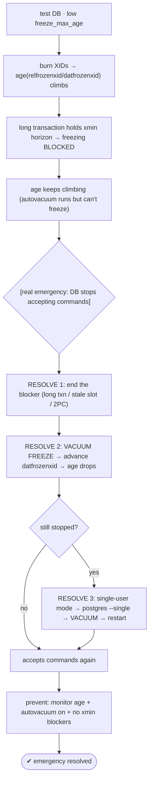
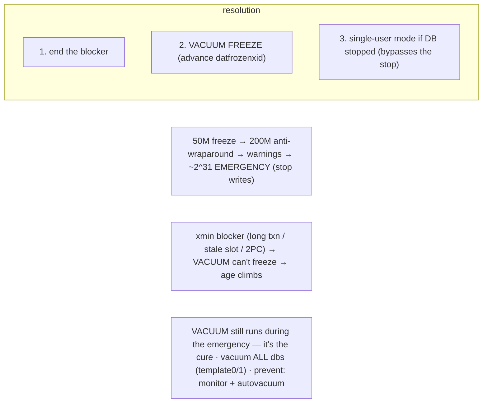

# Lab 126 — Simulate a Wraparound Emergency (Aggressive XID Consumption in a Test DB); Resolve It

> **Track C · Cross-Cutting · C1 Chaos & Failure Drills · Lab 6 of 6 (Lab 126/222 · C1 complete)**
> Teaching package: concept → diagram → steps → verify → quick-ref → self-test → video script.
> **Depends on:** Lab 60 (wraparound detection), Lab 110 (xmin horizon), Lab 58 (VACUUM), Lab 27 (slots).

---

## 0. Lab Card (at a glance)

| Field | Value |
|---|---|
| **Objective** | Simulate the conditions of a wraparound emergency (climbing XID age with blocked freezing), then run the full resolution — unblock freezing, `VACUUM FREEZE`, and single-user-mode vacuum. |
| **Success criterion** | XID age climbs; you find and remove the freezing blocker; `VACUUM FREEZE` drops the age; the single-user-mode recovery procedure is demonstrated. |
| **Scope boundary** | The emergency + recovery. Detection/mechanism was Lab 60. |
| **Prereqs** | Labs 60/110; a test database |
| **Time** | 35–50 min |
| **Difficulty** | ★★★★★ |
| **Risk** | Medium — test DB only; simulates the workflow (the real 2³¹ isn't reached). |

---

## 1. Learning Objectives

1. **The emergency** — when PostgreSQL stops accepting writes.
2. **Why freezing falls behind** — the xmin blocker.
3. **The resolution** — unblock + `VACUUM FREEZE`.
4. **Single-user mode** — the emergency recovery tool.
5. **Prevention** — monitor + autovacuum + no blockers.

---

## 2. Concept Primer — the "why"

**The wraparound emergency is PostgreSQL's last-ditch data protection (Lab 60).** With 32-bit XIDs wrapping at ~4.29 billion, old rows must be **frozen** before their age reaches ~**2³¹**. The freeze ladder: `vacuum_freeze_min_age` (50M, normal vacuum freezes) → `autovacuum_freeze_max_age` (200M, forced anti-wraparound autovacuum) → as age climbs toward 2³¹, **warnings** in the log (`database "X" must be vacuumed within N transactions`), and finally the **emergency**: within a small safety margin of wraparound, PostgreSQL **refuses to assign new XIDs** — it **stops accepting write commands**:
```
ERROR: database is not accepting commands to avoid wraparound data loss in database "X"
HINT:  Stop the postmaster and vacuum that database in single-user mode.
```
Reads and `VACUUM` can still run — `VACUUM` (which freezes) is exactly what saves you.

**Why freezing falls behind (the real cause).** Autovacuum *tries* to freeze, but it can only advance the frozen horizon if **nothing holds the xmin horizon back** (Lab 110): a **long-running / idle-in-transaction** session, a **stale replication slot** (Lab 27), or an **abandoned prepared (2PC)** transaction. Any of these means `VACUUM` **runs but can't freeze**, `age(datfrozenxid)` climbs relentlessly, and you march toward the emergency — even with autovacuum on. (Disabling autovacuum does it too.)

**The resolution — three steps:**
1. **Unblock freezing** — find and **end** whatever holds the xmin horizon: the oldest transaction (`pg_stat_activity`), a stale slot (`pg_replication_slots` → drop it), a prepared transaction (`pg_prepared_xacts` → commit/rollback).
2. **`VACUUM` (FREEZE)** the affected database/tables to **advance `datfrozenxid`** and drop the age. Aggressive: `vacuumdb --all --freeze`, or targeted at the oldest tables.
3. **If the DB has already stopped accepting commands**, use **single-user mode** (below).

**Single-user mode — the emergency recovery tool.** A standalone backend (no postmaster, one connection) that **bypasses the wraparound "stop,"** letting you vacuum a database that won't accept normal commands:
```bash
sudo systemctl stop postgresql-17
sudo -u postgres /usr/pgsql-17/bin/postgres --single -D /var/lib/pgsql/17/data mydb
#   backend> VACUUM;        (or VACUUM FREEZE;)   then Ctrl-D
sudo systemctl start postgresql-17
```
After freezing, `age(datfrozenxid)` drops, warnings clear, and the database accepts writes again. *(Vacuum **all** databases, including `template0`/`template1`, since any can be the one at risk; MultiXact wraparound — `age(datminmxid)` — resolves the same way.)*

**Prevention:** monitor `age(datfrozenxid)` and **alert early** (Lab 60), keep **autovacuum on and tuned** (Lab 59), and eliminate **xmin-horizon blockers** (Lab 110). A wraparound emergency is always preventable.

---

## 3. Diagrams

### 3.1 Simulate → resolve flow



### 3.2 Concept



---

## 4. Prerequisites — a test database

```bash
sudo -u postgres createdb wrapdb 2>/dev/null || true
sudo -u postgres psql -d wrapdb <<'SQL'
DROP TABLE IF EXISTS churn;
CREATE TABLE churn (id int PRIMARY KEY, v int);
INSERT INTO churn SELECT g, g FROM generate_series(1,100000) g;
ALTER TABLE churn SET (autovacuum_freeze_max_age = 150000);   -- low, so anti-wraparound triggers with fewer XIDs (Lab 60)
SQL
sudo -u postgres psql -d wrapdb -c "SELECT datname, age(datfrozenxid) FROM pg_database WHERE datname='wrapdb';"
```

---

## 5. Step-by-Step

### Step 1 — Burn XIDs; watch age climb

```bash
# each pgbench write transaction consumes an XID:
sudo -u postgres pgbench -c 4 -j 4 -t 50000 wrapdb >/dev/null 2>&1     # ~200k XIDs
sudo -u postgres psql -d wrapdb -c "SELECT age(relfrozenxid) AS churn_age FROM pg_class WHERE relname='churn';"
sudo -u postgres psql -d wrapdb -c "SELECT datname, age(datfrozenxid) FROM pg_database WHERE datname='wrapdb';"
```

### Step 2 — Block freezing with a long transaction (the real culprit)

```text
# in ANOTHER terminal on wrapdb, hold a snapshot open:
[BLOCKER] BEGIN ISOLATION LEVEL REPEATABLE READ; SELECT 1;   -- leave open → pins the xmin horizon
```
```bash
# now VACUUM can't advance the frozen horizon:
sudo -u postgres pgbench -c 4 -j 4 -t 50000 wrapdb >/dev/null 2>&1
sudo -u postgres psql -d wrapdb -c "VACUUM (FREEZE, VERBOSE) churn;" 2>&1 | grep -i "not yet removable\|frozen\|oldest xmin" | tail -3
sudo -u postgres psql -d wrapdb -c "SELECT age(relfrozenxid) FROM pg_class WHERE relname='churn';"   # still climbing (blocked)
```

### Step 3 — Diagnose the blocker

```bash
sudo -u postgres psql -c "
SELECT pid, datname, state, now()-xact_start AS txn_age, age(backend_xmin) AS xmin_age
FROM pg_stat_activity WHERE backend_xmin IS NOT NULL ORDER BY age(backend_xmin) DESC LIMIT 3;"   # the BLOCKER shows here
sudo -u postgres psql -c "SELECT slot_name, age(xmin) FROM pg_replication_slots WHERE xmin IS NOT NULL;"  # stale slots
sudo -u postgres psql -c "SELECT gid FROM pg_prepared_xacts;" 2>/dev/null                                # abandoned 2PC
```

### Step 4 — Resolve #1+#2: end the blocker, then VACUUM FREEZE

```text
[BLOCKER] COMMIT;   -- (or: on the primary, terminate it: SELECT pg_terminate_backend(:pid); )
```
```bash
sudo -u postgres psql -d wrapdb -c "VACUUM (FREEZE, VERBOSE) churn;" 2>&1 | tail -2
sudo -u postgres psql -d wrapdb -c "SELECT age(relfrozenxid) AS after FROM pg_class WHERE relname='churn';"   # age DROPS now
sudo -u postgres vacuumdb --freeze -d wrapdb                                                                  # freeze the whole DB
sudo -u postgres psql -c "SELECT datname, age(datfrozenxid) FROM pg_database WHERE datname='wrapdb';"          # datfrozenxid advanced
```

### Step 5 — Resolve #3: single-user-mode vacuum (the emergency procedure)

```bash
# THIS is what you run if the DB has stopped accepting commands ("vacuum in single-user mode").
# Demonstrated here on the test DB as the exact procedure:
sudo systemctl stop postgresql-17
sudo -u postgres bash -c '/usr/pgsql-17/bin/postgres --single -D /var/lib/pgsql/17/data wrapdb <<EOF
VACUUM FREEZE;
EOF'
sudo systemctl start postgresql-17
sudo -u postgres psql -d wrapdb -c "SELECT datname, age(datfrozenxid) FROM pg_database WHERE datname='wrapdb';"  # frozen, low age
```

### Step 6 — Prevention: monitor + keep freezing unblocked

```bash
sudo -u postgres psql -c "
SELECT datname, age(datfrozenxid), (2^31)::bigint - age(datfrozenxid) AS xids_until_wraparound
FROM pg_database ORDER BY age(datfrozenxid) DESC;"   # alert well before the limit (Lab 60)
# autovacuum ON; watch pg_stat_activity/slots/2PC for xmin blockers (Lab 110)
```

---

## 6. Verification Checklist

- [ ] Burned XIDs; `age` climbed
- [ ] A long transaction blocked freezing (VACUUM couldn't reduce age)
- [ ] Diagnosed the blocker in `pg_stat_activity`
- [ ] Ended the blocker; `VACUUM FREEZE` dropped the age
- [ ] `vacuumdb --freeze` advanced `datfrozenxid`
- [ ] Single-user-mode vacuum procedure demonstrated
- [ ] Prevention monitoring query in place

---

## 7. Troubleshooting

| Symptom | Cause | Fix |
|---|---|---|
| Age won't drop after VACUUM | Something still holds the xmin horizon | Find/end the long txn / drop stale slot / resolve 2PC, then re-vacuum |
| DB stopped accepting commands | Hit the wraparound stop | **Single-user mode** VACUUM |
| Single-user mode won't start | Wrong datadir/dbname | Correct `-D` and the DB name |
| VACUUM very slow | Big DB, full freeze scan | Expected; be patient |
| Recurs | Autovacuum off / persistent blocker | Enable autovacuum; eliminate xmin blockers; monitor |
| Still warns after vacuum | Other DBs at risk | Vacuum **all** DBs incl. `template0`/`template1` |
| MultiXact wraparound | `age(datminmxid)` high | Same single-user VACUUM fixes it |

---

## 8. Quick Reference Card (paste-ready)

```sql
-- EMERGENCY: age(oldest unfrozen XID) → ~2^31 → "database is not accepting commands to avoid wraparound data loss"
--   VACUUM still runs (it's the cure). Cause: something blocks freezing (xmin horizon).

-- MONITOR: SELECT datname, age(datfrozenxid), (2^31)::bigint-age(datfrozenxid) AS remaining FROM pg_database ORDER BY 2 DESC;

-- RESOLVE:
-- 1) UNBLOCK freezing — end the holder:
SELECT pid, age(backend_xmin) FROM pg_stat_activity WHERE backend_xmin IS NOT NULL ORDER BY 2 DESC;  -- long txn
SELECT slot_name FROM pg_replication_slots WHERE xmin IS NOT NULL;                                    -- stale slot → drop
SELECT gid FROM pg_prepared_xacts;                                                                    -- 2PC → commit/rollback
-- 2) FREEZE:
VACUUM FREEZE;   -- or:  vacuumdb --all --freeze
```
```bash
# 3) SINGLE-USER MODE (if the DB won't accept commands):
sudo systemctl stop postgresql-17
sudo -u postgres /usr/pgsql-17/bin/postgres --single -D /var/lib/pgsql/17/data <dbname>
#   backend> VACUUM FREEZE;   (Ctrl-D)
sudo systemctl start postgresql-17
# prevent: monitor age + autovacuum ON + no xmin blockers · vacuum ALL dbs (template0/1)
```

---

## 9. Self-Check

1. What triggers the wraparound emergency?
2. Why might freezing not keep up despite autovacuum?
3. What are the resolution steps?
4. What is single-user mode, and when do you use it?
5. What confirms recovery?
6. How do you prevent it?

<details>
<summary>Answers</summary>

1. The oldest unfrozen XID nearing **2³¹**; PostgreSQL then **stops accepting new transactions** to prevent data loss.
2. Something holds the **xmin horizon** — a long/idle transaction, a stale replication slot, or an abandoned 2PC — so `VACUUM` runs but **can't advance the frozen horizon** (or autovacuum is off).
3. (1) **End the blocker**; (2) **`VACUUM` (FREEZE)** to advance `datfrozenxid` and drop the age; (3) if the DB stopped accepting commands, **single-user mode** vacuum.
4. A standalone backend (`postgres --single`) that **bypasses the wraparound stop**, used to vacuum a database that won't accept normal commands.
5. `age(datfrozenxid)` **drops**, warnings clear, and the database accepts writes again.
6. **Monitor** `age(datfrozenxid)` with early alerts, keep **autovacuum on/tuned**, and eliminate **xmin-horizon blockers**.
</details>

---

## 10. Video / Teaching Script

| # | On screen | Say (narration) |
|---|---|---|
| 1 | Title: "The doomsday: wraparound" | "This is the one that stops writes across a whole database. Let's push toward it, and — more importantly — climb back out." |
| 2 | age climbs | "Burn transactions and the age of the oldest unfrozen row climbs. Vacuum is supposed to freeze old rows and keep it low." |
| 3 | blocked | "But leave one transaction open, and freezing *stalls*. Vacuum runs, and the age keeps rising anyway. That's how real wraparound emergencies happen." |
| 4 | resolve | "The fix is two moves: end the transaction that's holding things hostage, then vacuum-freeze. Watch the age fall." |
| 5 | single-user | "And if it's too late — the database already refusing commands? Single-user mode. Stop the server, start a lone backend, vacuum, restart. It's the one door that always opens." |
| 6 | prevent | "None of this should ever happen: monitor the age, keep autovacuum on, and never leave a transaction open forever." |
| 7 | Outro | "Doomsday, survivable. That completes Chaos and Failure Drills." |

---

## 11. Glossary

- **XID wraparound emergency** — writes stop near 2³¹ to prevent loss.
- **`age(datfrozenxid)`** — how old the oldest unfrozen XID is.
- **Freeze / `VACUUM FREEZE`** — mark rows always-visible (the cure).
- **xmin blocker** — long txn / stale slot / 2PC pinning the horizon.
- **Single-user mode** — `postgres --single`; bypasses the stop.
- **Anti-wraparound autovacuum** — forced vacuum near the limit.
- **`datfrozenxid`** — the frozen horizon (advanced by VACUUM).

---
*NETAPORT lab series · PostgreSQL 17 on AlmaLinux 9 · Lab 126/222 · **C1 Chaos & Failure Drills complete***
