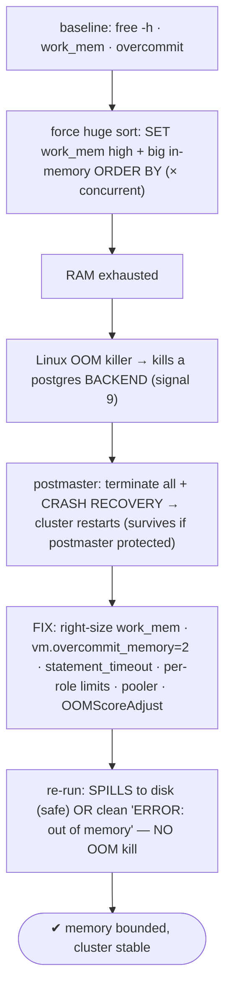
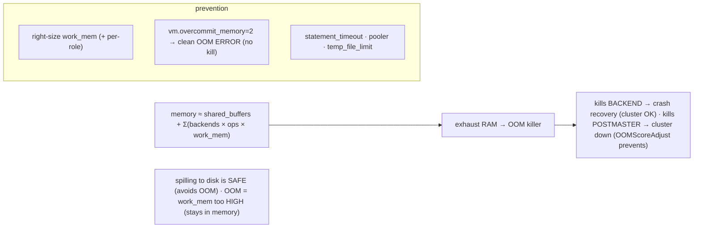

# Lab 127 — Runaway Query OOM: Force a Huge Sort, Watch the OOM Killer, Then Fix with `work_mem`/Limits

> **Track C · Cross-Cutting · C1 Chaos & Failure Drills · Lab 7 of 7 (Lab 127/222)**
> Teaching package: concept → diagram → steps → verify → quick-ref → self-test → video script.
> **Depends on:** Lab 08 (OOMScoreAdjust), Lab 09 (work_mem), Lab 11 (overcommit), Lab 121 (crash recovery).

---

## 0. Lab Card (at a glance)

| Field | Value |
|---|---|
| **Objective** | Force a memory-hungry query, observe the Linux OOM killer and PostgreSQL's crash-recovery response, then prevent it with right-sized `work_mem`, `vm.overcommit_memory=2`, timeouts, and OOM protection. |
| **Success criterion** | A huge in-memory sort exhausts RAM and triggers the OOM killer + recovery; after the fixes, the same query spills to disk or errors cleanly with no OOM kill. |
| **Scope boundary** | Memory-driven OOM + prevention. Crash recovery mechanics were Lab 121. |
| **Prereqs** | Labs 08/09/11; a lab cluster |
| **Time** | 30–45 min |
| **Difficulty** | ★★★★☆ |
| **Risk** | **Medium-High** — can trigger a cluster restart; lab only. |

---

## 1. Learning Objectives

1. **The memory math** — `work_mem` × ops × concurrency.
2. **OOM killer behavior** — backend vs postmaster.
3. **Crash-recovery response** to a killed backend.
4. **`vm.overcommit_memory=2`** — clean errors, not kills.
5. **Right-sizing + limits** to prevent it.

---

## 2. Concept Primer — the "why"

**`work_mem` is allocated *per backend, per operation* — that's how memory blows up.** Each **sort** or **hash** node in a plan can use up to `work_mem`; a single query may have **several** such nodes, and every concurrent connection multiplies it. So total demand is roughly:
```
memory ≈ shared_buffers + Σ(backends × operations × work_mem)   (hash ops use work_mem × hash_mem_multiplier, default 2)
```
An oversized `work_mem` (GBs), a query with many sort/hash nodes, or high concurrency can exhaust RAM.

**What a runaway does — and the crucial nuance about spilling.** If a sort/hash **exceeds** `work_mem`, PostgreSQL **spills to disk** (temp files) — **that's SAFE**: slower, but it *avoids* OOM. OOM comes from `work_mem` being set **too high**, so operations try to stay **in memory** and collectively exhaust RAM before spilling.

**When RAM is exhausted, the Linux OOM killer fires — and PostgreSQL's response depends on *what* it kills:**
- **A backend killed** (SIGKILL): the postmaster detects a backend died abnormally and — because shared memory might be inconsistent — **terminates all other backends and performs crash recovery** (a fast restart, Lab 121). Every session drops; the **cluster survives** and comes back in seconds. You'll see `server process was terminated by signal 9: Killed` → `terminating connection because another server process exited abnormally`.
- **The postmaster killed**: the **whole cluster goes down**. Much worse. This is what **`OOMScoreAdjust`** (Lab 08) prevents: the systemd unit sets `OOMScoreAdjust=-900` (or `PG_OOM_ADJUST_*`) to make the postmaster a **low-priority** OOM target, while children stay killable — so the OOM killer takes a **recoverable backend**, not the cluster.

**The best fix — make allocations fail cleanly instead of inviting the OOM killer.** Set **`vm.overcommit_memory=2`** (Lab 11) so Linux **stops over-promising memory**: an allocation that can't be satisfied **fails**, and PostgreSQL gets a clean **`ERROR: out of memory`** for that one query — **no OOM killer, no cluster restart**. This turns a cluster-wide restart into a single failed query. (Tune `overcommit_ratio` / add swap so legitimate queries aren't starved.)

**Prevent it properly:**
- **Right-size `work_mem`** (Lab 09): small (a few MB to tens of MB), sized so `backends × work_mem` fits in RAM alongside `shared_buffers` and the OS. Give heavy-query roles a **per-role** override (`ALTER ROLE … SET work_mem`), not a huge global.
- **`statement_timeout`** — cap long/heavy queries.
- **A connection pooler** (Lab 37) — bound concurrency so `work_mem` can't multiply out of control.
- **`temp_file_limit`** — cap spilling (prevents disk-full, Lab 122).
- **`vm.overcommit_memory=2`** + **`OOMScoreAdjust`** — clean errors, and protect the postmaster if the killer does run.

---

## 3. Diagrams

### 3.1 Force → OOM → fix flow



### 3.2 Concept



---

## 4. Prerequisites — settings

```bash
free -h
sudo -u postgres psql -c "SHOW work_mem; SHOW hash_mem_multiplier; SHOW max_connections;"
cat /proc/sys/vm/overcommit_memory      # 0 = heuristic (OOM killer risk); 2 = no overcommit (clean errors)
sudo systemctl show postgresql-17 -p OOMScoreAdjust    # Lab 08 (protect postmaster)
```

---

## 5. Step-by-Step

### Step 1 — Force a huge in-memory sort (the runaway)

```bash
# ⚠ lab cluster only — this may trigger a restart. A single session with absurd work_mem + a giant sort:
sudo -u postgres psql -d benchdb <<'SQL' &
SET work_mem = '8GB';                                   -- absurd: forces in-memory
SET max_parallel_workers_per_gather = 0;
SELECT count(*) FROM (SELECT md5(g::text) FROM generate_series(1, 60000000) g ORDER BY 1) s;   -- huge sort held in memory
SQL
# run a couple more concurrently to exhaust RAM faster if needed:
for i in 1 2; do sudo -u postgres psql -d benchdb -c "SET work_mem='8GB'; SELECT count(*) FROM (SELECT md5(g::text) FROM generate_series(1,40000000) g ORDER BY 1) s;" >/dev/null 2>&1 & done
```

### Step 2 — Watch memory + the OOM killer

```bash
# in another terminal, watch memory drop and catch the OOM kill:
watch -n1 free -h &
sleep 20
sudo dmesg | grep -iE "out of memory|killed process|oom" | tail -5      # kernel OOM killer
sudo journalctl -k | grep -i "Out of memory" | tail -3
```

### Step 3 — Observe PostgreSQL's crash-recovery response

```bash
sudo grep -iE "terminated by signal 9|another server process exited abnormally|not properly shut down|redo done|ready to accept" \
  /var/lib/pgsql/17/data/log/postgresql-$(date +%a).log | tail -8
#   → backend killed (signal 9) → all sessions terminated → crash recovery → ready again
sudo systemctl status postgresql-17 --no-pager | head -3    # up (recovered) if postmaster was protected
```

### Step 4 — FIX #1: right-size work_mem

```bash
sudo -u postgres psql -c "ALTER SYSTEM SET work_mem = '16MB'; SELECT pg_reload_conf();"   # sane per-op default
# heavy-query role gets a bounded override, not a huge global:
sudo -u postgres psql -c "ALTER ROLE app SET work_mem = '64MB';" 2>/dev/null || true
sudo -u postgres psql -c "SHOW work_mem;"
```

### Step 5 — FIX #2: vm.overcommit_memory=2 → clean errors instead of kills

```bash
sudo bash -c 'echo "vm.overcommit_memory = 2" >> /etc/sysctl.d/99-postgres.conf; echo "vm.overcommit_ratio = 80" >> /etc/sysctl.d/99-postgres.conf; sysctl --system' | tail -2
# now the same runaway (with high work_mem) ERRORS cleanly instead of OOM-killing:
sudo -u postgres psql -d benchdb -c "SET work_mem='8GB'; SELECT count(*) FROM (SELECT md5(g::text) FROM generate_series(1,60000000) g ORDER BY 1) s;" 2>&1 | tail -2
#   → ERROR: out of memory (one query fails; cluster untouched — NO OOM killer, NO restart)
```

### Step 6 — FIX #3: timeouts, limits, and confirm safe spilling

```bash
sudo -u postgres psql -c "ALTER SYSTEM SET statement_timeout = '60s'; ALTER SYSTEM SET temp_file_limit = '10GB'; SELECT pg_reload_conf();"
# with a SANE work_mem, the big sort SPILLS to disk (safe) instead of OOMing:
sudo -u postgres psql -d benchdb -c "EXPLAIN (ANALYZE, BUFFERS) SELECT count(*) FROM (SELECT md5(g::text) FROM generate_series(1,10000000) g ORDER BY 1) s;" 2>&1 | grep -iE "external merge|Disk|Sort Method" | tail -2
#   → "Sort Method: external merge  Disk: ..."  — spilled safely, no OOM
```

---

## 6. Verification Checklist

- [ ] Forced a huge in-memory sort (high `work_mem`)
- [ ] OOM killer fired (dmesg/journal); memory exhausted
- [ ] A backend was killed (signal 9) → crash recovery → cluster survived
- [ ] `work_mem` right-sized (global small + per-role override)
- [ ] `vm.overcommit_memory=2` → clean `ERROR: out of memory` instead of a kill
- [ ] `statement_timeout`/`temp_file_limit` set
- [ ] With sane `work_mem`, the sort spilled to disk (external merge) — no OOM

---

## 7. Troubleshooting

| Symptom | Cause | Fix |
|---|---|---|
| OOM killed the postmaster (whole cluster down) | No OOM protection | `OOMScoreAdjust=-900` / `PG_OOM_ADJUST_*` (Lab 08) |
| Random process killed | OOM killer (overcommit heuristic) | `vm.overcommit_memory=2` → clean errors |
| Memory blows up | `work_mem` too high × concurrency | Lower it; per-role overrides; pooler |
| Legit queries error "out of memory" | overcommit ratio too low / not enough RAM+swap | Tune `overcommit_ratio`; add RAM/swap; lower `work_mem` |
| Query spills to disk | Exceeded `work_mem` | **That's safe** (not OOM); raise a bit or accept |
| Hash uses more than expected | `hash_mem_multiplier` (×2) | Account for it in sizing |
| Cluster restarted | Backend OOM-killed | Automatic crash recovery (Lab 121) |

---

## 8. Quick Reference Card (paste-ready)

```sql
-- memory ≈ shared_buffers + Σ(backends × ops × work_mem)   (hash × hash_mem_multiplier)
-- OOM = work_mem too HIGH (stays in memory); spilling to disk is SAFE (avoids OOM)

-- FIX:
ALTER SYSTEM SET work_mem = '16MB';                  -- small global; per-role for heavy queries:
ALTER ROLE reporting SET work_mem = '256MB';
ALTER SYSTEM SET statement_timeout = '60s';
ALTER SYSTEM SET temp_file_limit  = '10GB';
SELECT pg_reload_conf();
```
```bash
# clean errors instead of the OOM killer (Lab 11):
echo "vm.overcommit_memory = 2" >> /etc/sysctl.d/99-postgres.conf; sysctl --system   # → ERROR: out of memory (no kill)
# protect the postmaster (Lab 08): systemd OOMScoreAdjust=-900 · pooler to bound concurrency (Lab 37)
# OOM kills a BACKEND → crash recovery (cluster OK) · kills POSTMASTER → cluster down (prevent with OOMScoreAdjust)
```

---

## 9. Self-Check

1. How does a query cause OOM?
2. What happens when the OOM killer kills a backend?
3. Why is killing the postmaster worse, and how do you prevent it?
4. What does `vm.overcommit_memory=2` do?
5. How do you right-size `work_mem`?
6. Is spilling to disk a problem?

<details>
<summary>Answers</summary>

1. A large **sort/hash** with an **oversized `work_mem`**, multiplied by the query's operations and concurrent connections, exhausts RAM → the OOM killer fires.
2. The postmaster detects the abnormal exit and **terminates all backends + runs crash recovery** — every session drops, but the **cluster survives** and restarts in seconds.
3. Killing the postmaster brings the **whole cluster down**; **`OOMScoreAdjust`** (Lab 08) makes the postmaster a low-priority OOM target so a recoverable backend is killed instead.
4. Disables memory **overcommit** — allocations that can't be satisfied **fail cleanly** (`ERROR: out of memory`) instead of triggering the OOM killer, turning a cluster restart into a single failed query.
5. Small (MBs), sized so `backends × work_mem` fits in RAM with `shared_buffers` + OS; give heavy roles a bounded **per-role** override rather than a large global.
6. **No** — spilling to disk is safe (slower, avoids OOM). OOM comes from `work_mem` being **too high** (staying in memory).
</details>

---

## 10. Video / Teaching Script

| # | On screen | Say (narration) |
|---|---|---|
| 1 | Title: "One query eats all the RAM" | "Set work_mem too high, run a giant sort, and Postgres tries to keep it *all* in memory — until Linux runs out and starts killing processes." |
| 2 | OOM | "There it is in the kernel log: 'out of memory, killed process postgres.' A backend dies." |
| 3 | recovery | "Postgres plays it safe — drops every session and does crash recovery. Seconds later it's back. The cluster survived — because the postmaster was protected." |
| 4 | overcommit | "Now the real fix. Tell Linux to stop over-promising memory. Re-run the runaway, and instead of a massacre, you get one clean error: 'out of memory.' One query fails; nothing else notices." |
| 5 | work_mem | "Then right-size work_mem — small by default, generous only for the roles that need it. And a statement timeout, so nothing runs forever." |
| 6 | spilling | "With sane settings, that same big sort just spills to disk. Slower, sure — but safe. That's the trade you want." |
| 7 | Outro | "Runaway queries, contained. That completes the chaos drills." |

---

## 11. Glossary

- **OOM killer** — Linux kernel process-reaper under memory pressure.
- **`work_mem`** — per-backend, per-operation sort/hash memory.
- **`hash_mem_multiplier`** — hash ops' extra `work_mem` factor.
- **`vm.overcommit_memory=2`** — no overcommit → clean OOM errors.
- **`OOMScoreAdjust` / `PG_OOM_ADJUST`** — protect the postmaster.
- **Spill to disk** — safe temp-file fallback (avoids OOM).
- **Crash recovery** — restart after an OOM-killed backend.

---
*NETAPORT lab series · PostgreSQL 17 on AlmaLinux 9 · Lab 127/222 · C1 Chaos & Failure Drills*
