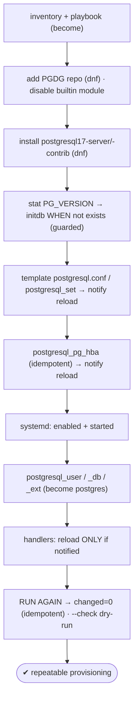
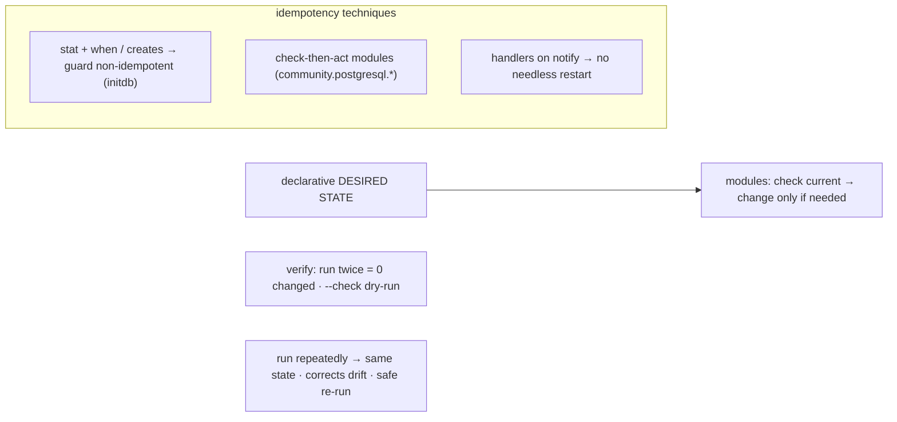

# Lab 128 — Ansible Playbook: Install + `initdb` + Configure a Cluster End-to-End, Idempotently

> **Track C · Cross-Cutting · C2 Automation & IaC · Lab 1 of 6 (Lab 128/222)**
> Teaching package: concept → diagram → steps → verify → quick-ref → self-test → video script.
> **Depends on:** Lab 01/02 (install/initdb), Lab 06 (pg_hba), Lab 13 (reload). Opens the automation track.

---

## 0. Lab Card (at a glance)

| Field | Value |
|---|---|
| **Objective** | Write an idempotent Ansible playbook that adds the PGDG repo, installs PostgreSQL 17, `initdb`s (guarded), configures `postgresql.conf`/`pg_hba.conf`, starts the service, and creates roles/DBs/extensions. |
| **Success criterion** | The playbook provisions a working cluster; a second run reports **0 changed** (idempotent); `--check` validates without changes. |
| **Scope boundary** | Ansible provisioning of one cluster. n8n pipelines are later in C2. |
| **Prereqs** | Ansible + `community.postgresql` collection; a target host |
| **Time** | 35–50 min |
| **Difficulty** | ★★★★☆ |
| **Risk** | Low — declarative; test on a lab host. |

---

## 1. Learning Objectives

1. **Idempotency** — why it matters and how it's achieved.
2. **Guarding non-idempotent steps** — `initdb`.
3. **`community.postgresql` modules** — roles/DBs/config.
4. **Handlers + `notify`** — reload only on change.
5. **Verify** — run twice, `--check`.

---

## 2. Concept Primer — the "why"

**Ansible describes *desired state*, and enforces it idempotently.** A **playbook** (YAML) is a list of **tasks**; each task uses a **module** that checks the current state and **only changes what's needed**. **Idempotency** means running the playbook repeatedly produces the **same result with no unintended changes** — the first run *converges* the host to the desired state; every later run is a no-op. That's what makes IaC safe: re-run anytime, drift is corrected, nothing is clobbered.

**Most modules are idempotent by design; some steps aren't — guard them.** `dnf`, `systemd`, and the `community.postgresql.*` modules check-then-act. But **`initdb` is *not* idempotent** — running it on an existing data directory **fails**. Guard it:
```yaml
- name: check if initialized
  stat: { path: "{{ pg_data }}/PG_VERSION" }
  register: pgdata
- name: initdb (only if not already done)
  command: "{{ pg_bin }}/initdb -D {{ pg_data }} -k --locale=en_US.UTF-8"
  become_user: postgres
  when: not pgdata.stat.exists            # ← the idempotency guard (or use `creates:`)
```

**The `community.postgresql` collection** (install with `ansible-galaxy`) provides idempotent modules:
- `postgresql_user` (roles), `postgresql_db` (databases), `postgresql_ext` (extensions).
- `postgresql_set` — `ALTER SYSTEM` a parameter (checks the current value; changes only if different).
- `postgresql_pg_hba` — manage `pg_hba.conf` entries idempotently.
- `postgresql_query`, `postgresql_privs`.
*(These need `psycopg2` on the target and usually `become_user: postgres` for local peer auth.)*

**Config — two idempotent approaches:** a **`template`** of the whole file (Ansible diffs the rendered content and only writes on change), or **targeted** changes via `postgresql_set` (ALTER SYSTEM) / `lineinfile`. Either way, only a *real* change should trigger a reload.

**Handlers + `notify` — reload only when something changed.** A config task **`notify`**s a **handler**; the handler (reload/restart) runs **once at the end**, and **only if it was notified** — so an unchanged run never bounces the service. (Reload vs restart per Lab 13.)

**Verify idempotency:** run the playbook **twice** — the second run should report **`changed=0`** (all `ok`). **`ansible-playbook --check`** does a dry run that shows what *would* change without changing anything. Structure it as a **role** (`tasks/`, `handlers/`, `templates/`, `defaults/`) for reuse.

---

## 3. Diagrams

### 3.1 Provision flow



### 3.2 Idempotency model



---

## 4. Prerequisites — Ansible + collection

```bash
# on the control node:
ansible --version || sudo dnf install -y ansible-core
ansible-galaxy collection install community.postgresql
# target host needs psycopg2 for the postgresql_* modules (add as a task, or):
#   ansible db1 -m dnf -a "name=python3-psycopg2 state=present" -b
cat > inventory.ini <<'EOF'
[db_servers]
db1 ansible_host=127.0.0.1 ansible_connection=local
EOF
```

---

## 5. Step-by-Step

### Step 1 — The playbook (paste-ready)

```bash
cat > provision-pg.yml <<'YAML'
---
- name: Provision PostgreSQL 17 (idempotent)
  hosts: db_servers
  become: true
  vars:
    pg_version: 17
    pg_data: /var/lib/pgsql/17/data
    pg_bin: /usr/pgsql-17/bin
    pg_service: postgresql-17
    app_db: appdb
    app_user: appuser
    app_password: "App!Pass1"

  tasks:
    - name: Install psycopg2 (for postgresql_* modules)
      ansible.builtin.dnf: { name: python3-psycopg2, state: present }

    - name: Add PGDG repo
      ansible.builtin.dnf:
        name: https://download.postgresql.org/pub/repos/yum/reporpms/EL-9-x86_64/pgdg-redhat-repo-latest.noarch.rpm
        state: present
        disable_gpg_check: true

    - name: Disable the built-in postgresql module (RHEL9)
      ansible.builtin.command: dnf -qy module disable postgresql
      args: { creates: /etc/dnf/modules.d/postgresql.module }   # guard → idempotent-ish

    - name: Install PostgreSQL 17
      ansible.builtin.dnf:
        name: [ "postgresql{{ pg_version }}-server", "postgresql{{ pg_version }}-contrib" ]
        state: present

    - name: Check if the cluster is initialized
      ansible.builtin.stat: { path: "{{ pg_data }}/PG_VERSION" }
      register: pgdata

    - name: initdb (with checksums) — only if not already done
      ansible.builtin.command: "{{ pg_bin }}/initdb -D {{ pg_data }} -k --locale=en_US.UTF-8 --data-checksums"
      become_user: postgres
      when: not pgdata.stat.exists

    - name: Enable + start the service
      ansible.builtin.systemd: { name: "{{ pg_service }}", enabled: true, state: started }

    - name: Set core parameters (ALTER SYSTEM — idempotent, checks current value)
      community.postgresql.postgresql_set: { name: "{{ item.k }}", value: "{{ item.v }}" }
      become_user: postgres
      loop:
        - { k: shared_buffers,               v: "256MB" }
        - { k: work_mem,                      v: "16MB" }
        - { k: logging_collector,             v: "on" }
        - { k: log_min_duration_statement,    v: "250ms" }
      notify: reload postgres

    - name: Manage pg_hba (scram for the app from localhost)
      community.postgresql.postgresql_pg_hba:
        dest: "{{ pg_data }}/pg_hba.conf"
        contype: host
        databases: "{{ app_db }}"
        users: "{{ app_user }}"
        address: 127.0.0.1/32
        method: scram-sha-256
      notify: reload postgres

    - name: Create app role
      community.postgresql.postgresql_user:
        name: "{{ app_user }}"
        password: "{{ app_password }}"
      become_user: postgres

    - name: Create app database
      community.postgresql.postgresql_db:
        name: "{{ app_db }}"
        owner: "{{ app_user }}"
      become_user: postgres

    - name: Enable pg_stat_statements
      community.postgresql.postgresql_ext:
        name: pg_stat_statements
        db: "{{ app_db }}"
      become_user: postgres

  handlers:
    - name: reload postgres
      ansible.builtin.systemd: { name: "{{ pg_service }}", state: reloaded }
YAML
```

### Step 2 — Run it

```bash
ansible-playbook -i inventory.ini provision-pg.yml
#   → PLAY RECAP: db1 : ok=N changed=M ... (first run makes changes)
```

### Step 3 — Prove idempotency: run AGAIN → 0 changed

```bash
ansible-playbook -i inventory.ini provision-pg.yml
#   → PLAY RECAP: db1 : ok=N changed=0 unreachable=0 failed=0   ← idempotent!
```

### Step 4 — Dry-run with --check

```bash
ansible-playbook -i inventory.ini provision-pg.yml --check
#   shows what WOULD change (should be nothing on a converged host)
```

### Step 5 — Verify the cluster

```bash
sudo -u postgres psql -c "SELECT version();"
sudo -u postgres psql -c "SELECT rolname FROM pg_roles WHERE rolname='appuser';"
sudo -u postgres psql -c "SELECT datname FROM pg_database WHERE datname='appdb';"
sudo -u postgres psql -d appdb -c "\dx pg_stat_statements"
sudo -u postgres psql -c "SHOW data_checksums; SHOW work_mem;"    # -k applied; ALTER SYSTEM applied
```

### Step 6 — Prove the handler only reloads on change

```bash
# change a param, run once → handler fires (RUNNING HANDLER reload postgres); run again → no handler
sudo -u postgres psql -c "ALTER SYSTEM SET work_mem='32MB';"   # drift
ansible-playbook -i inventory.ini provision-pg.yml | grep -iE "changed|RUNNING HANDLER"   # corrects drift + reloads once
```

---

## 6. Verification Checklist

- [ ] Collection + psycopg2 present
- [ ] Playbook provisions repo/install/initdb/config/service/role/db/ext
- [ ] `initdb` guarded (`when: not PG_VERSION exists`)
- [ ] First run: changes; **second run: `changed=0`** (idempotent)
- [ ] `--check` shows no changes on a converged host
- [ ] Cluster verified (version, role, db, extension, checksums, params)
- [ ] Handler reloads only on change / corrects drift

---

## 7. Troubleshooting

| Symptom | Cause | Fix |
|---|---|---|
| `initdb` fails on re-run | Not guarded | `stat PG_VERSION` + `when: not exists` (or `creates:`) |
| Always "changed" | Raw `command`/`shell` without `creates`/`changed_when` | Use modules; add guards |
| `postgresql_*` module fails | Collection/psycopg2 missing | `ansible-galaxy install`; install `python3-psycopg2` |
| `postgresql_set` errors | Server not running | Start the service before ALTER SYSTEM tasks |
| Handler never fires | `notify` name ≠ handler name | Match exactly |
| Reloads every run | Config task always changes | Idempotent config (`postgresql_set` / templated exact content) |
| DB tasks fail auth | Not running as postgres | `become_user: postgres` |

---

## 8. Quick Reference Card (paste-ready)

```yaml
# idempotent PostgreSQL provisioning essentials:
- dnf: { name: [postgresql17-server, postgresql17-contrib], state: present }
- stat: { path: "{{ pg_data }}/PG_VERSION" }        # guard initdb
  register: pgdata
- command: "{{ pg_bin }}/initdb -D {{ pg_data }} -k --locale=en_US.UTF-8"
  become_user: postgres
  when: not pgdata.stat.exists
- systemd: { name: postgresql-17, enabled: true, state: started }
- community.postgresql.postgresql_set: { name: work_mem, value: "16MB" }   # ALTER SYSTEM (idempotent)
  notify: reload postgres
- community.postgresql.postgresql_pg_hba: { ... }   notify: reload postgres
- community.postgresql.postgresql_user / _db / _ext: { ... }   # become_user: postgres
# handlers: reload only when NOTIFIED (no needless restart)
```
```bash
ansible-galaxy collection install community.postgresql
ansible-playbook -i inv provision-pg.yml           # run
ansible-playbook -i inv provision-pg.yml           # run AGAIN → changed=0 (idempotent)
ansible-playbook -i inv provision-pg.yml --check    # dry-run
```

---

## 9. Self-Check

1. What is idempotency and why does it matter?
2. Why must `initdb` be guarded, and how?
3. Which modules manage PostgreSQL objects/config?
4. How do handlers avoid unnecessary restarts?
5. How do you verify a playbook is idempotent?
6. What are the two idempotent config approaches?

<details>
<summary>Answers</summary>

1. Running the playbook repeatedly yields the **same state with no unintended changes** — it converges the host and corrects drift, so it's safe to re-run.
2. `initdb` **fails on an existing data directory**; guard it with `stat` on `PG_VERSION` + `when: not pgdata.stat.exists` (or a `creates:` argument).
3. The `community.postgresql` collection: `postgresql_user`, `postgresql_db`, `postgresql_ext`, `postgresql_set` (ALTER SYSTEM), `postgresql_pg_hba`, `postgresql_query` — all idempotent.
4. A task **`notify`**s a handler only when it **changes** something; the handler runs once at the end **only if notified**, so an unchanged run never bounces the service.
5. **Run it twice** — the second run should report `changed=0`; also `--check` for a dry run.
6. A **template** of the whole file (diffed content), or **targeted** changes via `postgresql_set`/`lineinfile`.
</details>

---

## 10. Video / Teaching Script

| # | On screen | Say (narration) |
|---|---|---|
| 1 | Title: "A database, from bare host to running — in one file" | "Ansible describes the state you want, and makes it so. Run it once, run it a hundred times — same result." |
| 2 | the guard | "One gotcha: initdb hates being run twice. So we guard it — only run if the cluster isn't already there." |
| 3 | modules | "Roles, databases, extensions, even pg_hba — dedicated modules that check first and change only what's needed." |
| 4 | run | "Run the playbook. Fresh host, fully provisioned — installed, initialized, configured, running." |
| 5 | idempotent | "Now the proof: run it again. Changed: zero. Nothing touched. *That's* idempotency." |
| 6 | drift | "Someone tweaks a setting by hand? Run the playbook — it quietly puts it back, and reloads once. Drift, corrected." |
| 7 | Outro | "Infrastructure as code, for real. Next: automating backups and maintenance with n8n." |

---

## 11. Glossary

- **Ansible / playbook** — agentless IaC tool / YAML task list.
- **Idempotency** — repeated runs → same state, no drift.
- **Module** — the unit that checks-then-acts (e.g. `dnf`, `postgresql_set`).
- **Guard (`when`/`creates`/`stat`)** — skip a non-idempotent step.
- **`community.postgresql`** — the PostgreSQL module collection.
- **Handler / `notify`** — run-on-change (reload/restart).
- **`--check`** — dry-run mode.

---
*NETAPORT lab series · PostgreSQL 17 on AlmaLinux 9 · Lab 128/222 · C2 Automation & IaC*
