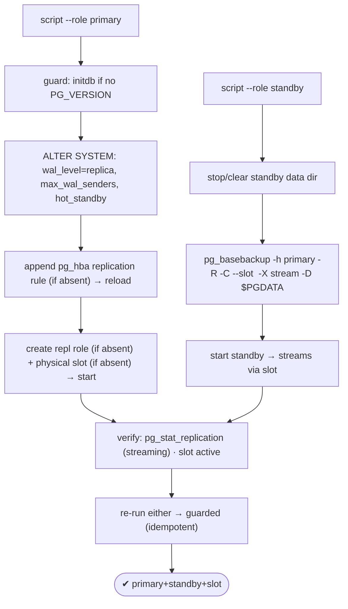
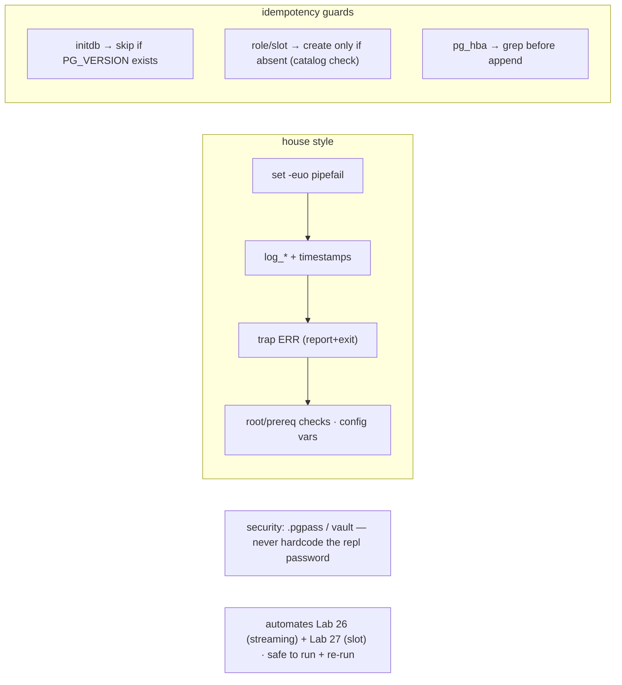

# Lab 129 — Bash Provisioning Script (House Style) to Stand Up Primary + Standby with Slots

> **Track C · Cross-Cutting · C2 Automation & IaC · Lab 2 of 6 (Lab 129/222)**
> Teaching package: concept → diagram → steps → verify → quick-ref → self-test → video script.
> **Depends on:** Lab 26 (streaming replication), Lab 27 (slots), Lab 19 (pg_basebackup), Lab 128 (Ansible).

---

## 0. Lab Card (at a glance)

| Field | Value |
|---|---|
| **Objective** | Write a production-grade, idempotent bash script that provisions a PostgreSQL 17 primary (with a replication role + slot + hba) and a streaming standby (via `pg_basebackup`). |
| **Success criterion** | `--role primary` and `--role standby` runs stand up streaming replication; re-running is safe (guarded); `pg_stat_replication` shows the standby streaming through the slot. |
| **Scope boundary** | Bash automation of primary+standby+slot. Ansible was Lab 128. |
| **Prereqs** | Labs 26/27; two hosts (or two clusters) |
| **Time** | 35–50 min |
| **Difficulty** | ★★★★☆ |
| **Risk** | Low-Medium — provisions clusters; test on lab hosts. |

---

## 1. Learning Objectives

1. **House-style bash** — safety flags, logging, traps.
2. **Idempotency guards** in shell.
3. **Primary setup** — wal_level, role, slot, hba.
4. **Standby setup** — `pg_basebackup` with a slot.
5. **Verify + secure** the automation.

---

## 2. Concept Primer — the "why"

**A provisioning script encodes a repeatable, auditable build.** Where Lab 128 used Ansible, a **hardened bash script** is often what runs first on a fresh AlmaLinux host (bootstrap, cloud-init, a runbook step). "Production-grade" means it's **safe to run and safe to re-run**:
- **`set -euo pipefail`** — exit on any error (`-e`), on unset variables (`-u`), and on a failure anywhere in a pipeline (`pipefail`). No silent partial runs.
- **Logging functions** with timestamps/levels (`log_info`/`log_ok`/`log_warn`/`die`) — every step is auditable.
- **A `trap ... ERR`** — report the failing line and exit cleanly rather than leaving a half-built cluster.
- **Root/prereq checks** and **config vars at the top** (versions, IPs, ports, slot name, credentials).
- **Idempotency guards** — the shell equivalent of Ansible's check-then-act: guard every mutating step so re-runs converge instead of failing.

**Primary setup (automating Labs 26/27):**
- `initdb` **only if `$PGDATA/PG_VERSION` is absent** (the guard).
- `postgresql.conf`: `listen_addresses`, `wal_level = replica`, `max_wal_senders`, `hot_standby = on` (via `ALTER SYSTEM` or config append).
- `pg_hba.conf`: a **`replication`** rule allowing the standby's IP with the replication role — **appended only if not already present**.
- A **replication role** (`REPLICATION LOGIN`) — created **only if it doesn't exist** (`DO`/catalog check).
- A **physical replication slot** — created **only if absent** (`pg_replication_slots` check).

**Standby setup:** `pg_basebackup` from the primary with the flags that wire it up in one shot (Lab 19):
- **`-R`** — write `standby.signal` + `primary_conninfo` so it starts as a standby.
- **`-C --slot <name>`** — create (or use) the slot so the primary retains WAL for it (Lab 27).
- **`-X stream`** — stream WAL during the backup so it's immediately consistent.
Then start the service; it connects and streams through the slot.

**Verify:** `pg_stat_replication` on the primary shows `state = streaming`; `pg_replication_slots` shows the slot **active**.

**Security note (don't skip):** never **hardcode the replication password** in a committed script — use a **`.pgpass`** file (mode 600), an environment variable, or a secret manager/Ansible Vault. The script here shows a variable for clarity; in production it reads the secret, not stores it.

---

## 3. Diagrams

### 3.1 Provision flow



### 3.2 House-style + idempotency



---

## 4. Prerequisites — hosts + variables

```bash
# two hosts: PRIMARY_IP and STANDBY_IP (or two clusters on one host with different ports/dirs).
# open the replication port between them (firewall). Run the script as root (sudo).
```

---

## 5. Step-by-Step — the script (paste-ready, house style)

### Step 1 — Write the provisioning script

```bash
cat > pg-cluster.sh <<'SCRIPT'
#!/usr/bin/env bash
# pg-cluster.sh — provision a PostgreSQL 17 primary or streaming standby (idempotent).
set -euo pipefail
IFS=$'\n\t'

# ---------- config (override via env) ----------
PG_VERSION="${PG_VERSION:-17}"
PGBIN="/usr/pgsql-${PG_VERSION}/bin"
PGDATA="${PGDATA:-/var/lib/pgsql/${PG_VERSION}/data}"
PGSVC="postgresql-${PG_VERSION}"
PRIMARY_IP="${PRIMARY_IP:-10.0.0.1}"
STANDBY_IP="${STANDBY_IP:-10.0.0.2}"
REPL_USER="${REPL_USER:-replicator}"
REPL_PASS="${REPL_PASS:-}"                 # ← supply via env / .pgpass; do NOT hardcode
SLOT_NAME="${SLOT_NAME:-standby1_slot}"
PORT="${PORT:-5432}"

# ---------- logging (house style) ----------
c(){ printf '\033[%sm' "$1"; }; NC=$(c 0)
ts(){ date '+%Y-%m-%d %H:%M:%S'; }
log_info(){ printf '%s [%sINFO%s] %s\n'  "$(ts)" "$(c '0;34')" "$NC" "$*"; }
log_ok(){   printf '%s [%s OK %s] %s\n'  "$(ts)" "$(c '0;32')" "$NC" "$*"; }
log_warn(){ printf '%s [%sWARN%s] %s\n'  "$(ts)" "$(c '0;33')" "$NC" "$*" >&2; }
die(){      printf '%s [%sFAIL%s] %s\n'  "$(ts)" "$(c '0;31')" "$NC" "$*" >&2; exit 1; }
trap 'die "error on line $LINENO"' ERR

psql_p(){ sudo -u postgres "$PGBIN/psql" -qtAX -p "$PORT" "$@"; }
require_root(){ [[ $EUID -eq 0 ]] || die "run as root (sudo)"; }
ensure_installed(){ rpm -q "postgresql${PG_VERSION}-server" &>/dev/null || die "install postgresql${PG_VERSION}-server first"; }

# ---------- primary ----------
provision_primary(){
  log_info "provisioning PRIMARY"
  if [[ ! -f "$PGDATA/PG_VERSION" ]]; then
    log_info "initdb (checksums)"; sudo -u postgres "$PGBIN/initdb" -D "$PGDATA" -k --locale=en_US.UTF-8 >/dev/null
  else log_ok "already initialized (skip initdb)"; fi
  systemctl enable --now "$PGSVC" >/dev/null
  log_info "applying replication settings"
  psql_p -c "ALTER SYSTEM SET listen_addresses='*';"
  psql_p -c "ALTER SYSTEM SET wal_level='replica';"
  psql_p -c "ALTER SYSTEM SET max_wal_senders='10';"
  psql_p -c "ALTER SYSTEM SET hot_standby='on';"
  # pg_hba replication rule (append if absent)
  local rule="host replication ${REPL_USER} ${STANDBY_IP}/32 scram-sha-256"
  grep -qF "$rule" "$PGDATA/pg_hba.conf" || { echo "$rule" >> "$PGDATA/pg_hba.conf"; log_info "added pg_hba replication rule"; }
  systemctl restart "$PGSVC"     # wal_level needs restart
  # replication role (if absent)
  if [[ "$(psql_p -c "SELECT 1 FROM pg_roles WHERE rolname='${REPL_USER}'")" != "1" ]]; then
    [[ -n "$REPL_PASS" ]] || die "set REPL_PASS (env/.pgpass) — do not hardcode"
    psql_p -c "CREATE ROLE ${REPL_USER} WITH REPLICATION LOGIN PASSWORD '${REPL_PASS}';"; log_ok "created role ${REPL_USER}"
  else log_ok "role ${REPL_USER} exists (skip)"; fi
  # physical slot (if absent)
  if [[ "$(psql_p -c "SELECT 1 FROM pg_replication_slots WHERE slot_name='${SLOT_NAME}'")" != "1" ]]; then
    psql_p -c "SELECT pg_create_physical_replication_slot('${SLOT_NAME}');" >/dev/null; log_ok "created slot ${SLOT_NAME}"
  else log_ok "slot ${SLOT_NAME} exists (skip)"; fi
  log_ok "PRIMARY ready"
}

# ---------- standby ----------
provision_standby(){
  log_info "provisioning STANDBY (base backup from ${PRIMARY_IP})"
  systemctl stop "$PGSVC" 2>/dev/null || true
  if [[ -f "$PGDATA/PG_VERSION" ]] && [[ -f "$PGDATA/standby.signal" ]]; then
    log_ok "standby already provisioned (skip base backup)"; systemctl start "$PGSVC"; return
  fi
  [[ -n "$REPL_PASS" ]] || die "set REPL_PASS (env/.pgpass)"
  rm -rf "${PGDATA:?}/"* 2>/dev/null || true     # PGDATA guarded non-empty
  log_info "pg_basebackup -R -C --slot ${SLOT_NAME} -X stream"
  PGPASSWORD="$REPL_PASS" sudo -u postgres "$PGBIN/pg_basebackup" \
    -h "$PRIMARY_IP" -p "$PORT" -U "$REPL_USER" -D "$PGDATA" \
    -R -C --slot "$SLOT_NAME" -X stream -P >/dev/null
  systemctl enable --now "$PGSVC" >/dev/null
  log_ok "STANDBY streaming"
}

# ---------- verify ----------
verify(){
  if [[ -f "$PGDATA/standby.signal" ]]; then
    psql_p -c "SELECT pg_is_in_recovery();"
  else
    log_info "replication status:"; psql_p -c "SELECT application_name, state, sync_state FROM pg_stat_replication;"
    psql_p -c "SELECT slot_name, active FROM pg_replication_slots;"
  fi
}

# ---------- main ----------
require_root; ensure_installed
case "${1:-}" in
  --role) case "${2:-}" in
      primary) provision_primary; verify ;;
      standby) provision_standby; verify ;;
      *) die "usage: $0 --role {primary|standby}" ;; esac ;;
  *) die "usage: $0 --role {primary|standby}" ;;
esac
SCRIPT
chmod +x pg-cluster.sh
```

### Step 2 — Run on the PRIMARY

```bash
sudo PRIMARY_IP=10.0.0.1 STANDBY_IP=10.0.0.2 REPL_PASS='ReplSecret!1' ./pg-cluster.sh --role primary
```

### Step 3 — Run on the STANDBY

```bash
sudo PRIMARY_IP=10.0.0.1 REPL_USER=replicator REPL_PASS='ReplSecret!1' SLOT_NAME=standby1_slot ./pg-cluster.sh --role standby
```

### Step 4 — Verify streaming (on the primary)

```bash
sudo -u postgres psql -c "SELECT application_name, state, sync_state, replay_lag FROM pg_stat_replication;"
sudo -u postgres psql -c "SELECT slot_name, active, wal_status FROM pg_replication_slots;"   # active = true
```

### Step 5 — Prove idempotency: re-run

```bash
sudo PRIMARY_IP=10.0.0.1 STANDBY_IP=10.0.0.2 REPL_PASS='ReplSecret!1' ./pg-cluster.sh --role primary
#   → "already initialized (skip)", "role exists (skip)", "slot exists (skip)" — no destructive changes
```

### Step 6 — Test a write replicates

```bash
sudo -u postgres psql -c "CREATE TABLE IF NOT EXISTS repl_test(id int); INSERT INTO repl_test VALUES (1);"
# on the standby (read-only):
sudo -u postgres psql -c "SELECT * FROM repl_test;"   # the row appears → replication works
```

---

## 6. Verification Checklist

- [ ] Script has `set -euo pipefail`, logging, ERR trap, root check
- [ ] Primary: initdb guarded; role/slot/hba created only if absent
- [ ] Standby: `pg_basebackup -R -C --slot -X stream` provisioned it
- [ ] `pg_stat_replication` shows `streaming`; slot `active`
- [ ] Re-running the primary role changes nothing (idempotent)
- [ ] A write on the primary appears on the standby
- [ ] `REPL_PASS` supplied via env/.pgpass (not hardcoded)

---

## 7. Troubleshooting

| Symptom | Cause | Fix |
|---|---|---|
| Fails on re-run | Missing guards | Check-before-create (PG_VERSION, catalogs, grep hba) |
| `pg_basebackup` fails | Role/hba/connectivity | Verify the replication role, the `host replication` hba rule, and the open port |
| `set -e` exits on a check | Non-zero expected | Guard with `|| true` or `if` tests |
| Standby won't start | Missing `standby.signal`/conninfo | `-R` writes them; confirm the slot name |
| Slot not created | Ran on the wrong node | Slot lives on the **primary** (`-C --slot`) |
| Password in the script | Hardcoded secret | `.pgpass` / env / Vault |
| `wal_level` change ignored | Needs restart | The script restarts after the setting |

---

## 8. Quick Reference Card (paste-ready)

```bash
# HOUSE STYLE: set -euo pipefail · IFS · log_info/ok/warn/die (timestamps) · trap 'die "line $LINENO"' ERR · require_root
# IDEMPOTENCY GUARDS:
[[ -f "$PGDATA/PG_VERSION" ]] || initdb ...                                   # initdb
psql -tAc "SELECT 1 FROM pg_roles WHERE rolname='r'" | grep -q 1 || CREATE ROLE ...   # role
psql -tAc "SELECT 1 FROM pg_replication_slots WHERE slot_name='s'" | grep -q 1 || pg_create_physical_replication_slot('s')
grep -qF "$rule" "$PGDATA/pg_hba.conf" || echo "$rule" >> "$PGDATA/pg_hba.conf"       # hba

# PRIMARY: wal_level=replica · max_wal_senders · hot_standby · host replication <user> <standby>/32 scram-sha-256 · slot
# STANDBY: pg_basebackup -h <primary> -U <user> -D $PGDATA -R -C --slot <name> -X stream
# VERIFY: SELECT state FROM pg_stat_replication;  ·  SELECT active FROM pg_replication_slots;
# SECRET: REPL_PASS via env/.pgpass — never hardcode
```

---

## 9. Self-Check

1. What are the house-style bash essentials?
2. What does the primary need for replication?
3. What `pg_basebackup` flags provision the standby, and what do they do?
4. How do you make the shell script idempotent?
5. How do you verify replication?
6. How should the replication password be handled?

<details>
<summary>Answers</summary>

1. `set -euo pipefail`, timestamped logging functions, a `trap … ERR`, a root/prereq check, config vars at the top, and idempotency guards.
2. `wal_level=replica`, `max_wal_senders`, `hot_standby`, a `REPLICATION LOGIN` role, a `host replication` pg_hba rule, and a physical slot.
3. `-R` (write `standby.signal` + `primary_conninfo`), `-C --slot <name>` (create/use the slot), `-X stream` (stream WAL for immediate consistency).
4. Guard each mutating step: skip `initdb` if `PG_VERSION` exists, create role/slot only if a catalog check shows they're absent, and `grep` the hba rule before appending.
5. `pg_stat_replication` on the primary shows `state=streaming`; `pg_replication_slots` shows the slot `active`; a write on the primary appears on the standby.
6. Never hardcode it — read it from an env var, a `.pgpass` (mode 600), or a secret manager/Vault.
</details>

---

## 10. Video / Teaching Script

| # | On screen | Say (narration) |
|---|---|---|
| 1 | Title: "One script, two nodes, real replication" | "A good provisioning script is safe to run — and safe to run *again*. Let's build one that stands up a primary and a streaming standby." |
| 2 | house style | "Every good script starts the same way: strict mode, timestamped logs, an error trap, a root check. If it breaks, it breaks *loudly* and cleanly." |
| 3 | guards | "The secret to re-runnable: guard everything. Already initialized? Skip. Role exists? Skip. That's idempotency in bash." |
| 4 | primary | "Run it as primary — wal-level, a replication user, a slot, an hba rule. Ready to serve a standby." |
| 5 | standby | "Run it as standby — one pg_basebackup with the right flags wires up the signal file, the connection, and the slot. It starts streaming." |
| 6 | secret | "One rule I never break: the replication password lives in pgpass or a vault, never in the script." |
| 7 | Outro | "Repeatable infrastructure in bash. Next: automating backups and health checks with n8n." |

---

## 11. Glossary

- **`set -euo pipefail`** — strict-mode bash (fail fast).
- **Idempotency guard** — check-before-mutate in shell.
- **ERR trap** — report + exit on any failure.
- **Replication role / slot** — `REPLICATION LOGIN` / WAL-retention marker.
- **`pg_basebackup -R -C --slot -X stream`** — one-shot standby setup.
- **`standby.signal` / `primary_conninfo`** — makes it a standby (from `-R`).
- **`.pgpass` / Vault** — where the secret belongs (not the script).

---
*NETAPORT lab series · PostgreSQL 17 on AlmaLinux 9 · Lab 129/222 · C2 Automation & IaC*
