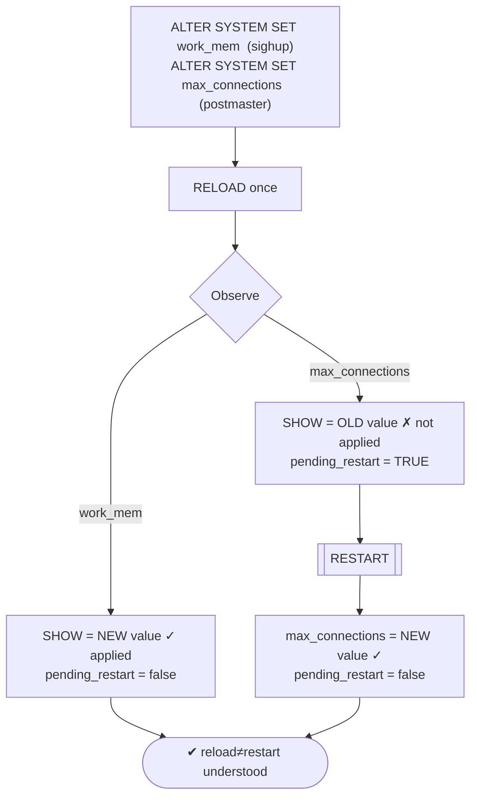
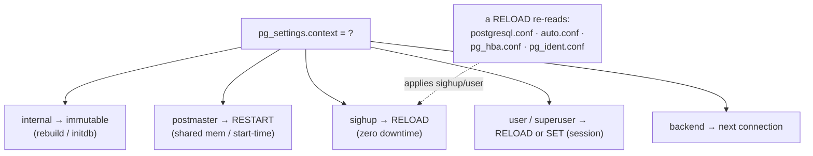

# Lab 13 — Reload vs Restart: SIGHUP Param vs Restart-Only Param; Observe What `reload` Applies

> **Track A · DBA · A2 Configuration & Tuning · Lab 5 of 7 (Lab 13/222)**
> Teaching package: concept → diagram → steps → verify → quick-ref → self-test → video script.
> **Depends on:** Labs 01–12 (you saw `context` and `pending_restart` in `pg_settings` in Lab 12).

---

## 0. Lab Card (at a glance)

| Field | Value |
|---|---|
| **Objective** | Change one **SIGHUP** (reloadable) param and one **postmaster** (restart-only) param, issue a single **reload**, and observe that only the SIGHUP one takes effect — then restart to apply the other. |
| **Success criterion** | After reload: SIGHUP param shows its new value; restart-only param shows the **old** value with `pending_restart=true`. After restart: the restart-only param shows its new value. |
| **Scope boundary** | The reload/restart distinction and how to predict it. Which specific params to tune is elsewhere in A2. |
| **Prereqs** | Labs 01–12; superuser |
| **Time** | 15–25 min |
| **Difficulty** | ★★☆☆☆ |
| **Risk** | Low — keep `max_connections` modest so the restart succeeds. |

---

## 1. Learning Objectives

1. **Predict the apply-method from `context`** — `internal` / `postmaster` / `sighup` / `backend` / `user`.
2. **Know what a reload does and doesn't** — applies SIGHUP params with zero downtime; can't apply postmaster params.
3. **Use `pending_restart`** — find exactly what's waiting for a restart window.
4. **Know the equivalent reload paths** — `systemctl reload`, `pg_reload_conf()`, `pg_ctl reload`, `kill -HUP`.
5. **Understand *why* some params need a restart** — shared-memory sizing and start-time-only reads.

---

## 2. Concept Primer — the "why"

**Every GUC has a `context` that dictates when a change applies:**

| `context` | Applies when… | Examples |
|---|---|---|
| `internal` | never (compile/initdb) | `block_size`, `data_checksums`, `server_version` |
| `postmaster` | **full restart** | `shared_buffers`, `max_connections`, `listen_addresses`, `port`, `shared_preload_libraries`, `wal_level`, `huge_pages`, `archive_mode`, `autovacuum_max_workers` |
| `sighup` | **reload (SIGHUP)** | `log_min_duration_statement`, `checkpoint_*`, most `autovacuum_*`, `archive_command`, `wal_compression` |
| `superuser` / `user` | reload **or** per-session `SET` | `work_mem`, `maintenance_work_mem`, `effective_cache_size` |
| `backend` / `superuser-backend` | at connection start | `ignore_system_indexes` |

**Reload = SIGHUP = zero downtime.** A reload signals the postmaster to **re-read** its config files — `postgresql.conf`, `postgresql.auto.conf`, **`pg_hba.conf`, `pg_ident.conf`** — and apply everything with `context` of `sighup`/`user`/`superuser`. Existing connections keep running; there's no interruption. (That's why auth changes in Lab 6 needed only a reload.)

**Restart = required for `postmaster` params.** These are read **once at startup** and can't change while the server runs, because they either:
- **size shared memory / fixed arrays** — `shared_buffers` is a shared-memory segment; `max_connections` sizes the proc array and lock tables at boot; or
- **are bound/loaded once** — `listen_addresses`/`port` bind sockets at startup; `shared_preload_libraries` loads at startup.

Change one of these in config and it stays **pending** — the running value is unchanged and `pg_settings.pending_restart` flips to **true** — until you restart.

**`internal` params can't change at all** without a new build or a fresh `initdb` (e.g., `data_checksums`, from Lab 5).

**How to know in advance:** never guess — read `pg_settings.context`. And to see what's currently waiting on a restart:
```sql
SELECT name, setting, pending_restart FROM pg_settings WHERE pending_restart;
```

---

## 3. Diagrams

### 3.1 Change → reload → restart flow



### 3.2 context → required action



---

## 4. Prerequisites

```bash
sudo -u postgres psql -c "SELECT name, setting, context FROM pg_settings
                          WHERE name IN ('work_mem','max_connections');"
#   work_mem        | ... | user
#   max_connections | ... | postmaster
```

---

## 5. Step-by-Step

### Step 1 — Baseline both values

```bash
sudo -u postgres psql -c "SHOW work_mem; SHOW max_connections;"
```

### Step 2 — Change one of each kind

```bash
sudo -u postgres psql -c "ALTER SYSTEM SET work_mem = '24MB';"          # sighup/user → reloadable
sudo -u postgres psql -c "ALTER SYSTEM SET max_connections = 150;"     # postmaster → restart-only (keep modest)
```

### Step 3 — Reload ONCE (zero downtime)

```bash
sudo -u postgres psql -c "SELECT pg_reload_conf();"   # or: sudo systemctl reload postgresql-17
```

### Step 4 — Observe what reload applied

```bash
sudo -u postgres psql -c "SELECT name, setting, context, pending_restart FROM pg_settings
                          WHERE name IN ('work_mem','max_connections');"
#   work_mem        | 24MB | user       | f     ← APPLIED by reload
#   max_connections | 100  | postmaster | t     ← NOT applied; waiting for restart
```
*Key result: `work_mem` took effect; `max_connections` still shows the old value with `pending_restart = true`.*

### Step 5 — List everything awaiting a restart

```bash
sudo -u postgres psql -c "SELECT name, setting, pending_restart FROM pg_settings WHERE pending_restart;"
#   → max_connections | 150 | t    (this is your 'restart window' worklist)
```

### Step 6 — Restart, then confirm the postmaster param applied

```bash
sudo systemctl restart postgresql-17
sudo -u postgres psql -c "SELECT name, setting, pending_restart FROM pg_settings
                          WHERE name IN ('work_mem','max_connections');"
#   work_mem        | 24MB | f
#   max_connections | 150  | f     ← now applied; pending_restart cleared
```

### Step 7 — (Clean up if desired)

```bash
sudo -u postgres psql -c "ALTER SYSTEM RESET work_mem; ALTER SYSTEM RESET max_connections;"
sudo systemctl restart postgresql-17
```

---

## 6. Verification Checklist

- [ ] `pg_settings.context` = `user` for `work_mem`, `postmaster` for `max_connections`
- [ ] After **reload**: `work_mem` updated; `max_connections` unchanged with `pending_restart=true`
- [ ] `WHERE pending_restart` lists `max_connections` (and only restart-pending params)
- [ ] After **restart**: `max_connections` updated; `pending_restart` cleared
- [ ] You can name the four equivalent ways to reload
- [ ] You can explain *why* `max_connections` can't change on reload

---

## 7. Troubleshooting

| Symptom | Cause | Fix |
|---|---|---|
| Changed a param, reloaded, no effect, `pending_restart=true` | It's a `postmaster` param | Restart in a maintenance window |
| SIGHUP param reloaded but still old | Overridden by `auto.conf`/`conf` layering, or value equals old | Check `sourcefile` (Lab 12); confirm the new value is the winner |
| `pg_reload_conf()` returns true but nothing changed | It only signals SIGHUP; postmaster params still need restart | Check `context`; restart if needed |
| Restart fails after raising `max_connections` | Too high for kernel semaphores/memory | Lower it, or raise kernel limits; check the log |
| Reload after a bad config edit | Syntax error | PG logs the error and applies only valid changes; fix the bad line |
| "Which params need a restart?" | — | `SELECT name FROM pg_settings WHERE context='postmaster';` |

---

## 8. Quick Reference Card (paste-ready)

```bash
# what applies how? — read it, don't guess:
sudo -u postgres psql -c "SELECT name,context FROM pg_settings WHERE name IN ('work_mem','max_connections','shared_buffers','listen_addresses');"

# change one of each kind
sudo -u postgres psql -c "ALTER SYSTEM SET work_mem='24MB';"        # sighup/user  → reload
sudo -u postgres psql -c "ALTER SYSTEM SET max_connections=150;"    # postmaster   → restart

# reload (any of these are equivalent):
sudo -u postgres psql -c "SELECT pg_reload_conf();"
# sudo systemctl reload postgresql-17
# sudo -u postgres pg_ctl -D $PGDATA reload
# sudo kill -HUP <postmaster_pid>

# observe: sighup applied, postmaster pending
sudo -u postgres psql -c "SELECT name,setting,context,pending_restart FROM pg_settings WHERE name IN ('work_mem','max_connections');"

# what's waiting for a restart window?
sudo -u postgres psql -c "SELECT name,setting FROM pg_settings WHERE pending_restart;"

sudo systemctl restart postgresql-17     # apply the postmaster param

# Restart-only (postmaster) examples: shared_buffers, max_connections, listen_addresses, port,
#   shared_preload_libraries, wal_level, huge_pages, archive_mode, autovacuum_max_workers
```

---

## 9. Self-Check

1. Which `pg_settings` column tells you whether a change needs a reload or a restart?
2. Name three restart-only (`postmaster`) parameters.
3. Besides `postgresql.conf`, what else does a reload re-read?
4. You changed `max_connections` and reloaded, but `SHOW` still shows the old value — why, what confirms it, and how do you apply it?
5. Give three equivalent ways to trigger a reload.
6. One query to list every parameter currently awaiting a restart.

<details>
<summary>Answers</summary>

1. `context` (with `pending_restart` confirming a postmaster change is queued).
2. Any of: `shared_buffers`, `max_connections`, `listen_addresses`, `port`, `shared_preload_libraries`, `wal_level`, `huge_pages`.
3. `postgresql.auto.conf`, `pg_hba.conf`, and `pg_ident.conf`.
4. `max_connections` is `postmaster` context — reloadable changes don't apply; `pending_restart=true` confirms it; a **restart** applies it.
5. `SELECT pg_reload_conf();`, `systemctl reload postgresql-17`, `pg_ctl reload`, or `kill -HUP <postmaster pid>`.
6. `SELECT name FROM pg_settings WHERE pending_restart;`.
</details>

---

## 10. Video / Teaching Script

| # | On screen | Say (narration) |
|---|---|---|
| 1 | Title: "Reload or restart? PostgreSQL tells you." | "Some settings apply instantly and free; others need a full restart. Guessing wrong means a change that silently didn't happen." |
| 2 | `pg_settings.context` for both params | "The answer is in one column: context. work_mem is 'user' — reloadable. max_connections is 'postmaster' — restart only." |
| 3 | `ALTER SYSTEM` both | "Change one of each." |
| 4 | single reload | "Now a single reload — zero downtime, no dropped connections." |
| 5 | observe results | "And here's the split: work_mem applied. max_connections? Still the old value — and look, pending_restart is true. The reload couldn't touch it." |
| 6 | `WHERE pending_restart` | "This query is your restart-window worklist — everything currently waiting on a bounce." |
| 7 | restart + confirm | "Restart, and now it applies. pending_restart clears." |
| 8 | why slide | "Why? max_connections sizes shared structures at boot; shared_buffers is a shared-memory segment. You can't resize those while running." |
| 9 | Outro | "Reload for most tuning, restart for the structural few — and let context tell you which. Next: logging configuration." |

---

## 11. Glossary

- **Reload / SIGHUP** — re-read config files and apply `sighup`/`user` params; no downtime.
- **Restart** — stop/start the postmaster; required for `postmaster`-context params.
- **`context`** — `pg_settings` column: `internal` / `postmaster` / `sighup` / `backend` / `user`.
- **`pending_restart`** — `pg_settings` flag: config changed but awaiting a restart.
- **`pg_reload_conf()`** — SQL function that signals a reload.
- **postmaster** — the parent server process that reads startup-only settings.

---
*NETAPORT lab series · PostgreSQL 17 on AlmaLinux 9 · Lab 13/222 · A2 Configuration & Tuning*
