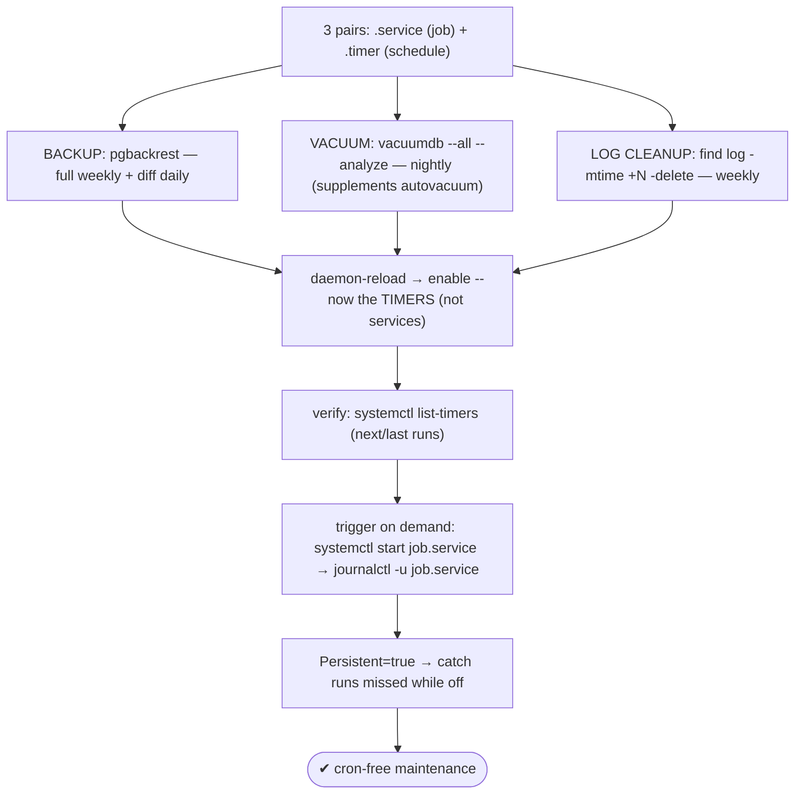
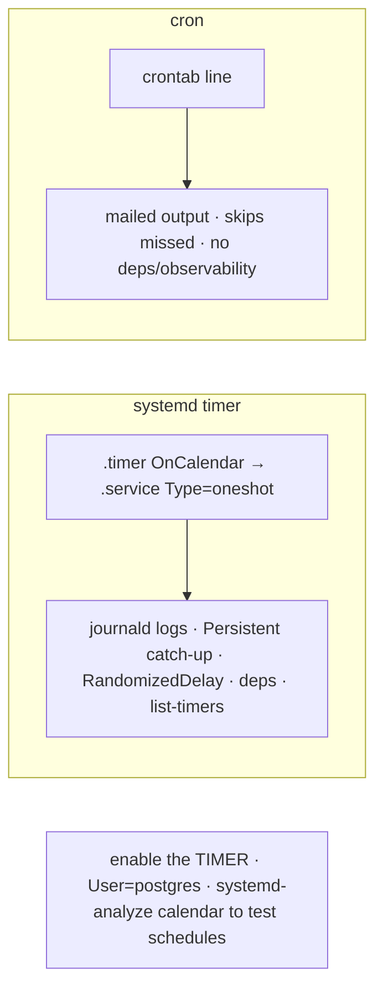

# Lab 130 — systemd Timers for Backup, Vacuum, and Log-Rotation Jobs (No Cron)

> **Track C · Cross-Cutting · C2 Automation & IaC · Lab 3 of 6 (Lab 130/222)**
> Teaching package: concept → diagram → steps → verify → quick-ref → self-test → video script.
> **Depends on:** Lab 63 (vacuumdb timer), Lab 25 (pgBackRest), Lab 14 (log rotation), Lab 20 (archiving).

---

## 0. Lab Card (at a glance)

| Field | Value |
|---|---|
| **Objective** | Schedule PostgreSQL backup, vacuum, and log-cleanup jobs entirely with systemd timers (no cron), enabling and verifying them. |
| **Success criterion** | Three `.timer`/`.service` pairs are enabled; `list-timers` shows next runs; each runs on demand and logs to journald; `Persistent` catches missed runs. |
| **Scope boundary** | systemd timers for maintenance. The vacuumdb single-job was Lab 63. |
| **Prereqs** | Labs 63/25/14; systemd |
| **Time** | 30–40 min |
| **Difficulty** | ★★★☆☆ |
| **Risk** | Low — scheduled jobs. |

---

## 1. Learning Objectives

1. **Timer + service units** — the pairing.
2. **Three maintenance jobs** — backup/vacuum/log-cleanup.
3. **`OnCalendar` schedules** — and testing them.
4. **systemd advantages** over cron.
5. **Enable + verify** — timers, not services.

---

## 2. Concept Primer — the "why"

**A systemd timer is a `.timer` (the schedule) + a `.service` (the job).** The `.service` defines *what* runs (`Type=oneshot`, `User=postgres`, `ExecStart=…`); the `.timer` defines *when* (`OnCalendar=…`). You **enable the timer**, and it triggers the service on schedule. This is the RHEL-native replacement for cron, and it's better on every axis:
- **journald logging** — every run's output is captured (`journalctl -u job.service`), not mailed like cron.
- **`Persistent=true`** — if the machine was **off** at the scheduled time, the timer **runs on next boot** (cron just skips it).
- **`RandomizedDelaySec`** — spread jobs to avoid a thundering herd.
- **Dependencies** — `After=postgresql-17.service`, ordering, `Requires`.
- **Observability** — `systemctl list-timers` shows next/last runs; `status` shows health.

**Three maintenance jobs (the suite):**

1. **Backup** (Labs 19/25) — a `.service` running `pgbackrest backup` (or `pg_basebackup`/`pg_dumpall`). Typical cadence: a **weekly full** timer + a **daily differential** timer.
2. **Vacuum / analyze** (Lab 63) — `vacuumdb --all --analyze --jobs=N` nightly, or a targeted anti-wraparound sweep (`--min-xid-age`). This **supplements** autovacuum (it isn't a replacement — Lab 63).
3. **Log cleanup / rotation** — PostgreSQL's `logging_collector` already **rotates** logs by size/age (Lab 14), but old rotated files accumulate. A cleanup `.service` deletes logs older than N days (`find … -mtime +N -delete`). *(Alternatively, integrate `logrotate` — itself run by `logrotate.timer` on AlmaLinux — via a config in `/etc/logrotate.d/`.)*

**`OnCalendar` schedules** (test any with `systemd-analyze calendar '<expr>'`):
- daily 02:00 → `*-*-* 02:00:00`; weekly Sun 03:00 → `Sun *-*-* 03:00:00`; every 6h → `*-*-* 0/6:00:00`; monthly → `*-*-01 04:00:00`.

**Enable the *timer*, not the service.** `systemctl daemon-reload && systemctl enable --now job.timer`. Enabling the *service* by mistake just runs it once. Verify with `systemctl list-timers` and `journalctl`.

---

## 3. Diagrams

### 3.1 Maintenance-suite flow



### 3.2 Timer vs cron



---

## 4. Prerequisites

```bash
systemctl is-active postgresql-17
sudo -u postgres psql -c "SHOW log_directory; SHOW logging_collector;"   # rotation on (Lab 14)
which vacuumdb; which pgbackrest 2>/dev/null || echo "pgbackrest optional (Lab 25)"
```

---

## 5. Step-by-Step

### Step 1 — Backup job (service + timers: weekly full, daily diff)

```bash
sudo tee /etc/systemd/system/pg-backup@.service >/dev/null <<'EOF'
[Unit]
Description=PostgreSQL backup (%i)
After=postgresql-17.service
Wants=postgresql-17.service
[Service]
Type=oneshot
User=postgres
Group=postgres
# pgBackRest (Lab 25); swap for pg_basebackup/pg_dumpall if not using pgBackRest:
ExecStart=/usr/bin/pgbackrest --stanza=main --type=%i backup
EOF

sudo tee /etc/systemd/system/pg-backup-full.timer >/dev/null <<'EOF'
[Unit]
Description=Weekly full PostgreSQL backup
[Timer]
Unit=pg-backup@full.service
OnCalendar=Sun *-*-* 01:00:00
RandomizedDelaySec=600
Persistent=true
[Install]
WantedBy=timers.target
EOF

sudo tee /etc/systemd/system/pg-backup-diff.timer >/dev/null <<'EOF'
[Unit]
Description=Daily differential PostgreSQL backup
[Timer]
Unit=pg-backup@diff.service
OnCalendar=Mon..Sat *-*-* 01:00:00
RandomizedDelaySec=600
Persistent=true
[Install]
WantedBy=timers.target
EOF
```

### Step 2 — Vacuum/analyze job (nightly)

```bash
sudo tee /etc/systemd/system/pg-vacuum.service >/dev/null <<'EOF'
[Unit]
Description=PostgreSQL vacuum + analyze (all databases)
After=postgresql-17.service
Wants=postgresql-17.service
[Service]
Type=oneshot
User=postgres
Group=postgres
ExecStart=/usr/pgsql-17/bin/vacuumdb --all --analyze --jobs=4
EOF

sudo tee /etc/systemd/system/pg-vacuum.timer >/dev/null <<'EOF'
[Unit]
Description=Nightly vacuum + analyze
[Timer]
OnCalendar=*-*-* 03:00:00
RandomizedDelaySec=300
Persistent=true
[Install]
WantedBy=timers.target
EOF
```

### Step 3 — Log cleanup job (delete rotated logs > 30 days)

```bash
sudo tee /etc/systemd/system/pg-logclean.service >/dev/null <<'EOF'
[Unit]
Description=Delete PostgreSQL log files older than 30 days
[Service]
Type=oneshot
User=postgres
Group=postgres
ExecStart=/usr/bin/find /var/lib/pgsql/17/data/log -type f -name "*.log" -mtime +30 -delete
EOF

sudo tee /etc/systemd/system/pg-logclean.timer >/dev/null <<'EOF'
[Unit]
Description=Weekly PostgreSQL log cleanup
[Timer]
OnCalendar=Sun *-*-* 04:00:00
Persistent=true
[Install]
WantedBy=timers.target
EOF
```

### Step 4 — Validate schedules, reload, enable the TIMERS

```bash
systemd-analyze calendar 'Sun *-*-* 01:00:00'; systemd-analyze calendar '*-*-* 03:00:00'   # test expressions
sudo systemctl daemon-reload
sudo systemctl enable --now pg-backup-full.timer pg-backup-diff.timer pg-vacuum.timer pg-logclean.timer
```

### Step 5 — Verify: list-timers + trigger on demand

```bash
systemctl list-timers 'pg-*' --no-pager     # NEXT / LAST for each timer
sudo systemctl start pg-vacuum.service       # run now (out of schedule)
journalctl -u pg-vacuum.service -n 15 --no-pager
```

### Step 6 — Confirm Persistent + templated instances

```bash
systemctl cat pg-vacuum.timer | grep -i persistent          # Persistent=true → catches missed runs
systemctl status pg-backup@diff.service --no-pager | head -3  # templated instance (full/diff via @%i)
```

---

## 6. Verification Checklist

- [ ] Backup service (templated) + full/diff timers created
- [ ] Vacuum service + nightly timer created
- [ ] Log-cleanup service + weekly timer created
- [ ] `OnCalendar` expressions validated with `systemd-analyze`
- [ ] Timers (not services) enabled; `list-timers` shows next runs
- [ ] On-demand run logged in journald
- [ ] `Persistent=true` set on each timer

---

## 7. Troubleshooting

| Symptom | Cause | Fix |
|---|---|---|
| Timer never fires | Not enabled/started | `systemctl enable --now …timer`; check `list-timers` |
| Enabled the service, not the timer | Runs once only | Enable the **`.timer`** |
| `OnCalendar` invalid | Syntax error | `systemd-analyze calendar '<expr>'` |
| Missed runs (host was off) | No catch-up | `Persistent=true` |
| Job fails | Wrong user/path/perms | `User=postgres`; full paths; `journalctl -u` |
| All jobs at once (load) | Same schedule | `RandomizedDelaySec`; stagger `OnCalendar` |
| Deleted the active log | `-mtime` too small | `-mtime +N` (old only); never the current log |
| Overlapping backup runs | Long job vs next trigger | systemd won't start a service already active |

---

## 8. Quick Reference Card (paste-ready)

```ini
# .service (the job)                     # .timer (the schedule)
[Service]                                [Timer]
Type=oneshot                             OnCalendar=*-*-* 03:00:00    # test: systemd-analyze calendar '<expr>'
User=postgres                            RandomizedDelaySec=300
ExecStart=/path/to/command               Persistent=true             # catch runs missed while off
                                         [Install]
                                         WantedBy=timers.target
```
```bash
# jobs: BACKUP (pgbackrest --type=full|diff) · VACUUM (vacuumdb --all --analyze --jobs=N) · LOGCLEAN (find log -mtime +30 -delete)
sudo systemctl daemon-reload
sudo systemctl enable --now JOB.timer           # enable the TIMER, not the service
systemctl list-timers 'pg-*'                    # next/last runs
sudo systemctl start JOB.service                # run now · journalctl -u JOB.service
# vs cron: journald logs · Persistent catch-up · RandomizedDelay · dependencies · observability
```

---

## 9. Self-Check

1. What are the two units of a systemd timer?
2. What three maintenance jobs did you schedule?
3. What are systemd's advantages over cron?
4. Which unit do you enable?
5. What does `Persistent=true` do?
6. How do you test an `OnCalendar` expression?

<details>
<summary>Answers</summary>

1. A `.timer` (the `OnCalendar` schedule) and a `.service` (the `Type=oneshot` job).
2. Backup (pgBackRest full/diff), vacuum/analyze (`vacuumdb`, supplementing autovacuum), and log cleanup (delete old rotated logs).
3. journald logging, `Persistent` catch-up of missed runs, `RandomizedDelaySec`, dependencies, and `list-timers` observability.
4. The **`.timer`** (enabling the service just runs it once).
5. Runs a timer that was **missed** while the machine was off, on the next boot.
6. `systemd-analyze calendar '<expr>'`.
</details>

---

## 10. Video / Teaching Script

| # | On screen | Say (narration) |
|---|---|---|
| 1 | Title: "Maintenance on schedule — no cron" | "Backups, vacuums, log cleanup — all on a schedule, all through systemd. Cleaner logs, missed-run catch-up, real observability." |
| 2 | timer + service | "Every job is two files: a service that does the work, a timer that says when. Enable the timer, and you're done." |
| 3 | the three jobs | "Backup weekly and daily, vacuum every night, clean old logs every Sunday. A full maintenance suite." |
| 4 | list-timers | "One command shows the whole schedule — next run, last run, for every job. Cron can't do that." |
| 5 | persistent | "And if the box was off at 3 a.m.? Persistent runs it on boot. Cron just shrugs and skips it." |
| 6 | logs | "Every run lands in journald — grep it, no mail to parse." |
| 7 | Outro | "Scheduled, logged, resilient. Next: n8n pipelines for event-driven automation." |

---

## 11. Glossary

- **systemd timer** — `.timer` (schedule) + `.service` (job).
- **`OnCalendar`** — the schedule expression.
- **`Type=oneshot`** — a run-and-exit service.
- **`Persistent=true`** — catch missed runs on boot.
- **`RandomizedDelaySec`** — jitter to spread load.
- **`list-timers`** — see next/last runs.
- **Templated unit (`@`)** — one service, parameterized instances (full/diff).

---
*NETAPORT lab series · PostgreSQL 17 on AlmaLinux 9 · Lab 130/222 · C2 Automation & IaC*
