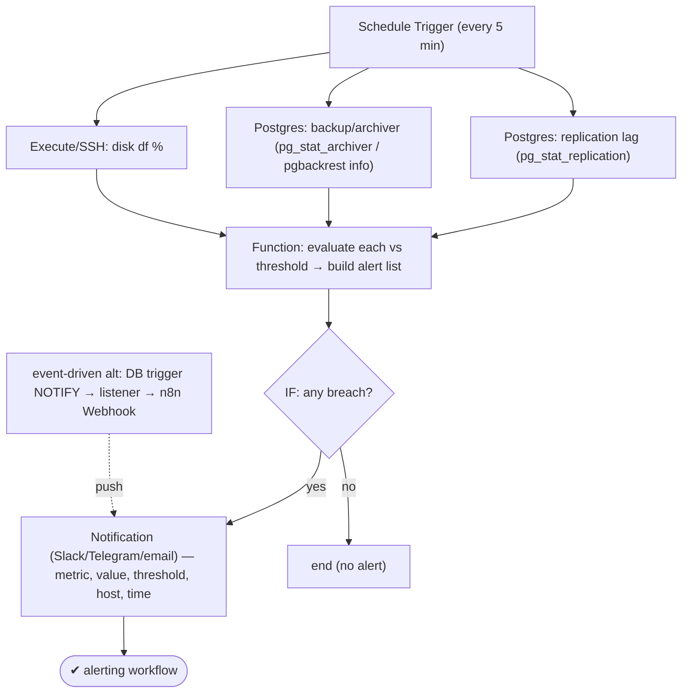
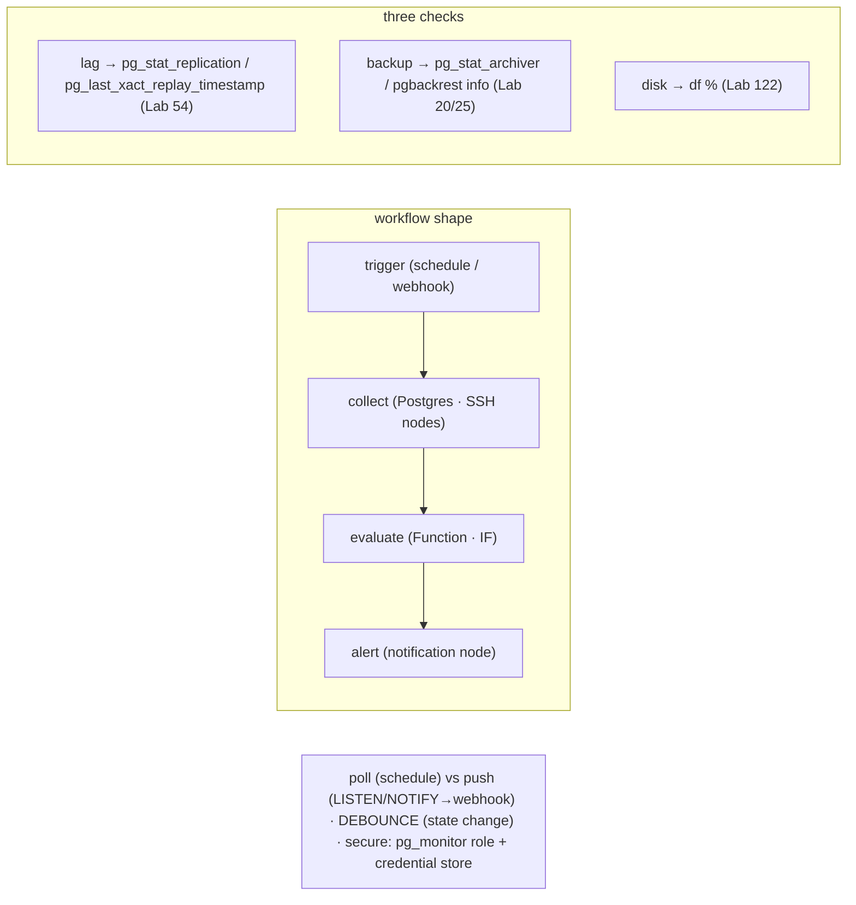

# Lab 131 — n8n Workflow: Alert on Replication Lag / Failed Backup / Disk Threshold

> **Track C · Cross-Cutting · C2 Automation & IaC · Lab 4 of 6 (Lab 131/222)**
> Teaching package: concept → diagram → steps → verify → quick-ref → self-test → video script.
> **Depends on:** Lab 54 (lag), Lab 20 (archiver), Lab 122 (disk), Lab 55 (monitoring role), Lab 114 (LISTEN/NOTIFY).

---

## 0. Lab Card (at a glance)

| Field | Value |
|---|---|
| **Objective** | Build an n8n workflow that periodically checks replication lag, backup status, and disk usage, and alerts (Slack/Telegram/email) when thresholds are breached. |
| **Success criterion** | A scheduled workflow collects the three metrics, evaluates thresholds, and fires a formatted alert only on breach; alerts are debounced; DB access uses a least-privilege role. |
| **Scope boundary** | n8n alerting workflow. Prometheus/Grafana was Lab 55; systemd jobs Lab 130. |
| **Prereqs** | Labs 54/20/55; a self-hosted n8n; a monitoring role |
| **Time** | 30–45 min |
| **Difficulty** | ★★★☆☆ |
| **Risk** | Low — read-only checks + notifications. |

---

## 1. Learning Objectives

1. **The n8n workflow shape** — trigger → collect → evaluate → alert.
2. **The three checks** and their SQL/commands.
3. **Threshold logic** — Function + IF nodes.
4. **Poll vs push** — schedule vs `LISTEN/NOTIFY`.
5. **Debounce + secure** the workflow.

---

## 2. Concept Primer — the "why"

**n8n is visual, node-based workflow automation (self-hostable).** A workflow is a graph: a **trigger** node starts it, **processing** nodes transform data, and **action** nodes do something (notify, call an API). For monitoring, the shape is: **trigger → collect metrics → evaluate thresholds → alert**. It's the lightweight, workflow-driven alternative to Prometheus/Grafana (Lab 55) for self-hosters — and it slots into the same n8n you already run for pipelines.

**The three checks (each maps to an earlier lab):**

1. **Replication lag** (Lab 54) — on the **primary**:
   ```sql
   SELECT application_name,
     pg_wal_lsn_diff(pg_current_wal_lsn(), replay_lsn) AS lag_bytes,
     EXTRACT(EPOCH FROM replay_lag) AS lag_seconds
   FROM pg_stat_replication;
   ```
   On a **standby**: `SELECT EXTRACT(EPOCH FROM now() - pg_last_xact_replay_timestamp()) AS lag_seconds;`. Alert if `lag_bytes`/`lag_seconds` exceed thresholds.

2. **Failed / stale backup** (Labs 20/25) — via the archiver:
   ```sql
   SELECT failed_count, last_failed_time, last_archived_time,
     EXTRACT(EPOCH FROM now() - last_archived_time) AS seconds_since_archive
   FROM pg_stat_archiver;
   ```
   Alert if `failed_count` rose or the last archive/backup is **too old** (stale). For pgBackRest, parse `pgbackrest info --output=json` for the last backup's time/status.

3. **Disk threshold** (Lab 122) — via an **Execute Command / SSH** node:
   ```bash
   df --output=pcent /var/lib/pgsql | tail -1 | tr -dc '0-9'
   ```
   Alert if the percentage exceeds, say, 80.

**The n8n nodes:**
- **Schedule Trigger** — run every N minutes.
- **Postgres** node(s) — run the lag/archiver queries (native n8n node + a stored credential).
- **Execute Command / SSH** node — the `df` disk check.
- **Function / Code** node — compare each metric to its threshold, build an alert list.
- **IF** node — branch on "any breach?".
- **Notification** node — Slack / Telegram / email (SMTP) / webhook with the details.

**Poll vs push.** The **Schedule Trigger** *polls* every few minutes — simple and sufficient for lag/disk/backup. For **instant** alerts on discrete events, use **`LISTEN/NOTIFY`** (Lab 114): a DB trigger `NOTIFY`s, a small listener posts to an **n8n Webhook** node → event-driven push. Combine both.

**Debounce + secure (don't skip):**
- **Debounce** — alerting *every run while breached* creates a storm. Alert only **on state change** (crossed the threshold this run), or **rate-limit** (n8n static data / a "last alerted" timestamp), and use **severity levels**.
- **Secure** — store DB credentials in n8n's **credential store**, and connect with a **least-privilege monitoring role** (member of **`pg_monitor`**, Lab 55) — not a superuser.

---

## 3. Diagrams

### 3.1 Workflow flow



### 3.2 Concept



---

## 4. Prerequisites — a monitoring role + n8n

```bash
# least-privilege monitoring role (Lab 55) for n8n's Postgres credential:
sudo -u postgres psql -c "CREATE ROLE n8n_monitor LOGIN PASSWORD 'MonSecret!1';" 2>/dev/null || true
sudo -u postgres psql -c "GRANT pg_monitor TO n8n_monitor;"
# allow it from the n8n host in pg_hba (adjust IP), reload.
# self-hosted n8n running (docker/native); have Slack/Telegram/SMTP creds ready.
```

---

## 5. Step-by-Step (build the workflow node by node)

### Step 1 — Schedule Trigger

```text
[Schedule Trigger]  → Interval: every 5 minutes
```

### Step 2 — Postgres node: replication lag (test the query first)

```bash
# validate the query the Postgres node will run:
sudo -u postgres psql -x -c "
SELECT application_name,
       pg_wal_lsn_diff(pg_current_wal_lsn(), replay_lsn) AS lag_bytes,
       EXTRACT(EPOCH FROM replay_lag)::int AS lag_seconds
FROM pg_stat_replication;"
```
```text
[Postgres: lag]  Operation: Execute Query  · Credential: n8n_monitor  · Query: (above)
```

### Step 3 — Postgres node: backup/archiver status

```bash
sudo -u postgres psql -x -c "
SELECT failed_count,
       EXTRACT(EPOCH FROM now() - last_archived_time)::int AS seconds_since_archive,
       last_failed_time
FROM pg_stat_archiver;"
```
```text
[Postgres: backup]  Execute Query · Query: (above)   # or an Execute node: pgbackrest info --output=json
```

### Step 4 — Execute Command / SSH node: disk usage

```text
[Execute Command / SSH]  Command:
  df --output=pcent /var/lib/pgsql | tail -1 | tr -dc '0-9'
# → returns the used-percent integer for the PGDATA volume
```

### Step 5 — Function node: evaluate thresholds

```javascript
// [Function] — inputs merged from the three nodes; build a list of breaches
const LAG_SECONDS   = 30;      // thresholds
const ARCHIVE_STALE = 3600;    // 1h since last archive
const DISK_PCT      = 80;

const lag     = $node["Postgres: lag"].json;       // array (per standby)
const backup  = $node["Postgres: backup"].json;    // { failed_count, seconds_since_archive }
const diskPct = parseInt($node["Execute Command"].json.stdout, 10);

const alerts = [];
for (const r of (Array.isArray(lag) ? lag : [lag])) {
  if (r && r.lag_seconds > LAG_SECONDS)
    alerts.push(`🔴 Replication lag ${r.application_name}: ${r.lag_seconds}s (> ${LAG_SECONDS}s)`);
}
if (backup && backup.seconds_since_archive > ARCHIVE_STALE)
  alerts.push(`🟠 No WAL archived in ${Math.round(backup.seconds_since_archive/60)}min (backup may be failing)`);
if (backup && backup.failed_count > 0)
  alerts.push(`🟠 Archiver failed_count = ${backup.failed_count}`);
if (diskPct > DISK_PCT)
  alerts.push(`🔴 Disk ${diskPct}% used (> ${DISK_PCT}%) on PGDATA volume`);

return [{ json: { breach: alerts.length > 0, alerts, host: 'pg-primary', at: new Date().toISOString() } }];
```

### Step 6 — IF + Notification (debounced)

```text
[IF]  Condition: {{$json.breach}} == true
  └─ true → [Notification: Slack/Telegram/Email]
        Message: "*PostgreSQL alert @ {{$json.host}} ({{$json.at}})*\n{{$json.alerts.join('\n')}}"
  └─ false → (end)

# DEBOUNCE: store last-alerted state in n8n static data (workflowStaticData) and only send
#   if the breach set CHANGED since last run → no storms.
# Activate the workflow. Export it (⋯ → Download) as JSON for version control / import elsewhere.
```

---

## 6. Verification Checklist

- [ ] Schedule Trigger runs every 5 min
- [ ] Postgres nodes return lag + archiver data (via `n8n_monitor`)
- [ ] Disk % returned by the Execute/SSH node
- [ ] Function node builds an alert list against thresholds
- [ ] IF branches on breach; Notification fires only on breach
- [ ] Debounce prevents repeated alerts for the same state
- [ ] DB credential uses a `pg_monitor` role (not superuser)

---

## 7. Troubleshooting

| Symptom | Cause | Fix |
|---|---|---|
| Postgres node auth fails | Credential / pg_hba / role | Store credential; add pg_hba for the n8n host; `GRANT pg_monitor` |
| Alert storms | Firing every run while breached | Debounce (alert on state change); rate-limit |
| Disk check fails | No host access | SSH node with creds, or run n8n on the host / an exporter |
| Lag query empty on standby | Different metric | Use `pg_last_xact_replay_timestamp()` on the standby |
| No notification | Node credential | Verify Slack token / SMTP / Telegram bot |
| Workflow doesn't run | Not activated | Activate; check the Schedule Trigger |
| Backup status unclear | pgBackRest | Parse `pgbackrest info --output=json` |

---

## 8. Quick Reference Card (paste-ready)

```text
WORKFLOW: Schedule Trigger → [Postgres: lag] + [Postgres: backup] + [Exec/SSH: disk] → Function (thresholds) → IF → Notify
```
```sql
-- lag (primary):   SELECT application_name, pg_wal_lsn_diff(pg_current_wal_lsn(),replay_lsn) AS lag_bytes, EXTRACT(EPOCH FROM replay_lag) AS lag_seconds FROM pg_stat_replication;
-- lag (standby):   SELECT EXTRACT(EPOCH FROM now()-pg_last_xact_replay_timestamp()) AS lag_seconds;
-- backup/archiver: SELECT failed_count, EXTRACT(EPOCH FROM now()-last_archived_time) AS seconds_since_archive FROM pg_stat_archiver;
```
```bash
# disk: df --output=pcent /var/lib/pgsql | tail -1 | tr -dc '0-9'
# thresholds in a Function node → IF breach → Slack/Telegram/email with (metric, value, threshold, host, time)
# poll (Schedule) vs push (LISTEN/NOTIFY → n8n Webhook, Lab 114) · DEBOUNCE on state change · role: pg_monitor (Lab 55), NOT superuser
```

---

## 9. Self-Check

1. What's the shape of an n8n monitoring workflow?
2. What are the three checks and their sources?
3. Which n8n nodes do you use?
4. What's the difference between poll and push alerting?
5. How do you avoid alert storms?
6. How do you secure the DB access?

<details>
<summary>Answers</summary>

1. **Trigger → collect metrics → evaluate thresholds → alert.**
2. Replication lag (`pg_stat_replication` / `pg_last_xact_replay_timestamp`), failed/stale backup (`pg_stat_archiver` / `pgbackrest info`), disk usage (`df`).
3. Schedule Trigger, Postgres (queries), Execute Command/SSH (disk), Function/Code (thresholds), IF (branch), Notification (Slack/email/Telegram).
4. **Poll**: a Schedule Trigger checks every N minutes; **push**: `LISTEN/NOTIFY` → a listener → an n8n **Webhook** node for instant, event-driven alerts.
5. **Debounce** — alert only on a **state change** (or rate-limit), plus severity levels — instead of every run while breached.
6. Store credentials in n8n's credential store and connect with a **least-privilege `pg_monitor` role**, not a superuser.
</details>

---

## 10. Video / Teaching Script

| # | On screen | Say (narration) |
|---|---|---|
| 1 | Title: "Let n8n watch your database" | "You already run n8n for pipelines. Point it at Postgres, and it becomes your on-call: lag, backups, disk — checked and alerted, automatically." |
| 2 | shape | "Every monitoring workflow is the same four beats: trigger, collect, evaluate, alert." |
| 3 | three checks | "Three queries and a df: replication lag, backup freshness, disk usage. That's most of what pages you at 3 a.m." |
| 4 | function + IF | "A little code sets the thresholds and builds the alert. An IF node decides: send, or stay quiet." |
| 5 | notify | "Breach? Slack, Telegram, email — with the metric, the value, the host. Everything you need to act." |
| 6 | debounce | "One rule: don't alert every five minutes while it's broken. Alert on *change*. Your team will thank you." |
| 7 | Outro | "Alerting, the workflow way. Next: migrating to and from the cloud." |

---

## 11. Glossary

- **n8n** — self-hostable node-based workflow automation.
- **Schedule Trigger** — periodic workflow start.
- **Postgres node** — runs SQL with a stored credential.
- **Function / IF node** — threshold logic / branching.
- **Notification node** — Slack/Telegram/email/webhook.
- **Debounce** — alert on state change, not every run.
- **`pg_monitor`** — least-privilege monitoring role (Lab 55).

---
*NETAPORT lab series · PostgreSQL 17 on AlmaLinux 9 · Lab 131/222 · C2 Automation & IaC*
