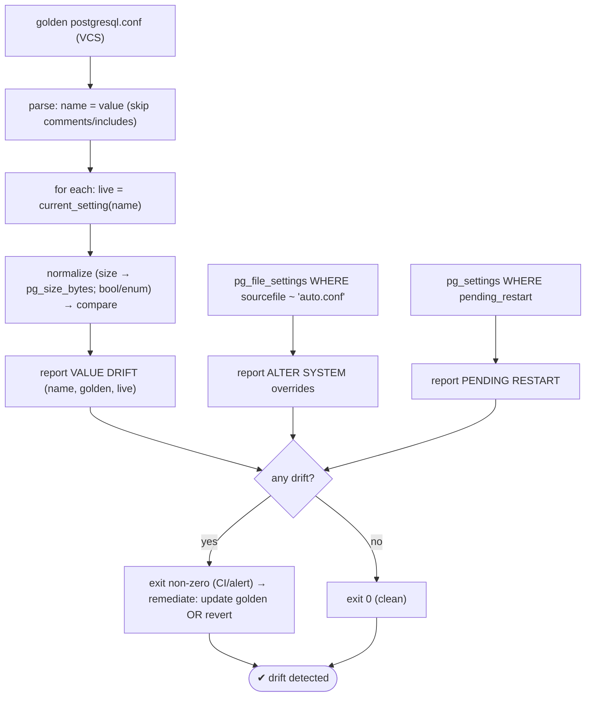
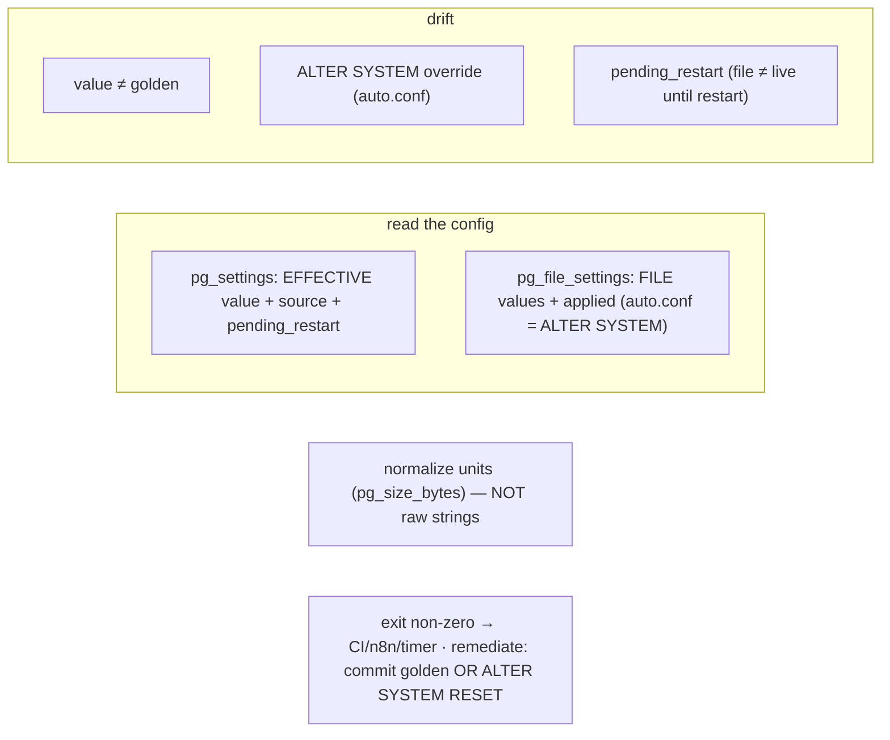

# Lab 132 — Config Drift Check: Script That Diffs Live `pg_settings` Against a Golden `postgresql.conf`

> **Track C · Cross-Cutting · C2 Automation & IaC · Lab 5 of 6 (Lab 132/222)**
> Teaching package: concept → diagram → steps → verify → quick-ref → self-test → video script.
> **Depends on:** Lab 12 (ALTER SYSTEM/auto.conf), Lab 13 (pending_restart), Lab 128 (IaC), Lab 129 (bash style).

---

## 0. Lab Card (at a glance)

| Field | Value |
|---|---|
| **Objective** | Write a house-style script that diffs the live effective settings (`pg_settings`) against a golden `postgresql.conf`, flags drift, `ALTER SYSTEM` overrides, and pending-restart settings, and exits non-zero on drift for CI. |
| **Success criterion** | The script reports no drift on a matching config and reports the exact drift after an `ALTER SYSTEM`, with correct unit normalization; exit code reflects drift. |
| **Scope boundary** | Drift detection. Applying/remediating config is Labs 12/128. |
| **Prereqs** | Labs 12/13; a golden config file |
| **Time** | 30–45 min |
| **Difficulty** | ★★★★☆ |
| **Risk** | Low — read-only checks. |

---

## 1. Learning Objectives

1. **Config drift** — what it is and where it comes from.
2. **`pg_settings` vs `pg_file_settings`** — effective vs file.
3. **Detect `ALTER SYSTEM` overrides** and pending restarts.
4. **Unit normalization** — the comparison pitfall.
5. **CI integration** — exit codes.

---

## 2. Concept Primer — the "why"

**Config drift is the running configuration diverging from the declared baseline.** Your IaC (Lab 128) or version control holds a **golden `postgresql.conf`** — the *intended* config. Drift happens when reality diverges: a manual edit, an `ALTER SYSTEM` (which writes `postgresql.auto.conf`, Lab 12), a hotfix nobody committed, or an Ansible run that didn't cover a setting. **Detecting drift = comparing the live config to the golden baseline**, so you can reconcile before it bites you (or an incident) later.

**Where settings live — two views:**
- **`pg_settings`** — every setting's **effective runtime value**, with a **`source`** column: `default`, `configuration file`, `override`, `command line`, etc., plus `sourcefile`/`sourceline`, `boot_val`, `reset_val`, **`pending_restart`**, and `context`.
- **`pg_file_settings`** — settings **as the config *files* declare them** (`postgresql.conf` + `postgresql.auto.conf` + includes), with `sourcefile`, `sourceline`, and **`applied`** (is this the effective value?). A `sourcefile` ending in **`postgresql.auto.conf`** is an **`ALTER SYSTEM` override** — a prime drift source not present in your golden file.

**What a drift check reports:**
1. **Value drift** — golden says X, live is Y.
2. **`ALTER SYSTEM` overrides** — settings in `postgresql.auto.conf` (runtime changes outside the golden file).
3. **`pending_restart`** — settings changed in the file but not yet applied (file and live differ until restart).

**The comparison pitfall — unit normalization.** PostgreSQL **normalizes** values: `shared_buffers = '128MB'` in the file becomes `16384` (8kB blocks) or shows as `128MB` via `SHOW`. Comparing **raw strings** (`128MB` vs `134217728`) yields false positives. Robust options:
- For **size/memory** settings, normalize both sides to **bytes** with **`pg_size_bytes()`** and compare numbers.
- Or feed the golden value through PostgreSQL's own normalization (`SET LOCAL … ; SELECT current_setting(…)` in a rolled-back transaction) and compare the normalized forms.
- Booleans/enums normalize too (`on`/`true`/`1`) — normalize before comparing.

**CI/automation integration.** The script **exits non-zero on drift**, so it plugs into CI (fail the pipeline), a systemd timer + n8n alert (Labs 130/131), or a pre-deploy gate. That closes the GitOps loop: declare in git, detect drift automatically, reconcile.

**Remediation:** for each drift, decide — **update the golden file** (the change was intended → commit it) or **revert** (`ALTER SYSTEM RESET name` / edit the file → reload/restart). Drift detection tells you *what* diverged; you decide *which way* to reconcile.

---

## 3. Diagrams

### 3.1 Drift-check flow



### 3.2 Concept



---

## 4. Prerequisites — a golden config

```bash
# a small "golden" baseline (in real life: from version control):
sudo -u postgres bash -c 'cat > /tmp/golden.conf <<EOF
# golden baseline (declared)
shared_buffers = 256MB
work_mem = 16MB
max_connections = 100
log_min_duration_statement = 250ms
logging_collector = on
EOF'
```

---

## 5. Step-by-Step — the drift-check script

### Step 1 — Write the script (house style)

```bash
cat > pg-drift-check.sh <<'SCRIPT'
#!/usr/bin/env bash
# pg-drift-check.sh — diff live pg_settings against a golden postgresql.conf. Exit non-zero on drift.
set -euo pipefail
IFS=$'\n\t'
GOLDEN="${1:-/tmp/golden.conf}"
PSQL=(sudo -u postgres psql -qtAX)
c(){ printf '\033[%sm' "$1"; }; NC=$(c 0)
log(){ printf '%s\n' "$*"; }
drift=0

# settings that carry size/byte units → normalize both sides via pg_size_bytes
is_size(){ case "$1" in shared_buffers|work_mem|maintenance_work_mem|effective_cache_size|wal_buffers|temp_file_limit|max_wal_size|min_wal_size) return 0;; *) return 1;; esac; }

norm(){ # normalize a value for a setting name → comparable string
  local name="$1" val="$2"
  if is_size "$name"; then "${PSQL[@]}" -c "SELECT pg_size_bytes('${val}')" 2>/dev/null || echo "$val"
  else echo "$val" | tr '[:upper:]' '[:lower:]' | sed "s/^'//; s/'$//"; fi
}

log "=== VALUE DRIFT (golden ${GOLDEN} vs live) ==="
# parse golden: name = value, skip comments/blank/includes
grep -vE '^\s*(#|$|include)' "$GOLDEN" | sed 's/#.*//' | while IFS='=' read -r name value; do
  name="$(echo "$name" | xargs)"; value="$(echo "$value" | xargs)"
  [[ -z "$name" ]] && continue
  live="$("${PSQL[@]}" -c "SELECT current_setting('${name}')" 2>/dev/null || echo "<unknown>")"
  g="$(norm "$name" "$value")"; l="$(norm "$name" "$live")"
  if [[ "$g" != "$l" ]]; then
    printf "  %sDRIFT%s %-30s golden=%-12s live=%s\n" "$(c '0;31')" "$NC" "$name" "$value" "$live"
    echo drift > /tmp/.drift_flag
  fi
done
[[ -f /tmp/.drift_flag ]] && { drift=1; rm -f /tmp/.drift_flag; } || log "  (none)"

log ""; log "=== ALTER SYSTEM overrides (postgresql.auto.conf — not in golden) ==="
as="$("${PSQL[@]}" -c "SELECT name||' = '||setting FROM pg_file_settings WHERE sourcefile LIKE '%postgresql.auto.conf'")"
[[ -n "$as" ]] && { echo "$as" | sed 's/^/  /'; drift=1; } || log "  (none)"

log ""; log "=== PENDING RESTART (changed, not yet effective) ==="
pr="$("${PSQL[@]}" -c "SELECT name||' → '||setting FROM pg_settings WHERE pending_restart")"
[[ -n "$pr" ]] && { echo "$pr" | sed 's/^/  /'; drift=1; } || log "  (none)"

log ""; [[ $drift -eq 0 ]] && { log "✔ no drift"; exit 0; } || { log "✗ drift detected"; exit 2; }
SCRIPT
chmod +x pg-drift-check.sh
```

### Step 2 — Run it against a matching config (expect clean)

```bash
# make the live config match the golden first (so we see a clean run):
sudo -u postgres psql -c "ALTER SYSTEM SET shared_buffers='256MB'; ALTER SYSTEM SET work_mem='16MB'; ALTER SYSTEM SET log_min_duration_statement='250ms';"
sudo systemctl restart postgresql-17    # shared_buffers needs restart
./pg-drift-check.sh /tmp/golden.conf; echo "exit: $?"
```

### Step 3 — Introduce drift with ALTER SYSTEM, re-check

```bash
sudo -u postgres psql -c "ALTER SYSTEM SET work_mem='64MB';"     # drift: golden says 16MB
sudo -u postgres psql -c "SELECT pg_reload_conf();"
./pg-drift-check.sh /tmp/golden.conf; echo "exit: $?"
#   → DRIFT work_mem golden=16MB live=64MB · ALTER SYSTEM override listed · exit 2
```

### Step 4 — Detect a pending-restart drift

```bash
sudo -u postgres psql -c "ALTER SYSTEM SET shared_buffers='512MB'; SELECT pg_reload_conf();"   # needs restart to apply
./pg-drift-check.sh /tmp/golden.conf | grep -A2 "PENDING RESTART"
#   → shared_buffers listed as pending_restart (file changed, not yet effective)
```

### Step 5 — Inspect the underlying views

```bash
sudo -u postgres psql -c "SELECT name, setting, source, sourcefile FROM pg_settings WHERE name IN ('work_mem','shared_buffers');"
sudo -u postgres psql -c "SELECT name, setting, applied FROM pg_file_settings WHERE sourcefile LIKE '%auto.conf';"
sudo -u postgres psql -c "SELECT name, setting, pending_restart FROM pg_settings WHERE pending_restart;"
```

### Step 6 — Remediate + integrate

```bash
# reconcile: either COMMIT the change to golden, OR revert:
sudo -u postgres psql -c "ALTER SYSTEM RESET work_mem; ALTER SYSTEM RESET shared_buffers; SELECT pg_reload_conf();"
sudo systemctl restart postgresql-17
./pg-drift-check.sh /tmp/golden.conf; echo "exit: $?"    # clean again → exit 0
# INTEGRATE: run via a systemd timer (Lab 130) → n8n alert on non-zero exit (Lab 131) → CI gate
```

---

## 6. Verification Checklist

- [ ] Script parses the golden file (skips comments/includes)
- [ ] Matching config → no drift, exit 0
- [ ] `ALTER SYSTEM` change → value drift reported + auto.conf override listed → exit 2
- [ ] Size units normalized (no false positive on `256MB` vs bytes)
- [ ] `pending_restart` detected
- [ ] Inspected `pg_settings`/`pg_file_settings`
- [ ] Remediated → clean; know the CI/timer integration

---

## 7. Troubleshooting

| Symptom | Cause | Fix |
|---|---|---|
| False positive on size setting | Raw-string compare | Normalize via `pg_size_bytes()` (both sides) |
| `ALTER SYSTEM` override flagged | `postgresql.auto.conf` change | Commit to golden **or** `ALTER SYSTEM RESET` |
| `pending_restart` shown | File changed, not applied | Restart to apply (or the file/live differ until then) |
| Golden parse errors | Comments/includes | Skip comments; handle `include`/`include_dir` |
| Unknown setting | Typo / not in this version | Skip/handle gracefully |
| Boolean mismatch | `on` vs `true` | Normalize booleans/enums |
| Only golden keys checked | Partial audit | For a full audit, also compare non-default settings |

---

## 8. Quick Reference Card (paste-ready)

```sql
-- effective values + where from + pending restart:
SELECT name, setting, source, sourcefile, pending_restart FROM pg_settings;
-- file values; auto.conf = ALTER SYSTEM overrides (drift):
SELECT name, setting, sourcefile, applied FROM pg_file_settings WHERE sourcefile LIKE '%postgresql.auto.conf';
-- pending restart (file ≠ live until restart):
SELECT name, setting FROM pg_settings WHERE pending_restart;
```
```bash
# DRIFT CHECK: parse golden (name=value) → compare current_setting(name) → normalize size via pg_size_bytes
#   report: value drift · ALTER SYSTEM overrides · pending_restart · exit non-zero on drift
# REMEDIATE: commit change to golden  OR  ALTER SYSTEM RESET name  (then reload/restart)
# INTEGRATE: systemd timer (Lab 130) → n8n alert on non-zero exit (Lab 131) / CI gate
```

---

## 9. Self-Check

1. What is config drift, and where does it come from?
2. What's the difference between `pg_settings` and `pg_file_settings`?
3. How do you detect `ALTER SYSTEM` overrides?
4. What's the unit-normalization pitfall, and the fix?
5. What does `pending_restart` mean?
6. How do you integrate the check into automation?

<details>
<summary>Answers</summary>

1. The running config diverging from the declared golden baseline — from manual edits, `ALTER SYSTEM` (writes `postgresql.auto.conf`), or uncommitted hotfixes.
2. `pg_settings` = the **effective runtime** value (with `source`, `pending_restart`); `pg_file_settings` = the values **in the config files** (with `applied`; `auto.conf` entries are `ALTER SYSTEM` overrides).
3. Query `pg_file_settings WHERE sourcefile LIKE '%postgresql.auto.conf'` (or `pg_settings.source`).
4. PostgreSQL normalizes units (`128MB` vs bytes), so raw-string compares false-positive; normalize size settings with `pg_size_bytes()` (and booleans/enums) before comparing.
5. A setting changed in the file but **not yet applied** — it needs a restart; the file value and the live value differ until then.
6. The script **exits non-zero on drift**, so a systemd timer + n8n alert or a CI gate can act on it.
</details>

---

## 10. Video / Teaching Script

| # | On screen | Say (narration) |
|---|---|---|
| 1 | Title: "Is your database still what you declared?" | "You wrote a golden config and committed it. But is the *running* database still that? Drift creeps in — a hotfix here, an ALTER SYSTEM there." |
| 2 | views | "Postgres tells you the truth in two views: the effective settings, and what the files declare. The auto-conf file is where sneaky changes hide." |
| 3 | script | "So we script the diff: read the golden, compare each setting to live, and report every gap." |
| 4 | drift | "Watch — one ALTER SYSTEM, and the check lights up: work-mem, golden sixteen, live sixty-four. Caught." |
| 5 | units | "The trap is units — a hundred-and-twenty-eight megs versus a number of bytes are the *same* value. Normalize, or you'll cry wolf." |
| 6 | integrate | "It exits non-zero on drift — so a timer runs it, n8n alerts, and your CI won't ship a config that quietly wandered off." |
| 7 | Outro | "GitOps for your database config. Next: migrating to the cloud." |

---

## 11. Glossary

- **Config drift** — live config ≠ declared golden baseline.
- **Golden config** — the intended `postgresql.conf` in version control.
- **`pg_settings` / `pg_file_settings`** — effective values / file values.
- **`postgresql.auto.conf`** — where `ALTER SYSTEM` writes (drift source).
- **`pending_restart`** — changed but not yet effective.
- **`pg_size_bytes()`** — normalize size units for comparison.
- **Exit code** — non-zero on drift for CI/automation.

---
*NETAPORT lab series · PostgreSQL 17 on AlmaLinux 9 · Lab 132/222 · C2 Automation & IaC*
