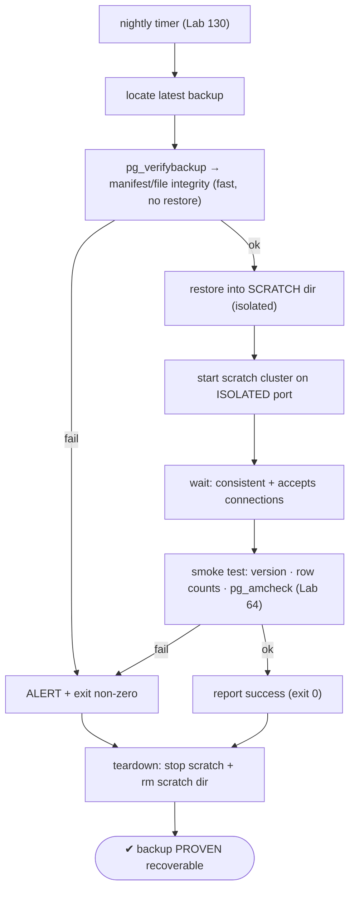
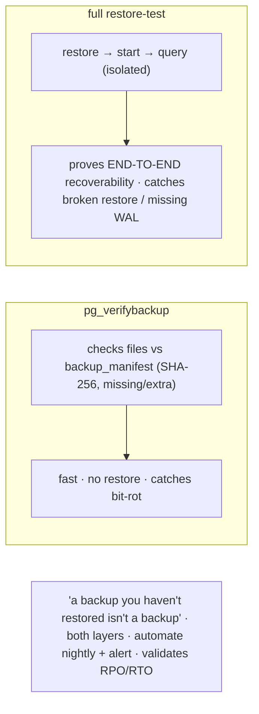

# Lab 133 — Automated Restore-Test: Nightly Restore of Last Backup into a Scratch Cluster + `pg_verifybackup`

> **Track C · Cross-Cutting · C2 Automation & IaC · Lab 6 of 6 (Lab 133/222 · C2 complete)**
> Teaching package: concept → diagram → steps → verify → quick-ref → self-test → video script.
> **Depends on:** Lab 19 (pg_basebackup), Lab 23 (pg_verifybackup), Lab 64 (amcheck), Lab 130 (timers), Lab 131 (alerts).

---

## 0. Lab Card (at a glance)

| Field | Value |
|---|---|
| **Objective** | Automate a nightly restore-test: verify the latest backup with `pg_verifybackup`, restore it into an isolated scratch cluster, start and smoke-test it, alert on failure, and tear it down. |
| **Success criterion** | The script verifies the manifest, restores + starts a scratch cluster on an isolated port, passes smoke tests, exits non-zero on any failure, and cleans up; a systemd timer runs it nightly. |
| **Scope boundary** | Backup validation automation. Backup creation was Labs 19/25; PITR Lab 21. |
| **Prereqs** | Labs 19/23/64; a recent backup + free disk/port |
| **Time** | 35–50 min |
| **Difficulty** | ★★★★☆ |
| **Risk** | Low — isolated scratch cluster; no prod impact. |

---

## 1. Learning Objectives

1. **Why restore-test** — "success" ≠ recoverable.
2. **`pg_verifybackup` vs full restore-test** — the two layers.
3. **Isolate the scratch cluster** — port/dir.
4. **Smoke tests** — prove it's runnable + clean.
5. **Automate + alert** — timer + non-zero exit.

---

## 2. Concept Primer — the "why"

**A backup you haven't restored isn't a backup.** A backup job that reports **"success"** proves only that the *job ran* — not that the backup is **restorable**. Backups fail silently: bit-rot corrupts a file, WAL needed for consistency is missing, the restore config is broken, or the manifest is incomplete. **The only way to know a backup works is to restore it.** Automating that nightly catches a broken backup **before** you need it in a real disaster — it's the discipline that turns a backup *policy* into a backup *guarantee*, and validates your RPO/RTO assumptions.

**Two complementary validation layers:**
1. **`pg_verifybackup`** (Lab 23) — verifies a backup against its **`backup_manifest`**: every file's SHA-256 checksum, plus missing/extra-file detection, and optionally WAL. **Fast, no restore needed** — catches file-level corruption. `pg_verifybackup <backup_dir>` → exit 0 if valid.
2. **Full restore-test** — actually **restore + start + query** the backup. This proves **end-to-end recoverability** and catches what `pg_verifybackup` can't: a broken restore path, missing WAL for reaching consistency, a config that won't start, or logically bad data. **Verify tests the files; restore-test tests the *recovery*.** Do both.

**The restore-test workflow:**
1. **Locate** the latest backup (Labs 19/25).
2. **`pg_verifybackup`** the manifest → fail fast if files don't match.
3. **Restore** into a **scratch** location — a separate data dir (a pg_basebackup *is* a data dir; pgBackRest uses `pgbackrest restore --pg1-path=/scratch`).
4. **Start** the scratch cluster on an **isolated port** — no contact with prod.
5. **Smoke-test** — it reached a consistent state, accepts connections, and: `SELECT version()`, row counts on key tables, and **`pg_amcheck`** (Lab 64) for corruption.
6. **Report** success/failure → **alert on failure** (n8n, Lab 131).
7. **Tear down** — stop the scratch instance, delete the scratch dir.

**Isolation is essential.** The scratch cluster uses its **own data dir** and **own port** and **never touches production** — so the test is safe to run anytime. Restore needs disk equal to the backup size; clean up after.

**Automate + integrate:** run it via a **systemd timer** nightly (Lab 130); the script **exits non-zero on any failure**, so an n8n/monitoring hook can alert. A green nightly restore-test is the single best proof your DR plan works.

---

## 3. Diagrams

### 3.1 Restore-test flow



### 3.2 Two layers



---

## 4. Prerequisites — a backup to test

```bash
# a recent pg_basebackup WITH a manifest (Lab 19):
sudo -u postgres /usr/pgsql-17/bin/pg_basebackup -D /backup/latest -X stream -P 2>/dev/null || echo "point BACKUP_DIR at your latest backup"
ls /backup/latest/backup_manifest    # pg_verifybackup needs this
```

---

## 5. Step-by-Step — the restore-test script

### Step 1 — Write the script (house style)

```bash
cat > pg-restore-test.sh <<'SCRIPT'
#!/usr/bin/env bash
# pg-restore-test.sh — verify + restore-test the latest backup in an isolated scratch cluster.
set -euo pipefail
IFS=$'\n\t'
PGBIN="/usr/pgsql-17/bin"
BACKUP_DIR="${BACKUP_DIR:-/backup/latest}"
SCRATCH="${SCRATCH:-/var/tmp/pg-restore-test}"
PORT="${PORT:-5599}"
c(){ printf '\033[%sm' "$1"; }; NC=$(c 0)
ts(){ date '+%Y-%m-%d %H:%M:%S'; }
log(){ printf '%s [%sINFO%s] %s\n' "$(ts)" "$(c '0;34')" "$NC" "$*"; }
ok(){  printf '%s [%s OK %s] %s\n' "$(ts)" "$(c '0;32')" "$NC" "$*"; }
fail(){ printf '%s [%sFAIL%s] %s\n' "$(ts)" "$(c '0;31')" "$NC" "$*" >&2; cleanup; exit 2; }

cleanup(){ sudo -u postgres "$PGBIN/pg_ctl" -D "$SCRATCH" stop -m immediate >/dev/null 2>&1 || true; rm -rf "${SCRATCH:?}"; }
trap 'fail "error on line $LINENO"' ERR

# 1) manifest integrity (fast, no restore)
log "pg_verifybackup ${BACKUP_DIR}"
sudo -u postgres "$PGBIN/pg_verifybackup" "$BACKUP_DIR" >/dev/null || fail "pg_verifybackup: manifest/file integrity FAILED"
ok "manifest verified"

# 2) restore into an ISOLATED scratch dir
log "restoring into ${SCRATCH}"
rm -rf "${SCRATCH:?}"; sudo -u postgres cp -a "$BACKUP_DIR" "$SCRATCH"
# isolate: own port, no archiving/replication side-effects
sudo -u postgres bash -c "printf '\nport=${PORT}\narchive_mode=off\n' >> ${SCRATCH}/postgresql.auto.conf"
rm -f "$SCRATCH/postmaster.pid" 2>/dev/null || true

# 3) start the scratch cluster
log "starting scratch cluster on port ${PORT}"
sudo -u postgres "$PGBIN/pg_ctl" -D "$SCRATCH" -o "-p ${PORT}" -w -t 60 start >/dev/null || fail "scratch cluster did not start"
ok "scratch cluster started (recovery reached consistency)"

# 4) smoke tests
PSQL=(sudo -u postgres "$PGBIN/psql" -p "$PORT" -qtAX)
"${PSQL[@]}" -c "SELECT version();" >/dev/null || fail "no connection"
rows="$("${PSQL[@]}" -d postgres -c "SELECT count(*) FROM pg_database;")"; log "databases restored: ${rows}"
"${PSQL[@]}" -c "CREATE EXTENSION IF NOT EXISTS amcheck;" >/dev/null 2>&1 || true
if "${PSQL[@]}" -d postgres -c "SELECT 1" >/dev/null; then
  sudo -u postgres "$PGBIN/pg_amcheck" -p "$PORT" -d postgres 2>/dev/null && ok "pg_amcheck clean" || log "pg_amcheck: see output (non-fatal here)"
fi
ok "smoke tests passed"

# 5) teardown + report
cleanup
ok "RESTORE-TEST PASSED — backup is recoverable"
exit 0
SCRIPT
chmod +x pg-restore-test.sh
```

### Step 2 — Run it manually

```bash
sudo BACKUP_DIR=/backup/latest PORT=5599 ./pg-restore-test.sh; echo "exit: $?"
#   → pg_verifybackup ok · restore · scratch starts on 5599 · smoke tests · teardown · exit 0
```

### Step 3 — Prove it catches a bad backup

```bash
# corrupt a file in a COPY of the backup and verify the test fails:
sudo -u postgres cp -a /backup/latest /backup/broken
sudo dd if=/dev/urandom of=/backup/broken/base/1/PG_VERSION bs=1 count=4 conv=notrunc 2>/dev/null || \
  sudo bash -c 'echo garbage >> /backup/broken/backup_manifest'
sudo BACKUP_DIR=/backup/broken ./pg-restore-test.sh; echo "exit: $?"    # → FAIL, exit 2 (catches it!)
sudo rm -rf /backup/broken
```

### Step 4 — Schedule nightly (systemd timer, Lab 130)

```bash
sudo tee /etc/systemd/system/pg-restore-test.service >/dev/null <<'EOF'
[Unit]
Description=Nightly backup restore-test
[Service]
Type=oneshot
Environment=BACKUP_DIR=/backup/latest PORT=5599 SCRATCH=/var/tmp/pg-restore-test
ExecStart=/usr/local/bin/pg-restore-test.sh
EOF
sudo cp pg-restore-test.sh /usr/local/bin/
sudo tee /etc/systemd/system/pg-restore-test.timer >/dev/null <<'EOF'
[Unit]
Description=Run the backup restore-test nightly
[Timer]
OnCalendar=*-*-* 05:00:00
Persistent=true
[Install]
WantedBy=timers.target
EOF
sudo systemctl daemon-reload && sudo systemctl enable --now pg-restore-test.timer
systemctl list-timers pg-restore-test.timer --no-pager
```

### Step 5 — Alert on failure (n8n, Lab 131)

```bash
# the service exits non-zero on failure → alert on OnFailure or scrape the journal:
sudo tee -a /etc/systemd/system/pg-restore-test.service >/dev/null <<'EOF'

[Unit]
OnFailure=pg-restore-test-alert.service
EOF
#   pg-restore-test-alert.service → curl an n8n webhook / send Slack (Lab 131)
sudo systemctl daemon-reload
journalctl -u pg-restore-test.service -n 15 --no-pager    # audit the last run
```

### Step 6 — Confirm cleanup + no prod impact

```bash
ls /var/tmp/pg-restore-test 2>&1 | tail -1      # gone after a run (teardown)
sudo -u postgres psql -c "SELECT count(*) FROM pg_stat_activity WHERE backend_type='client backend';"   # prod untouched
```

---

## 6. Verification Checklist

- [ ] `pg_verifybackup` verifies the manifest (fast)
- [ ] Restore into an **isolated** scratch dir + port
- [ ] Scratch cluster starts and reaches consistency
- [ ] Smoke tests pass (version, db count, `pg_amcheck`)
- [ ] A corrupted backup makes the test **fail** (exit non-zero)
- [ ] Scratch cluster torn down; no prod impact
- [ ] Nightly timer enabled; failure alert wired

---

## 7. Troubleshooting

| Symptom | Cause | Fix |
|---|---|---|
| `pg_verifybackup` fails | Corrupt/missing files | The backup is broken — investigate storage; re-backup |
| Scratch won't start | Incomplete backup / missing WAL | `-X stream` in pg_basebackup; check recovery/config |
| Port conflict | Scratch port in use | Use a free isolated port |
| Touches prod files | Not isolated | Separate dir + port; never reuse prod paths |
| `pg_amcheck` finds corruption | Source data was corrupt | Fix the source (Lab 64) |
| Cleanup fails | Instance still running | `pg_ctl stop` first, then `rm -rf` |
| Out of disk | Restore = backup size | Ensure room; clean up after |

---

## 8. Quick Reference Card (paste-ready)

```bash
# "a backup you haven't restored isn't a backup" — verify FILES + prove RECOVERY
pg_verifybackup /backup/latest                    # manifest/file integrity (fast, no restore) — exit 0 = valid

# full restore-test (isolated):
cp -a /backup/latest /scratch                     # (or: pgbackrest restore --pg1-path=/scratch)
printf '\nport=5599\narchive_mode=off\n' >> /scratch/postgresql.auto.conf; rm -f /scratch/postmaster.pid
pg_ctl -D /scratch -o "-p 5599" -w start          # must reach consistency + accept connections
psql -p 5599 -c "SELECT version();"               # + row counts + pg_amcheck (Lab 64)
pg_ctl -D /scratch stop -m immediate; rm -rf /scratch   # teardown

# AUTOMATE: systemd timer nightly (Lab 130) · script exits non-zero on failure → n8n/OnFailure alert (Lab 131)
# ISOLATE: own dir + own port · never touch prod · restore needs disk = backup size
```

---

## 9. Self-Check

1. Why automate restore-testing?
2. What's the difference between `pg_verifybackup` and a full restore-test?
3. What are the workflow steps?
4. How do you isolate the scratch cluster?
5. What smoke tests should you run?
6. How do you integrate it into automation?

<details>
<summary>Answers</summary>

1. A backup that reports "success" isn't proven **restorable** — only a restore verifies recoverability, catching silent corruption, missing WAL, or a broken restore path *before* a real disaster.
2. `pg_verifybackup` checks **files against the manifest** (fast, no restore); a **full restore-test** restores + starts + queries to prove **end-to-end recoverability** — do both.
3. Locate the backup → `pg_verifybackup` → restore into a scratch dir → start on an isolated port → smoke-test → report → tear down.
4. Its own **data dir** and **isolated port**, never touching production paths.
5. `SELECT version()`, row counts on key tables, and `pg_amcheck` for corruption.
6. A **systemd timer** runs it nightly (Lab 130); the script **exits non-zero on failure**, so an n8n/`OnFailure` hook alerts (Lab 131).
</details>

---

## 10. Video / Teaching Script

| # | On screen | Say (narration) |
|---|---|---|
| 1 | Title: "A backup you never tested is a wish" | "Your backup job says 'success' every night. Great — but can you actually *restore* it? The only way to know is to try. Automatically." |
| 2 | verify | "First, cheap and fast: pg_verifybackup checks every file against the manifest. Bit-rot? Caught, in seconds." |
| 3 | restore | "But files matching isn't recovery. So we restore it — into a throwaway cluster, on its own port, nowhere near production." |
| 4 | smoke | "It starts, reaches consistency, and we poke it: version, row counts, a corruption check. If it lives, the backup's real." |
| 5 | catch a bad one | "Watch it earn its keep — corrupt a backup, and the test fails, loudly. That's the night you *want* to find out." |
| 6 | automate | "Then schedule it nightly, and alert if it ever fails. A green restore-test every morning is the only DR plan you can trust." |
| 7 | Outro | "Backups, proven. That completes automation and infrastructure-as-code." |

---

## 11. Glossary

- **Restore-test** — restoring a backup to prove it's recoverable.
- **`pg_verifybackup`** — file/manifest integrity check (no restore).
- **`backup_manifest`** — per-file checksums (Lab 23).
- **Scratch cluster** — isolated throwaway restore target.
- **Smoke test** — quick runnable/clean checks (version, counts, amcheck).
- **RPO/RTO** — recovery point/time objectives (what restore-tests validate).
- **Teardown** — stop + delete the scratch cluster.

---
*NETAPORT lab series · PostgreSQL 17 on AlmaLinux 9 · Lab 133/222 · **C2 Automation & IaC complete***
