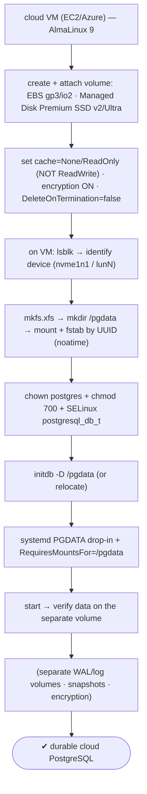

# Lab 134 — Deploy PostgreSQL on an EC2/Azure VM with a Separate EBS/Managed-Disk Data Volume

> **Track C · Cross-Cutting · C3 Cloud & Managed Services · Lab 1 of 5 (Lab 134/222)**
> Teaching package: concept → diagram → steps → verify → quick-ref → self-test → video script.
> **Depends on:** Lab 02 (initdb/systemd PGDATA), Lab 04 (relocate volume/SELinux/fstab), Lab 15 (fsync/storage honesty). Opens the cloud track.

---

## 0. Lab Card (at a glance)

| Field | Value |
|---|---|
| **Objective** | Attach a dedicated block volume (EBS/Managed Disk) to a cloud VM and place PGDATA on it correctly — formatted, UUID-mounted, SELinux-labeled, systemd-guarded — with the right cloud durability settings. |
| **Success criterion** | PGDATA lives on a separate durable volume; it mounts on reboot; postgres starts only after the mount; host caching is safe; encryption is on. |
| **Scope boundary** | Self-managed PostgreSQL on a cloud VM. Managed RDS/Azure DB is Lab 135. |
| **Prereqs** | Lab 04; a cloud VM + an attachable volume |
| **Time** | 35–50 min |
| **Difficulty** | ★★★★☆ |
| **Risk** | Low — provisioning; VM-only. |

---

## 1. Learning Objectives

1. **Why a separate data volume** — cloud benefits.
2. **EBS vs Managed Disk** — types and IOPS.
3. **The durability gotchas** — host cache, instance-store.
4. **Attach → format → mount** by UUID, safely.
5. **systemd + SELinux + encryption** on the VM.

---

## 2. Concept Primer — the "why"

**Put PGDATA (and ideally `pg_wal`) on a dedicated block volume, not the root disk.** In the cloud that's an **EBS volume** (AWS) or a **Managed Disk** (Azure). The benefits are bigger than on-prem:
- **Independent sizing and IOPS/throughput** — grow or speed up the data volume without touching the OS disk.
- **Volume snapshots** — snapshot just the data (backup/clone).
- **Persistence** — the volume **survives instance termination** (set **`DeleteOnTermination=false`** on EBS / don't delete the disk with the VM), so a lost instance doesn't lose data.
- **Detach/reattach** — move the volume to a new instance for recovery/migration.
- **I/O isolation** — separate volumes for data vs WAL vs logs (Lab 122).

**Block-storage types:**
- **AWS EBS** — **`gp3`** (recommended: 3000 IOPS / 125 MB/s baseline, **IOPS/throughput provisioned independently of size** — unlike `gp2`), **`io2`/`io2 Block Express`** for high, consistent IOPS.
- **Azure Managed Disk** — **Premium SSD**, **Premium SSD v2** (independent IOPS/throughput tuning), **Ultra Disk** for the highest performance.
Provision IOPS to your workload — network-attached volumes have higher latency than local NVMe, so under-provisioning shows up as slow queries.

**Two cloud-specific durability gotchas (get these right):**
1. **Host-level write caching must be `None` or `ReadOnly` for the data/WAL volume.** A **`ReadWrite`** host cache can acknowledge a write (and PostgreSQL's fsync) **before** the data is durably stored — so a **host failure loses acknowledged writes**. That's exactly the **lying-storage** failure from Lab 15, in cloud form. For PostgreSQL data and WAL, use **`None`** (or `ReadOnly`) caching — **never `ReadWrite`**.
2. **Instance-store / local NVMe is fast but *ephemeral*.** It's lost on **stop/terminate** (and some host events). **Never put PGDATA on instance-store** — only temp/scratch. Durable EBS/Managed Disk for anything you can't lose.

**On-VM setup (same on both clouds, building on Lab 04):**
1. `lsblk` — identify the attached device (Nitro/modern VMs use **NVMe names** like `/dev/nvme1n1`; Azure uses `/dev/disk/azure/scsi1/lunN`).
2. **`mkfs.xfs`** — XFS is recommended for PostgreSQL (handles large files well); ext4 is fine too.
3. `mkdir /pgdata`, then **mount + `/etc/fstab` by UUID** (`blkid`), with **`noatime`** to cut write overhead. **Device names can change across reboots/attach — always mount by UUID, not `/dev/...`.**
4. `chown postgres:postgres /pgdata`, `chmod 700`, and **SELinux label** `postgresql_db_t` (Lab 04).
5. `initdb -D /pgdata` (or relocate an existing cluster, Lab 04).
6. **systemd**: a `PGDATA` drop-in (Lab 02) **plus `RequiresMountsFor=/pgdata`** (Lab 04) so postgres starts **only after** the volume mounts (else it could start on an empty root path).
7. **Enable encryption at rest** (EBS encryption / Azure disk encryption) — a baseline security control.

**Snapshots for backup — with a caveat:** volume snapshots are **crash-consistent** (like a power-loss image — recoverable via crash recovery, Lab 121). For a *guaranteed-consistent* PostgreSQL backup, use `pg_basebackup` (Lab 19) or the low-level backup API (`pg_backup_start/stop`) + WAL, or snapshot while the cluster is quiesced.

---

## 3. Diagrams

### 3.1 Provision flow



### 3.2 Cloud storage decisions

```mermaid
flowchart LR
    subgraph DURABLE [durable (PGDATA)]
      E1["EBS gp3/io2 · Managed Disk Premium SSD v2/Ultra"] --> E2["independent IOPS · snapshots · survives terminate"]
    end
    subgraph EPHEM [NEVER for PGDATA]
      L1["instance-store / local NVMe = fast but LOST on stop/terminate"]
    end
    subgraph SAFE [durability settings]
      S1["host cache = None/ReadOnly (ReadWrite = lose acknowledged writes, Lab 15)"]
      S2["mount by UUID + RequiresMountsFor · encryption at rest"]
    end
    note["snapshots = crash-consistent → use pg_basebackup for guaranteed-consistent backups (Lab 19)"]
```

---

## 4. Prerequisites — a VM with an attached volume

```bash
# AWS: create gp3 EBS + attach to the instance (DeleteOnTermination=false, encrypted):
#   aws ec2 create-volume --volume-type gp3 --size 100 --iops 4000 --throughput 250 --encrypted --availability-zone <az>
#   aws ec2 attach-volume --volume-id vol-xxxx --instance-id i-xxxx --device /dev/sdf
# Azure: create + attach a Managed Disk (Premium SSD v2, caching None, encrypted):
#   az disk create -g <rg> -n pgdata --size-gb 100 --sku PremiumV2_LRS
#   az vm disk attach -g <rg> --vm-name <vm> --name pgdata --caching None
lsblk    # confirm the new device appeared
```

---

## 5. Step-by-Step (on the VM)

### Step 1 — Identify the attached device

```bash
lsblk -o NAME,SIZE,TYPE,MOUNTPOINT           # e.g., nvme1n1 (AWS Nitro) or sdc (Azure)
DEV=/dev/nvme1n1                              # ← set to YOUR unmounted data device
ls -l /dev/disk/azure/scsi1/ 2>/dev/null      # (Azure: map LUN → device)
```

### Step 2 — Format (XFS) and prepare the mount point

```bash
sudo mkfs.xfs -f "$DEV"
sudo mkdir -p /pgdata
```

### Step 3 — Mount by UUID (persistent) + noatime

```bash
UUID=$(sudo blkid -s UUID -o value "$DEV")
echo "UUID=$UUID /pgdata xfs defaults,noatime 0 2" | sudo tee -a /etc/fstab
sudo mount -a
df -h /pgdata                                 # mounted on the separate volume
```

### Step 4 — Ownership + SELinux label (Lab 04)

```bash
sudo chown -R postgres:postgres /pgdata && sudo chmod 700 /pgdata
sudo semanage fcontext -a -t postgresql_db_t "/pgdata(/.*)?"
sudo restorecon -Rv /pgdata
```

### Step 5 — initdb on the volume + systemd guard

```bash
sudo -u postgres /usr/pgsql-17/bin/initdb -D /pgdata -k --locale=en_US.UTF-8
# systemd PGDATA drop-in + require the mount before starting:
sudo mkdir -p /etc/systemd/system/postgresql-17.service.d
sudo tee /etc/systemd/system/postgresql-17.service.d/override.conf >/dev/null <<'EOF'
[Service]
Environment=PGDATA=/pgdata
[Unit]
RequiresMountsFor=/pgdata
EOF
sudo systemctl daemon-reload
sudo systemctl enable --now postgresql-17
```

### Step 6 — Verify data lives on the separate volume

```bash
sudo -u postgres psql -c "SHOW data_directory;"           # /pgdata
sudo -u postgres psql -c "SELECT version();"
df -h /pgdata; sudo du -sh /pgdata/base                    # data on the attached volume
findmnt /pgdata                                            # confirm the separate filesystem
```

---

## 6. Verification Checklist

- [ ] Dedicated durable volume (EBS/Managed Disk), not instance-store
- [ ] Host cache None/ReadOnly (not ReadWrite); encryption on; `DeleteOnTermination=false`
- [ ] Formatted XFS; mounted by **UUID** with `noatime`
- [ ] SELinux `postgresql_db_t`; owned by postgres
- [ ] `initdb`/data on `/pgdata`; `data_directory` confirms
- [ ] systemd `RequiresMountsFor=/pgdata` (starts after mount)
- [ ] Survives reboot (mounts + starts)

---

## 7. Troubleshooting

| Symptom | Cause | Fix |
|---|---|---|
| Volume not mounting on reboot | fstab by `/dev/...` (name changed) | Mount by **UUID** |
| postgres starts before mount | No dependency | `RequiresMountsFor=/pgdata` (Lab 04) |
| SELinux denies access | Unlabeled mount | `semanage fcontext … postgresql_db_t` + `restorecon` |
| Slow I/O | Under-provisioned IOPS | `gp3`/`io2` provisioned IOPS; Premium SSD v2 |
| Data loss on host failure | `ReadWrite` host cache | Set cache **None/ReadOnly** for data/WAL |
| Data lost on terminate | Instance-store / delete-on-terminate | Durable volume; `DeleteOnTermination=false` |
| Wrong device name | Nitro NVMe naming | `lsblk`; Azure `/dev/disk/azure/scsi1/lunN` |
| Snapshot restore inconsistent | Crash-consistent only | Use `pg_basebackup`/backup API for consistent |

---

## 8. Quick Reference Card (paste-ready)

```bash
# durable volume for PGDATA — EBS gp3/io2  |  Azure Managed Disk Premium SSD v2/Ultra
#   host cache = None/ReadOnly (NOT ReadWrite → lose acked writes, Lab 15) · encryption ON · keep on terminate
#   NEVER instance-store/local NVMe for PGDATA (ephemeral)

lsblk                                             # find the device (nvme1n1 / lunN)
sudo mkfs.xfs -f /dev/nvme1n1
UUID=$(sudo blkid -s UUID -o value /dev/nvme1n1)
echo "UUID=$UUID /pgdata xfs defaults,noatime 0 2" | sudo tee -a /etc/fstab && sudo mount -a
sudo chown -R postgres:postgres /pgdata && sudo chmod 700 /pgdata
sudo semanage fcontext -a -t postgresql_db_t "/pgdata(/.*)?" && sudo restorecon -Rv /pgdata
sudo -u postgres /usr/pgsql-17/bin/initdb -D /pgdata -k
# systemd: Environment=PGDATA=/pgdata + RequiresMountsFor=/pgdata → start after mount
# snapshots = crash-consistent → pg_basebackup for guaranteed-consistent backups (Lab 19)
```

---

## 9. Self-Check

1. Why put PGDATA on a separate volume in the cloud?
2. What are the block-storage options on AWS and Azure?
3. What's the critical cloud durability gotcha?
4. Why mount by UUID and use `RequiresMountsFor`?
5. Why never use instance-store for PGDATA?
6. Are volume snapshots consistent PostgreSQL backups?

<details>
<summary>Answers</summary>

1. Independent sizing/IOPS, volume snapshots, **persistence across instance termination**, detach/reattach, and I/O isolation.
2. AWS EBS (`gp3`, `io2`); Azure Managed Disk (Premium SSD, **Premium SSD v2**, Ultra Disk).
3. **Host write caching must be None/ReadOnly** for data/WAL — `ReadWrite` can lose acknowledged writes on host failure (lying storage, Lab 15).
4. Cloud device names can change; **UUID** is stable, and **`RequiresMountsFor`** ensures postgres starts only after the volume mounts.
5. Instance-store/local NVMe is **ephemeral** — lost on stop/terminate — so it must never hold durable data.
6. **No** — they're crash-consistent; use `pg_basebackup` or the backup API + WAL for a guaranteed-consistent backup.
</details>

---

## 10. Video / Teaching Script

| # | On screen | Say (narration) |
|---|---|---|
| 1 | Title: "PostgreSQL on a cloud VM, done right" | "Running your own Postgres in the cloud? The data belongs on its own volume — durable, sizable, snapshottable. Not the root disk, and never the local scratch disk." |
| 2 | attach + type | "Attach an EBS or managed disk — gp3, or premium SSD. Provision the IOPS you need; network storage isn't magic." |
| 3 | the cache trap | "Now the trap that eats databases: host write-caching. Set it to ReadWrite, and a host crash loses writes Postgres *swore* were saved. None or ReadOnly. Always." |
| 4 | mount | "On the VM: format, then mount by UUID — because cloud device names *move*. And tell systemd to wait for the mount before starting." |
| 5 | ephemeral | "One more: that fast local NVMe? It vanishes when you stop the instance. Great for temp files, fatal for your data." |
| 6 | encrypt + snapshot | "Encrypt the volume, and remember — snapshots are crash-consistent. For a clean backup, use pg_basebackup." |
| 7 | Outro | "Self-managed, cloud-durable. Next: managed PostgreSQL — RDS and Azure Database." |

---

## 11. Glossary

- **EBS / Managed Disk** — AWS / Azure durable block storage.
- **gp3 / io2 / Premium SSD v2 / Ultra** — performance tiers.
- **Host cache** — None/ReadOnly for data/WAL (ReadWrite = risk).
- **Instance-store** — fast local NVMe, **ephemeral** (never PGDATA).
- **fstab by UUID / `RequiresMountsFor`** — stable mount + start ordering.
- **DeleteOnTermination=false** — keep the volume when the VM dies.
- **Encryption at rest** — EBS/Azure disk encryption.

---
*NETAPORT lab series · PostgreSQL 17 on AlmaLinux 9 · Lab 134/222 · C3 Cloud & Managed Services*
