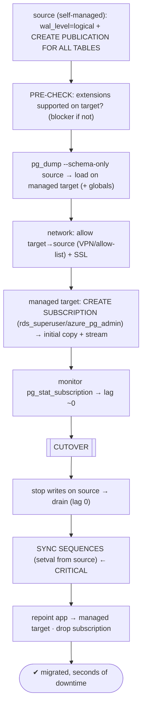

# Lab 135 — Migrate a Self-Managed DB into RDS/Azure Database via Logical Replication (Near-Zero Downtime)

> **Track C · Cross-Cutting · C3 Cloud & Managed Services · Lab 2 of 5 (Lab 135/222)**
> Teaching package: concept → diagram → steps → verify → quick-ref → self-test → video script.
> **Depends on:** Lab 33 (logical replication), Lab 76 (zero-downtime cutover), Lab 45 (TLS), Lab 134 (cloud VM).

---

## 0. Lab Card (at a glance)

| Field | Value |
|---|---|
| **Objective** | Migrate a self-managed PostgreSQL into a managed service (RDS/Azure Database) using logical replication, with a brief cutover — handling schema, extensions, sequences, network, and managed-service permissions. |
| **Success criterion** | The managed target catches up via logical replication; a cutover (stop writes → drain → sync sequences → repoint) moves the app with seconds of downtime; data matches. |
| **Scope boundary** | Self-managed → managed migration path. In-place upgrade was Lab 76. |
| **Prereqs** | Labs 33/76; a source cluster + a managed target |
| **Time** | 45–70 min |
| **Difficulty** | ★★★★★ |
| **Risk** | Medium — high-stakes cutover; sequence sync is critical. |

---

## 1. Learning Objectives

1. **Why logical replication** into managed services.
2. **Publication (source) + subscription (target)** setup.
3. **Cloud-specific gotchas** — extensions, permissions, network.
4. **The Lab-76 gotchas** — schema, sequences, replica identity.
5. **The cutover** — brief, safe.

---

## 2. Concept Primer — the "why"

**Managed services give you SQL access, not filesystem/superuser access — so logical replication is *the* migration path.** RDS/Aurora and Azure Database for PostgreSQL don't let you `pg_basebackup` into them, do file-level restore, or use physical streaming replication — you can't touch the data directory or be a real superuser. But **logical replication** (Lab 33) works over an ordinary connection, **across versions**, into a target where you only have SQL. So you migrate exactly like the zero-downtime upgrade (Lab 76): **replicate the live data in, let it catch up, cut over** — seconds of downtime, not a maintenance window.

**The workflow (publication on source → subscription on the managed target):**
1. **Source** (self-managed): `wal_level=logical` + `CREATE PUBLICATION … FOR ALL TABLES`.
2. **Managed target:**
   - **Pre-create the schema** — logical replication replicates **data, not DDL** (Lab 76): `pg_dump --schema-only` from the source → load on the target (globals via `pg_dumpall -g`).
   - `CREATE SUBSCRIPTION` pointing at the source's publication → it does the **initial copy** then streams changes.
3. **Catch up** (lag ~0), then **cut over**: stop writes on the source → drain remaining changes → **sync sequences** → repoint the app → drop the subscription.

**Cloud/managed-specific gotchas (these are the migration blockers):**
- **Extension supported-list — check *before* you start.** Managed services allow only a **curated set** of extensions. If your database uses `pgvector`, `pg_partman`, `pgaudit`, a custom C extension, etc., **verify each is available on the target** (RDS `rds.extensions` / Azure allow-list). An unsupported extension is a **hard blocker** — resolve it (alternative, drop, or a different plan) before migrating.
- **No superuser.** Use the managed admin role — **`rds_superuser`** (RDS) / **`azure_pg_admin`** (Azure). Some operations are restricted; `CREATE SUBSCRIPTION` is supported by these roles on modern managed PostgreSQL. *(On RDS, `rds.logical_replication` matters when RDS is the **source**; as a subscriber/target, the admin role suffices.)*
- **Network + SSL.** The managed target must **reach the source** (VPN/peering/allow-list to the source's IP, source `pg_hba`/firewall permitting the target), and the subscription connection should use **SSL** (`sslmode=require`/`verify-full`, Lab 45).
- **Large objects (`pg_largeobject`) aren't replicated** by logical replication — migrate them separately if used.

**The same Lab-76 gotchas apply:**
- **Schema/DDL** — pre-create (and mirror any DDL applied mid-migration).
- **Sequences** — **not replicated**; the target's sequences stay at initial values, so after cutover new inserts would reuse old IDs → duplicate-key errors. **Sync them at cutover** (`setval` from the source's `last_value`).
- **Replica identity** — tables need a **PK** (or `REPLICA IDENTITY FULL`) for UPDATE/DELETE to replicate.

**Downtime = only the cutover window** (stop-writes → drain → sync sequences → repoint) — typically seconds. **Alternative:** managed migration services (**AWS DMS**, Azure's migration service) do CDC-based migration; native logical replication is the PostgreSQL-native, no-extra-service approach.

---

## 3. Diagrams

### 3.1 Migration flow



### 3.2 Concept

```mermaid
flowchart LR
    SRC["self-managed source"] -->|logical replication (SQL, cross-version, SSL): DATA| TGT["managed target (RDS/Azure)"]
    subgraph HANDLE [must handle]
      H1["schema/DDL → pg_dump -s"]
      H2["sequences → setval at cutover"]
      H3["EXTENSIONS → supported list (BLOCKER)"]
      H4["large objects · replica identity"]
    end
    note["no filesystem/superuser on managed → physical replication impossible → logical is the path · permissions: rds_superuser/azure_pg_admin · alt: AWS DMS"]
```

---

## 4. Prerequisites — source + managed target

```bash
# SOURCE (self-managed, e.g. 5432): enable logical replication
sudo -u postgres psql -c "ALTER SYSTEM SET wal_level='logical'; " && sudo systemctl restart postgresql-17
sudo -u postgres psql -c "SHOW wal_level;"   # logical
# a replication role the target will connect as:
sudo -u postgres psql -c "CREATE ROLE mig REPLICATION LOGIN PASSWORD 'MigPass!1';" 2>/dev/null || true
# pg_hba on source: allow the managed target's egress IP for the DB, over SSL. (+ firewall/security group)

# TARGET: a managed RDS/Azure endpoint. FIRST — verify extensions are supported:
sudo -u postgres psql -d benchdb -c "SELECT extname FROM pg_extension;"   # list what the source uses → check each on the target
```

### Extension pre-check (the blocker to catch first)

```bash
# on the SOURCE, list required extensions; then confirm each is on the target's allow-list:
sudo -u postgres psql -d benchdb -tAc "SELECT extname FROM pg_extension WHERE extname NOT IN ('plpgsql');"
#   RDS:   SELECT name FROM pg_available_extensions;   (on the RDS instance)
#   Azure: check the Flexible Server allow-list / azure.extensions parameter
# ANY unsupported extension = resolve BEFORE migrating (no superuser to add arbitrary extensions)
```

---

## 5. Step-by-Step

### Step 1 — Publication on the source

```bash
sudo -u postgres psql -d benchdb -c "CREATE PUBLICATION mig_pub FOR ALL TABLES;"
sudo -u postgres psql -d benchdb -c "GRANT SELECT ON ALL TABLES IN SCHEMA public TO mig;"   # publisher needs read
```

### Step 2 — Pre-create schema + globals on the managed target

```bash
# (run against the managed endpoint as its admin role; TGT = the managed host)
sudo -u postgres pg_dumpall -h localhost -g | psql "host=$TGT dbname=postgres user=$ADMIN sslmode=require"       # globals
sudo -u postgres pg_dump -h localhost -d benchdb --schema-only | psql "host=$TGT dbname=benchdb user=$ADMIN sslmode=require"   # schema (DDL)
# create the extensions the target supports:
psql "host=$TGT dbname=benchdb user=$ADMIN sslmode=require" -c "CREATE EXTENSION IF NOT EXISTS pg_stat_statements;"
```

### Step 3 — Subscription on the managed target (SSL)

```bash
psql "host=$TGT dbname=benchdb user=$ADMIN sslmode=require" -c "
CREATE SUBSCRIPTION mig_sub
  CONNECTION 'host=<source_public_ip> port=5432 dbname=benchdb user=mig password=MigPass!1 sslmode=require'
  PUBLICATION mig_pub;"
#   → initial data copy begins, then streaming (rds_superuser/azure_pg_admin can create subscriptions)
```

### Step 4 — Monitor catch-up

```bash
psql "host=$TGT dbname=benchdb user=$ADMIN sslmode=require" -x -c "
SELECT subname, received_lsn, latest_end_lsn FROM pg_stat_subscription;"   # received ≈ latest_end = caught up
# on the source: replication progress toward the target
sudo -u postgres psql -c "SELECT application_name, replay_lag FROM pg_stat_replication;"
```

### Step 5 — CUTOVER: stop writes, drain, SYNC SEQUENCES, repoint

```bash
# 1) stop writes on the SOURCE:
sudo -u postgres psql -d benchdb -c "ALTER DATABASE benchdb SET default_transaction_read_only = on;"
# 2) confirm drained (target applied everything):
sudo -u postgres psql -tAc "SELECT pg_current_wal_lsn();"                                    # source current
psql "host=$TGT dbname=benchdb user=$ADMIN sslmode=require" -tAc "SELECT latest_end_lsn FROM pg_stat_subscription;"  # target applied (match/exceed)
# 3) SYNC SEQUENCES (logical replication does NOT replicate sequence state):
sudo -u postgres psql -d benchdb -tAc "
SELECT format('SELECT setval(%L,%s,true);', schemaname||'.'||sequencename, last_value)
FROM pg_sequences WHERE last_value IS NOT NULL;" | psql "host=$TGT dbname=benchdb user=$ADMIN sslmode=require"
# 4) repoint the app to the managed endpoint (connstring/DNS), then drop the subscription:
psql "host=$TGT dbname=benchdb user=$ADMIN sslmode=require" -c "DROP SUBSCRIPTION mig_sub;"
```

### Step 6 — Verify on the managed target

```bash
psql "host=$TGT dbname=benchdb user=$ADMIN sslmode=require" -c "SELECT count(*) FROM pgbench_accounts;"   # data intact
psql "host=$TGT dbname=benchdb user=$ADMIN sslmode=require" -c "INSERT INTO pgbench_accounts (aid,bid,abalance) VALUES (default,1,0) RETURNING aid;" 2>/dev/null || true
#   → no duplicate-key error → sequences synced correctly
```

---

## 6. Verification Checklist

- [ ] Extensions verified supported on the target **before** migrating
- [ ] Source `wal_level=logical` + publication; target schema/globals pre-created
- [ ] Network + SSL: target reaches source; subscription connected
- [ ] Subscription caught up (lag ~0)
- [ ] Cutover: writes stopped, drained, **sequences synced**, app repointed
- [ ] Subscription dropped; data validated on the managed target
- [ ] Large objects (if any) migrated separately

---

## 7. Troubleshooting

| Symptom | Cause | Fix |
|---|---|---|
| Subscription can't connect | Network / pg_hba / SSL | Allow the target's IP; `sslmode=require`; open firewall/security group |
| Extension unsupported on target | Managed allow-list | Verify **before** migrating; find an alternative/plan |
| Tables missing on target | Schema not pre-created | `pg_dump --schema-only` first |
| Duplicate key after cutover | Sequences not synced | `setval` from source before writes on target |
| Permission denied | No superuser | Use `rds_superuser` / `azure_pg_admin` |
| Large objects missing | Not replicated | Migrate `pg_largeobject` separately |
| UPDATE/DELETE not replicating | No replica identity | Add PK / `REPLICA IDENTITY FULL` |
| Slow initial copy | Large DB | `max_sync_workers_per_subscription`; or use DMS |

---

## 8. Quick Reference Card (paste-ready)

```sql
-- WHY: managed services (RDS/Azure) = no filesystem/superuser → physical replication impossible → LOGICAL is the path
-- PRE-CHECK: every extension the source uses must be on the target's supported list (BLOCKER if not)

-- SOURCE (self-managed): wal_level=logical + publication
ALTER SYSTEM SET wal_level='logical';  -- (restart)
CREATE PUBLICATION mig_pub FOR ALL TABLES;

-- TARGET (managed, as rds_superuser/azure_pg_admin):
--   1) pg_dumpall -g  +  pg_dump --schema-only  → load (DDL not replicated) + create supported extensions
--   2) CREATE SUBSCRIPTION mig_sub CONNECTION 'host=<source> ... sslmode=require' PUBLICATION mig_pub;   -- copy + stream

-- CUTOVER (seconds): stop writes → drain (lag 0) → SYNC SEQUENCES (setval from source) → repoint app → DROP SUBSCRIPTION
-- also handle: replica identity (PK) · large objects (separate) · alt tool: AWS DMS / Azure migration
```

---

## 9. Self-Check

1. Why use logical (not physical) replication to migrate into a managed service?
2. What's the setup on source and target?
3. What are the cloud/managed-specific gotchas?
4. What are the same-as-Lab-76 gotchas?
5. What are the cutover steps?
6. What's an alternative managed-migration tool?

<details>
<summary>Answers</summary>

1. Managed services have **no filesystem/superuser access**, so physical replication and file restore are impossible; **logical replication** works over SQL, cross-version, into a managed target.
2. Source: `wal_level=logical` + a publication; managed target: pre-create schema/globals + a subscription over SSL.
3. **Extension supported-list** (a hard blocker — check first), **no superuser** (`rds_superuser`/`azure_pg_admin`), **network/SSL** to reach the source, and **large objects** not replicated.
4. **Schema/DDL** (pre-create with `pg_dump -s`), **sequences** (sync at cutover), **replica identity** (PK for UPDATE/DELETE).
5. Stop writes on the source → drain remaining lag → **sync sequences** → repoint the app → drop the subscription.
6. **AWS DMS** (or Azure's migration service) — CDC-based; native logical replication is the PostgreSQL-native alternative.
</details>

---

## 10. Video / Teaching Script

| # | On screen | Say (narration) |
|---|---|---|
| 1 | Title: "Move to managed — without the downtime" | "Migrating to RDS or Azure Database? You can't copy files in — no filesystem access. But logical replication flows right through a connection." |
| 2 | pre-check | "First, the blocker nobody expects: extensions. Managed services only allow a curated set. Check every one *before* you start, or you'll hit a wall." |
| 3 | setup | "Publish on the source, pre-load the schema on the target, then subscribe. It copies the data, then keeps it in sync — live." |
| 4 | catch up | "Both databases running, the managed one catching up. No downtime yet." |
| 5 | cutover | "Now the cutover — seconds. Stop writes, drain the last changes, and — critically — sync the sequences, or your new database hands out IDs that already exist." |
| 6 | repoint | "Repoint the app, drop the subscription. You're on managed. Done." |
| 7 | Outro | "Self-managed to managed, seamlessly. Next: point-in-time restore on a managed service." |

---

## 11. Glossary

- **Logical replication** — SQL-level, cross-version replication (into managed).
- **Publication / subscription** — source-side / target-side objects.
- **Managed service** — RDS/Aurora, Azure Database (no filesystem/superuser).
- **`rds_superuser` / `azure_pg_admin`** — managed admin roles.
- **Supported-extension list** — the managed allow-list (a blocker).
- **Sequence sync** — `setval` the target's sequences at cutover.
- **AWS DMS** — CDC-based managed migration alternative.

---
*NETAPORT lab series · PostgreSQL 17 on AlmaLinux 9 · Lab 135/222 · C3 Cloud & Managed Services*
