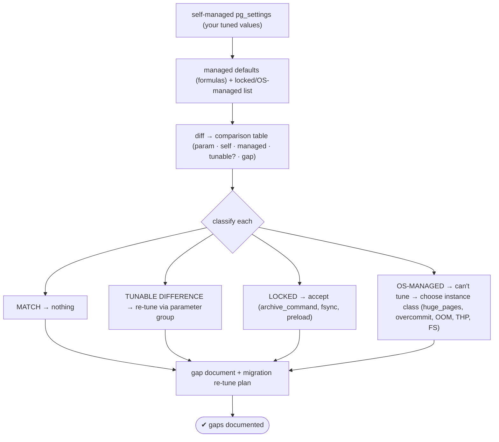
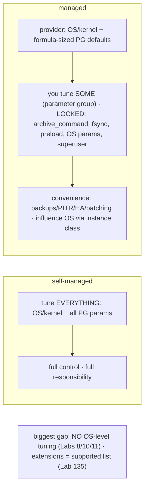

# Lab 136 — Compare Self-Managed Tuning vs a Managed Instance's Defaults; Document the Gaps

> **Track C · Cross-Cutting · C3 Cloud & Managed Services · Lab 3 of 5 (Lab 136/222)**
> Teaching package: concept → diagram → steps → verify → quick-ref → self-test → video script.
> **Depends on:** Labs 08/10/11 (OS tuning), 09/15/57 (memory/WAL/checkpoints), 40 (connections), 132 (config diff), 135 (migration).

---

## 0. Lab Card (at a glance)

| Field | Value |
|---|---|
| **Objective** | Compare your self-managed tuned settings against a managed service's formula-sized defaults and locked parameters, and produce a documented gap analysis + re-tune plan. |
| **Success criterion** | A comparison table classifies each setting as match / tunable-difference / locked-or-OS-managed; the lost OS-tuning layer is documented; a migration re-tune plan follows. |
| **Scope boundary** | Config/tuning gap analysis. Migration mechanics were Lab 135. |
| **Prereqs** | Labs 08–15/40; a tuned self-managed cluster |
| **Time** | 30–45 min |
| **Difficulty** | ★★★★☆ |
| **Risk** | Low — analysis. |

---

## 1. Learning Objectives

1. **The control spectrum** — self-managed vs managed.
2. **Formula-sized defaults** — shared_buffers, max_connections.
3. **Locked parameters + the OS-tuning layer** you lose.
4. **Build the gap table** — classify each setting.
5. **The migration re-tune plan** and trade-off.

---

## 2. Concept Primer — the "why"

**Self-managed = you tune everything; managed = the provider owns a layer and locks part of it.** When you self-manage (Labs 8–15), you set every OS and PostgreSQL knob. A managed service (RDS/Aurora, Azure Database for PostgreSQL) instead:
- **Formula-sizes** key PostgreSQL parameters to the **instance class** automatically.
- **Exposes some** parameters for you to change (RDS **parameter groups** / Azure **server parameters**) — some *dynamic*, some *static* (need a reboot).
- **Locks others** entirely — and owns the **entire OS/kernel layer** you have no access to.

Understanding these **gaps** matters for migration planning (Lab 135), performance expectations, and the architectural decision itself.

**Formula-sized defaults (examples):**
- **`shared_buffers`** — RDS default ≈ `{DBInstanceClassMemory/32768}` (~25% of RAM in 8 kB pages); Azure ~25%. Auto-sized; tunable.
- **`effective_cache_size`** — ~50–75% of RAM (formula). Tunable.
- **`max_connections`** — RDS ≈ `{DBInstanceClassMemory/9531392}` (memory-based); Azure similar. Tunable but **capped**; managed services push you toward a **pooler** (RDS Proxy / Azure's built-in PgBouncer on Flexible Server).
- **`work_mem` / `maintenance_work_mem`** — conservative defaults; tunable (re-tune after migrating).

**Locked / provider-owned (the real gaps):**
- **`archive_command` / `archive_mode`** — **locked**: the service handles WAL archiving for its **automated backups/PITR**. Backups are *its* job, not yours.
- **`fsync` / `full_page_writes`** — **forced on**: durability is enforced (you *can't* disable it — which is good).
- **`shared_preload_libraries`** — limited to the **supported extension list** (Lab 135); you can't preload arbitrary libraries.
- **The entire OS/kernel-tuning layer is the provider's** (you have **no OS/root access**): `huge_pages`, `vm.overcommit_memory` (Lab 11), `kernel.shmmax`, **`OOMScoreAdjust`/`PG_OOM_ADJUST`** (Lab 8), Transparent Huge Pages, ulimits, the filesystem/mount, `data_directory`, systemd — **all set by the provider, none tunable by you.** This is the biggest gap: **you give up OS-level tuning entirely** and instead influence it only by **choosing the instance class**.
- **No superuser** — `rds_superuser`/`azure_pg_admin` restrict some settings and operations.

**Producing the gap document (the deliverable).** Compare your self-managed `pg_settings` (your tuned values) against the managed defaults, and classify each:

| Class | Meaning | Action |
|---|---|---|
| **Match** | managed default ≈ your tuning | nothing |
| **Tunable difference** | differs, but changeable via parameter group | **re-tune** after migrating |
| **Locked** | can't change (`archive_command`, `fsync`, preload) | accept; rely on the service |
| **OS-managed** | no OS access (huge_pages, overcommit, OOM, THP, FS) | can't tune — **pick the right instance class** |

**The trade-off, stated plainly:** managed buys **convenience** (no OS/kernel tuning, automated backups/PITR/patching/HA, durability enforced, sane defaults) at the cost of **control** (no OS tuning, locked parameters, no superuser, extension limits, and cost). Self-managed keeps **full control** — and full responsibility.

---

## 3. Diagrams

### 3.1 Gap-analysis flow



### 3.2 Control spectrum



---

## 4. Prerequisites — your tuned self-managed values

```bash
sudo -u postgres psql -c "
SELECT name, setting, unit, source FROM pg_settings
WHERE name IN ('shared_buffers','work_mem','maintenance_work_mem','effective_cache_size',
               'max_connections','max_wal_size','checkpoint_timeout','wal_level',
               'archive_mode','archive_command','fsync','full_page_writes','huge_pages',
               'shared_preload_libraries','random_page_cost') ORDER BY name;"
```

---

## 5. Step-by-Step

### Step 1 — Capture self-managed settings

```bash
sudo -u postgres psql -tAF',' -c "
SELECT name, setting, COALESCE(unit,'') FROM pg_settings
WHERE name IN ('shared_buffers','work_mem','maintenance_work_mem','effective_cache_size',
  'max_connections','max_wal_size','checkpoint_timeout','wal_level','archive_command','fsync',
  'full_page_writes','huge_pages','shared_preload_libraries','random_page_cost')
ORDER BY name;" > /tmp/self.csv
cat /tmp/self.csv
```

### Step 2 — Managed defaults + lock status (reference table)

```bash
cat > /tmp/managed.csv <<'EOF'
name,managed_default,tunable,note
shared_buffers,{DBInstanceClassMemory/32768} (~25% RAM),yes,formula-sized to instance class
work_mem,4MB (conservative),yes,re-tune after migration
maintenance_work_mem,64MB,yes,re-tune (autovacuum/index builds)
effective_cache_size,{DBInstanceClassMemory/16384} (~50-75%),yes,formula-sized
max_connections,{DBInstanceClassMemory/9531392},capped,use a pooler (RDS Proxy / Azure PgBouncer)
max_wal_size,provider default,yes,tunable
checkpoint_timeout,provider default,yes,tunable
wal_level,replica (or logical if enabled),limited,service uses it for backups/replicas
archive_command,MANAGED by service,NO,service handles WAL archiving / PITR
fsync,on,NO,durability enforced (locked on)
full_page_writes,on,NO,durability enforced (locked on)
huge_pages,provider-set,NO,no OS access (Lab 10)
shared_preload_libraries,supported list only,limited,extension restrictions (Lab 135)
random_page_cost,1.1 (SSD-tuned),yes,usually fine on cloud SSD
EOF
column -s, -t /tmp/managed.csv
```

### Step 3 — Generate the comparison / gap table

```bash
cat > gap-report.sh <<'SCRIPT'
#!/usr/bin/env bash
set -euo pipefail
printf "%-24s | %-22s | %-30s | %-8s | %s\n" PARAM SELF-MANAGED MANAGED-DEFAULT TUNABLE GAP
printf '%.0s-' {1..110}; echo
declare -A MD TN NT
while IFS=, read -r n d t note; do MD[$n]="$d"; TN[$n]="$t"; NT[$n]="$note"; done < <(tail -n +2 /tmp/managed.csv)
while IFS=, read -r name setting unit; do
  md="${MD[$name]:-?}"; tn="${TN[$name]:-?}"; note="${NT[$name]:-}"
  gap="match"
  [[ "$tn" == "NO" ]] && gap="LOCKED / OS-managed"
  [[ "$tn" == "limited" ]] && gap="restricted"
  [[ "$tn" == "yes" || "$tn" == "capped" ]] && gap="re-tune ($note)"
  printf "%-24s | %-22s | %-30s | %-8s | %s\n" "$name" "${setting}${unit}" "$md" "$tn" "$gap"
done < /tmp/self.csv
SCRIPT
chmod +x gap-report.sh
./gap-report.sh
```

### Step 4 — Document the fully-lost OS-tuning layer

```bash
cat <<'EOF'
=== OS / kernel tuning — NOT available on managed (no OS access) ===
  huge_pages (Lab 10)               → provider-set; influence via instance class
  vm.overcommit_memory=2 (Lab 11)   → provider-set; can't get clean OOM errors your way
  kernel.shmmax / sysctl (Lab 11)   → provider-set
  OOMScoreAdjust / PG_OOM_ADJUST (Lab 8) → provider-set (postmaster protection is theirs)
  Transparent Huge Pages, ulimits   → provider-set
  filesystem / mount / data_directory / systemd → provider-owned
  ⇒ the ENTIRE A1/A2 OS-tuning layer is the provider's. You tune the DB via parameter groups only.
EOF
```

### Step 5 — Migration re-tune plan (post Lab 135)

```bash
cat <<'EOF'
=== After migrating to managed (Lab 135) ===
  1. RE-TUNE the "yes/capped" params in the parameter group to match your golden (work_mem, maintenance_work_mem, etc.)
  2. ACCEPT locked params (archive_command → use managed backups/PITR; fsync/full_page_writes stay on).
  3. Verify all EXTENSIONS are on the supported list (Lab 135) before migrating.
  4. Right-size the INSTANCE CLASS for shared_buffers/max_connections/IOPS (you can't OS-tune).
  5. Add a POOLER (RDS Proxy / Azure PgBouncer) for connection scaling.
EOF
```

### Step 6 — Summarize the trade-off

```bash
cat <<'EOF'
MANAGED  ✓ no OS/kernel tuning · automated backups/PITR/patching/HA · durability enforced · sane defaults
         ✗ no OS tuning · locked params (archive_command, fsync, preload) · no superuser · extension limits · cost
SELF     ✓ full control of every OS + PG knob
         ✗ you own OS tuning, backups, HA, patching, durability config
EOF
```

---

## 6. Verification Checklist

- [ ] Captured self-managed tuned settings
- [ ] Managed defaults + lock status referenced
- [ ] Comparison table generated (param, self, managed, tunable, gap)
- [ ] Settings classified (match / tunable / locked / OS-managed)
- [ ] The lost OS-tuning layer documented (Labs 8/10/11)
- [ ] Migration re-tune plan written
- [ ] Trade-off (convenience vs control) summarized

---

## 7. Troubleshooting

| Symptom | Cause | Fix |
|---|---|---|
| Managed param won't change | Static or locked | Reboot for static; accept if not modifiable |
| Slower after migration | Conservative managed defaults | Re-tune tunable params to match golden |
| OS tuning missing | No OS access | Can't — right-size the instance class |
| `archive_command` error | Locked (service does backups) | Use managed backups/PITR |
| Extension unavailable | Supported-list only | Check before migrating (Lab 135) |
| `max_connections` capped | Instance-sized | Use a pooler (RDS Proxy / PgBouncer) |
| `fsync` can't be changed | Durability enforced | That's intentional — leave it |

---

## 8. Quick Reference Card (paste-ready)

```text
CONTROL SPECTRUM: self-managed = tune EVERYTHING (OS + PG) · managed = provider owns OS + formula-sized PG defaults

MANAGED formula defaults:  shared_buffers ~25% RAM · effective_cache_size ~50-75% · max_connections = memory formula (capped)
LOCKED / provider-owned:   archive_command (backups) · fsync/full_page_writes (durability) · shared_preload_libraries (supported list)
NO OS ACCESS (can't tune): huge_pages · vm.overcommit_memory · kernel.shmmax · OOMScoreAdjust · THP · filesystem · data_directory

GAP TABLE: for each param → self-managed value | managed default | tunable? (yes/capped/limited/NO) | class (match/re-tune/locked/OS-managed)
POST-MIGRATION: re-tune tunable params to golden · accept locked · verify extensions (Lab 135) · right-size instance class · add a pooler
TRADE: managed = convenience (backups/PITR/HA/patching, durability enforced) vs control (no OS tuning, locked params, no superuser)
```

---

## 9. Self-Check

1. What does a managed service control that you can't?
2. How does it size `shared_buffers` and `max_connections`?
3. What's locked, and why?
4. How do you document the gaps?
5. What's the migration implication?
6. What's the core trade-off?

<details>
<summary>Answers</summary>

1. The **entire OS/kernel layer** (huge_pages, overcommit, OOM protection, THP, filesystem, `data_directory`, systemd), plus superuser, locked PG params (`archive_command`, `fsync`), backup/archiving, and the extension list.
2. By **formula, sized to the instance class** (`shared_buffers` ~25% RAM; `max_connections` a memory-based formula, capped).
3. `archive_command` (the service does backups/PITR), `fsync`/`full_page_writes` (durability enforced), `shared_preload_libraries` (supported-list), and all OS params (no OS access).
4. Compare `pg_settings` self-managed vs managed defaults in a table (param, self, managed, tunable?, gap) and classify each as match / tunable-difference / locked / OS-managed.
5. **Re-tune** the tunable params to your golden, **accept** the locked ones, **verify extensions** are supported, and **right-size the instance class** (since you can't OS-tune) — plus add a pooler.
6. Managed trades **control** for **convenience** (no OS tuning/backups/HA burden, durability enforced) — self-managed keeps full control but full responsibility.
</details>

---

## 10. Video / Teaching Script

| # | On screen | Say (narration) |
|---|---|---|
| 1 | Title: "What you give up going managed" | "Self-managed, you tune everything. Managed, the provider tunes a lot for you — and locks the rest. Know which is which *before* you migrate." |
| 2 | formulas | "Shared buffers, max connections — sized to your instance class by formula. Reasonable, but not your hand-tuned values." |
| 3 | locked | "Some knobs are welded shut: the archive command — because backups are *their* job now. Fsync — because durability is non-negotiable. Good locks." |
| 4 | OS gap | "The big one: no OS access at all. Huge pages, overcommit, the OOM protection you set up — all theirs. You influence it only by picking a bigger instance." |
| 5 | the table | "So build the gap table: match, re-tune, locked, or OS-managed. Now you know exactly what to expect." |
| 6 | trade | "It's a straight trade — convenience for control. Automated backups and HA, versus tuning it yourself. Choose with eyes open." |
| 7 | Outro | "Gaps, documented. Next: PITR and read replicas on a managed service." |

---

## 11. Glossary

- **Parameter group / server parameters** — managed's tunable-parameter surface.
- **Formula-sized default** — a param set from instance-class memory.
- **Locked parameter** — not modifiable (archive_command, fsync).
- **OS-managed** — provider-owned OS/kernel layer (no access).
- **Instance class** — the lever for OS-level capacity on managed.
- **Supported-extension list** — the managed allow-list (Lab 135).
- **Convenience vs control** — the managed trade-off.

---
*NETAPORT lab series · PostgreSQL 17 on AlmaLinux 9 · Lab 136/222 · C3 Cloud & Managed Services*
